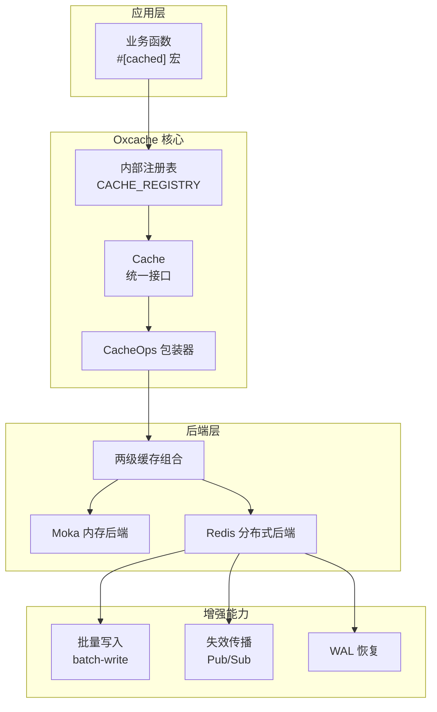
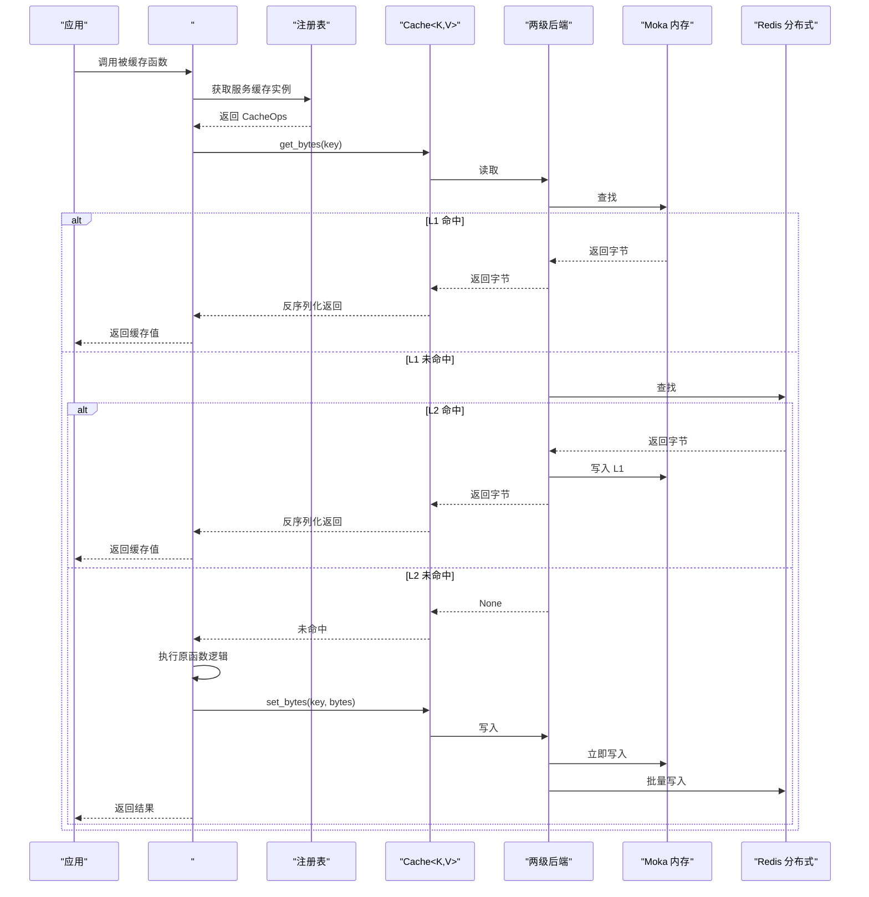
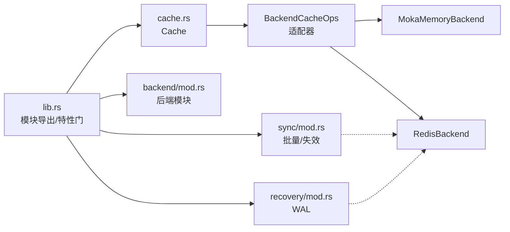

# 核心特性

<cite>
**本文引用的文件**
- [README.md](file://README.md)
- [API_REFERENCE.md](file://docs/API_REFERENCE.md)
- [ARCHITECTURE.md](file://docs/ARCHITECTURE.md)
- [lib.rs](file://src/lib.rs)
- [cache.rs](file://src/cache.rs)
- [backend.rs](file://src/backend/mod.rs)
- [moka/backend.rs](file://src/backend/client/moka/backend.rs)
- [redis/client.rs](file://src/backend/client/redis/client.rs)
- [sync/mod.rs](file://src/sync/mod.rs)
- [recovery/mod.rs](file://src/recovery/mod.rs)
- [cache_benchmark.rs](file://benches/cache_benchmark.rs)
- [modern_api_benchmark.rs](file://benches/modern_api_benchmark.rs)
- [redis_benchmark.rs](file://benches/redis_benchmark.rs)
</cite>

## 目录
1. [简介](#简介)
2. [项目结构](#项目结构)
3. [核心组件](#核心组件)
4. [架构总览](#架构总览)
5. [详细特性分析](#详细特性分析)
6. [依赖关系分析](#依赖关系分析)
7. [性能考量](#性能考量)
8. [故障排查指南](#故障排查指南)
9. [结论](#结论)
10. [附录](#附录)

## 简介
本文件面向开发者与架构师，系统化阐述 Oxcache 的五大核心特性与其协同工作机制，并提供可落地的使用建议与性能参考。五大特性分别为：
- 极端性能（L1 纳秒级响应）
- 零代码变更（#[cached] 宏）
- 自动恢复（Redis 故障降级）
- 多实例同步（基于 Pub/Sub）
- 批量优化（智能批处理写入）

## 项目结构
Oxcache 采用“现代 API + 插件化后端”的分层设计：
- 现代 API 层：Cache<K, V> 统一接口，支持类型安全的键值操作与构建器配置
- 后端层：内存（Moka）与 Redis 两套后端，支持组合为两级缓存
- 同步与恢复层：批量写入、失效传播、WAL 恢复
- 宏与注册层：#[cached] 宏通过内部注册表驱动缓存调用

图表来源
- [ARCHITECTURE.md](file://docs/ARCHITECTURE.md#L36-L73)
- [lib.rs](file://src/lib.rs#L417-L512)
- [cache.rs](file://src/cache.rs#L117-L120)

章节来源
- [README.md](file://README.md#L21-L58)
- [ARCHITECTURE.md](file://docs/ARCHITECTURE.md#L34-L73)
- [lib.rs](file://src/lib.rs#L417-L512)

## 核心组件
- Cache<K, V>：现代 API 的统一缓存接口，提供 get/set/get_or 等常用操作
- MokaMemoryBackend：基于 Moka 的高性能内存后端，支持容量与 TTL 策略
- RedisBackend：支持 Standalone/Sentinel/Cluster 的 Redis 后端，内置连接校验与安全校验
- 后端适配器：BackendCacheOps 将任意 CacheBackend 适配为 CacheOps，供 #[cached] 宏使用
- 特性开关：通过 feature gate 控制 Bloom、速率限制、WAL、批量写入、指标等能力

章节来源
- [cache.rs](file://src/cache.rs#L117-L120)
- [moka/backend.rs](file://src/backend/client/moka/backend.rs#L14-L49)
- [redis/client.rs](file://src/backend/client/redis/client.rs#L66-L132)
- [lib.rs](file://src/lib.rs#L436-L443)

## 架构总览
Oxcache 的两级缓存（L1 + L2）读写路径如下：

图表来源
- [ARCHITECTURE.md](file://docs/ARCHITECTURE.md#L381-L406)
- [ARCHITECTURE.md](file://docs/ARCHITECTURE.md#L448-L483)
- [ARCHITECTURE.md](file://docs/ARCHITECTURE.md#L506-L540)

章节来源
- [ARCHITECTURE.md](file://docs/ARCHITECTURE.md#L375-L406)

## 详细特性分析

### 特性一：极端性能（L1 纳秒级响应）
- 技术实现
  - L1 使用 Moka 内存后端，具备并发安全、TinyLFU 淘汰策略与毫秒级 TTL 支持
  - 读写路径极短，序列化/反序列化由统一接口完成
- 性能收益
  - 单线程读延迟 P99 低至纳秒级（仓库文档给出范围 50-100ns），写延迟约 50-200ns
  - 通过基准测试脚本可复现 L1 的 SET/GET/批量写入等场景
- 使用场景
  - 高频热点数据、毫秒级响应要求的接口
- 实践要点
  - 合理设置 L1 容量与 TTL，避免频繁淘汰
  - 对大对象优先考虑二进制序列化以降低 CPU 开销

章节来源
- [README.md](file://README.md#L52-L56)
- [moka/backend.rs](file://src/backend/client/moka/backend.rs#L67-L123)
- [cache.rs](file://src/cache.rs#L241-L325)
- [cache_benchmark.rs](file://benches/cache_benchmark.rs#L13-L40)
- [modern_api_benchmark.rs](file://benches/modern_api_benchmark.rs#L13-L80)

### 特性二：零代码变更（#[cached] 宏）
- 技术实现
  - #[cached] 宏通过内部注册表自动注入缓存读取/写入逻辑
  - 宏展开后根据服务名从注册表获取 CacheOps，执行序列化/反序列化与回填
- 性能收益
  - 无样板代码，减少出错率；宏内联与类型安全减少运行时开销
- 使用场景
  - 快速为现有异步函数增加缓存能力，无需修改业务逻辑
- 实践要点
  - 通过服务名与 TTL 参数控制缓存行为
  - 宏依赖 serialization 特性以支持序列化

章节来源
- [README.md](file://README.md#L176-L214)
- [API_REFERENCE.md](file://docs/API_REFERENCE.md#L93-L133)
- [ARCHITECTURE.md](file://docs/ARCHITECTURE.md#L377-L406)
- [lib.rs](file://src/lib.rs#L518-L524)

### 特性三：自动恢复（Redis 故障降级）
- 技术实现
  - Redis 后端健康检查失败时，系统切换到 L1-only 模式继续服务
  - WAL 记录写入操作，在 Redis 恢复后重放到 L2
- 性能收益
  - 保证高可用，避免缓存中断导致的数据库压力
- 使用场景
  - 生产环境网络抖动或 Redis 故障期间维持服务能力
- 实践要点
  - 启用 wal-recovery 特性以获得 WAL 能力
  - 结合批量写入提升恢复阶段吞吐

章节来源
- [README.md](file://README.md#L54-L56)
- [ARCHITECTURE.md](file://docs/ARCHITECTURE.md#L575-L592)
- [recovery/mod.rs](file://src/recovery/mod.rs#L8-L12)

### 特性四：多实例同步（基于 Pub/Sub）
- 技术实现
  - 通过 Pub/Sub 发布/订阅失效消息，版本化（时间戳+实例标识）避免竞态
  - 多实例共享同一 Redis，确保全局一致性
- 性能收益
  - 降低跨实例一致性成本，延迟通常小于 100ms
- 使用场景
  - 多副本/多实例部署，需要强一致或最终一致的缓存失效
- 实践要点
  - 保持版本格式稳定，避免比较异常
  - 结合批量写入与失效传播，形成闭环

章节来源
- [README.md](file://README.md#L56-L56)
- [ARCHITECTURE.md](file://docs/ARCHITECTURE.md#L542-L574)

### 特性五：批量优化（智能批处理写入）
- 技术实现
  - 批量写入器按阈值与超时聚合 L2 写入，使用 MSET 等原子命令提升吞吐
  - 通过 feature gate 控制启用，未启用时提供清晰的编译期错误提示
- 性能收益
  - 单次写入吞吐可达 50-100K ops/sec，批量可达 200-500K ops/sec（仓库文档）
- 使用场景
  - 写入密集型工作负载，如日志缓存、事件落盘、热数据预热
- 实践要点
  - 合理设置批量大小与刷新间隔，平衡延迟与吞吐
  - 与 WAL 结合，确保持久化与恢复

章节来源
- [README.md](file://README.md#L56-L56)
- [README.md](file://README.md#L328-L334)
- [API_REFERENCE.md](file://docs/API_REFERENCE.md#L424-L441)
- [sync/mod.rs](file://src/sync/mod.rs#L16-L173)
- [redis_benchmark.rs](file://benches/redis_benchmark.rs#L15-L61)

## 依赖关系分析

图表来源
- [lib.rs](file://src/lib.rs#L417-L512)
- [cache.rs](file://src/cache.rs#L29-L85)
- [moka/backend.rs](file://src/backend/client/moka/backend.rs#L14-L49)
- [redis/client.rs](file://src/backend/client/redis/client.rs#L66-L132)
- [sync/mod.rs](file://src/sync/mod.rs#L1-L311)
- [recovery/mod.rs](file://src/recovery/mod.rs#L1-L86)

章节来源
- [lib.rs](file://src/lib.rs#L417-L512)

## 性能考量
- 基准测试
  - L1：SET/GET/批量写入等单测脚本可直接运行，适合本地对比
  - L2：Redis 后端基准脚本需本地 Redis 可用，建议在相同硬件条件下对比
- 规模化建议
  - 写入密集场景优先启用批量写入与 WAL
  - 大对象建议使用二进制序列化（bincode）以降低 CPU
  - 合理设置 L1 TTL 与容量，避免频繁逐出
- 环境差异
  - 文档明确性能受硬件、网络与数据大小影响，应以实测为准

章节来源
- [README.md](file://README.md#L305-L335)
- [cache_benchmark.rs](file://benches/cache_benchmark.rs#L1-L100)
- [modern_api_benchmark.rs](file://benches/modern_api_benchmark.rs#L1-L158)
- [redis_benchmark.rs](file://benches/redis_benchmark.rs#L1-L123)

## 故障排查指南
- Redis 连接失败
  - 现象：健康检查失败、连接超时
  - 排查：确认连接字符串、TLS 设置、网络连通性
  - 处理：系统自动降级为 L1-only 模式，待恢复后 WAL 重放
- 批量写入不可用
  - 现象：编译时报错提示缺少 batch-write 特性
  - 处理：启用 features = ["batch-write"] 或 ["full"]
- 序列化相关错误
  - 现象：get/set 操作报序列化错误
  - 处理：启用 serialization 特性或使用字节数组接口
- 版本化失效异常
  - 现象：多实例间失效不同步
  - 处理：检查 Pub/Sub 通道与版本格式一致性

章节来源
- [redis/client.rs](file://src/backend/client/redis/client.rs#L167-L213)
- [sync/mod.rs](file://src/sync/mod.rs#L62-L173)
- [cache.rs](file://src/cache.rs#L241-L325)
- [ARCHITECTURE.md](file://docs/ARCHITECTURE.md#L575-L592)

## 结论
Oxcache 通过“现代 API + 两级后端 + 增强能力”的组合，实现了“极致性能 + 零侵入 + 高可用 + 可扩展”的工程目标。五大特性相互补充：
- L1 纳秒级响应奠定基础
- #[cached] 宏实现零代码变更
- 自动恢复与 WAL 保障高可用
- Pub/Sub 失效传播实现多实例一致性
- 批量写入显著提升吞吐

在实际选型中，建议：
- 以 #[cached] 宏快速启用缓存
- 写入密集场景启用批量写入与 WAL
- 多实例部署启用 Pub/Sub 失效传播
- 根据数据特征选择合适的序列化与 TTL

## 附录
- 使用示例路径
  - #[cached] 宏示例：[README.md](file://README.md#L176-L214)
  - 手动客户端示例：[README.md](file://README.md#L216-L242)
  - 批量写入示例：[API_REFERENCE.md](file://docs/API_REFERENCE.md#L286-L295)
- 关键流程图
  - #[cached] 宏工作流：[ARCHITECTURE.md](file://docs/ARCHITECTURE.md#L381-L406)
  - 两级读路径：[ARCHITECTURE.md](file://docs/ARCHITECTURE.md#L485-L504)
  - 写路径与失效传播：[ARCHITECTURE.md](file://docs/ARCHITECTURE.md#L506-L540)