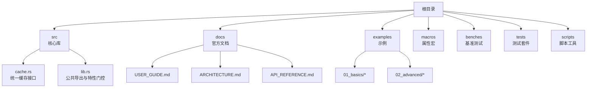
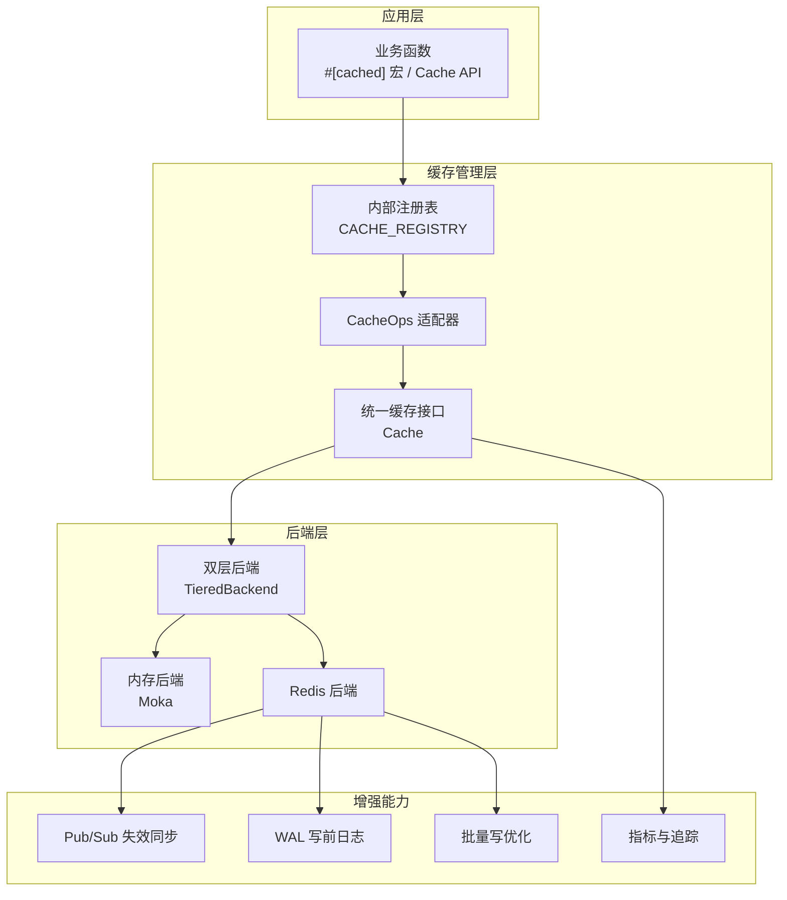
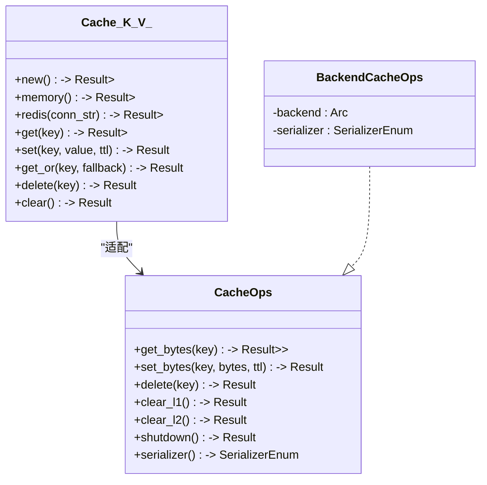
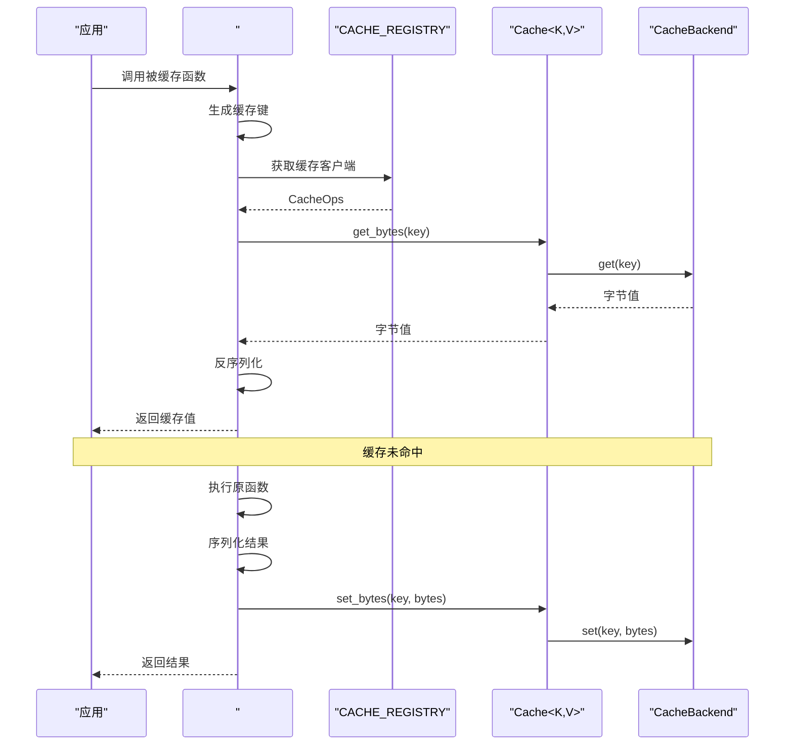
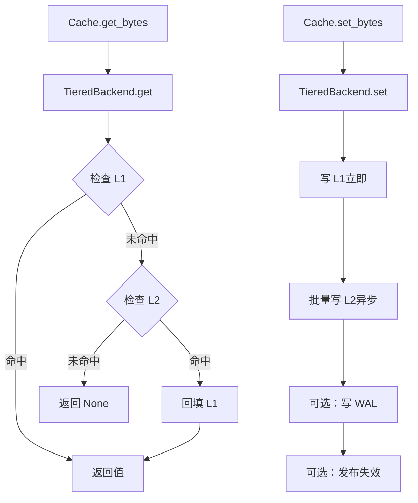
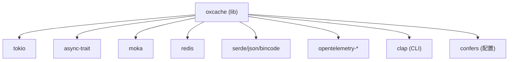

# 项目介绍

<cite>
**本文引用的文件**
- [README.md](file://README.md)
- [README_zh.md](file://README_zh.md)
- [Cargo.toml](file://Cargo.toml)
- [src/lib.rs](file://src/lib.rs)
- [src/cache.rs](file://src/cache.rs)
- [docs/USER_GUIDE.md](file://docs/USER_GUIDE.md)
- [docs/ARCHITECTURE.md](file://docs/ARCHITECTURE.md)
- [docs/API_REFERENCE.md](file://docs/API_REFERENCE.md)
- [examples/src/01_basics/example_basic_operations.rs](file://examples/src/01_basics/example_basic_operations.rs)
</cite>

## 目录
1. [引言](#引言)
2. [项目结构](#项目结构)
3. [核心组件](#核心组件)
4. [架构总览](#架构总览)
5. [详细组件分析](#详细组件分析)
6. [依赖关系分析](#依赖关系分析)
7. [性能考量](#性能考量)
8. [故障排查指南](#故障排查指南)
9. [结论](#结论)
10. [附录](#附录)

## 引言
Oxcache 是一个高性能、生产级的 Rust 多级缓存库，提供 L1（内存缓存，Moka）+ L2（分布式缓存，Redis）的双层架构。项目的核心使命是“零代码变更、极致性能、生产就绪”，通过现代化 API 与 `#[cached]` 宏实现零侵入式缓存，结合批处理优化、自动故障恢复与可观测性，帮助开发者在不改变业务逻辑的前提下获得卓越的性能与可靠性。

- 零代码变更：通过 `#[cached]` 宏或现代 API，一行即可启用缓存
- 极致性能：L1 纳秒级响应（P99 < 100ns），L2 毫秒级响应（P99 < 5ms）
- 生产就绪：自动降级、WAL 恢复、健康检查、混沌测试验证、OpenTelemetry 集成

## 项目结构
仓库采用按功能域划分的模块化组织方式，核心目录与职责如下：
- src：核心库实现，包含新式 API、后端抽象、客户端、配置、错误处理等
- docs：官方文档，涵盖用户指南、架构设计、API 参考、安全与性能报告等
- examples：分层次的示例，从基础 CRUD 到高级特性（批量写入、失效同步、温启动等）
- macros：属性宏实现，为 `#[cached]` 提供零样板代码的缓存装饰器
- benches：基准测试，覆盖缓存读写、现代 API、Redis 集成等场景
- tests：单元、集成、端到端与混沌测试，保障稳定性与回归质量
- scripts：预提交审计、安全扫描、性能测试脚本等

图表来源
- [src/cache.rs](file://src/cache.rs#L87-L132)
- [src/lib.rs](file://src/lib.rs#L414-L638)
- [docs/USER_GUIDE.md](file://docs/USER_GUIDE.md#L17-L38)
- [docs/ARCHITECTURE.md](file://docs/ARCHITECTURE.md#L5-L16)
- [docs/API_REFERENCE.md](file://docs/API_REFERENCE.md#L14-L26)

章节来源
- [README.md](file://README.md#L16-L58)
- [README_zh.md](file://README_zh.md#L16-L57)
- [Cargo.toml](file://Cargo.toml#L1-L377)

## 核心组件
- 现代化统一缓存接口：Cache<K, V> 提供类型安全的读写与回退加载能力，支持内存、Redis 与双层后端
- 后端抽象层：通过 CacheBackend trait 解耦 L1/Moka 与 L2/Redis，便于扩展与替换
- 客户端与适配器：CacheOps 与 BackendCacheOps 封装后端操作，便于注册到内部宏注册表
- 特性门控与空实现：通过宏在编译期校验特性依赖，未启用特性时生成空实现，保证 API 稳定
- 配置与构建器：Builder 模式简化复杂配置，支持 L1 容量、TTL、Redis 连接与批处理等参数
- 宏系统：#[cached] 宏自动处理键生成、序列化、缓存读写与错误传播

章节来源
- [src/cache.rs](file://src/cache.rs#L87-L132)
- [src/cache.rs](file://src/cache.rs#L117-L200)
- [src/lib.rs](file://src/lib.rs#L414-L638)
- [docs/API_REFERENCE.md](file://docs/API_REFERENCE.md#L134-L190)

## 架构总览
Oxcache 的整体架构围绕“零样板代码 + 双层缓存 + 可观测性”展开。应用通过 `#[cached]` 宏或 Cache API 访问统一接口，内部通过注册表与适配器桥接到具体后端；TieredBackend 在读路径优先命中 L1，未命中则回源 L2 并回填 L1；写路径同时更新 L1 与 L2，并在 L2 批处理优化与 WAL 持久化之间取得平衡。

图表来源
- [docs/ARCHITECTURE.md](file://docs/ARCHITECTURE.md#L36-L73)
- [src/cache.rs](file://src/cache.rs#L29-L85)
- [src/lib.rs](file://src/lib.rs#L435-L477)

## 详细组件分析

### 组件一：统一缓存接口 Cache<K, V>
- 类型安全：通过泛型 K、V 与 traits（CacheKey、Cacheable）约束键与值的序列化/反序列化
- 生命周期：支持 get、set、get_or（回退加载）、delete、clear 等常用操作
- 后端解耦：内部持有 Arc<dyn CacheBackend>，可替换为内存或 Redis 后端
- 构建器：CacheBuilder/BackendBuilder 提供灵活配置入口

图表来源
- [src/cache.rs](file://src/cache.rs#L87-L132)
- [src/cache.rs](file://src/cache.rs#L29-L85)

章节来源
- [src/cache.rs](file://src/cache.rs#L87-L200)
- [docs/API_REFERENCE.md](file://docs/API_REFERENCE.md#L215-L277)

### 组件二：#[cached] 宏工作流
- 键生成：根据 service、key/key_prefix、key_generator 等参数生成稳定键
- 注册表：从内部注册表获取 CacheOps 实例
- 读路径：尝试从缓存读取字节，反序列化为目标类型
- 写路径：执行原函数逻辑，序列化结果并写入缓存
- 错误传播：保持原函数的错误语义

图表来源
- [docs/ARCHITECTURE.md](file://docs/ARCHITECTURE.md#L381-L406)
- [src/lib.rs](file://src/lib.rs#L414-L477)

章节来源
- [docs/ARCHITECTURE.md](file://docs/ARCHITECTURE.md#L375-L447)
- [src/lib.rs](file://src/lib.rs#L414-L477)

### 组件三：TieredBackend 读写路径
- 读路径：先查 L1，命中则返回；未命中再查 L2，命中则回填 L1 后返回
- 写路径：立即写 L1，异步批量写 L2，必要时写 WAL 并发布失效消息

图表来源
- [docs/ARCHITECTURE.md](file://docs/ARCHITECTURE.md#L485-L540)

章节来源
- [docs/ARCHITECTURE.md](file://docs/ARCHITECTURE.md#L485-L540)

### 组件四：特性门控与空实现
- 编译期断言：check_feature_dependence! 确保启用依赖特性（如 bloom-filter 需 moka）
- 空实现宏：在未启用特性时生成空结构体/方法，保证 API 稳定与二进制体积可控
- 运行时特性查询：提供 is_l1_enabled/is_l2_enabled 等辅助函数

章节来源
- [src/lib.rs](file://src/lib.rs#L183-L252)
- [src/lib.rs](file://src/lib.rs#L254-L391)
- [src/lib.rs](file://src/lib.rs#L635-L679)

### 组件五：现代 API 与 Builder 模式
- Cache::new/memory/redis：快速创建缓存实例
- CacheBuilder/BackendBuilder：集中配置 TTL、L1 容量、Redis 连接串、批处理等
- 类型安全键：通过实现 CacheKey trait 支持任意键类型

章节来源
- [src/cache.rs](file://src/cache.rs#L139-L200)
- [docs/API_REFERENCE.md](file://docs/API_REFERENCE.md#L299-L360)

## 依赖关系分析
- 语言与生态：Rust 1.70+，Tokio 异步运行时，Serde 序列化，Moka 内存缓存，Redis 客户端
- 特性分层：minimal（仅 L1）、core（L1+L2）、full（全部高级特性）
- 关键依赖：Moka（并发内存缓存）、Redis（连接池、Sentinel/Cluster）、OpenTelemetry（指标与追踪）

图表来源
- [Cargo.toml](file://Cargo.toml#L20-L186)

章节来源
- [Cargo.toml](file://Cargo.toml#L20-L186)

## 性能考量
- L1：纳秒级延迟（P99 < 100ns），TinyLFU 淘汰策略，锁自由并发设计
- L2：毫秒级延迟（P99 < 5ms，本地 Redis），批处理写入（MSET）显著提升吞吐
- 批处理：批量缓冲、定时刷新，单次写入吞吐可达数十万级 ops/sec
- 序列化：JSON/Bincode 可选，Bincode 更小更快
- 编译优化：release 配置启用 LTO、单代码生成单元、无栈展开，减小二进制体积

章节来源
- [README.md](file://README.md#L328-L335)
- [README_zh.md](file://README_zh.md#L317-L324)
- [docs/ARCHITECTURE.md](file://docs/ARCHITECTURE.md#L608-L646)
- [Cargo.toml](file://Cargo.toml#L350-L370)

## 故障排查指南
- 缓存未命中率高：检查 TTL、是否启用 promote_on_hit、L1 容量是否过小
- Redis 连接失败：核对连接串、网络与防火墙、认证信息
- 数据不一致：确认 Pub/Sub 通道与版本号机制、主动失效策略
- 性能下降：排查内存泄漏、批处理配置、L1 容量与序列化开销
- 健康检查与优雅关闭：启用健康检查与 WAL，在关闭前确保资源释放

章节来源
- [docs/USER_GUIDE.md](file://docs/USER_GUIDE.md#L711-L760)
- [docs/ARCHITECTURE.md](file://docs/ARCHITECTURE.md#L575-L607)

## 结论
Oxcache 以“零代码变更、极致性能、生产就绪”为核心价值，通过现代化 API、特性门控与完善的可观测性，为 Rust 生态提供了即插即用的多级缓存方案。其双层架构在 L1 的纳秒级延迟与 L2 的分布式共享之间取得平衡，配合批处理、WAL 与失效同步，满足高并发与高可用场景的需求。对于希望在不改动业务逻辑的前提下获得卓越性能与可靠性的团队，Oxcache 是理想之选。

## 附录

### 何时选择 Oxcache
- 需要零样板代码的缓存：使用 #[cached] 宏或现代 Cache API
- 需要双层缓存：L1 提升热点命中，L2 支持多实例共享
- 需要高吞吐写入：启用批处理写入与合适的序列化
- 需要生产级可靠性：自动降级、WAL、健康检查与可观测性

### 入门示例（基础 CRUD）
- 创建内存缓存并进行 set/get/delete/update 演示
- 参考示例：[example_basic_operations.rs](file://examples/src/01_basics/example_basic_operations.rs#L21-L72)

章节来源
- [examples/src/01_basics/example_basic_operations.rs](file://examples/src/01_basics/example_basic_operations.rs#L21-L72)
