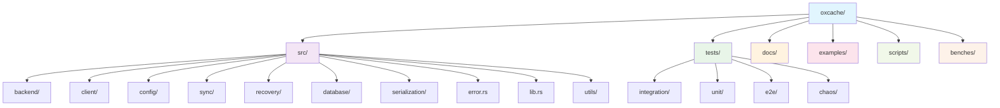
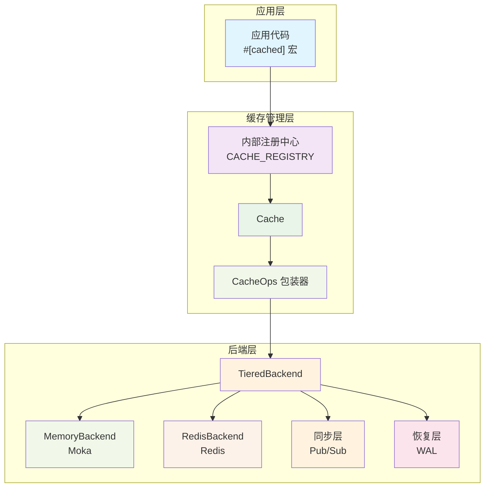
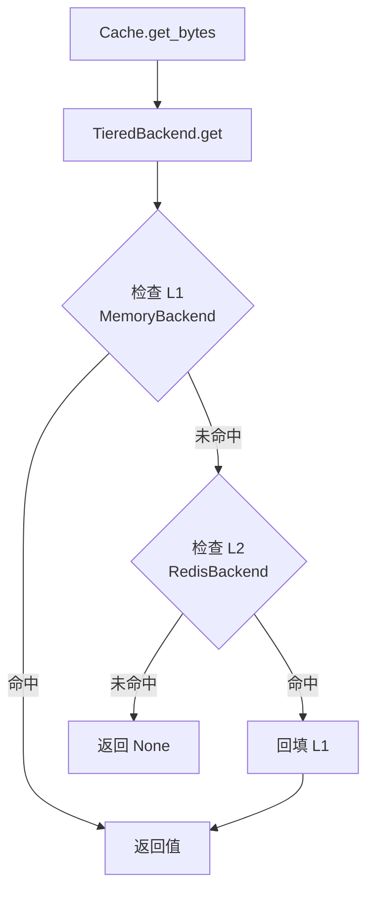
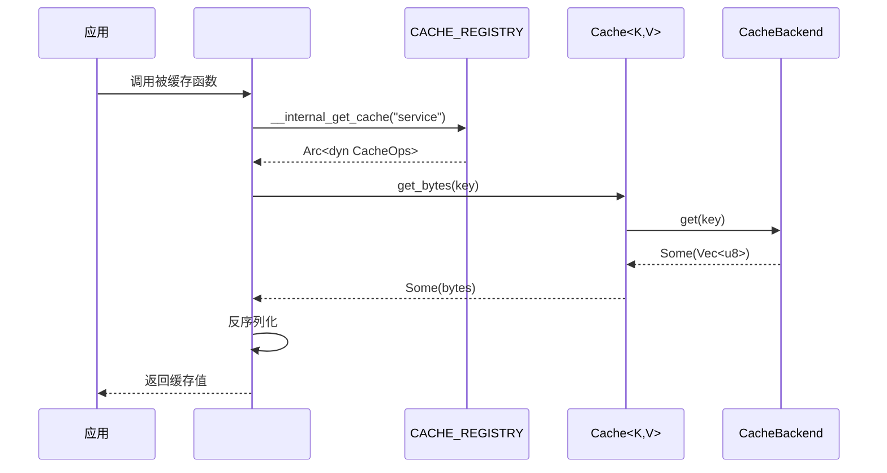
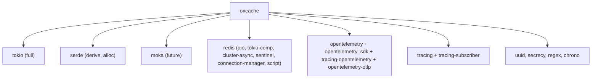

# 项目概述

<cite>
**本文引用的文件**
- [README.md](file://README.md)
- [Cargo.toml](file://Cargo.toml)
- [src/lib.rs](file://src/lib.rs)
- [docs/USER_GUIDE.md](file://docs/USER_GUIDE.md)
- [docs/API_REFERENCE.md](file://docs/API_REFERENCE.md)
- [docs/ARCHITECTURE.md](file://docs/ARCHITECTURE.md)
- [docs/PERFORMANCE_BENCHMARK_REPORT.md](file://docs/PERFORMANCE_BENCHMARK_REPORT.md)
- [docs/CONTRIBUTING.md](file://docs/CONTRIBUTING.md)
- [docs/CHANGELOG.md](file://docs/CHANGELOG.md)
</cite>

## 目录
1. [引言](#引言)
2. [项目结构](#项目结构)
3. [核心组件](#核心组件)
4. [架构总览](#架构总览)
5. [详细组件分析](#详细组件分析)
6. [依赖关系分析](#依赖关系分析)
7. [性能考量](#性能考量)
8. [故障排查指南](#故障排查指南)
9. [结论](#结论)
10. [附录](#附录)

## 引言
Oxcache 是一个高性能、生产级的 Rust 多级缓存库，采用 L1（内存缓存，Moka）+ L2（Redis 分布式缓存）两级架构，提供零代码变更、自动恢复、多实例同步、批量优化等特性。项目通过现代化 API 与宏支持，让开发者以最少成本获得极致性能与可靠性。

- **核心目标**：在 Rust 生态中提供“即插即用”的双层缓存方案，兼顾极致性能与生产可用性。
- **设计理念**：以 L1 保证纳秒级访问、L2 提供跨实例共享与弹性扩展；通过 Pub/Sub 与版本化失效保障一致性；通过 WAL 与健康检查实现故障自动降级与恢复。
- **适用场景**：高并发 Web 服务、API 缓存、数据库查询缓存、分布式系统中的热点数据加速等。

**章节来源**
- [README.md](file://README.md#L16-L58)
- [docs/USER_GUIDE.md](file://docs/USER_GUIDE.md#L75-L86)

## 项目结构
仓库采用模块化组织，围绕“后端实现 + 客户端 + 配置 + 功能特性”划分目录，便于按需启用特性与扩展后端。

**图表来源**
- [docs/CONTRIBUTING.md](file://docs/CONTRIBUTING.md#L122-L154)

**章节来源**
- [docs/CONTRIBUTING.md](file://docs/CONTRIBUTING.md#L120-L188)

## 核心组件
- 现代化 API 与宏支持：通过 Cache 类型与 #[cached] 宏实现零样板代码缓存。
- L1 内存缓存（Moka）：TinyLFU 淘汰策略，纳秒级访问延迟。
- L2 分布式缓存（Redis）：支持 Standalone/Sentinel/Cluster，批处理写入与 Pub/Sub 失效。
- 同步与恢复：基于版本号的 Pub/Sub 失效传播，WAL 写前日志保障持久化与恢复。
- 观测性与安全：OpenTelemetry 指标、健康检查、输入校验、超时保护、连接串脱敏等。

**章节来源**
- [src/lib.rs](file://src/lib.rs#L10-L176)
- [docs/ARCHITECTURE.md](file://docs/ARCHITECTURE.md#L34-L74)

## 架构总览
双层缓存架构通过统一 Cache 接口与后端适配，实现 L1 + L2 的协同工作。宏注册中心负责 #[cached] 函数与缓存实例的绑定，TieredBackend 在读写路径上分别处理 L1/L2 与 WAL/Pub/Sub。

**图表来源**
- [docs/ARCHITECTURE.md](file://docs/ARCHITECTURE.md#L36-L73)

**章节来源**
- [docs/ARCHITECTURE.md](file://docs/ARCHITECTURE.md#L34-L74)

## 详细组件分析

### L1 内存缓存（Moka）
- 技术选型：Moka 提供并发安全、TinyLFU 淘汰策略，适合高并发、低延迟的本地缓存。
- 性能特征：读写延迟通常在亚微秒至微秒级，吞吐量可达百万级 ops/s。
- 配置要点：最大容量、键值大小限制、清理间隔等。

**章节来源**
- [docs/ARCHITECTURE.md](file://docs/ARCHITECTURE.md#L136-L158)

### L2 分布式缓存（Redis）
- 支持模式：Standalone、Sentinel、Cluster，具备连接池、拓扑感知与自动重连能力。
- 序列化：支持 JSON 与 Bincode，Bincode 更小更快。
- 批处理：通过 MSET 等命令批量写入，显著提升吞吐量。
- 失效与同步：结合 Pub/Sub 与版本号，实现跨实例一致性。

**章节来源**
- [docs/ARCHITECTURE.md](file://docs/ARCHITECTURE.md#L159-L176)

### TieredBackend 读写路径
- 读路径：优先 L1，命中则返回；未命中再查 L2，命中则回填 L1 后返回。
- 写路径：立即写 L1，异步批量写 L2，必要时写 WAL 并发布失效消息。

**图表来源**
- [docs/ARCHITECTURE.md](file://docs/ARCHITECTURE.md#L485-L504)

**章节来源**
- [docs/ARCHITECTURE.md](file://docs/ARCHITECTURE.md#L201-L216)

### #[cached] 宏工作流
- 自动生成缓存键，从注册中心获取缓存实例，序列化/反序列化，自动写回缓存。
- 支持 TTL、键格式化、键前缀、键生成策略等参数。

**图表来源**
- [docs/ARCHITECTURE.md](file://docs/ARCHITECTURE.md#L381-L406)

**章节来源**
- [docs/ARCHITECTURE.md](file://docs/ARCHITECTURE.md#L375-L447)

### 同步与恢复
- 版本化失效：通过 Pub/Sub 发布失效消息，接收端根据版本号决定是否删除 L1。
- WAL：在 L2 不可用时，记录写操作并在恢复后重放，确保数据不丢失。
- 健康检查：周期性检测 L1/L2/WAL 状态，触发降级或恢复流程。

**章节来源**
- [docs/ARCHITECTURE.md](file://docs/ARCHITECTURE.md#L257-L312)

### 观测性与安全
- 指标：命中率、操作耗时、L2 健康状态、WAL 条目数、批量缓冲大小等。
- 追踪：OpenTelemetry 集成，支持 OTLP。
- 安全：输入校验（键、Lua 脚本、SCAN 模式）、超时保护、UUID 锁值、连接串脱敏、防注入规则等。

**章节来源**
- [docs/ARCHITECTURE.md](file://docs/ARCHITECTURE.md#L647-L668)

## 依赖关系分析
Oxcache 通过特性门控（feature flags）灵活启用功能，核心依赖包括：
- 异步运行时：Tokio（full 特性）
- 序列化：Serde（derive + alloc）
- 内存缓存：Moka（future 特性）
- 分布式缓存：Redis（aio、tokio-comp、cluster-async、sentinel、connection-manager、script）
- 观测性：OpenTelemetry、Tracing、Prometheus 输出
- 工具：UUID、Secret、Regex、Chrono 等

**图表来源**
- [Cargo.toml](file://Cargo.toml#L20-L120)

**章节来源**
- [Cargo.toml](file://Cargo.toml#L20-L377)

## 性能考量
- L1（Moka）：亚微秒级延迟，百万级 ops/s；可通过 capacity、序列化方式优化。
- L2（Redis）：本地回环约 1-5ms；批量写入可将吞吐提升至 200-500K ops/s。
- 批处理：通过批量缓冲与 MSET 等命令降低网络往返与协议开销。
- 编译优化：Release 配置启用 LTO、单 codegen 单元、panic abort、strip 等，显著提升性能与减小二进制体积。

**章节来源**
- [docs/PERFORMANCE_BENCHMARK_REPORT.md](file://docs/PERFORMANCE_BENCHMARK_REPORT.md#L8-L68)
- [docs/ARCHITECTURE.md](file://docs/ARCHITECTURE.md#L608-L646)
- [Cargo.toml](file://Cargo.toml#L352-L370)

## 故障排查指南
- 缓存未命中率高：检查 TTL、是否启用 promote_on_hit、L1 容量是否过小。
- Redis 连接失败：核对连接串、网络与防火墙、凭据与 TLS。
- 数据不一致：确认 Pub/Sub 通道与版本号配置，考虑缩短 TTL 或主动失效。
- 性能下降：检查内存泄漏、批量写入配置、L1 容量与序列化方式。

**章节来源**
- [docs/USER_GUIDE.md](file://docs/USER_GUIDE.md#L711-L760)

## 结论
Oxcache 以“L1 + L2”双层架构为核心，结合宏与现代 API，提供零代码变更、自动恢复、多实例同步与批量优化等能力。其特性门控设计与可观测性、安全性措施，使其既能满足初学者快速上手，也能满足资深开发者对性能与可靠性的严苛要求。配合完善的测试与文档体系，适合在生产环境中大规模部署。

## 附录

### 技术栈概览
- 异步运行时：Tokio
- 内存缓存：Moka
- 分布式缓存：Redis（Standalone/Sentinel/Cluster）
- 序列化：Serde（JSON/Bincode 等）
- 观测性：OpenTelemetry、Tracing、Prometheus
- 工具库：UUID、Secret、Regex、Chrono 等

**章节来源**
- [Cargo.toml](file://Cargo.toml#L24-L120)

### 特性分层与选择
- minimal：仅 L1（Moka），适合纯内存缓存场景。
- core：L1 + L2（Redis），默认推荐。
- full：包含宏、批处理、WAL、布隆过滤、速率限制、数据库集成、CLI、指标、智能策略等全部高级特性。

**章节来源**
- [README.md](file://README.md#L75-L115)
- [docs/API_REFERENCE.md](file://docs/API_REFERENCE.md#L27-L91)

### 适用场景与目标用户
- 场景：用户信息缓存、API 响应缓存、数据库查询缓存、热数据加速、多实例共享缓存。
- 用户：追求极致性能与易用性的 Rust 开发者，需要在生产环境稳定运行的团队。

**章节来源**
- [README.md](file://README.md#L244-L276)

### 发展历程与版本信息
- v0.1.4：重构示例与测试，统一新 API，增强安全与稳定性。
- v0.1.2：修复多个高危安全漏洞，引入多项性能优化。
- v0.1.1：引入全面编译器优化，显著提升运行时性能与减小二进制体积。
- v0.1.0：实现优雅关闭、降级策略、数据库回退、HTTP 指标端点、Redis 兼容性等。

**章节来源**
- [docs/CHANGELOG.md](file://docs/CHANGELOG.md#L8-L163)

### 许可证
- 项目采用 MIT 许可证，允许自由使用、修改与分发。

**章节来源**
- [README.md](file://README.md#L401-L404)