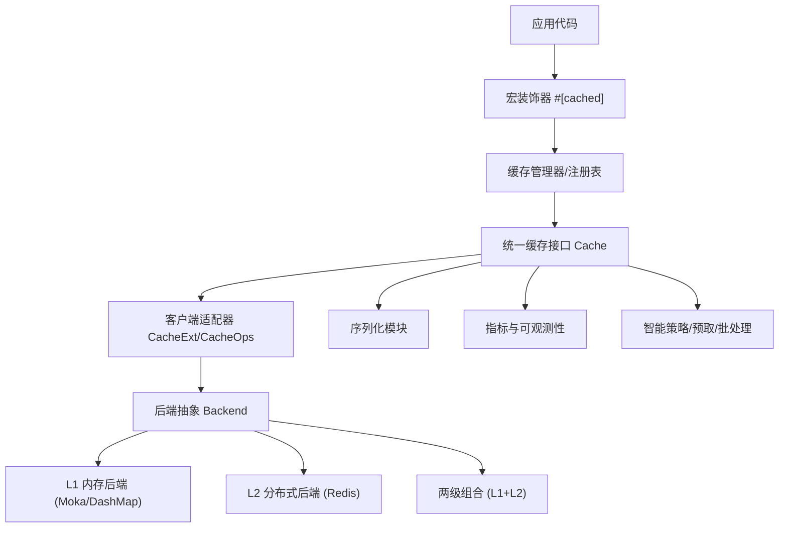
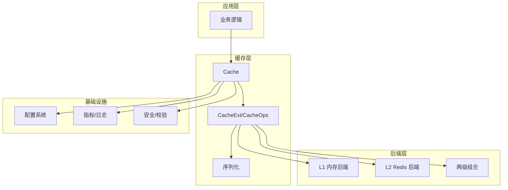
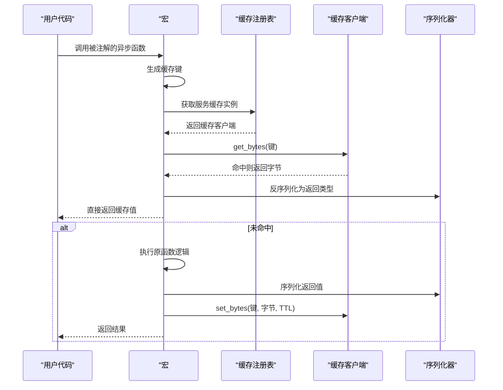
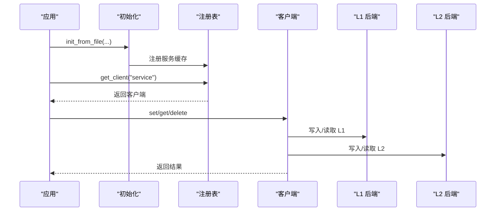
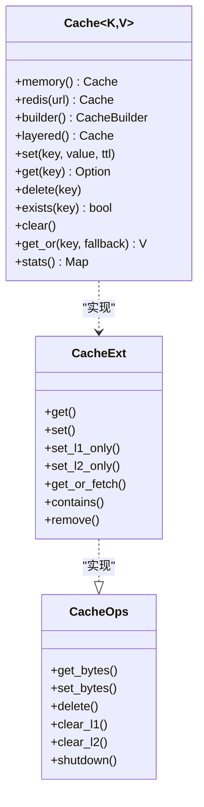
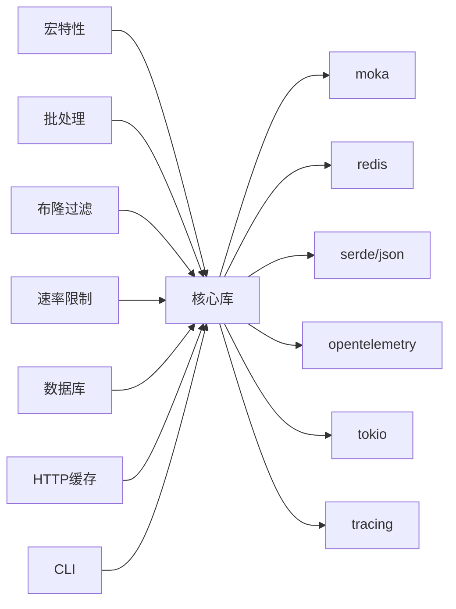

# 快速开始

<cite>
**本文引用的文件**   
- [README.md](file://README.md)
- [Cargo.toml](file://Cargo.toml)
- [src/lib.rs](file://src/lib.rs)
- [src/cache.rs](file://src/cache.rs)
- [src/config/mod.rs](file://src/config/mod.rs)
- [src/config/unified.rs](file://src/config/unified.rs)
- [src/client/mod.rs](file://src/client/mod.rs)
- [src/manager.rs](file://src/manager.rs)
- [src/backend/mod.rs](file://src/backend/mod.rs)
- [src/backend/client/mod.rs](file://src/backend/client/mod.rs)
- [src/backend/client/moka/mod.rs](file://src/backend/client/moka/mod.rs)
- [src/backend/client/redis/mod.rs](file://src/backend/client/redis/mod.rs)
- [src/serialization/mod.rs](file://src/serialization/mod.rs)
- [src/serialization/json.rs](file://src/serialization/json.rs)
- [src/serialization/bincode.rs](file://src/serialization/bincode.rs)
- [src/features.rs](file://src/features.rs)
- [src/error.rs](file://src/error.rs)
- [src/utils/key_generator.rs](file://src/utils/key_generator.rs)
- [src/metrics/mod.rs](file://src/metrics/mod.rs)
- [src/smart_strategy.rs](file://src/smart_strategy.rs)
- [src/sync/warmup.rs](file://src/sync/warmup.rs)
- [src/security/mod.rs](file://src/security/mod.rs)
- [src/telemetry.rs](file://src/telemetry.rs)
- [src/cli/mod.rs](file://src/cli/mod.rs)
- [src/http/mod.rs](file://src/http/mod.rs)
- [src/http/axum.rs](file://src/http/axum.rs)
- [src/database/mod.rs](file://src/database/mod.rs)
- [src/database/connection_string.rs](file://src/database/connection_string.rs)
- [src/database/mysql.rs](file://src/database/mysql.rs)
- [src/database/postgresql.rs](file://src/database/postgresql.rs)
- [src/database/sqlite.rs](file://src/database/sqlite.rs)
- [src/bloom_filter.rs](file://src/bloom_filter.rs)
- [src/rate_limiting.rs](file://src/rate_limiting.rs)
- [src/recovery/wal.rs](file://src/recovery/wal.rs)
- [src/internal.rs](file://src/internal.rs)
- [src/traits/cache_key.rs](file://src/traits/cache_key.rs)
- [src/traits/cacheable.rs](file://src/traits/cacheable.rs)
- [src/traits/mod.rs](file://src/traits/mod.rs)
- [macros/src/lib.rs](file://macros/src/lib.rs)
- [examples/src/01_basics/example_basic_operations.rs](file://examples/src/01_basics/example_basic_operations.rs)
- [examples/src/01_basics/example_comprehensive_usage.rs](file://examples/src/01_basics/example_comprehensive_usage.rs)
- [examples/src/01_basics/example_new_api.rs](file://examples/src/01_basics/example_new_api.rs)
- [examples/src/02_advanced/example_batch_write.rs](file://examples/src/02_advanced/example_batch_write.rs)
- [examples/src/02_advanced/example_cache_promotion.rs](file://examples/src/02_advanced/example_cache_promotion.rs)
- [examples/src/dynamic_config.rs](file://examples/src/dynamic_config.rs)
- [tests/test_config.toml](file://tests/test_config.toml)
</cite>

## 目录
1. [简介](#简介)
2. [项目结构](#项目结构)
3. [核心组件](#核心组件)
4. [架构总览](#架构总览)
5. [详细组件分析](#详细组件分析)
6. [依赖分析](#依赖分析)
7. [性能考虑](#性能考虑)
8. [故障排除指南](#故障排除指南)
9. [结论](#结论)
10. [附录](#附录)

## 简介
Oxcache 是一个高性能、生产级的 Rust 两级缓存库，采用 L1（内存缓存）+ L2（Redis 分布式缓存）架构。它提供零代码变更启用缓存的能力、自动降级与恢复、可观测性、批量优化、多实例同步等特性，适合在高并发与低延迟场景下使用。

- 零代码变更：通过宏装饰器一键启用缓存
- 自动降级：Redis 故障时自动降级，WAL 恢复
- 多实例同步：基于发布订阅与版本失效的跨实例同步
- 批量优化：智能批处理写入，显著提升吞吐
- 生产就绪：健康检查、混沌测试、安全防护

## 项目结构
仓库采用按功能域划分的模块化组织，核心模块包括：
- 核心 API 与公共导出：lib.rs、cache.rs、client/mod.rs
- 配置系统：config/mod.rs、config/unified.rs
- 后端实现：backend/mod.rs、backend/client/mod.rs、backend/client/moka、backend/client/redis
- 序列化与工具：serialization/mod.rs、utils/key_generator.rs
- 高级特性：metrics、smart_strategy、http、database、security、recovery、rate_limiting、bloom_filter、cli
- 宏实现：macros/src/lib.rs
- 示例与测试：examples/、tests/

图表来源
- [src/lib.rs](file://src/lib.rs#L575-L639)
- [src/cache.rs](file://src/cache.rs#L117-L120)
- [src/client/mod.rs](file://src/client/mod.rs#L18-L152)
- [src/backend/mod.rs](file://src/backend/mod.rs)
- [src/backend/client/mod.rs](file://src/backend/client/mod.rs)

章节来源
- [src/lib.rs](file://src/lib.rs#L417-L639)
- [src/cache.rs](file://src/cache.rs#L117-L120)
- [src/client/mod.rs](file://src/client/mod.rs#L18-L152)

## 核心组件
- 统一缓存接口：Cache<K, V> 提供类型安全的缓存操作，支持内存、Redis、两级缓存三种后端形态。
- 客户端适配器：CacheExt/CacheOps 抽象了 get/set/delete 等通用操作，并内置序列化支持。
- 配置系统：UnifiedConfig/ServiceConfig 提供集中式配置，支持 L1、L2、性能、监控、安全等维度。
- 宏装饰器：#[cached] 提供零侵入缓存增强，支持服务名、TTL、键生成策略等参数。
- 高级特性：指标、智能策略、HTTP 缓存、数据库集成、安全防护、WAL 恢复等。

章节来源
- [src/cache.rs](file://src/cache.rs#L117-L200)
- [src/client/mod.rs](file://src/client/mod.rs#L18-L200)
- [src/config/unified.rs](file://src/config/unified.rs#L21-L33)
- [macros/src/lib.rs](file://macros/src/lib.rs#L45-L314)

## 架构总览
Oxcache 的新 API（v0.2+）提供类型安全、独立的缓存接口，支持内存、Redis、两级缓存三种形态；通过统一配置与后端抽象实现灵活部署与扩展。

图表来源
- [src/cache.rs](file://src/cache.rs#L117-L120)
- [src/client/mod.rs](file://src/client/mod.rs#L18-L152)
- [src/config/unified.rs](file://src/config/unified.rs#L21-L33)
- [src/backend/client/mod.rs](file://src/backend/client/mod.rs)

## 详细组件分析

### 1) 安装与特性层级选择
- 添加依赖：在 Cargo.toml 中添加 oxcache，并根据需求选择特性层级（minimal/core/full）。
- 特性说明：
  - minimal：仅 L1 内存缓存（moka、序列化、指标）
  - core：L1 + L2（Redis）
  - full：包含宏、批处理、WAL、布隆过滤、速率限制、数据库、CLI、OpenTelemetry 等全部高级特性
- 最小依赖：如需最小化依赖，可关闭默认特性并手动启用所需特性。

章节来源
- [README.md](file://README.md#L61-L98)
- [Cargo.toml](file://Cargo.toml#L235-L347)

### 2) 全局配置与服务配置
- 全局设置：default_ttl、health_check_interval、serialization、enable_metrics 等。
- 服务配置：
  - 两层缓存（L1+L2）：支持 write_through、promote_on_hit、enable_batch_write、batch_size、batch_interval_ms 等。
  - L1-only：max_capacity、ttl、tti、initial_capacity。
  - L2-only：mode（standalone/sentinel/cluster）、connection_string。
- 配置加载：启用 config-toml 与 confers 特性后，可通过 init_from_file 加载配置文件。

章节来源
- [README.md](file://README.md#L116-L172)
- [src/config/unified.rs](file://src/config/unified.rs#L21-L33)
- [src/config/mod.rs](file://src/config/mod.rs#L15-L32)

### 3) 使用方式一：宏装饰器（推荐）
- 步骤：
  - 启用 macros 特性
  - 在函数上使用 #[cached(service = "...", ttl = ...)] 注解
  - 初始化：init_from_file("config.toml").await?
  - 调用函数即可自动缓存
- 键生成策略：支持自定义 key、key_prefix、key_generator（simple/md5/murmur3/namespace）。
- 缓存类型：可选 "two-level"/"l1-only"/"l2-only"。

图表来源
- [macros/src/lib.rs](file://macros/src/lib.rs#L45-L314)
- [src/internal.rs](file://src/internal.rs)
- [src/client/mod.rs](file://src/client/mod.rs#L18-L152)

章节来源
- [README.md](file://README.md#L174-L214)
- [macros/src/lib.rs](file://macros/src/lib.rs#L45-L314)

### 4) 使用方式二：手动客户端
- 初始化：init_from_file("config.toml").await?
- 获取客户端：get_client("service_name")?
- 常用操作：set/get/delete，以及 set_l1_only/set_l2_only。
- 适用场景：需要更细粒度控制或不希望引入宏装饰器的场景。

图表来源
- [src/lib.rs](file://src/lib.rs#L517-L539)
- [src/client/mod.rs](file://src/client/mod.rs#L18-L152)
- [src/backend/client/mod.rs](file://src/backend/client/mod.rs)

章节来源
- [README.md](file://README.md#L216-L242)
- [src/lib.rs](file://src/lib.rs#L517-L539)

### 5) 新 API（v0.2+）入门
- 创建缓存：Cache::memory()/redis()/builder()/layered()
- 基本操作：set/get/delete、exists、clear、get_or（回退模式）
- 批量操作：set_many/get_many/delete_many
- 高级配置：Builder 模式设置 TTL、序列化、批处理、并发等
- 自定义键类型：实现 CacheKey trait

图表来源
- [src/cache.rs](file://src/cache.rs#L117-L200)
- [src/client/mod.rs](file://src/client/mod.rs#L18-L152)

章节来源
- [src/cache.rs](file://src/cache.rs#L117-L200)
- [src/client/mod.rs](file://src/client/mod.rs#L18-L152)
- [examples/src/01_basics/example_new_api.rs](file://examples/src/01_basics/example_new_api.rs#L30-L271)

### 6) 配置文件示例与说明
- 全局设置：default_ttl、health_check_interval、serialization、enable_metrics
- 服务配置：
  - 两层缓存（L1+L2）：ttl、write_through、promote_on_hit、enable_batch_write、batch_size、batch_interval_ms
  - L1-only：max_capacity、ttl、tti、initial_capacity
  - L2-only：mode、connection_string
- 动态配置示例：使用缓存存储配置键值，支持批量导入、查询、更新与分组导出。

章节来源
- [README.md](file://README.md#L116-L172)
- [examples/src/dynamic_config.rs](file://examples/src/dynamic_config.rs#L20-L133)

### 7) 高级特性与最佳实践
- 批量写入：enable_batch_write + 批大小/间隔，显著提升吞吐
- 缓存提升：promote_on_hit 将热点数据提升至 L1
- 智能策略：压缩决策、命中率收集、预取策略
- 安全防护：输入校验、超时保护、锁值安全、连接串脱敏
- 观测性：指标导出、健康检查、日志记录
- 数据库集成：SeaORM/SQLX 支持，分区策略
- HTTP 缓存：中间件与键生成策略
- CLI：命令行工具与状态查看

章节来源
- [README.md](file://README.md#L106-L115)
- [src/smart_strategy.rs](file://src/smart_strategy.rs)
- [src/security/mod.rs](file://src/security/mod.rs)
- [src/metrics/mod.rs](file://src/metrics/mod.rs)
- [src/database/mod.rs](file://src/database/mod.rs)
- [src/http/mod.rs](file://src/http/mod.rs)
- [src/cli/mod.rs](file://src/cli/mod.rs)

## 依赖分析
- 特性依赖：通过编译时断言确保特性组合正确（如 bloom-filter 需要 moka，wal-recovery 需要 redis 等）。
- 后端依赖：L1（moka/dashmap）、L2（redis）、序列化（serde/json/bincode/flate2）、指标（opentelemetry/tracing）。
- 运行时依赖：tokio、async-trait、uuid、log、anyhow、thiserror 等。

图表来源
- [Cargo.toml](file://Cargo.toml#L235-L347)
- [src/lib.rs](file://src/lib.rs#L670-L680)

章节来源
- [Cargo.toml](file://Cargo.toml#L235-L347)
- [src/lib.rs](file://src/lib.rs#L670-L680)

## 性能考虑
- L1：内存缓存，纳秒级响应（P99 < 100ns），适合热数据
- L2：Redis 本地网络，毫秒级响应（P99 < 5ms），适合共享数据
- 批量写入：开启批处理可将 L2 单写吞吐提升至 200-500K ops/sec
- 序列化：JSON/Bincode/压缩可降低网络与存储开销
- 预热与提升：通过 promote_on_hit 与预热策略提升命中率

章节来源
- [README.md](file://README.md#L305-L335)
- [src/smart_strategy.rs](file://src/smart_strategy.rs)
- [src/sync/warmup.rs](file://src/sync/warmup.rs)

## 故障排除指南
- 初始化失败
  - 确认已启用 config-toml 与 confers 特性
  - 检查配置文件路径与权限
  - 查看日志输出，确认连接串格式正确
- Redis 连接问题
  - 检查连接字符串、认证信息、网络连通性
  - 如需非 TLS 连接，参考环境变量或配置项
- 特性组合错误
  - 编译时报错提示缺少依赖特性（如启用 bloom-filter 但未启用 moka/full）
  - 使用 full 特性或手动添加缺失特性
- 键长度与字符校验
  - 宏装饰器会对键进行长度与非法字符校验，超长或包含非法字符将回退为直连执行
- 安全告警
  - 使用内置校验与脱敏工具，避免协议注入与凭据泄露

章节来源
- [README.md](file://README.md#L116-L123)
- [macros/src/lib.rs](file://macros/src/lib.rs#L21-L43)
- [src/security/mod.rs](file://src/security/mod.rs)
- [src/database/connection_string.rs](file://src/database/connection_string.rs)

## 结论
通过本快速开始指南，你可以在几分钟内完成 Oxcache 的安装、配置与使用。建议优先采用宏装饰器方式实现零侵入缓存增强，结合新 API 的类型安全接口与统一配置系统，快速搭建高性能、可观测、可扩展的两级缓存方案。对于复杂场景，可进一步探索批处理、智能策略、HTTP 缓存、数据库集成等高级特性。

## 附录

### A. 常用示例路径
- 基础 CRUD：[示例](file://examples/src/01_basics/example_basic_operations.rs#L21-L73)
- 宏装饰器使用：[示例](file://examples/src/01_basics/example_cached_macro.rs#L20-L170)
- 综合使用：[示例](file://examples/src/01_basics/example_comprehensive_usage.rs#L37-L225)
- 新 API 使用：[示例](file://examples/src/01_basics/example_new_api.rs#L30-L271)
- 批量写入优化：[示例](file://examples/src/02_advanced/example_batch_write.rs#L25-L154)
- 缓存提升策略：[示例](file://examples/src/02_advanced/example_cache_promotion.rs#L21-L66)
- 布隆过滤器：[示例](file://examples/src/06_features/example_bloom_filter.rs#L19-L180)
- 限流保护：[示例](file://examples/src/06_features/example_rate_limiting.rs#L20-L150)
- 数据库集成：[示例](file://examples/src/05_database/example_database_integration.rs#L25-L160)
- 动态配置：[示例](file://examples/src/dynamic_config.rs#L20-L133)

### B. 关键 API 与类型
- 统一缓存接口：[Cache](file://src/cache.rs#L117-L120)
- 客户端适配器：[CacheExt/CacheOps](file://src/client/mod.rs#L18-L200)
- 配置系统：[UnifiedConfig/ServiceConfig](file://src/config/unified.rs#L21-L33)
- 宏装饰器：[#[cached]](file://macros/src/lib.rs#L45-L314)
- 键生成器：[KeyGenerator](file://src/utils/key_generator.rs)