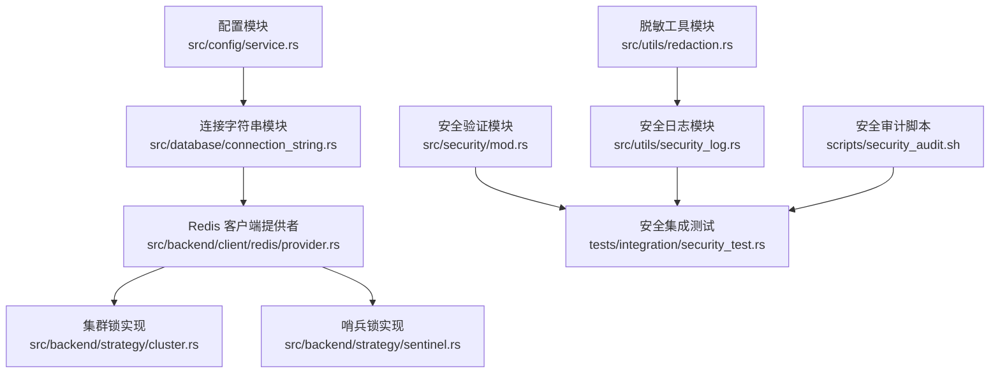
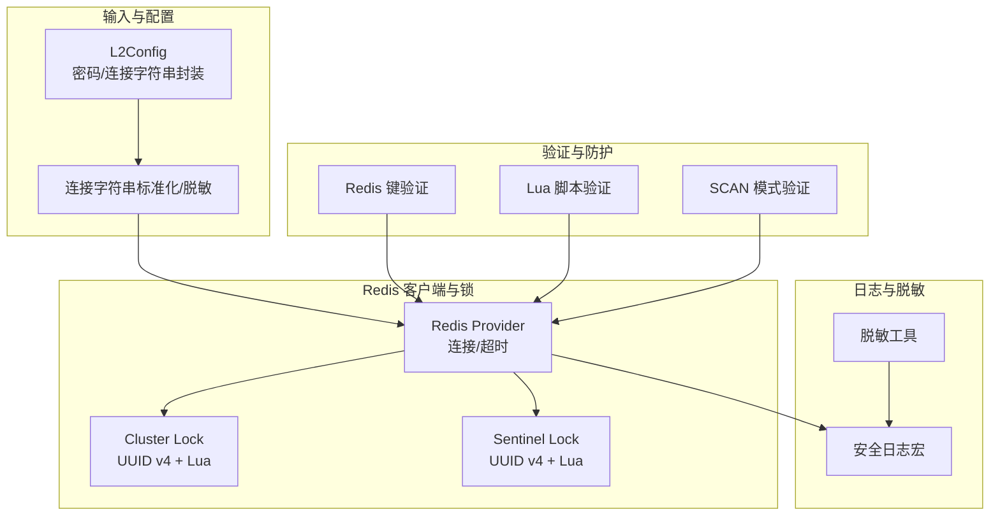
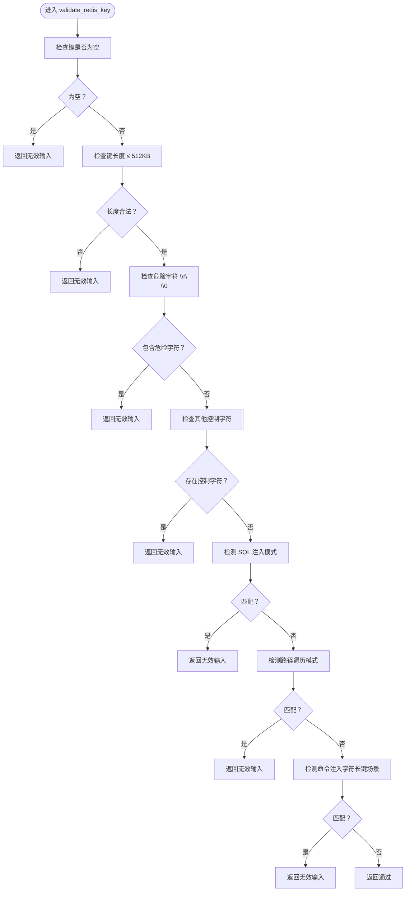
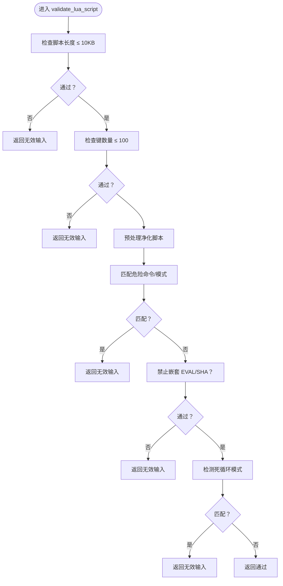
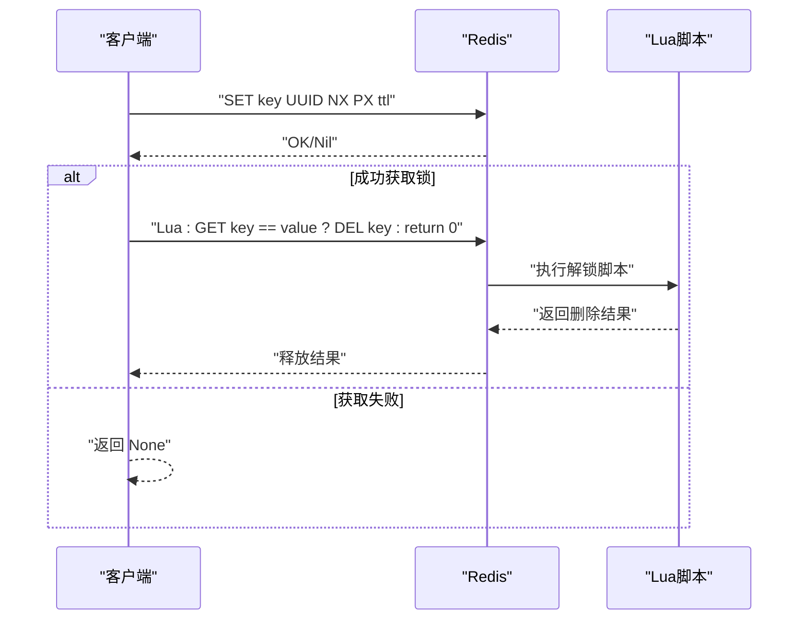
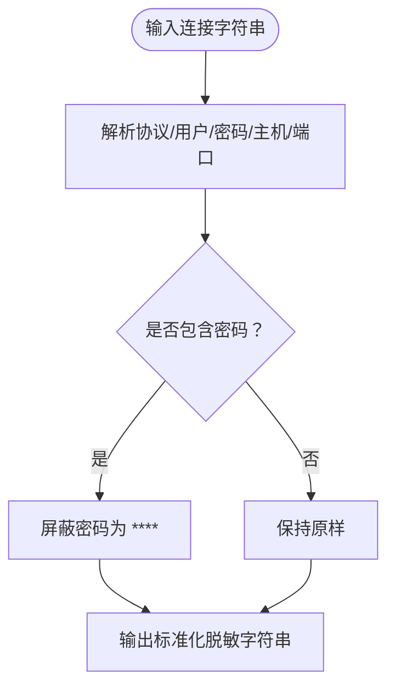
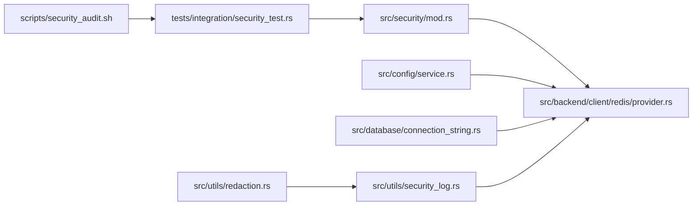

# 安全特性

<cite>
**本文引用的文件**
- [src/security/mod.rs](file://src/security/mod.rs)
- [src/utils/redaction.rs](file://src/utils/redaction.rs)
- [src/utils/security_log.rs](file://src/utils/security_log.rs)
- [src/config/service.rs](file://src/config/service.rs)
- [src/database/connection_string.rs](file://src/database/connection_string.rs)
- [src/backend/strategy/cluster.rs](file://src/backend/strategy/cluster.rs)
- [src/backend/strategy/sentinel.rs](file://src/backend/strategy/sentinel.rs)
- [src/backend/client/redis/provider.rs](file://src/backend/client/redis/provider.rs)
- [tests/integration/security_test.rs](file://tests/integration/security_test.rs)
- [scripts/security_audit.sh](file://scripts/security_audit.sh)
- [tests/redis_test_utils.rs](file://tests/redis_test_utils.rs)
</cite>

## 目录
1. [简介](#简介)
2. [项目结构](#项目结构)
3. [核心组件](#核心组件)
4. [架构总览](#架构总览)
5. [详细组件分析](#详细组件分析)
6. [依赖关系分析](#依赖关系分析)
7. [性能考量](#性能考量)
8. [故障排查指南](#故障排查指南)
9. [结论](#结论)
10. [附录](#附录)

## 简介
本章节系统梳理 Oxcache 的安全特性，覆盖输入验证、连接安全、日志脱敏与攻击防护机制。重点包括：
- 键值验证机制，防止 Redis 协议注入与命令注入
- Lua 脚本安全限制与扫描操作防护
- 分布式锁的安全实现（基于加密安全的 UUID v4）
- 连接字符串脱敏与日志脱敏策略
- 超时保护与安全审计流程
- 安全配置最佳实践与应急响应指引

## 项目结构
Oxcache 的安全能力由多个模块协同实现：
- 安全验证模块：集中于键值、Lua 脚本、SCAN 模式的校验
- 脱敏与日志模块：统一处理敏感信息脱敏与安全日志输出
- 配置与连接字符串模块：对 L2 配置中的敏感字段进行安全封装与标准化
- Redis 客户端与分布式锁：在锁获取与释放中采用原子 Lua 脚本与强随机值
- 测试与审计：集成安全测试与自动化安全审计脚本

图表来源
- [src/security/mod.rs](file://src/security/mod.rs#L74-L202)
- [src/utils/redaction.rs](file://src/utils/redaction.rs#L26-L115)
- [src/utils/security_log.rs](file://src/utils/security_log.rs#L27-L95)
- [src/config/service.rs](file://src/config/service.rs#L370-L420)
- [src/database/connection_string.rs](file://src/database/connection_string.rs#L792-L856)
- [src/backend/client/redis/provider.rs](file://src/backend/client/redis/provider.rs#L70-L109)
- [src/backend/strategy/cluster.rs](file://src/backend/strategy/cluster.rs#L274-L294)
- [src/backend/strategy/sentinel.rs](file://src/backend/strategy/sentinel.rs#L274-L294)
- [tests/integration/security_test.rs](file://tests/integration/security_test.rs#L17-L115)
- [scripts/security_audit.sh](file://scripts/security_audit.sh#L133-L189)

章节来源
- [src/security/mod.rs](file://src/security/mod.rs#L74-L202)
- [src/utils/redaction.rs](file://src/utils/redaction.rs#L26-L115)
- [src/utils/security_log.rs](file://src/utils/security_log.rs#L27-L95)
- [src/config/service.rs](file://src/config/service.rs#L370-L420)
- [src/database/connection_string.rs](file://src/database/connection_string.rs#L792-L856)
- [src/backend/client/redis/provider.rs](file://src/backend/client/redis/provider.rs#L70-L109)
- [src/backend/strategy/cluster.rs](file://src/backend/strategy/cluster.rs#L274-L294)
- [src/backend/strategy/sentinel.rs](file://src/backend/strategy/sentinel.rs#L274-L294)
- [tests/integration/security_test.rs](file://tests/integration/security_test.rs#L17-L115)
- [scripts/security_audit.sh](file://scripts/security_audit.sh#L133-L189)

## 核心组件
- 输入验证与攻击防护
  - Redis 键验证：长度限制、协议注入字符过滤、SQL 注入与路径遍历模式检测、命令注入字符检测
  - Lua 脚本验证：长度与键数量上限、危险命令白名单匹配、嵌套 EVAL 检测、潜在死循环模式检测
  - SCAN 模式验证：长度与通配符数量限制、count 参数安全范围钳制
- 连接安全与脱敏
  - L2 配置使用加密安全的 SecretString 存储敏感字段（连接字符串、密码）
  - 连接字符串标准化与密码屏蔽（支持 Redis/MySQL/PG/SQLite）
  - 日志脱敏：宏自动脱敏连接字符串与缓存键，提供安全日志记录接口
- 分布式锁安全
  - 使用 UUID v4 作为锁值，保证唯一性与不可预测性
  - 原子解锁 Lua 脚本，确保“获取锁值”与“释放锁”一致性
- 超时保护
  - 连接超时与命令超时配置，避免长时间阻塞
  - 回源加载具备超时与重试控制
- 安全审计与测试
  - 集成安全测试用例，覆盖常见注入与 ReDoS 场景
  - 自动化安全审计脚本，定期扫描依赖漏洞

章节来源
- [src/security/mod.rs](file://src/security/mod.rs#L74-L202)
- [src/security/mod.rs](file://src/security/mod.rs#L204-L312)
- [src/security/mod.rs](file://src/security/mod.rs#L431-L482)
- [src/config/service.rs](file://src/config/service.rs#L370-L420)
- [src/database/connection_string.rs](file://src/database/connection_string.rs#L792-L856)
- [src/utils/security_log.rs](file://src/utils/security_log.rs#L27-L95)
- [src/backend/strategy/cluster.rs](file://src/backend/strategy/cluster.rs#L274-L294)
- [src/backend/strategy/sentinel.rs](file://src/backend/strategy/sentinel.rs#L274-L294)
- [src/backend/client/redis/provider.rs](file://src/backend/client/redis/provider.rs#L70-L109)
- [tests/integration/security_test.rs](file://tests/integration/security_test.rs#L17-L115)
- [scripts/security_audit.sh](file://scripts/security_audit.sh#L133-L189)

## 架构总览
下图展示安全相关模块之间的交互关系与数据流。

图表来源
- [src/config/service.rs](file://src/config/service.rs#L370-L420)
- [src/database/connection_string.rs](file://src/database/connection_string.rs#L792-L856)
- [src/security/mod.rs](file://src/security/mod.rs#L74-L202)
- [src/security/mod.rs](file://src/security/mod.rs#L204-L312)
- [src/security/mod.rs](file://src/security/mod.rs#L431-L482)
- [src/utils/redaction.rs](file://src/utils/redaction.rs#L26-L115)
- [src/utils/security_log.rs](file://src/utils/security_log.rs#L27-L95)
- [src/backend/client/redis/provider.rs](file://src/backend/client/redis/provider.rs#L70-L109)
- [src/backend/strategy/cluster.rs](file://src/backend/strategy/cluster.rs#L274-L294)
- [src/backend/strategy/sentinel.rs](file://src/backend/strategy/sentinel.rs#L274-L294)

## 详细组件分析

### 键值验证机制与 Redis 协议注入防护
- 防护目标
  - 阻止键中包含 CR/LF、NULL 等协议注入字符
  - 检测 SQL 注入、路径遍历与命令注入模式
  - 限制键长度，防止滥用
- 关键规则
  - 非空、长度 ≤ 512KB
  - 不含 \r/\n/\0；Unicode 控制字符严格过滤
  - 关键词模式检测（SQL 注入、路径遍历、命令注入）
- 验证入口
  - [validate_redis_key](file://src/security/mod.rs#L92-L201)

图表来源
- [src/security/mod.rs](file://src/security/mod.rs#L92-L201)

章节来源
- [src/security/mod.rs](file://src/security/mod.rs#L92-L201)
- [tests/integration/security_test.rs](file://tests/integration/security_test.rs#L118-L152)

### Lua 脚本安全限制与扫描操作防护
- Lua 脚本验证
  - 长度上限：≤ 10KB
  - 键数量上限：≤ 100
  - 预处理净化：移除注释、字符串，保留标识符字符，规范化空白
  - 危险命令黑名单：FLUSHALL/FLUSHDB/KEYS/SHUTDOWN/CONFIG/DEBUG/SAVE/BGSAVE/MONITOR/os.execute/io.popen/loadstring/load 等
  - 禁止嵌套 redis.eval/evalsha
  - 死循环模式检测（WHILE TRUE/REPEAT/GOTO）
- SCAN 模式防护
  - 模式长度上限：≤ 256
  - 通配符数量上限：≤ 10
  - count 参数安全范围钳制：1–1000
- 验证入口
  - [validate_lua_script](file://src/security/mod.rs#L223-L312)
  - [validate_scan_pattern](file://src/security/mod.rs#L448-L469)
  - [clamp_scan_count](file://src/security/mod.rs#L480-L482)

图表来源
- [src/security/mod.rs](file://src/security/mod.rs#L223-L312)

章节来源
- [src/security/mod.rs](file://src/security/mod.rs#L223-L312)
- [src/security/mod.rs](file://src/security/mod.rs#L448-L482)
- [tests/integration/security_test.rs](file://tests/integration/security_test.rs#L17-L115)

### 分布式锁的安全实现（UUID v4 + 原子解锁）
- 锁值生成：使用加密安全的 UUID v4，保证唯一性与不可预测性
- 加锁：SET NX PX 原语，设置 TTL
- 解锁：Lua 脚本原子判断锁值并删除，避免误删他人锁
- 适用模式：Cluster 与 Sentinel
- 实现入口
  - [cluster lock](file://src/backend/strategy/cluster.rs#L274-L294)
  - [cluster unlock](file://src/backend/strategy/cluster.rs#L301-L322)
  - [sentinel lock](file://src/backend/strategy/sentinel.rs#L274-L294)
  - [sentinel unlock](file://src/backend/strategy/sentinel.rs#L301-L322)

图表来源
- [src/backend/strategy/cluster.rs](file://src/backend/strategy/cluster.rs#L274-L294)
- [src/backend/strategy/cluster.rs](file://src/backend/strategy/cluster.rs#L301-L322)
- [src/backend/strategy/sentinel.rs](file://src/backend/strategy/sentinel.rs#L274-L294)
- [src/backend/strategy/sentinel.rs](file://src/backend/strategy/sentinel.rs#L301-L322)

章节来源
- [src/backend/strategy/cluster.rs](file://src/backend/strategy/cluster.rs#L274-L294)
- [src/backend/strategy/cluster.rs](file://src/backend/strategy/cluster.rs#L301-L322)
- [src/backend/strategy/sentinel.rs](file://src/backend/strategy/sentinel.rs#L274-L294)
- [src/backend/strategy/sentinel.rs](file://src/backend/strategy/sentinel.rs#L301-L322)

### 连接字符串脱敏与日志脱敏
- 连接字符串脱敏
  - 统一解析协议、用户、密码、主机、端口，按需屏蔽密码
  - 支持 Redis/MySQL/PG/SQLite 标准化与脱敏
  - [redact_connection_string](file://src/utils/redaction.rs#L45-L74)
  - [normalize_connection_string_with_redaction](file://src/database/connection_string.rs#L792-L856)
- 日志脱敏
  - 宏 secure_info!/secure_debug! 自动识别并脱敏连接字符串
  - [secure_info!](file://src/utils/security_log.rs#L27-L49)
  - [secure_debug!](file://src/utils/security_log.rs#L53-L68)
  - 缓存键脱敏：[log_cache_key](file://src/utils/security_log.rs#L85-L95)
- 安全配置
  - L2Config 使用 SecretString 封装敏感字段，避免明文存储
  - [L2Config.password](file://src/config/service.rs#L378-L440)
  - [L2Config.connection_string](file://src/config/service.rs#L371-L421)

图表来源
- [src/utils/redaction.rs](file://src/utils/redaction.rs#L45-L74)
- [src/database/connection_string.rs](file://src/database/connection_string.rs#L792-L856)

章节来源
- [src/utils/redaction.rs](file://src/utils/redaction.rs#L45-L74)
- [src/utils/security_log.rs](file://src/utils/security_log.rs#L27-L95)
- [src/config/service.rs](file://src/config/service.rs#L371-L440)
- [src/database/connection_string.rs](file://src/database/connection_string.rs#L792-L856)

### 超时保护机制
- 连接超时与命令超时
  - L2Config 提供 connection_timeout_ms 与 command_timeout_ms
  - Redis Provider 在获取连接与执行命令时应用超时
  - [L2Config.connection_timeout_ms](file://src/config/service.rs#L373-L447)
  - [L2Config.command_timeout_ms](file://src/config/service.rs#L375-L451)
  - [Redis Provider 连接超时](file://src/backend/client/redis/provider.rs#L97-L107)
- 回源加载超时与重试
  - DbFallbackManager 支持超时与最大重试次数
  - [DbFallbackManager.new](file://src/client/db_loader.rs#L147-L159)
  - [fallback_load](file://src/client/db_loader.rs#L171-L189)

章节来源
- [src/config/service.rs](file://src/config/service.rs#L373-L451)
- [src/backend/client/redis/provider.rs](file://src/backend/client/redis/provider.rs#L97-L107)
- [src/client/db_loader.rs](file://src/client/db_loader.rs#L147-L189)

### 安全配置最佳实践
- 配置层面
  - 使用 L2Config 的 SecretString 存储敏感信息，避免明文日志
  - 合理设置连接与命令超时，防止阻塞
  - 启用 TLS（enable_tls），在生产环境强制使用
- 连接字符串
  - 使用标准化与脱敏输出，避免在日志中暴露密码
- 锁与并发
  - 使用 UUID v4 作为锁值，避免冲突与猜测
  - 解锁使用原子 Lua 脚本，确保一致性
- 日志
  - 使用 secure_info!/secure_debug! 宏记录，自动脱敏
  - 对缓存键使用脱敏输出，避免泄露敏感业务数据

章节来源
- [src/config/service.rs](file://src/config/service.rs#L371-L440)
- [src/utils/security_log.rs](file://src/utils/security_log.rs#L27-L95)
- [src/backend/strategy/cluster.rs](file://src/backend/strategy/cluster.rs#L274-L294)
- [src/backend/strategy/sentinel.rs](file://src/backend/strategy/sentinel.rs#L274-L294)

### 安全审计与测试
- 安全测试
  - 集成测试覆盖 Lua 注入、SCAN ReDoS、键注入等场景
  - [security_test.rs](file://tests/integration/security_test.rs#L17-L115)
- 依赖安全审计
  - 自动化脚本定期扫描依赖漏洞，支持 JSON/人类可读输出
  - [security_audit.sh](file://scripts/security_audit.sh#L133-L189)

章节来源
- [tests/integration/security_test.rs](file://tests/integration/security_test.rs#L17-L115)
- [scripts/security_audit.sh](file://scripts/security_audit.sh#L133-L189)

## 依赖关系分析
- 安全验证模块与 Redis 客户端
  - 键/脚本/SCAN 验证在执行前进行，降低注入风险
  - Provider 层应用超时配置，避免阻塞
- 脱敏与日志
  - redaction 与 security_log 作为通用工具被各模块复用
- 配置与连接字符串
  - L2Config 使用 SecretString，connection_string 提供标准化与脱敏

图表来源
- [src/security/mod.rs](file://src/security/mod.rs#L74-L202)
- [src/backend/client/redis/provider.rs](file://src/backend/client/redis/provider.rs#L70-L109)
- [src/config/service.rs](file://src/config/service.rs#L371-L440)
- [src/database/connection_string.rs](file://src/database/connection_string.rs#L792-L856)
- [src/utils/redaction.rs](file://src/utils/redaction.rs#L26-L115)
- [src/utils/security_log.rs](file://src/utils/security_log.rs#L27-L95)
- [tests/integration/security_test.rs](file://tests/integration/security_test.rs#L17-L115)
- [scripts/security_audit.sh](file://scripts/security_audit.sh#L133-L189)

章节来源
- [src/security/mod.rs](file://src/security/mod.rs#L74-L202)
- [src/backend/client/redis/provider.rs](file://src/backend/client/redis/provider.rs#L70-L109)
- [src/config/service.rs](file://src/config/service.rs#L371-L440)
- [src/database/connection_string.rs](file://src/database/connection_string.rs#L792-L856)
- [src/utils/redaction.rs](file://src/utils/redaction.rs#L26-L115)
- [src/utils/security_log.rs](file://src/utils/security_log.rs#L27-L95)
- [tests/integration/security_test.rs](file://tests/integration/security_test.rs#L17-L115)
- [scripts/security_audit.sh](file://scripts/security_audit.sh#L133-L189)

## 性能考量
- 验证复杂度
  - 键验证与 SCAN 模式验证均为线性扫描，常数开销小
  - Lua 脚本预处理与净化采用一次遍历，复杂度 O(n)
- 超时与阻塞
  - 通过连接与命令超时限制阻塞时间，避免级联故障
- 日志脱敏
  - 脱敏与连接字符串解析在必要时进行，避免频繁处理大对象

## 故障排查指南
- 常见错误与定位
  - InvalidInput：键/脚本/SCAN 模式不满足安全阈值
  - RedisError：连接/命令执行失败，检查超时与网络
  - L2Error：连接超时，检查 connection_timeout_ms
- 排查步骤
  - 检查配置项：L2Config 的连接超时、命令超时、TLS 开关
  - 校验输入：确认键/脚本/SCAN 模式符合限制
  - 日志脱敏：使用 secure_info!/secure_debug! 确认敏感信息被屏蔽
  - 依赖审计：运行安全审计脚本，修复高危漏洞
- 相关入口
  - [L2Config](file://src/config/service.rs#L371-L440)
  - [Redis Provider 错误处理](file://src/backend/client/redis/provider.rs#L70-L78)
  - [安全审计脚本](file://scripts/security_audit.sh#L133-L189)

章节来源
- [src/config/service.rs](file://src/config/service.rs#L371-L440)
- [src/backend/client/redis/provider.rs](file://src/backend/client/redis/provider.rs#L70-L78)
- [scripts/security_audit.sh](file://scripts/security_audit.sh#L133-L189)

## 结论
Oxcache 通过多层次的安全设计，有效降低了输入注入、协议污染、资源滥用与信息泄露的风险。结合超时保护与自动化安全审计，形成从输入到输出、从配置到运行的闭环安全体系。建议在生产环境中启用 TLS、合理设置超时、使用 UUID v4 分布式锁，并持续运行安全审计脚本以保障长期安全。

## 附录
- 安全日志记录示例
  - 使用 secure_info!/secure_debug! 自动脱敏连接字符串与敏感字段
  - 使用 log_cache_key 对缓存键进行脱敏输出
- 应急响应流程
  - 发现漏洞：立即运行安全审计脚本，定位受影响组件
  - 修复与验证：更新依赖、重新构建与测试，确认修复生效
  - 监控与告警：在日志中启用安全告警，关注异常模式

章节来源
- [src/utils/security_log.rs](file://src/utils/security_log.rs#L27-L95)
- [scripts/security_audit.sh](file://scripts/security_audit.sh#L133-L189)