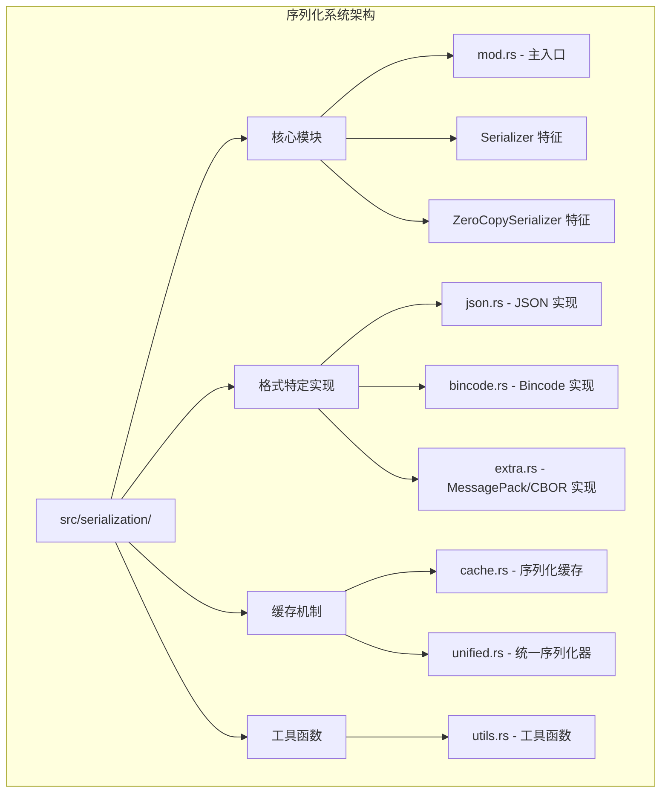
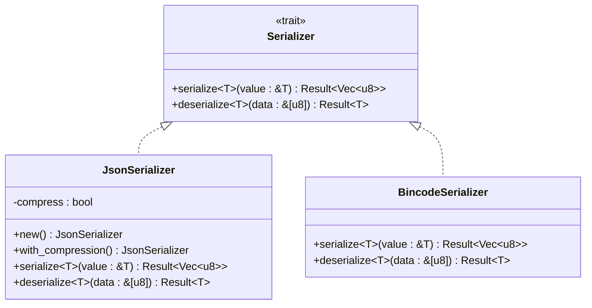
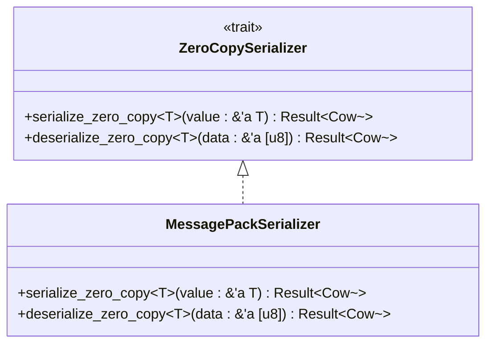
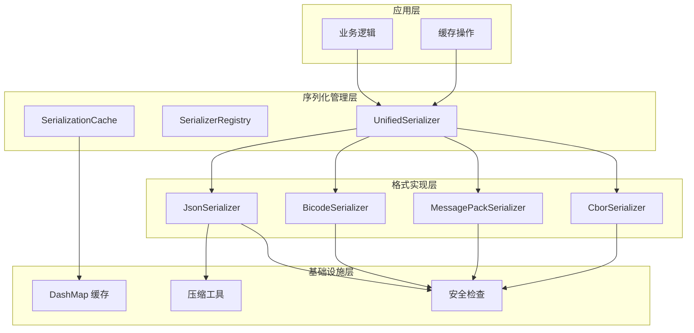
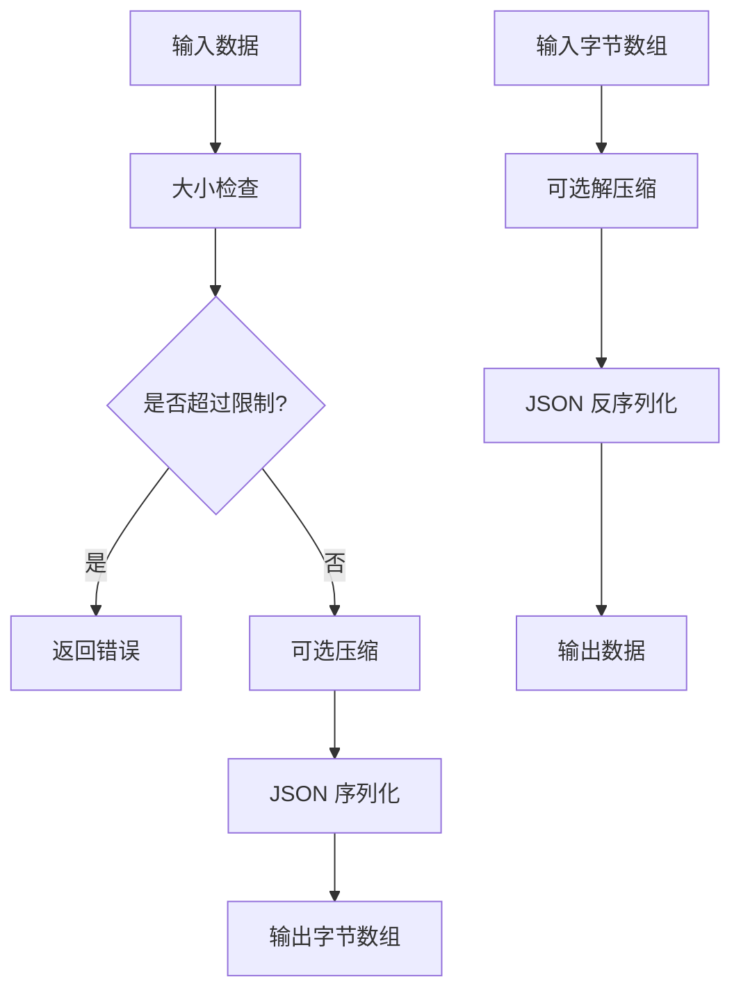
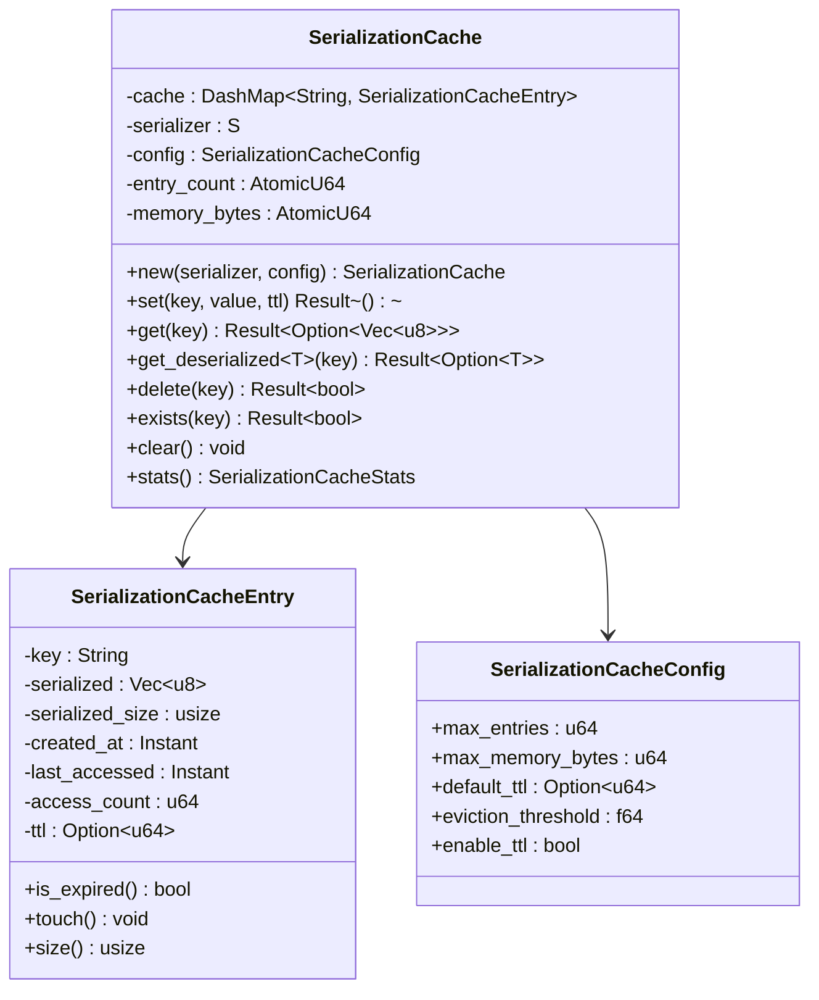
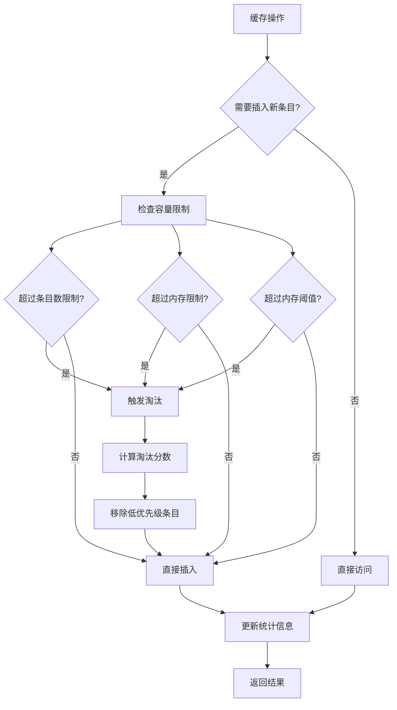
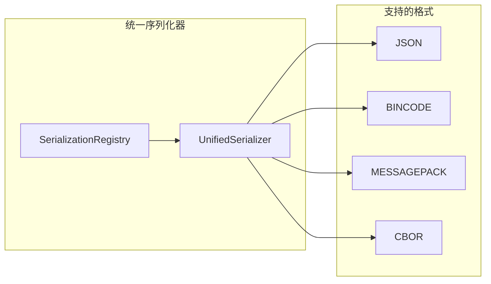
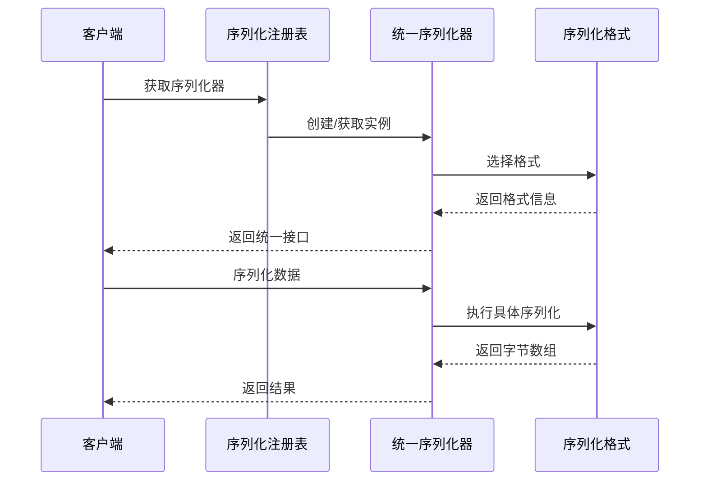
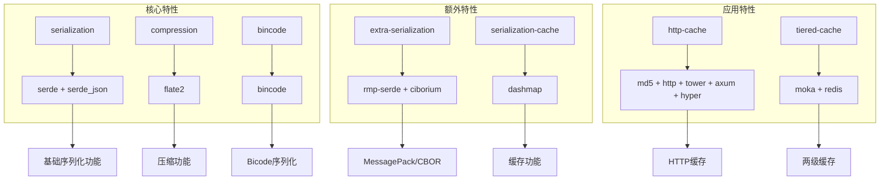

# 序列化系统

<cite>
**本文档引用的文件**
- [SERIALIZATION.md](file://docs/SERIALIZATION.md)
- [mod.rs](file://src/serialization/mod.rs)
- [json.rs](file://src/serialization/json.rs)
- [bincode.rs](file://src/serialization/bincode.rs)
- [cache.rs](file://src/serialization/cache.rs)
- [unified.rs](file://src/serialization/unified.rs)
- [utils.rs](file://src/serialization/utils.rs)
- [extra.rs](file://src/serialization/extra.rs)
- [Cargo.toml](file://Cargo.toml)
- [serialization_test.rs](file://tests/unit/serialization_test.rs)
- [example_serialization.rs](file://examples/src/01_basics/example_serialization.rs)
</cite>

## 目录
1. [简介](#简介)
2. [项目结构](#项目结构)
3. [核心组件](#核心组件)
4. [架构概览](#架构概览)
5. [详细组件分析](#详细组件分析)
6. [依赖关系分析](#依赖关系分析)
7. [性能考量](#性能考量)
8. [故障排除指南](#故障排除指南)
9. [结论](#结论)
10. [附录](#附录)

## 简介

Oxcache 的序列化系统是一个高度灵活且高性能的多格式序列化框架，专为现代 Rust 应用程序设计。该系统提供了多种序列化格式支持，包括 JSON、Bincode、MessagePack 和 CBOR，并集成了智能的序列化缓存机制来避免重复序列化开销。

该系统的核心目标是在保证类型安全性和性能的同时，为开发者提供最大的灵活性和可扩展性。通过基于 serde 的类型安全序列化，Oxcache 确保了数据的可靠性和一致性。

## 项目结构

Oxcache 的序列化系统采用模块化设计，主要分布在 `src/serialization/` 目录下：



**图表来源**
- [mod.rs](file://src/serialization/mod.rs#L1-L98)
- [json.rs](file://src/serialization/json.rs#L1-L100)
- [bincode.rs](file://src/serialization/bincode.rs#L1-L55)
- [cache.rs](file://src/serialization/cache.rs#L1-L627)

**章节来源**
- [mod.rs](file://src/serialization/mod.rs#L1-L98)
- [Cargo.toml](file://Cargo.toml#L92-L124)

## 核心组件

### 序列化器特征系统

Oxcache 定义了两个核心特征来抽象序列化操作：

#### Serializer 特征
这是最基础的序列化特征，定义了标准的序列化和反序列化接口：



**图表来源**
- [mod.rs](file://src/serialization/mod.rs#L45-L51)
- [json.rs](file://src/serialization/json.rs#L16-L37)
- [bincode.rs](file://src/serialization/bincode.rs#L16-L16)

#### ZeroCopySerializer 特征
这是一个高级特征，提供了零拷贝优化的序列化能力：



**图表来源**
- [mod.rs](file://src/serialization/mod.rs#L56-L69)
- [extra.rs](file://src/serialization/extra.rs#L39-L54)

**章节来源**
- [mod.rs](file://src/serialization/mod.rs#L45-L69)

## 架构概览

Oxcache 的序列化系统采用了分层架构设计，确保了高内聚和低耦合：



**图表来源**
- [unified.rs](file://src/serialization/unified.rs#L23-L35)
- [cache.rs](file://src/serialization/cache.rs#L162-L179)
- [extra.rs](file://src/serialization/extra.rs#L84-L130)

## 详细组件分析

### JSON 序列化器

JSON 序列化器是 Oxcache 的默认序列化器，提供了最佳的可读性和兼容性。

#### 核心特性
- **可读性**：输出人类可读的 JSON 格式
- **兼容性**：跨语言兼容，易于调试
- **压缩支持**：可选的 gzip 压缩
- **安全检查**：防止拒绝服务攻击

#### 安全机制
JSON 序列化器实现了多重安全保护：



**图表来源**
- [json.rs](file://src/serialization/json.rs#L55-L98)
- [utils.rs](file://src/serialization/utils.rs#L23-L33)

#### 配置选项
- **默认模式**：标准 JSON 序列化
- **压缩模式**：启用 gzip 压缩
- **大小限制**：5MB 最大数据大小
- **深度限制**：64 层最大嵌套深度

**章节来源**
- [json.rs](file://src/serialization/json.rs#L1-L100)

### Bincode 序列化器

Bincode 序列化器专注于性能和效率，适用于 Rust 间的高效通信。

#### 核心特性
- **高性能**：二进制格式，序列化速度快
- **紧凑存储**：最小化存储空间占用
- **类型安全**：编译时类型检查
- **零拷贝支持**：部分操作支持零拷贝优化

#### 性能优势
Bincode 相比 JSON 的主要优势在于：
- **序列化速度**：通常比 JSON 快 5-10 倍
- **存储效率**：体积通常为 JSON 的 20-50%
- **内存占用**：更低的内存分配开销

**章节来源**
- [bincode.rs](file://src/serialization/bincode.rs#L1-L55)

### MessagePack 和 CBOR 序列化器

这些是额外的序列化格式支持，提供了更多的选择：

#### MessagePack 特性
- **紧凑性**：比 JSON 更紧凑
- **跨语言**：广泛的语言支持
- **零拷贝**：支持零拷贝操作
- **标准**：IETF 标准格式

#### CBOR 特性
- **自描述**：数据包含类型信息
- **标准**：IETF RFC 7049 标准
- **安全性**：内置安全检查
- **灵活性**：支持复杂数据类型

**章节来源**
- [extra.rs](file://src/serialization/extra.rs#L1-L270)

### 序列化缓存机制

序列化缓存是 Oxcache 的核心优化组件，显著减少了重复序列化的开销。

#### 缓存架构


**图表来源**
- [cache.rs](file://src/serialization/cache.rs#L162-L179)
- [cache.rs](file://src/serialization/cache.rs#L21-L39)
- [cache.rs](file://src/serialization/cache.rs#L101-L113)

#### 淘汰策略
序列化缓存采用了智能的混合淘汰策略：



**图表来源**
- [cache.rs](file://src/serialization/cache.rs#L364-L426)

#### 统计监控
缓存提供了全面的性能统计：

| 统计指标 | 描述 | 用途 |
|---------|------|------|
| entry_count | 当前条目数量 | 监控缓存规模 |
| memory_bytes | 内存使用量 | 监控内存占用 |
| hit_rate | 命中率 | 评估缓存效果 |
| avg_serialize_us | 平均序列化时间 | 性能优化参考 |
| eviction_count | 淘汰次数 | 缓存效率评估 |

**章节来源**
- [cache.rs](file://src/serialization/cache.rs#L128-L156)

### 统一序列化器

统一序列化器提供了统一的 API 接口，简化了多格式序列化的使用：

#### 格式支持矩阵


**图表来源**
- [unified.rs](file://src/serialization/unified.rs#L27-L35)
- [unified.rs](file://src/serialization/unified.rs#L52-L65)

#### 动态格式切换
统一序列化器支持运行时格式切换：



**图表来源**
- [unified.rs](file://src/serialization/unified.rs#L269-L307)

**章节来源**
- [unified.rs](file://src/serialization/unified.rs#L1-L537)

## 依赖关系分析

### 特性依赖图

Oxcache 的序列化系统通过精心设计的特性系统实现了灵活的功能组合：



**图表来源**
- [Cargo.toml](file://Cargo.toml#L235-L347)

### 外部依赖分析

#### 核心依赖
- **serde**: 类型安全序列化的基础库
- **serde_json**: JSON 序列化支持
- **bincode**: 高性能二进制序列化
- **dashmap**: 高并发缓存存储

#### 可选依赖
- **rmp-serde**: MessagePack 序列化
- **ciborium**: CBOR 序列化
- **flate2**: 压缩算法支持

**章节来源**
- [Cargo.toml](file://Cargo.toml#L94-L124)
- [Cargo.toml](file://Cargo.toml#L235-L347)

## 性能考量

### 格式性能对比

| 序列化格式 | 序列化速度 | 反序列化速度 | 存储效率 | 内存占用 | 可读性 | 跨语言支持 |
|-----------|-----------|-------------|---------|---------|--------|------------|
| JSON | ⭐⭐ | ⭐⭐ | ⭐⭐ | ⭐⭐ | ⭐⭐⭐⭐⭐ | ⭐⭐⭐⭐⭐ |
| Bincode | ⭐⭐⭐⭐⭐ | ⭐⭐⭐⭐⭐ | ⭐⭐⭐⭐⭐ | ⭐⭐⭐⭐⭐ | ⭐ | ⭐⭐⭐ |
| MessagePack | ⭐⭐⭐⭐ | ⭐⭐⭐⭐ | ⭐⭐⭐⭐ | ⭐⭐⭐⭐ | ⭐⭐ | ⭐⭐⭐⭐ |
| CBOR | ⭐⭐⭐⭐ | ⭐⭐⭐⭐ | ⭐⭐⭐⭐ | ⭐⭐⭐⭐ | ⭐⭐ | ⭐⭐⭐⭐ |

### 性能优化策略

#### 1. 缓存策略优化
- **预热缓存**：在启动时预加载常用数据
- **智能淘汰**：基于访问频率和时间局部性的淘汰策略
- **容量管理**：动态调整缓存大小以适应内存限制

#### 2. 压缩策略
- **条件压缩**：只对大对象启用压缩
- **压缩阈值**：设置合理的压缩触发阈值
- **异步压缩**：使用异步压缩避免阻塞主线程

#### 3. 内存管理
- **零拷贝优化**：尽可能使用零拷贝操作
- **内存池**：复用内存分配减少 GC 压力
- **及时释放**：及时释放不再使用的序列化数据

## 故障排除指南

### 常见问题及解决方案

#### 序列化失败
**症状**：序列化过程中抛出错误

**可能原因**：
1. 数据类型不支持序列化
2. 循环引用导致栈溢出
3. 结构体字段缺失序列化特性

**解决方案**：
```rust
// 确保数据类型实现必要的特性
#[derive(Serialize, Deserialize, Clone)]
struct MyStruct {
    field: String,
}

// 检查序列化器配置
let serializer = JsonSerializer::with_compression();
```

#### 反序列化失败
**症状**：反序列化返回错误或数据不完整

**可能原因**：
1. 数据损坏或被篡改
2. 格式不匹配
3. 版本不兼容

**解决方案**：
```rust
match serializer.deserialize::<MyStruct>(&data) {
    Ok(value) => println!("反序列化成功"),
    Err(e) => {
        // 记录详细错误信息
        eprintln!("反序列化失败: {}", e);
        // 尝试降级处理
    }
}
```

#### 性能问题
**症状**：序列化/反序列化速度慢

**诊断步骤**：
1. 检查缓存命中率
2. 分析内存使用情况
3. 监控序列化时间分布

**优化建议**：
```rust
// 启用序列化缓存
let cache = SerializationCache::new(serializer, config);

// 使用零拷贝序列化器
let zero_copy_serializer = ZeroCopySerializer::new();
```

**章节来源**
- [SERIALIZATION.md](file://docs/SERIALIZATION.md#L271-L308)

## 结论

Oxcache 的序列化系统通过其模块化设计、多格式支持和智能缓存机制，为现代 Rust 应用程序提供了强大而灵活的序列化解决方案。该系统在保证类型安全性和性能的同时，还提供了丰富的扩展机制和完善的错误处理能力。

### 主要优势
1. **多格式支持**：JSON、Bincode、MessagePack、CBOR 四种格式满足不同场景需求
2. **高性能**：智能缓存和零拷贝优化显著提升性能
3. **类型安全**：基于 serde 的编译时类型检查
4. **可扩展性**：插件化的序列化器架构支持自定义扩展
5. **安全性**：多重安全检查防止拒绝服务攻击

### 未来发展方向
1. **更多格式支持**：考虑添加 Protocol Buffers、Apache Avro 等格式
2. **性能优化**：进一步优化序列化算法和内存使用
3. **监控增强**：提供更详细的性能监控和分析工具
4. **自动优化**：基于使用模式的自动序列化器选择

## 附录

### 使用示例

#### 基础序列化示例
```rust
use oxcache::serialization::{JsonSerializer, BincodeSerializer};

// JSON 序列化
let json_serializer = JsonSerializer::new();
let json_data = json_serializer.serialize(&my_data)?;

// Bincode 序列化
let bincode_serializer = BincodeSerializer::new();
let bincode_data = bincode_serializer.serialize(&my_data)?;
```

#### 序列化缓存使用
```rust
use oxcache::serialization::{SerializationCache, JsonSerializer};

let cache = SerializationCache::new(JsonSerializer::new(), config);
let cached_data = cache.serialize(&my_data, &serializer)?;
```

#### 自定义序列化器
```rust
use oxcache::serialization::Serializer;

struct CustomSerializer;

impl Serializer for CustomSerializer {
    fn serialize<T: Serialize>(&self, value: &T) -> Result<Vec<u8>> {
        // 自定义序列化逻辑
        Ok(serde_json::to_vec(value)?)
    }

    fn deserialize<'de, T: Deserialize<'de>>(&self, data: &[u8]) -> Result<T> {
        // 自定义反序列化逻辑
        Ok(serde_json::from_slice(data)?)
    }
}
```

**章节来源**
- [SERIALIZATION.md](file://docs/SERIALIZATION.md#L188-L269)
- [example_serialization.rs](file://examples/src/01_basics/example_serialization.rs#L1-L63)
