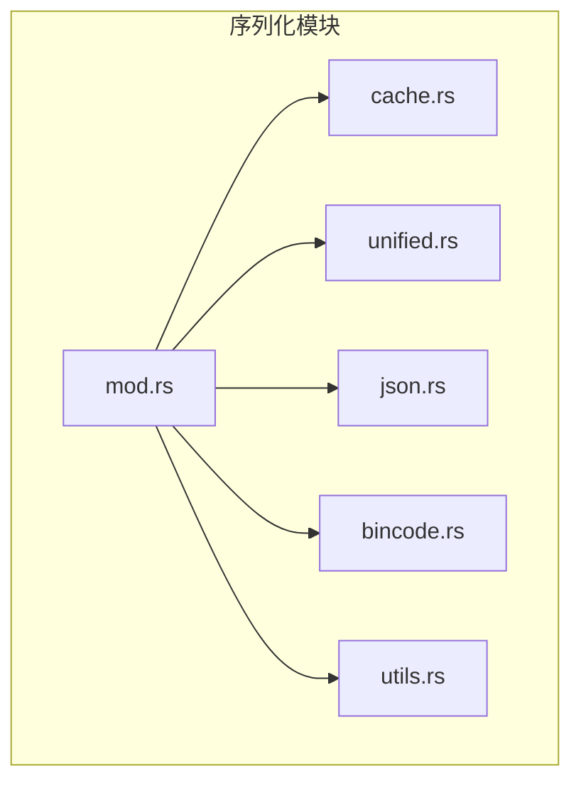
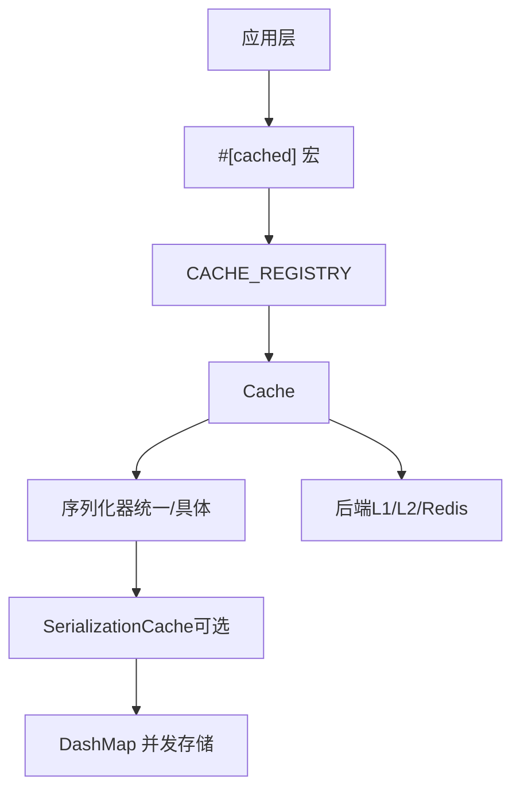
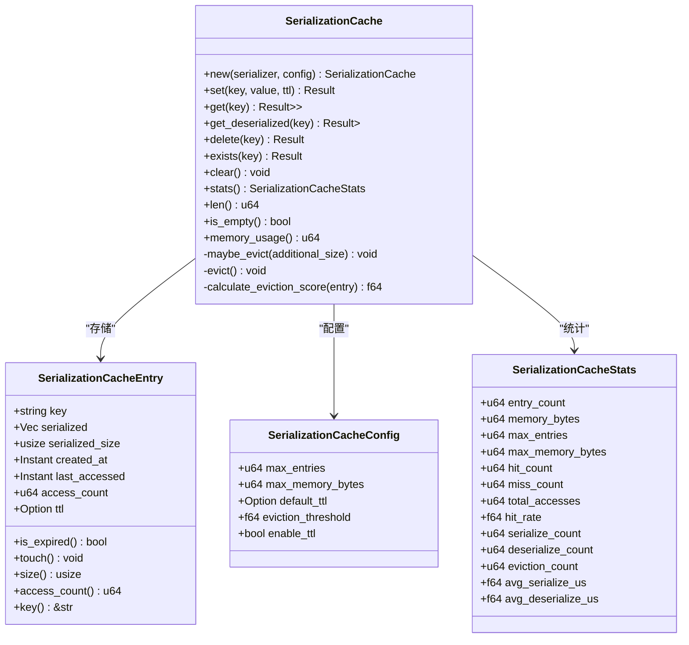
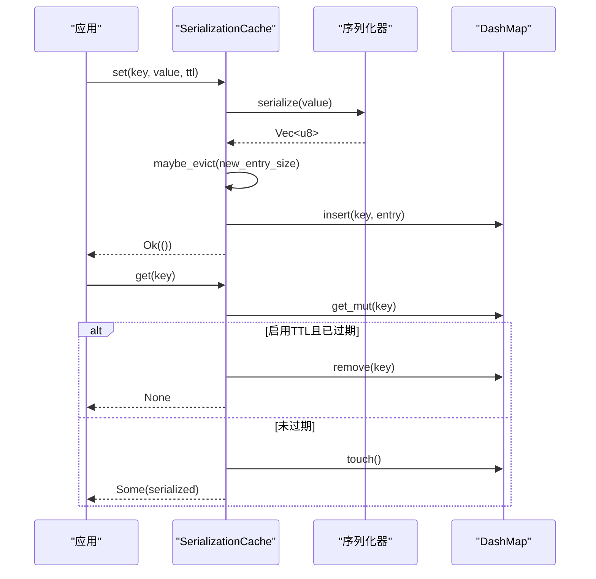
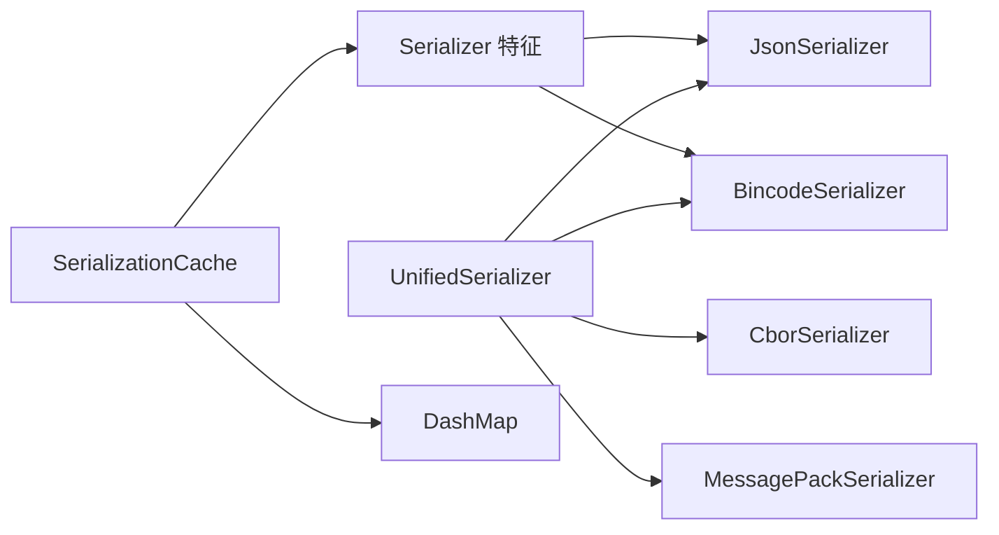

# 序列化缓存

<cite>
**本文档引用的文件**
- [src/serialization/cache.rs](file://src/serialization/cache.rs)
- [src/serialization/mod.rs](file://src/serialization/mod.rs)
- [src/serialization/unified.rs](file://src/serialization/unified.rs)
- [src/serialization/json.rs](file://src/serialization/json.rs)
- [src/serialization/bincode.rs](file://src/serialization/bincode.rs)
- [src/serialization/utils.rs](file://src/serialization/utils.rs)
- [Cargo.toml](file://Cargo.toml)
- [docs/ARCHITECTURE.md](file://docs/ARCHITECTURE.md)
- [tests/unit/serialization_test.rs](file://tests/unit/serialization_test.rs)
- [examples/src/01_basics/example_serialization.rs](file://examples/src/01_basics/example_serialization.rs)
</cite>

## 目录
1. [简介](#简介)
2. [项目结构](#项目结构)
3. [核心组件](#核心组件)
4. [架构总览](#架构总览)
5. [详细组件分析](#详细组件分析)
6. [依赖关系分析](#依赖关系分析)
7. [性能考量](#性能考量)
8. [故障排查指南](#故障排查指南)
9. [结论](#结论)
10. [附录](#附录)

## 简介
本文件系统性阐述 Oxcache 的序列化缓存机制，重点围绕 SerializationCache 的设计原理、配置项、统计指标、性能优化策略以及在高并发场景下的行为与调优建议。同时给出使用示例、配置方法、缓存失效与内存管理机制说明，帮助读者在实际工程中高效、安全地应用序列化缓存能力。

## 项目结构
序列化相关代码位于 src/serialization 目录，包含：
- cache.rs：序列化缓存实现（含条目结构、配置、统计、淘汰策略）
- mod.rs：导出统一入口与特征定义
- json.rs、bincode.rs：具体序列化器实现
- unified.rs：统一序列化器与注册表
- utils.rs：通用工具（大小检查、压缩/解压）

图表来源
- [src/serialization/mod.rs](file://src/serialization/mod.rs#L1-L98)
- [src/serialization/cache.rs](file://src/serialization/cache.rs#L1-L627)
- [src/serialization/unified.rs](file://src/serialization/unified.rs#L1-L537)
- [src/serialization/json.rs](file://src/serialization/json.rs#L1-L100)
- [src/serialization/bincode.rs](file://src/serialization/bincode.rs#L1-L55)
- [src/serialization/utils.rs](file://src/serialization/utils.rs#L1-L130)

章节来源
- [src/serialization/mod.rs](file://src/serialization/mod.rs#L1-L98)
- [src/serialization/cache.rs](file://src/serialization/cache.rs#L1-L627)
- [src/serialization/unified.rs](file://src/serialization/unified.rs#L1-L537)
- [src/serialization/json.rs](file://src/serialization/json.rs#L1-L100)
- [src/serialization/bincode.rs](file://src/serialization/bincode.rs#L1-L55)
- [src/serialization/utils.rs](file://src/serialization/utils.rs#L1-L130)

## 核心组件
- 序列化缓存条目（SerializationCacheEntry）：封装键、序列化数据、大小、创建/访问时间、访问次数、TTL 以及序列化器引用。
- 序列化缓存配置（SerializationCacheConfig）：最大条目数、最大内存字节、默认 TTL、淘汰阈值、是否启用 TTL。
- 序列化缓存统计（SerializationCacheStats）：当前条目数、内存使用、命中/未命中、总访问、命中率、序列化/反序列化次数、平均耗时、淘汰次数。
- 序列化缓存（SerializationCache）：基于 DashMap 的并发缓存，支持混合容量限制（条目数+内存）、TTL、LRU-like 淘汰（基于访问频率与时间局部性）。
- 统一序列化器（UnifiedSerializer）：集中管理多种序列化格式（JSON、Bincode、CBOR、MessagePack），支持零拷贝提示与格式信息查询。
- 具体序列化器（JsonSerializer、BincodeSerializer）：实现 Serializer 特征，内置大小限制与安全检查。
- 工具模块（utils.rs）：数据大小检查、可选压缩/解压。

章节来源
- [src/serialization/cache.rs](file://src/serialization/cache.rs#L20-L98)
- [src/serialization/cache.rs](file://src/serialization/cache.rs#L100-L156)
- [src/serialization/cache.rs](file://src/serialization/cache.rs#L158-L496)
- [src/serialization/unified.rs](file://src/serialization/unified.rs#L18-L253)
- [src/serialization/json.rs](file://src/serialization/json.rs#L12-L99)
- [src/serialization/bincode.rs](file://src/serialization/bincode.rs#L12-L54)
- [src/serialization/utils.rs](file://src/serialization/utils.rs#L11-L75)

## 架构总览
序列化缓存作为 L1 层的补充能力，与统一序列化器配合，提供“序列化结果”的内存缓存，避免重复序列化开销。其与整体缓存架构的关系如下：

图表来源
- [docs/ARCHITECTURE.md](file://docs/ARCHITECTURE.md#L381-L406)
- [src/serialization/unified.rs](file://src/serialization/unified.rs#L18-L253)
- [src/serialization/cache.rs](file://src/serialization/cache.rs#L158-L179)

章节来源
- [docs/ARCHITECTURE.md](file://docs/ARCHITECTURE.md#L375-L446)
- [src/serialization/cache.rs](file://src/serialization/cache.rs#L158-L179)
- [src/serialization/unified.rs](file://src/serialization/unified.rs#L18-L253)

## 详细组件分析

### 序列化缓存条目（SerializationCacheEntry）
- 字段含义：键、序列化字节、序列化大小、创建时间、最后访问时间、访问次数、TTL、序列化器引用。
- 行为要点：提供 is_expired 判断、touch 更新访问信息、size 计算条目占用（键名长度 + 序列化数据 + 估算开销）、访问计数与键访问。

章节来源
- [src/serialization/cache.rs](file://src/serialization/cache.rs#L20-L98)

### 序列化缓存配置（SerializationCacheConfig）
- 关键配置项：
  - max_entries：最大条目数
  - max_memory_bytes：最大内存字节
  - default_ttl：默认 TTL（秒）
  - eviction_threshold：淘汰阈值（达到上限比例时触发）
  - enable_ttl：是否启用 TTL
- 默认值：条目数 10000、内存 100MB、TTL 默认关闭、阈值 0.9、启用 TTL。

章节来源
- [src/serialization/cache.rs](file://src/serialization/cache.rs#L100-L125)

### 序列化缓存统计（SerializationCacheStats）
- 指标覆盖：当前条目数、内存使用、命中/未命中、总访问、命中率、序列化/反序列化次数、平均耗时、淘汰次数。
- 统计更新：set/get/delete/exists/clear 等路径均会原子更新对应计数器；stats 会计算命中率与平均耗时。

章节来源
- [src/serialization/cache.rs](file://src/serialization/cache.rs#L127-L156)
- [src/serialization/cache.rs](file://src/serialization/cache.rs#L441-L480)

### 序列化缓存（SerializationCache）
- 并发存储：基于 Arc<DashMap<String, SerializationCacheEntry<S>>>，线程安全。
- 混合容量控制：在 set 时根据新增条目大小触发 maybe_evict，目标降至 70%。
- 淘汰策略：优先过期条目，其次按“访问频率权重 0.6 + 时间局部性权重 0.4”综合评分，评分越高越易被淘汰。
- TTL 行为：get/exists 时若启用 TTL 且已过期则删除条目并返回 None。
- 统计与可观测：提供 stats 查询，便于监控命中率、平均序列化/反序列化耗时、淘汰次数等。

图表来源
- [src/serialization/cache.rs](file://src/serialization/cache.rs#L20-L98)
- [src/serialization/cache.rs](file://src/serialization/cache.rs#L100-L156)
- [src/serialization/cache.rs](file://src/serialization/cache.rs#L158-L496)

章节来源
- [src/serialization/cache.rs](file://src/serialization/cache.rs#L158-L496)

### 统一序列化器（UnifiedSerializer）
- 支持格式：JSON、Bincode、CBOR、MessagePack（按特性启用）。
- 能力：序列化/反序列化、零拷贝提示（部分格式）、格式信息查询、注册表管理。
- 适配器：UnifiedSerializerAdapter 将统一序列化器适配为旧版 Serializer 特征。

章节来源
- [src/serialization/unified.rs](file://src/serialization/unified.rs#L18-L253)
- [src/serialization/unified.rs](file://src/serialization/unified.rs#L309-L328)

### 具体序列化器（JsonSerializer、BincodeSerializer）
- JsonSerializer：支持可选压缩，提供大小限制与深度限制提示。
- BincodeSerializer：提供大小限制，防止拒绝服务攻击。
- 工具：check_data_size、compress_data/decompress_data（按特性启用）。

章节来源
- [src/serialization/json.rs](file://src/serialization/json.rs#L12-L99)
- [src/serialization/bincode.rs](file://src/serialization/bincode.rs#L12-L54)
- [src/serialization/utils.rs](file://src/serialization/utils.rs#L11-L75)

### 序列化流程时序图

图表来源
- [src/serialization/cache.rs](file://src/serialization/cache.rs#L207-L285)
- [src/serialization/cache.rs](file://src/serialization/cache.rs#L364-L426)

## 依赖关系分析
- 特性开关：
  - serialization-cache：启用序列化缓存（依赖 dashmap）
  - serialization：启用 serde/serde_json
  - bincode：启用 bincode
  - compression/flate2：启用压缩
  - extra-serialization：启用 rmp-serde/ciborium
- 组件耦合：
  - SerializationCache 依赖 Serializer 特征与 DashMap 并发容器。
  - UnifiedSerializer 通过枚举统一管理多种格式，降低上层耦合。
  - JsonSerializer/BincodeSerializer 依赖 serde 与 serde_json/bincode，结合 utils 提供安全检查与压缩。

图表来源
- [src/serialization/mod.rs](file://src/serialization/mod.rs#L44-L98)
- [src/serialization/unified.rs](file://src/serialization/unified.rs#L27-L49)
- [src/serialization/cache.rs](file://src/serialization/cache.rs#L162-L164)
- [Cargo.toml](file://Cargo.toml#L306-L343)

章节来源
- [Cargo.toml](file://Cargo.toml#L306-L343)
- [src/serialization/mod.rs](file://src/serialization/mod.rs#L44-L98)
- [src/serialization/unified.rs](file://src/serialization/unified.rs#L27-L49)
- [src/serialization/cache.rs](file://src/serialization/cache.rs#L162-L164)

## 性能考量
- 减少重复序列化开销：SerializationCache 将序列化后的字节缓存，后续 get 直接返回字节，避免再次序列化。
- 混合容量控制：同时限制条目数与内存使用，防止缓存无限增长。
- 淘汰策略：基于访问频率与时间局部性的评分，优先淘汰低价值条目，兼顾命中率与内存回收。
- 统计指标：命中率、平均序列化/反序列化耗时、淘汰次数，便于定位性能瓶颈。
- 高并发友好：DashMap 提供无锁并发访问，set/get 均为异步操作，适合高并发场景。

章节来源
- [src/serialization/cache.rs](file://src/serialization/cache.rs#L207-L285)
- [src/serialization/cache.rs](file://src/serialization/cache.rs#L364-L439)
- [src/serialization/cache.rs](file://src/serialization/cache.rs#L441-L480)

## 故障排查指南
- 反序列化失败：get_deserialized 失败时会记录警告并删除对应缓存条目，避免脏数据影响后续请求。
- TTL 导致的“假阳性”未命中：确认 enable_ttl 与 default_ttl 配置，必要时调整阈值或禁用 TTL。
- 内存占用异常：通过 stats 查看 memory_bytes 与 max_memory_bytes 比较，评估 eviction_threshold 与 max_entries 设置。
- 压缩相关问题：若启用压缩，确保 flate2 特性开启，否则压缩/解压将退化为直通逻辑。

章节来源
- [src/serialization/cache.rs](file://src/serialization/cache.rs#L287-L317)
- [src/serialization/json.rs](file://src/serialization/json.rs#L77-L99)
- [src/serialization/utils.rs](file://src/serialization/utils.rs#L35-L75)

## 结论
SerializationCache 通过“序列化结果”的内存缓存，显著降低重复序列化成本，结合混合容量控制与智能淘汰策略，在保证命中率的同时控制内存占用。配合 UnifiedSerializer 的多格式支持与安全检查，可在不同场景下灵活选择最优序列化方案，满足高并发、高性能的缓存需求。

## 附录

### 使用示例与配置方法
- 基础用法（设置/获取序列化字节）：
  - 创建 JsonSerializer，默认配置见 [SerializationCacheConfig 默认值](file://src/serialization/cache.rs#L115-L124)
  - 使用 set(key, value, ttl) 缓存序列化字节
  - 使用 get(key) 获取字节，或使用 get_deserialized<T>() 直接反序列化
- 示例参考：
  - 单元测试：[tests/unit/serialization_test.rs](file://tests/unit/serialization_test.rs#L17-L51)
  - 基础示例：[examples/src/01_basics/example_serialization.rs](file://examples/src/01_basics/example_serialization.rs#L21-L62)

章节来源
- [src/serialization/cache.rs](file://src/serialization/cache.rs#L207-L317)
- [tests/unit/serialization_test.rs](file://tests/unit/serialization_test.rs#L17-L51)
- [examples/src/01_basics/example_serialization.rs](file://examples/src/01_basics/example_serialization.rs#L21-L62)

### 配置选项详解
- max_entries：缓存最大条目数，默认 10000
- max_memory_bytes：最大内存字节，默认 100MB
- default_ttl：默认 TTL（秒），None 表示不启用
- eviction_threshold：触发淘汰的内存阈值比例，默认 0.9
- enable_ttl：是否启用 TTL，默认 true

章节来源
- [src/serialization/cache.rs](file://src/serialization/cache.rs#L100-L125)

### 统计指标说明
- entry_count/memory_bytes：当前条目数与内存使用
- hit_count/miss_count/total_accesses/hit_rate：命中/未命中与命中率
- serialize_count/deserialize_count：序列化/反序列化次数
- avg_serialize_us/avg_deserialize_us：平均序列化/反序列化耗时（微秒）
- eviction_count：淘汰次数

章节来源
- [src/serialization/cache.rs](file://src/serialization/cache.rs#L127-L156)
- [src/serialization/cache.rs](file://src/serialization/cache.rs#L441-L480)

### 缓存失效策略与内存管理
- TTL：get/exists 时检查过期，过期即删除并返回 None
- 淘汰：当条目数或内存接近阈值时，按评分淘汰低价值条目，目标降至 70%
- 内存估算：条目大小 = 键长度 + 序列化数据长度 + 估算开销（约 64 字节）

章节来源
- [src/serialization/cache.rs](file://src/serialization/cache.rs#L58-L98)
- [src/serialization/cache.rs](file://src/serialization/cache.rs#L364-L439)
- [src/serialization/cache.rs](file://src/serialization/cache.rs#L84-L87)

### 高并发场景优化技巧
- 合理设置 max_entries 与 max_memory_bytes，避免频繁淘汰
- 调整 eviction_threshold，平衡命中率与内存回收节奏
- 选择合适序列化格式：小对象可考虑 JSON，大对象可考虑 Bincode
- 使用 stats 持续监控命中率与平均耗时，动态调参

章节来源
- [src/serialization/cache.rs](file://src/serialization/cache.rs#L115-L125)
- [src/serialization/cache.rs](file://src/serialization/cache.rs#L441-L480)
- [src/serialization/unified.rs](file://src/serialization/unified.rs#L51-L65)