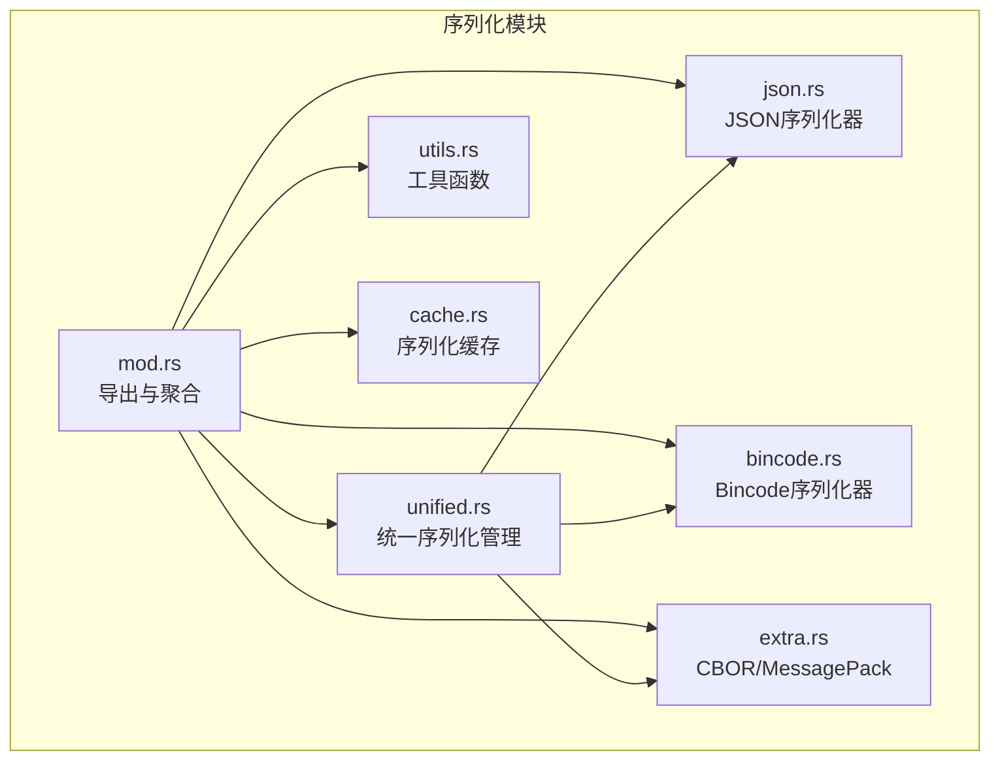
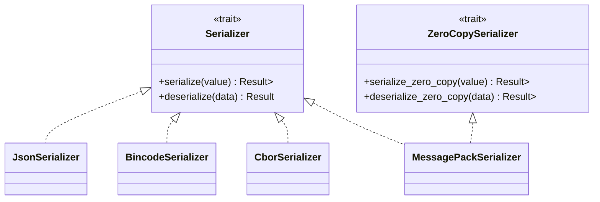
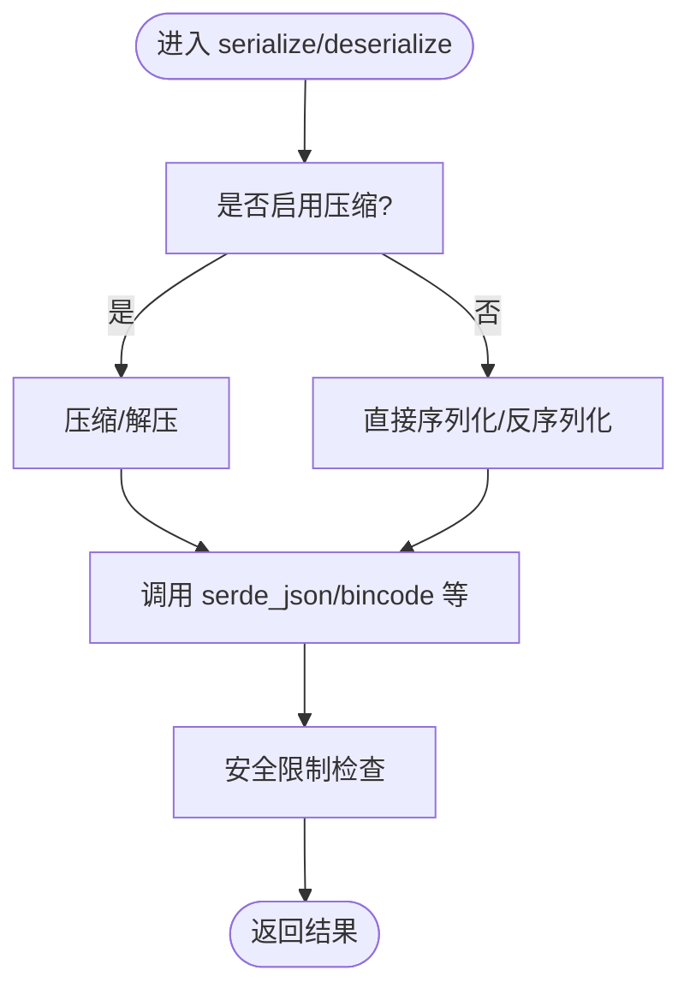
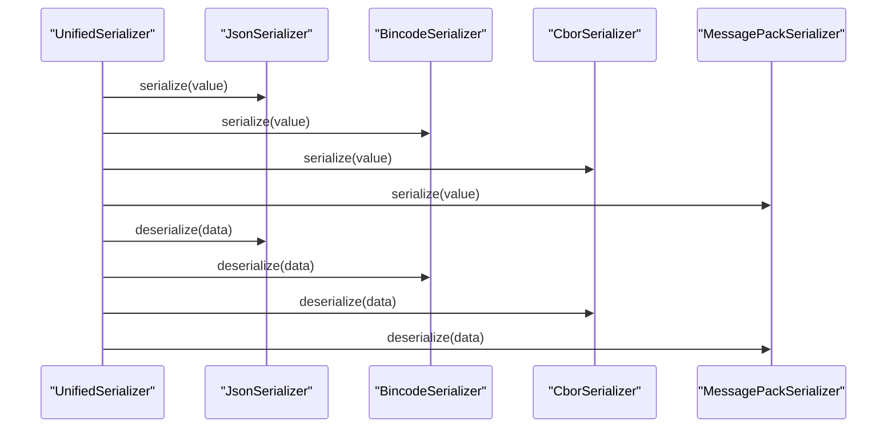
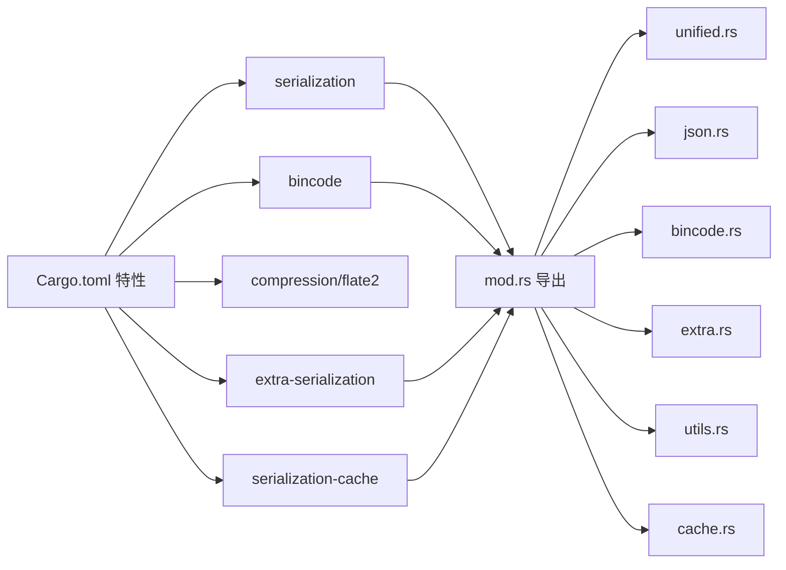

# 支持的序列化格式

<cite>
**本文档引用的文件**
- [src/serialization/mod.rs](file://src/serialization/mod.rs)
- [src/serialization/json.rs](file://src/serialization/json.rs)
- [src/serialization/bincode.rs](file://src/serialization/bincode.rs)
- [src/serialization/extra.rs](file://src/serialization/extra.rs)
- [src/serialization/unified.rs](file://src/serialization/unified.rs)
- [src/serialization/utils.rs](file://src/serialization/utils.rs)
- [src/serialization/cache.rs](file://src/serialization/cache.rs)
- [Cargo.toml](file://Cargo.toml)
- [examples/src/01_basics/example_serialization.rs](file://examples/src/01_basics/example_serialization.rs)
- [tests/unit/serialization_test.rs](file://tests/unit/serialization_test.rs)
</cite>

## 目录
1. [简介](#简介)
2. [项目结构](#项目结构)
3. [核心组件](#核心组件)
4. [架构总览](#架构总览)
5. [详细组件分析](#详细组件分析)
6. [依赖关系分析](#依赖关系分析)
7. [性能考量](#性能考量)
8. [故障排查指南](#故障排查指南)
9. [结论](#结论)
10. [附录](#附录)

## 简介
本章节系统梳理 Oxcache 支持的序列化格式，重点覆盖以下内容：
- JSON 序列化器的实现原理、安全限制与性能特征
- Bincode 序列化器的实现与“零拷贝”能力说明
- 额外序列化格式 CBOR 与 MessagePack 的特性与使用方式
- 不同格式在性能、体积与兼容性方面的对比
- 具体使用示例与最佳实践
- 如何依据数据类型与性能需求选择合适格式

## 项目结构
Oxcache 的序列化子系统位于 src/serialization 目录，采用模块化设计，支持按需启用不同格式与特性。

图表来源
- [src/serialization/mod.rs](file://src/serialization/mod.rs#L1-L98)
- [src/serialization/unified.rs](file://src/serialization/unified.rs#L1-L537)

章节来源
- [src/serialization/mod.rs](file://src/serialization/mod.rs#L1-L98)
- [src/serialization/unified.rs](file://src/serialization/unified.rs#L1-L537)

## 核心组件
- Serializer 特征：定义统一的序列化与反序列化接口，面向公共 API。
- ZeroCopySerializer 特征：提供零拷贝能力，使用 Cow<[u8]> 避免不必要内存分配。
- SerializerEnum：对已启用格式进行多态封装，便于在运行时切换。
- UnifiedSerializer：统一的序列化管理器，集中处理格式选择、零拷贝与估算等。
- JsonSerializer/BincodeSerializer/CborSerializer/MessagePackSerializer：各格式的具体实现。
- SerializerRegistry：动态注册与管理额外序列化器。
- SerializationCache：带容量管理的序列化缓存，支持混合限制（条目数+内存）。

章节来源
- [src/serialization/mod.rs](file://src/serialization/mod.rs#L41-L98)
- [src/serialization/unified.rs](file://src/serialization/unified.rs#L18-L253)
- [src/serialization/extra.rs](file://src/serialization/extra.rs#L80-L203)
- [src/serialization/cache.rs](file://src/serialization/cache.rs#L158-L496)

## 架构总览
统一序列化管理器根据配置选择具体格式，并在支持的情况下提供零拷贝能力；工具模块负责安全限制与压缩；额外模块提供 CBOR 与 MessagePack 的擦除类型接口。

图表来源
- [src/serialization/mod.rs](file://src/serialization/mod.rs#L41-L98)
- [src/serialization/json.rs](file://src/serialization/json.rs#L12-L100)
- [src/serialization/bincode.rs](file://src/serialization/bincode.rs#L12-L55)
- [src/serialization/extra.rs](file://src/serialization/extra.rs#L19-L78)

## 详细组件分析

### JSON 序列化器
- 实现原理
  - 基于 serde_json 进行序列化与反序列化。
  - 支持可选压缩（通过 flate2），在启用时自动压缩/解压。
  - 提供安全限制：最大反序列化大小与深度限制常量预留。
- 性能特点
  - 人类可读，便于调试与可观测性。
  - 体积通常大于二进制格式；压缩可降低体积但增加 CPU 开销。
- 适用场景
  - 开发与调试阶段。
  - 需要跨语言互通或人类可读日志的场景。
- 安全与限制
  - 限制最大反序列化大小与深度，防止拒绝服务攻击。
  - 压缩功能受特性控制，未启用时等价于直通。

图表来源
- [src/serialization/json.rs](file://src/serialization/json.rs#L55-L98)
- [src/serialization/utils.rs](file://src/serialization/utils.rs#L23-L75)

章节来源
- [src/serialization/json.rs](file://src/serialization/json.rs#L12-L100)
- [src/serialization/utils.rs](file://src/serialization/utils.rs#L11-L75)

### Bincode 序列化器
- 实现原理
  - 基于 bincode 进行序列化与反序列化。
  - 提供独立的安全大小限制。
- 性能特点
  - 二进制格式，体积紧凑、解析速度快。
  - 项目中未实现 ZeroCopySerializer，零拷贝路径会回退到常规序列化。
- 适用场景
  - 对性能敏感的内部缓存、进程内数据交换。
- 零拷贝说明
  - 当前实现不支持真正的零拷贝，统一序列化器在检测到 Bincode 时仍会回退到常规路径。

章节来源
- [src/serialization/bincode.rs](file://src/serialization/bincode.rs#L12-L55)
- [src/serialization/unified.rs](file://src/serialization/unified.rs#L163-L224)

### CBOR 与 MessagePack（额外序列化）
- 实现原理
  - CBOR：使用 ciborium 进行序列化/反序列化。
  - MessagePack：使用 rmp-serde 进行序列化/反序列化。
  - 提供 ZeroCopySerializer 接口，但当前实现仍返回 Owned Cow。
- 特点
  - 体积紧凑、解析高效。
  - MessagePack 支持擦除类型接口，可通过 SerializerRegistry 动态注册与使用。
- 适用场景
  - 跨语言互通、网络传输、RPC 场景。
  - 需要动态注册与管理多种序列化格式的场景。

章节来源
- [src/serialization/extra.rs](file://src/serialization/extra.rs#L19-L78)
- [src/serialization/extra.rs](file://src/serialization/extra.rs#L80-L203)

### 统一序列化管理器（UnifiedSerializer）
- 功能
  - 根据配置创建对应格式的序列化器实例。
  - 提供统一的 serialize/deserialize 接口。
  - 支持零拷贝能力查询与格式信息查询。
  - 提供估算序列化大小与便捷函数。
- 零拷贝支持
  - 仅在启用 bincode 且当前格式为 Bincode 时返回 true。
  - 其他格式（含 JSON、CBOR、MessagePack）当前返回 false。
- 注册与适配
  - 提供 SerializationRegistry 管理多个格式实例。
  - 提供 UnifiedSerializerAdapter 将统一序列化器适配为旧版 Serializer 特征。

图表来源
- [src/serialization/unified.rs](file://src/serialization/unified.rs#L67-L161)

章节来源
- [src/serialization/unified.rs](file://src/serialization/unified.rs#L18-L253)
- [src/serialization/unified.rs](file://src/serialization/unified.rs#L268-L307)
- [src/serialization/unified.rs](file://src/serialization/unified.rs#L309-L371)

### 序列化缓存（SerializationCache）
- 功能
  - 基于 DashMap 的并发缓存，支持混合容量限制（条目数 + 内存）。
  - 自动 TTL 管理与淘汰策略（基于访问频率与时间局部性）。
  - 统计指标：命中率、平均序列化/反序列化耗时、淘汰次数等。
- 与序列化的关系
  - 以 Serializer 为抽象，可与任意格式配合使用。
  - 统一序列化器可直接注入，简化配置。

章节来源
- [src/serialization/cache.rs](file://src/serialization/cache.rs#L158-L496)

## 依赖关系分析
- 特性开关
  - serialization：启用 serde 与 serde_json（默认启用）。
  - bincode：在 serialization 基础上启用 bincode。
  - compression/flate2：启用压缩工具函数。
  - extra-serialization：启用 rmp-serde 与 ciborium。
  - serialization-cache：启用序列化缓存（依赖 dashmap）。
- 模块依赖
  - mod.rs 聚合导出，按特性条件编译。
  - unified.rs 依赖各具体格式实现。
  - utils.rs 为 JSON 压缩与安全限制提供通用工具。

图表来源
- [Cargo.toml](file://Cargo.toml#L306-L341)
- [src/serialization/mod.rs](file://src/serialization/mod.rs#L7-L39)

章节来源
- [Cargo.toml](file://Cargo.toml#L306-L341)
- [src/serialization/mod.rs](file://src/serialization/mod.rs#L7-L39)

## 性能考量
- 体积与速度权衡
  - JSON：体积较大，便于调试与跨语言互通。
  - Bincode：二进制格式，体积小、解析快，适合内部缓存。
  - CBOR/MessagePack：二进制格式，体积紧凑，MessagePack 提供擦除类型接口，适合 RPC/跨语言。
- 压缩策略
  - JSON 支持可选压缩（flate2），可显著降低体积但增加 CPU 开销。
  - Bincode/CBOR/MessagePack 本身已是二进制格式，进一步压缩收益有限。
- 零拷贝能力
  - 当前实现中，只有 Bincode 在统一序列化器层面具备零拷贝能力查询（但具体实现未暴露真正零拷贝）。
  - MessagePack 实现了 ZeroCopySerializer 接口，但返回 Owned Cow。
  - JSON/CBOR 当前不支持零拷贝。
- 安全与稳定性
  - 各格式均内置大小限制，防止反序列化攻击。
  - 建议在高风险场景下启用压缩与大小限制。

## 故障排查指南
- 反序列化失败
  - 检查数据大小是否超过限制（JSON/ Bincode 分别有各自上限）。
  - 确认序列化与反序列化格式一致。
- 压缩相关问题
  - 若启用压缩但未启用 flate2 特性，压缩/解压将直接返回原数据，不会报错。
- 零拷贝未生效
  - 确认当前格式为 Bincode 且统一序列化器支持零拷贝。
  - 当前实现中，Bincode 与其它格式的零拷贝路径会回退到常规序列化。
- 缓存命中异常
  - 检查序列化缓存的 TTL 与淘汰策略，确认数据未被提前清理。

章节来源
- [src/serialization/utils.rs](file://src/serialization/utils.rs#L23-L75)
- [src/serialization/unified.rs](file://src/serialization/unified.rs#L232-L242)
- [src/serialization/cache.rs](file://src/serialization/cache.rs#L364-L426)

## 结论
- JSON 适合调试与跨语言互通，体积较大但易维护。
- Bincode 适合高性能内部缓存，体积小、解析快，当前实现未暴露真正零拷贝。
- CBOR/MessagePack 适合跨语言与 RPC，MessagePack 提供擦除类型接口，便于动态扩展。
- 建议根据场景选择：开发调试用 JSON，生产内部用 Bincode，跨语言/网络用 CBOR 或 MessagePack。
- 合理启用压缩与安全限制，确保在性能与安全之间取得平衡。

## 附录

### 使用示例与最佳实践
- 示例入口
  - 基础序列化示例展示了 JSON 与可选 Bincode 的使用方式。
- 最佳实践
  - 开发阶段使用 JSON，便于调试与日志可观测性。
  - 生产环境优先考虑 Bincode，兼顾体积与性能。
  - 跨语言/网络场景优先考虑 CBOR 或 MessagePack。
  - 大体量数据可结合压缩（JSON），但需评估 CPU 开销。
  - 使用统一序列化器与序列化缓存，简化配置与提升命中率。

章节来源
- [examples/src/01_basics/example_serialization.rs](file://examples/src/01_basics/example_serialization.rs#L1-L63)
- [tests/unit/serialization_test.rs](file://tests/unit/serialization_test.rs#L17-L51)

### 格式对比表
- JSON
  - 体积：较大
  - 速度：中等（可压缩）
  - 兼容性：高（人类可读、跨语言）
  - 零拷贝：不支持
- Bincode
  - 体积：小
  - 速度：快
  - 兼容性：高（二进制）
  - 零拷贝：查询为支持，当前实现回退到常规序列化
- CBOR
  - 体积：小
  - 速度：快
  - 兼容性：高（标准二进制）
  - 零拷贝：不支持
- MessagePack
  - 体积：小
  - 速度：快
  - 兼容性：高（标准二进制）
  - 零拷贝：接口支持，实现返回 Owned Cow

### 选择指南
- 需要人类可读日志/调试：JSON
- 内部缓存/高性能：Bincode
- 跨语言/RPC：CBOR 或 MessagePack
- 需要动态注册/管理多种格式：MessagePack（擦除类型接口）
