# 统一序列化器

<cite>
**本文档引用的文件**
- [src/serialization/unified.rs](file://src/serialization/unified.rs)
- [src/serialization/mod.rs](file://src/serialization/mod.rs)
- [src/serialization/json.rs](file://src/serialization/json.rs)
- [src/serialization/bincode.rs](file://src/serialization/bincode.rs)
- [src/serialization/extra.rs](file://src/serialization/extra.rs)
- [src/serialization/utils.rs](file://src/serialization/utils.rs)
- [src/serialization/cache.rs](file://src/serialization/cache.rs)
- [src/lib.rs](file://src/lib.rs)
- [Cargo.toml](file://Cargo.toml)
- [examples/src/01_basics/example_serialization.rs](file://examples/src/01_basics/example_serialization.rs)
- [tests/unit/serialization_test.rs](file://tests/unit/serialization_test.rs)
</cite>

## 目录
1. [简介](#简介)
2. [项目结构](#项目结构)
3. [核心组件](#核心组件)
4. [架构概览](#架构概览)
5. [详细组件分析](#详细组件分析)
6. [依赖关系分析](#依赖关系分析)
7. [性能考虑](#性能考虑)
8. [故障排除指南](#故障排除指南)
9. [结论](#结论)

## 简介

Oxcache 的统一序列化器架构是一个高度模块化的设计，旨在为缓存系统提供灵活、高效的序列化解决方案。该架构的核心目标是简化缓存系统的序列化操作，同时保持高性能和安全性。

统一序列化器提供了以下关键特性：
- 多格式支持：JSON、Bincode、CBOR、MessagePack
- 动态注册和管理序列化器
- 零拷贝优化支持
- 安全的数据大小限制
- 统一的接口简化缓存操作
- 可扩展的插件架构

## 项目结构

Oxcache 的序列化模块采用模块化设计，每个序列化格式都有独立的实现模块：

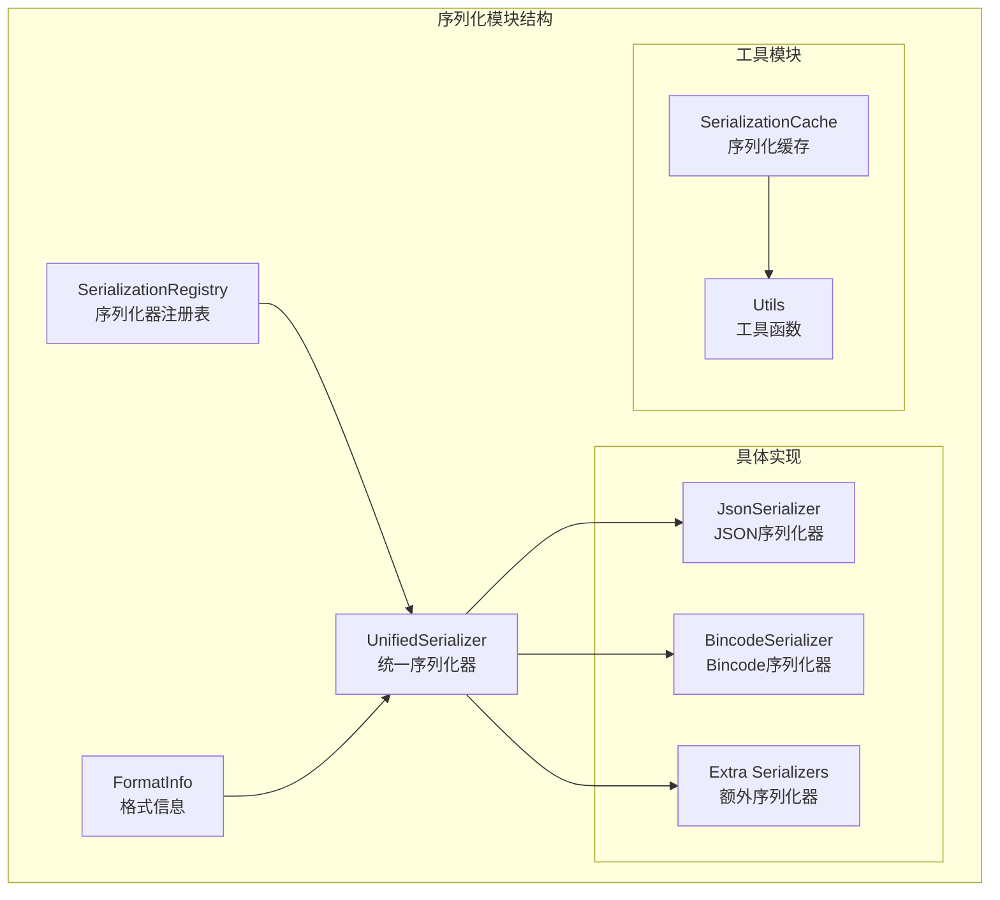

**图表来源**
- [src/serialization/unified.rs](file://src/serialization/unified.rs#L18-L537)
- [src/serialization/mod.rs](file://src/serialization/mod.rs#L1-L98)

**章节来源**
- [src/serialization/mod.rs](file://src/serialization/mod.rs#L1-L98)
- [src/serialization/unified.rs](file://src/serialization/unified.rs#L1-L537)

## 核心组件

### UnifiedSerializer 统一序列化器

UnifiedSerializer 是整个序列化架构的核心，它提供了一个统一的接口来处理所有序列化操作。该组件支持多种序列化格式，并根据配置动态选择合适的序列化器。

主要特性：
- **多格式支持**：支持 JSON、Bincode、CBOR、MessagePack 格式
- **零拷贝优化**：在支持的格式上提供零拷贝序列化能力
- **动态格式切换**：运行时可以在不同格式间切换
- **格式信息查询**：提供详细的格式特性信息

### SerializationRegistry 序列化器注册表

SerializationRegistry 提供了集中式的序列化器管理功能，允许动态注册、查找和管理不同格式的序列化器实例。

核心功能：
- **注册管理**：动态注册新的序列化器
- **查找机制**：根据格式类型获取对应的序列化器
- **懒加载**：按需创建序列化器实例
- **格式列表**：提供已注册格式的完整列表

### FormatInfo 格式信息结构体

FormatInfo 结构体封装了序列化格式的所有相关信息，为用户提供统一的格式特性查询接口。

包含的信息：
- **格式类型**：当前使用的序列化格式
- **零拷贝支持**：是否支持零拷贝操作
- **人类可读性**：格式是否对人类友好
- **紧凑性**：格式是否为二进制紧凑格式

**章节来源**
- [src/serialization/unified.rs](file://src/serialization/unified.rs#L255-L333)

## 架构概览

统一序列化器架构采用了分层设计模式，确保了高内聚、低耦合的代码组织：

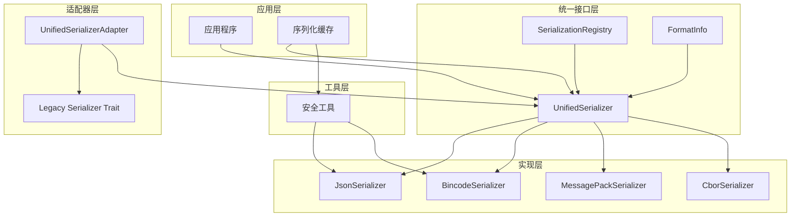

**图表来源**
- [src/serialization/unified.rs](file://src/serialization/unified.rs#L18-L333)
- [src/serialization/mod.rs](file://src/serialization/mod.rs#L41-L98)

## 详细组件分析

### UnifiedSerializer 工作原理

UnifiedSerializer 采用枚举包装器模式，将不同的序列化器实现封装在一个统一的接口后面：

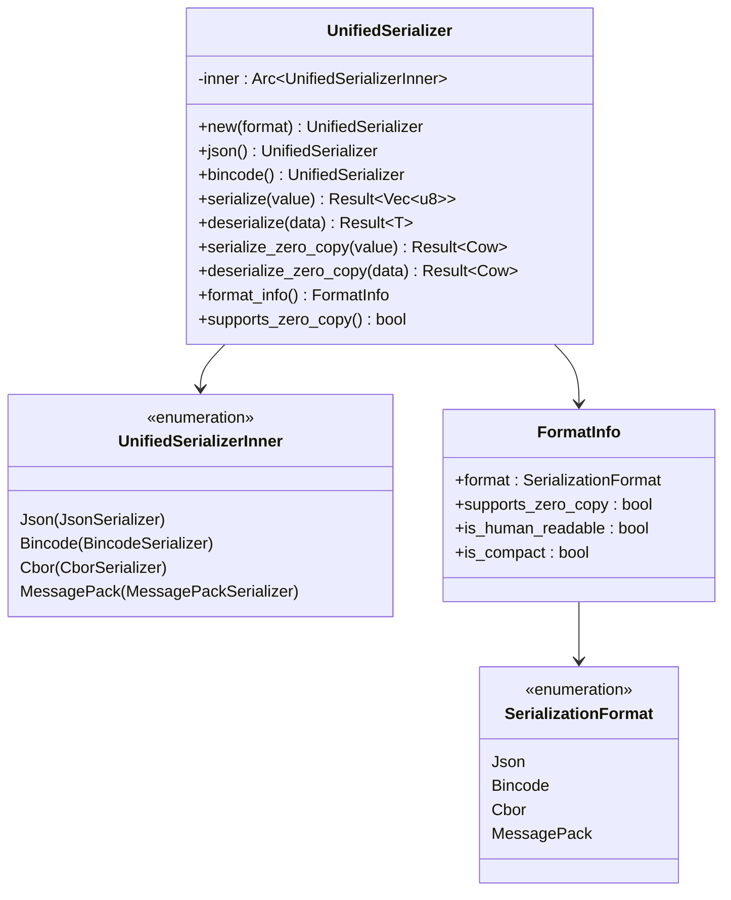

**图表来源**
- [src/serialization/unified.rs](file://src/serialization/unified.rs#L23-L253)

#### 序列化格式自动选择机制

UnifiedSerializer 实现了智能的格式选择机制，根据运行时条件自动选择最优的序列化格式：

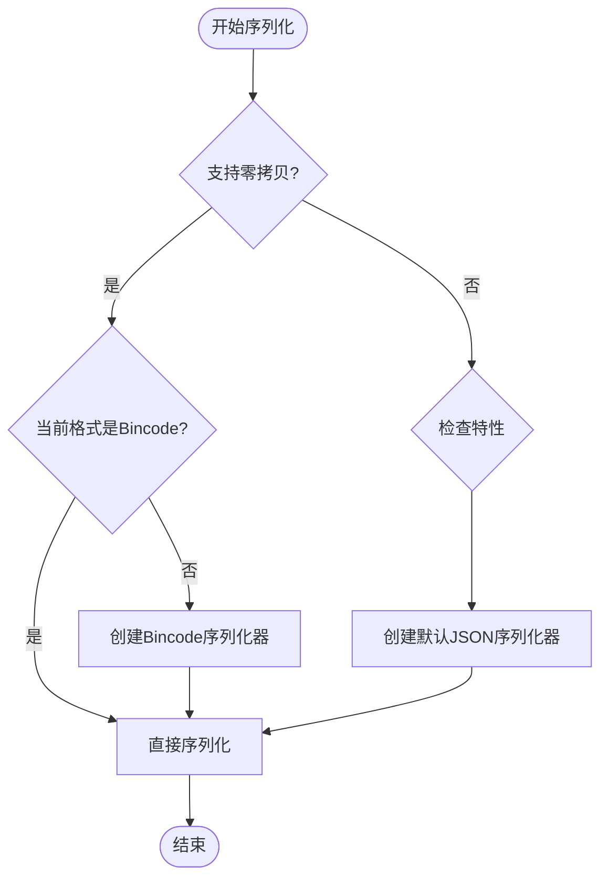

**图表来源**
- [src/serialization/unified.rs](file://src/serialization/unified.rs#L129-L161)

### SerializationRegistry 注册管理

SerializationRegistry 提供了完整的序列化器生命周期管理：

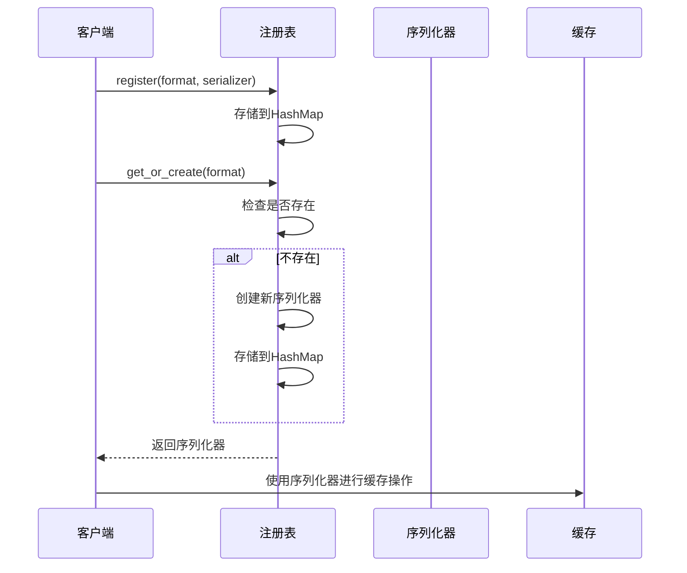

**图表来源**
- [src/serialization/unified.rs](file://src/serialization/unified.rs#L274-L306)

#### 动态序列化器切换流程

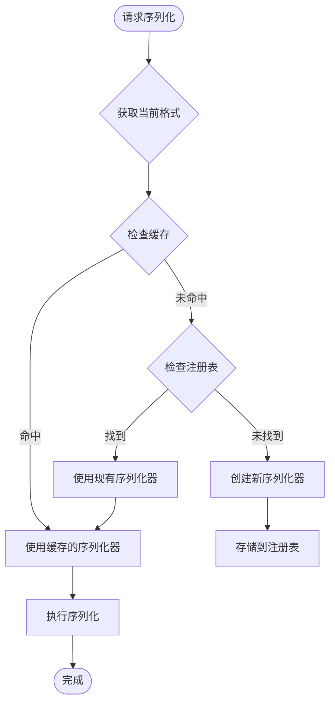

**图表来源**
- [src/serialization/unified.rs](file://src/serialization/unified.rs#L290-L296)

### FormatInfo 格式信息管理

FormatInfo 结构体提供了统一的格式特性查询接口：

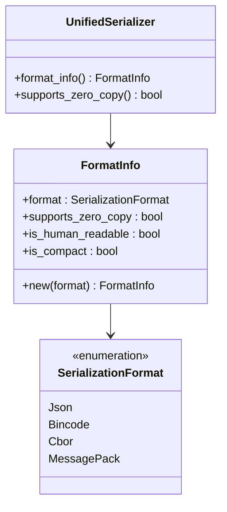

**图表来源**
- [src/serialization/unified.rs](file://src/serialization/unified.rs#L255-L266)

#### 格式特性判断逻辑

| 格式 | 零拷贝支持 | 人类可读 | 紧凑格式 |
|------|------------|----------|----------|
| JSON | 否 | 是 | 否 |
| Bincode | 是 | 否 | 是 |
| CBOR | 否 | 否 | 是 |
| MessagePack | 否 | 否 | 是 |

**章节来源**
- [src/serialization/unified.rs](file://src/serialization/unified.rs#L244-L252)

### 具体序列化器实现

#### JSON 序列化器

JSON 序列化器提供了人类可读的序列化格式，特别适合调试和开发环境：

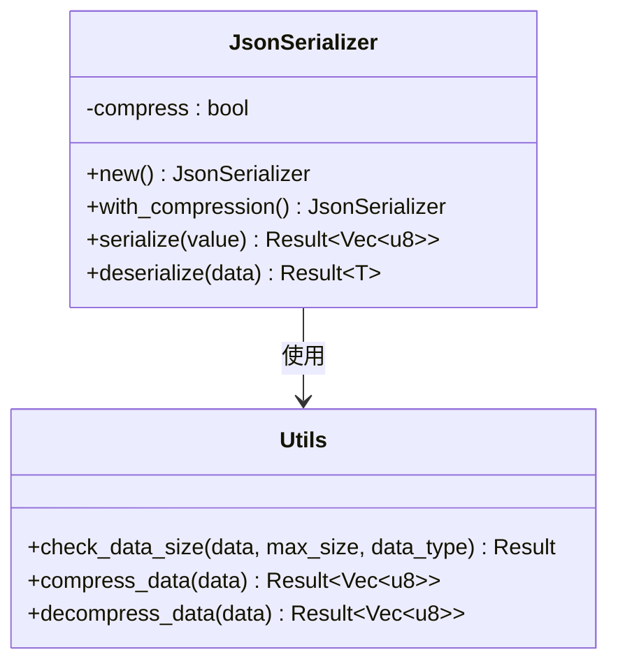

**图表来源**
- [src/serialization/json.rs](file://src/serialization/json.rs#L12-L99)

JSON 序列化器的安全特性：
- **数据大小限制**：最大 5MB，防止内存耗尽攻击
- **深度限制**：防止递归攻击
- **压缩支持**：可选的 Gzip 压缩

#### Bincode 序列化器

Bincode 序列化器提供了高效的二进制序列化格式：

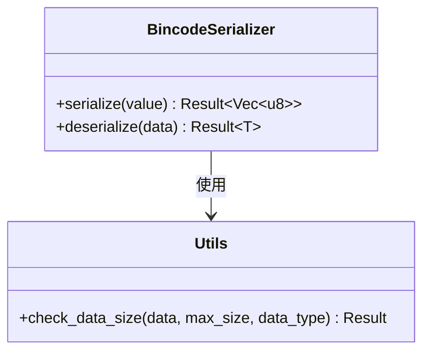

**图表来源**
- [src/serialization/bincode.rs](file://src/serialization/bincode.rs#L12-L54)

Bincode 序列化器的特点：
- **高效性**：二进制格式，序列化速度快
- **紧凑性**：占用更少的存储空间
- **数据大小限制**：最大 10MB，防止内存攻击

#### 额外序列化器

额外序列化器模块提供了 CBOR 和 MessagePack 格式的支持：

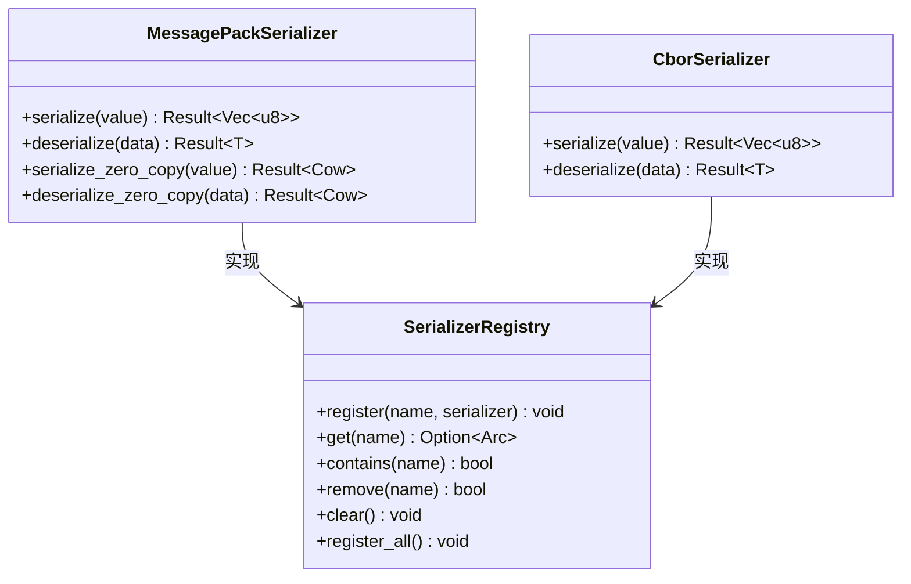

**图表来源**
- [src/serialization/extra.rs](file://src/serialization/extra.rs#L19-L203)

**章节来源**
- [src/serialization/json.rs](file://src/serialization/json.rs#L1-L100)
- [src/serialization/bincode.rs](file://src/serialization/bincode.rs#L1-L55)
- [src/serialization/extra.rs](file://src/serialization/extra.rs#L1-L270)

## 依赖关系分析

统一序列化器架构的依赖关系体现了清晰的分层设计：

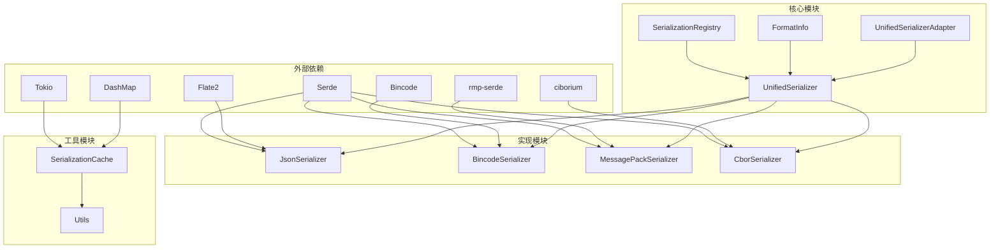

**图表来源**
- [Cargo.toml](file://Cargo.toml#L92-L120)
- [src/serialization/unified.rs](file://src/serialization/unified.rs#L1-L537)

### 特性依赖关系

统一序列化器的特性系统确保了正确的功能组合：

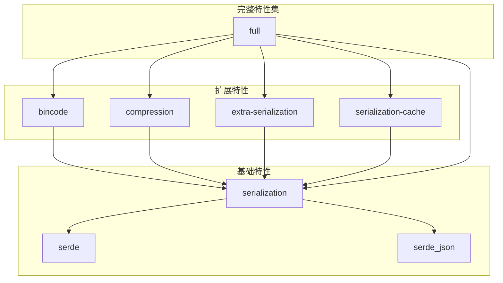

**图表来源**
- [Cargo.toml](file://Cargo.toml#L235-L347)

**章节来源**
- [Cargo.toml](file://Cargo.toml#L235-L347)

## 性能考虑

统一序列化器架构在设计时充分考虑了性能优化：

### 零拷贝优化

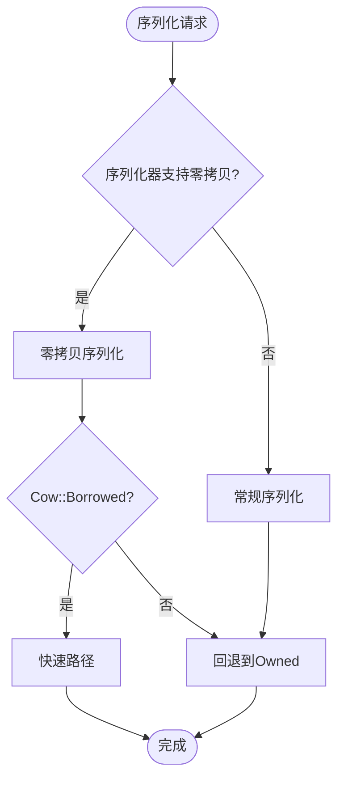

**图表来源**
- [src/serialization/unified.rs](file://src/serialization/unified.rs#L163-L224)

### 内存管理策略

统一序列化器采用了智能的内存管理策略：

1. **Arc 包装**：使用原子引用计数共享序列化器实例
2. **延迟初始化**：按需创建序列化器实例
3. **缓存机制**：注册表缓存已创建的序列化器
4. **零拷贝支持**：在可能的情况下避免内存分配

### 安全防护机制

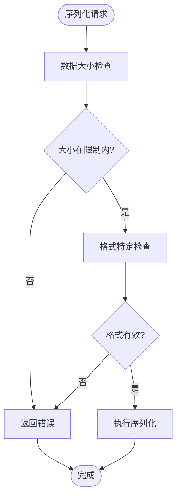

**图表来源**
- [src/serialization/utils.rs](file://src/serialization/utils.rs#L11-L33)

**章节来源**
- [src/serialization/unified.rs](file://src/serialization/unified.rs#L232-L252)
- [src/serialization/utils.rs](file://src/serialization/utils.rs#L1-L130)

## 故障排除指南

### 常见问题及解决方案

#### 序列化器不可用错误

**问题**：尝试使用未启用的序列化格式
**原因**：相关特性未在 Cargo.toml 中启用
**解决方案**：
1. 检查 Cargo.toml 中的特性配置
2. 启用相应的序列化特性
3. 重新编译项目

#### 内存不足错误

**问题**：序列化或反序列化过程中出现内存不足
**原因**：数据大小超过限制或内存泄漏
**解决方案**：
1. 检查数据大小限制设置
2. 实施数据压缩策略
3. 优化数据结构设计

#### 性能问题

**问题**：序列化性能不满足要求
**原因**：选择了不合适的序列化格式
**解决方案**：
1. 评估不同格式的性能特点
2. 根据使用场景选择最优格式
3. 考虑启用零拷贝优化

### 调试技巧

#### 启用详细日志

```rust
// 在配置中启用调试日志
env_logger::Builder::from_env(env_logger::Env::default()
    .default_filter_or("oxcache=debug"))
    .init();
```

#### 性能监控

```rust
// 使用内置统计功能
let stats = cache.stats();
println!("序列化次数: {}", stats.serialize_count);
println!("反序列化次数: {}", stats.deserialize_count);
println!("平均序列化时间: {:.2}μs", stats.avg_serialize_us);
```

**章节来源**
- [src/serialization/cache.rs](file://src/serialization/cache.rs#L441-L496)

## 结论

Oxcache 的统一序列化器架构通过精心设计的模块化结构，成功实现了高性能、安全、易用的序列化解决方案。该架构的主要优势包括：

### 设计优势

1. **统一接口**：提供一致的序列化 API，简化了缓存系统的使用
2. **灵活扩展**：支持动态注册新的序列化格式
3. **性能优化**：通过零拷贝和智能缓存提升性能
4. **安全保障**：内置数据大小限制和安全检查
5. **特性驱动**：基于特性系统实现按需编译

### 技术创新

1. **智能格式选择**：根据运行时条件自动选择最优序列化格式
2. **零拷贝优化**：在支持的格式上提供零拷贝序列化能力
3. **统一注册管理**：集中管理序列化器实例，避免重复创建
4. **格式信息抽象**：通过 FormatInfo 提供统一的格式特性查询

### 应用价值

统一序列化器架构为缓存系统提供了强大的基础设施支持，使得开发者能够专注于业务逻辑，而无需担心底层序列化细节。这种设计模式值得在其他类似的缓存系统中借鉴和应用。

通过持续的优化和扩展，Oxcache 的统一序列化器将继续为 Rust 生态系统中的缓存需求提供可靠、高效的解决方案。
