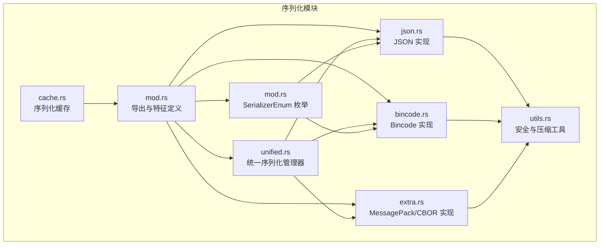
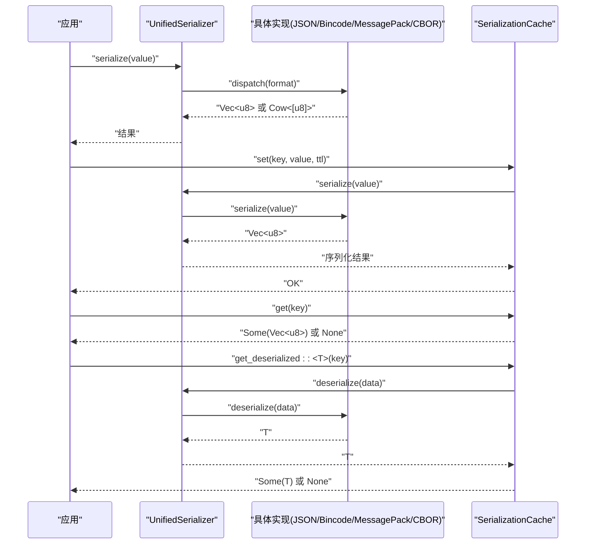
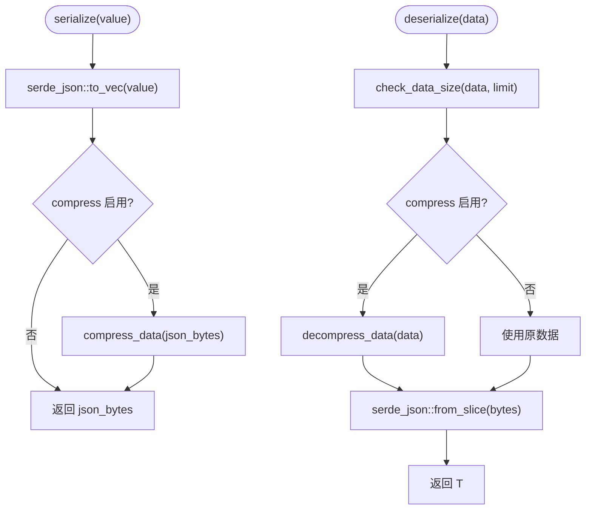
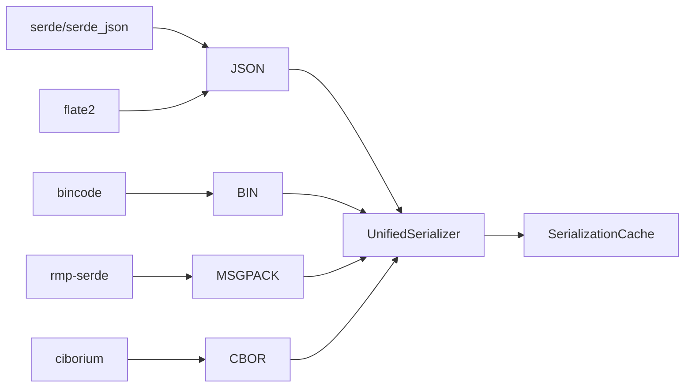

# 自定义序列化器

<cite>
**本文档引用的文件**
- [src/serialization/mod.rs](file://src/serialization/mod.rs)
- [src/serialization/json.rs](file://src/serialization/json.rs)
- [src/serialization/bincode.rs](file://src/serialization/bincode.rs)
- [src/serialization/extra.rs](file://src/serialization/extra.rs)
- [src/serialization/utils.rs](file://src/serialization/utils.rs)
- [src/serialization/cache.rs](file://src/serialization/cache.rs)
- [src/serialization/unified.rs](file://src/serialization/unified.rs)
- [tests/unit/serialization_test.rs](file://tests/unit/serialization_test.rs)
- [examples/src/01_basics/example_serialization.rs](file://examples/src/01_basics/example_serialization.rs)
- [benches/cache_benchmark.rs](file://benches/cache_benchmark.rs)
- [benches/modern_api_benchmark.rs](file://benches/modern_api_benchmark.rs)
- [Cargo.toml](file://Cargo.toml)
</cite>

## 目录
1. [简介](#简介)
2. [项目结构](#项目结构)
3. [核心组件](#核心组件)
4. [架构总览](#架构总览)
5. [详细组件分析](#详细组件分析)
6. [依赖关系分析](#依赖关系分析)
7. [性能考量](#性能考量)
8. [故障排查指南](#故障排查指南)
9. [结论](#结论)
10. [附录](#附录)

## 简介
本章节面向希望在 Oxcache 中实现和扩展自定义序列化器的开发者，系统讲解以下内容：
- Serializer 特征与 ZeroCopySerializer 特征的实现要求与约束
- 如何创建自定义序列化器（含序列化与反序列化）
- 如何将自定义序列化器集成到现有统一序列化系统（UnifiedSerializer、SerializerEnum）
- 零拷贝序列化的优势与实现技巧
- 完整实现示例（含错误处理与性能优化）
- 测试方法与调试技巧
- 性能基准测试与对比方法

## 项目结构
Oxcache 的序列化子系统位于 src/serialization 目录，包含：
- 核心特征与统一管理器：mod.rs、unified.rs
- 具体实现：json.rs、bincode.rs、extra.rs
- 工具函数：utils.rs
- 序列化缓存：cache.rs
- 示例与测试：examples/...、tests/...

图表来源
- [src/serialization/mod.rs](file://src/serialization/mod.rs#L1-L98)
- [src/serialization/unified.rs](file://src/serialization/unified.rs#L1-L537)
- [src/serialization/json.rs](file://src/serialization/json.rs#L1-L100)
- [src/serialization/bincode.rs](file://src/serialization/bincode.rs#L1-L55)
- [src/serialization/extra.rs](file://src/serialization/extra.rs#L1-L270)
- [src/serialization/utils.rs](file://src/serialization/utils.rs#L1-L130)
- [src/serialization/cache.rs](file://src/serialization/cache.rs#L1-L627)

章节来源
- [src/serialization/mod.rs](file://src/serialization/mod.rs#L1-L98)
- [src/serialization/unified.rs](file://src/serialization/unified.rs#L1-L537)

## 核心组件
- Serializer 特征：定义 serialize 与 deserialize 两个方法，分别负责序列化为字节数组与从字节数组反序列化。
- ZeroCopySerializer 特征：在 Serializer 基础上增加 serialize_zero_copy 与 deserialize_zero_copy，返回 Cow<[u8]> 或 Cow<T>，以避免不必要的内存分配。
- SerializerEnum：对已内置的序列化器进行多态封装，便于在运行时选择具体实现。
- UnifiedSerializer：统一序列化管理器，集中处理不同格式的序列化与反序列化，并提供零拷贝能力适配。
- JsonSerializer、BincodeSerializer、MessagePackSerializer、CborSerializer：具体实现，分别基于 serde_json、bincode、rmp-serde、ciborium。
- SerializationCache：带容量管理的序列化缓存，内部持有 Serializer 实例，用于缓存序列化结果。

章节来源
- [src/serialization/mod.rs](file://src/serialization/mod.rs#L41-L98)
- [src/serialization/unified.rs](file://src/serialization/unified.rs#L18-L253)
- [src/serialization/json.rs](file://src/serialization/json.rs#L12-L99)
- [src/serialization/bincode.rs](file://src/serialization/bincode.rs#L12-L54)
- [src/serialization/extra.rs](file://src/serialization/extra.rs#L19-L78)
- [src/serialization/cache.rs](file://src/serialization/cache.rs#L158-L179)

## 架构总览
统一序列化管理器根据配置选择具体格式，并在支持零拷贝的格式上优先使用零拷贝路径；否则回退到常规序列化。序列化缓存层在 Serializer 之上提供 LRU/TinyLFU 式的容量控制与淘汰策略。

图表来源
- [src/serialization/unified.rs](file://src/serialization/unified.rs#L129-L161)
- [src/serialization/cache.rs](file://src/serialization/cache.rs#L216-L317)

## 详细组件分析

### Serializer 与 ZeroCopySerializer 特征
- Serializer
  - serialize<T: Serialize>(&self, value: &T) -> Result<Vec<u8>>
  - deserialize<T: DeserializeOwned>(&self, data: &[u8]) -> Result<T>
- ZeroCopySerializer
  - serialize_zero_copy<'a, T: Serialize>(&self, value: &'a T) -> Result<Cow<'a, [u8]>>
  - deserialize_zero_copy<'a, T: DeserializeOwned + Clone>(&self, data: &'a [u8]) -> Result<Cow<'a, T>> 

实现要点
- 所有实现必须返回 Result 类型，以便与全局错误类型兼容。
- ZeroCopySerializer 的返回值使用 Cow，尽量避免不必要的克隆与分配。
- 对输入数据大小进行限制，防止拒绝服务攻击。

章节来源
- [src/serialization/mod.rs](file://src/serialization/mod.rs#L41-L69)

### JsonSerializer（JSON 实现）
- 支持可选压缩（需启用 flate2 特性），默认不压缩。
- 提供 with_compression 构造方式。
- 反序列化时进行大小限制与深度限制预留（深度限制可通过 serde_json 的深度限制功能进一步加强）。

实现流程图

图表来源
- [src/serialization/json.rs](file://src/serialization/json.rs#L55-L98)
- [src/serialization/utils.rs](file://src/serialization/utils.rs#L23-L75)

章节来源
- [src/serialization/json.rs](file://src/serialization/json.rs#L12-L99)
- [src/serialization/utils.rs](file://src/serialization/utils.rs#L11-L75)

### BincodeSerializer（二进制实现）
- 基于 bincode::serialize/deserialize。
- 提供最大数据大小限制，防止异常输入导致资源耗尽。

章节来源
- [src/serialization/bincode.rs](file://src/serialization/bincode.rs#L12-L54)

### MessagePackSerializer 与 CborSerializer（额外实现）
- MessagePackSerializer 实现了 ZeroCopySerializer，提供零拷贝能力。
- CborSerializer 未实现 ZeroCopySerializer，统一走常规路径。
- 提供 SerializerRegistry，支持动态注册与擦除类型分发。

章节来源
- [src/serialization/extra.rs](file://src/serialization/extra.rs#L19-L78)
- [src/serialization/extra.rs](file://src/serialization/extra.rs#L80-L203)

### UnifiedSerializer（统一序列化管理器）
- 支持多种格式：Json、Bincode、Cbor、MessagePack（按特性启用）。
- 提供 format_info、supports_zero_copy、estimate_size 等辅助能力。
- serialize_zero_copy/deserialize_zero_copy 在不支持零拷贝的格式上回退到常规路径。

章节来源
- [src/serialization/unified.rs](file://src/serialization/unified.rs#L18-L253)

### SerializerEnum（多态序列化器）
- 将多种具体序列化器封装为枚举，统一对外暴露 Serializer 接口。
- 适用于需要在运行时切换序列化格式的场景。

章节来源
- [src/serialization/mod.rs](file://src/serialization/mod.rs#L71-L98)

### SerializationCache（序列化缓存）
- 基于 Serializer 实例缓存序列化结果，支持 TTL 与容量淘汰。
- 提供 set、get、get_deserialized、delete、exists、clear 等操作。
- 内部统计 serialize_count、deserialize_count、hit_count、miss_count 等指标。

章节来源
- [src/serialization/cache.rs](file://src/serialization/cache.rs#L158-L496)

### 创建自定义序列化器（实现指南）
步骤
1. 定义结构体并实现 Serializer 特征
   - serialize：调用目标库的序列化函数，返回 Vec<u8>，错误包装为全局 Result。
   - deserialize：先做数据大小检查，再调用目标库的反序列化函数，返回 T。
2. 若目标格式支持零拷贝，可同时实现 ZeroCopySerializer
   - serialize_zero_copy：返回 Cow::Borrowed(...)（若底层支持零拷贝）或 Cow::Owned(...)。
   - deserialize_zero_copy：返回 Cow::Owned(...)（通常无法真正零拷贝）。
3. 在统一序列化系统中注册
   - 将自定义实现加入 UnifiedSerializer 的内部枚举分支。
   - 或通过 SerializerEnum 将其作为具体实现之一。
4. 集成到 SerializationCache
   - 使用自定义 Serializer 初始化 SerializationCache。
   - 通过 set/get/get_deserialized 等方法验证缓存行为。

注意
- 必须实现 check_data_size 以限制输入大小，防止 DoS。
- 对于需要压缩的格式，可复用 compress_data/decompress_data 工具函数（需启用 flate2 特性）。

章节来源
- [src/serialization/mod.rs](file://src/serialization/mod.rs#L41-L69)
- [src/serialization/utils.rs](file://src/serialization/utils.rs#L11-L75)
- [src/serialization/unified.rs](file://src/serialization/unified.rs#L27-L35)
- [src/serialization/cache.rs](file://src/serialization/cache.rs#L181-L205)

### 零拷贝序列化的优势与实现技巧
优势
- 减少一次内存分配与数据复制，降低 CPU 与内存压力。
- 在高吞吐场景下显著提升序列化/反序列化性能。

实现技巧
- 仅在底层库明确支持零拷贝时才返回 Cow::Borrowed(...)。
- 对于 JSON、CBOR 等格式，通常无法实现真正的零拷贝，应返回 Cow::Owned(...) 并记录日志。
- 在 UnifiedSerializer 中对 supports_zero_copy 进行判断，合理选择路径。

章节来源
- [src/serialization/mod.rs](file://src/serialization/mod.rs#L53-L69)
- [src/serialization/unified.rs](file://src/serialization/unified.rs#L163-L224)
- [src/serialization/extra.rs](file://src/serialization/extra.rs#L39-L54)

### 完整实现示例（不含代码片段）
- 示例目标：实现一个名为 CustomSerializer 的自定义序列化器，支持 JSON 与 MessagePack 两种格式。
- 步骤概要
  1) 定义结构体 CustomSerializer，包含 format 字段（Json/MessagePack）。
  2) 实现 Serializer：在 serialize 中根据 format 选择 serde_json 或 rmp-serde；在 deserialize 中进行大小检查并反序列化。
  3) 可选实现 ZeroCopySerializer：仅在 MessagePack 下返回 Cow::Borrowed(...)。
  4) 在 UnifiedSerializer 中新增分支，使其可被统一调度。
  5) 使用 SerializationCache 包裹 CustomSerializer，验证 set/get/get_deserialized 的行为。
  6) 添加单元测试与基准测试，覆盖错误路径与性能指标。

章节来源
- [src/serialization/unified.rs](file://src/serialization/unified.rs#L27-L35)
- [src/serialization/cache.rs](file://src/serialization/cache.rs#L216-L317)
- [tests/unit/serialization_test.rs](file://tests/unit/serialization_test.rs#L17-L51)

### 集成到现有系统
- 通过 SerializerEnum 将自定义实现纳入多态体系，便于运行时切换。
- 通过 SerializationRegistry（额外序列化模块）注册自定义实现，支持动态分发。
- 在 Cache 初始化时注入自定义 Serializer，确保全局一致性。

章节来源
- [src/serialization/mod.rs](file://src/serialization/mod.rs#L71-L98)
- [src/serialization/extra.rs](file://src/serialization/extra.rs#L80-L203)

## 依赖关系分析
- 特性开关
  - serialization：启用 serde 与 serde_json
  - bincode：启用 serialization 与 bincode
  - compression/flate2：启用 flate2 压缩
  - extra-serialization：启用 rmp-serde 与 ciborium
  - serialization-cache：启用 serialization 与 dashmap
- 组件耦合
  - JsonSerializer、BincodeSerializer、MessagePackSerializer、CborSerializer 均依赖 serde trait。
  - UnifiedSerializer 通过内部枚举统一调度各实现。
  - SerializationCache 依赖 Serializer trait，不关心具体实现。

图表来源
- [Cargo.toml](file://Cargo.toml#L94-L124)
- [Cargo.toml](file://Cargo.toml#L306-L342)
- [src/serialization/unified.rs](file://src/serialization/unified.rs#L27-L35)

章节来源
- [Cargo.toml](file://Cargo.toml#L306-L342)

## 性能考量
- 格式选择
  - JSON：人类可读，调试友好，体积较大。
  - Bincode/MessagePack/CBOR：二进制紧凑，适合高性能场景。
- 零拷贝
  - 仅在底层库支持时启用，避免误用导致性能下降。
- 压缩
  - 对大对象启用压缩可显著降低网络与存储开销，但会增加 CPU 开销。
- 缓存
  - 使用 SerializationCache 控制条目数与内存占用，结合 TTL 与淘汰策略提升命中率。

章节来源
- [src/serialization/unified.rs](file://src/serialization/unified.rs#L244-L252)
- [src/serialization/cache.rs](file://src/serialization/cache.rs#L100-L125)

## 故障排查指南
常见问题
- 反序列化失败
  - 检查数据大小限制与格式一致性。
  - 对于 JSON，考虑启用深度限制功能。
- 大数据导致内存压力
  - 启用压缩或改用更紧凑的格式。
- 零拷贝未生效
  - 确认底层库支持且格式为支持零拷贝的类型。
- 缓存命中率低
  - 调整 SerializationCache 配置（max_entries、max_memory_bytes、eviction_threshold）。

调试技巧
- 使用 tracing 日志观察序列化/反序列化耗时与缓存状态。
- 通过 SerializationCache::stats 获取命中率与平均耗时。
- 单元测试覆盖边界条件（空数据、超大对象、错误格式）。

章节来源
- [src/serialization/utils.rs](file://src/serialization/utils.rs#L11-L33)
- [src/serialization/cache.rs](file://src/serialization/cache.rs#L441-L496)
- [tests/unit/serialization_test.rs](file://tests/unit/serialization_test.rs#L17-L51)

## 结论
通过统一的 Serializer/ZeroCopySerializer 特征与 UnifiedSerializer 管理器，Oxcache 为自定义序列化器提供了清晰的扩展点。结合 SerializationCache 的容量与淘汰策略，可在保证性能的同时提升系统的稳定性与可观测性。建议在实现自定义序列化器时遵循安全限制、零拷贝适配与统一注册的原则，并配合完善的测试与基准评估。

## 附录

### 示例：使用不同序列化选项
- 示例展示了 JSON 与可选的 Bincode（启用时）的使用方式，便于理解格式差异与切换方法。

章节来源
- [examples/src/01_basics/example_serialization.rs](file://examples/src/01_basics/example_serialization.rs#L1-L63)

### 基准测试参考
- 缓存基准测试：涵盖 L1 缓存的 set/get、不同数据大小与批量写入等场景。
- 现代 API 基准测试：覆盖基本操作、不同数据大小、顺序操作与吞吐量测试。

章节来源
- [benches/cache_benchmark.rs](file://benches/cache_benchmark.rs#L1-L100)
- [benches/modern_api_benchmark.rs](file://benches/modern_api_benchmark.rs#L1-L158)