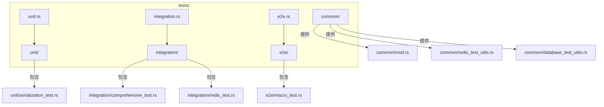
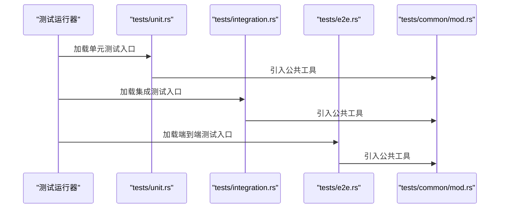
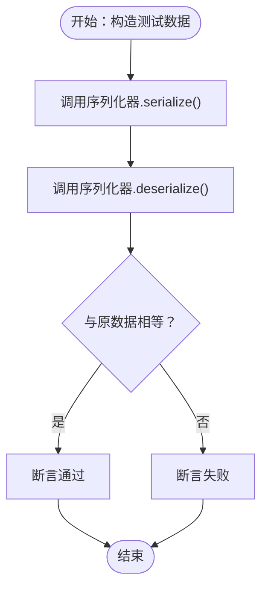
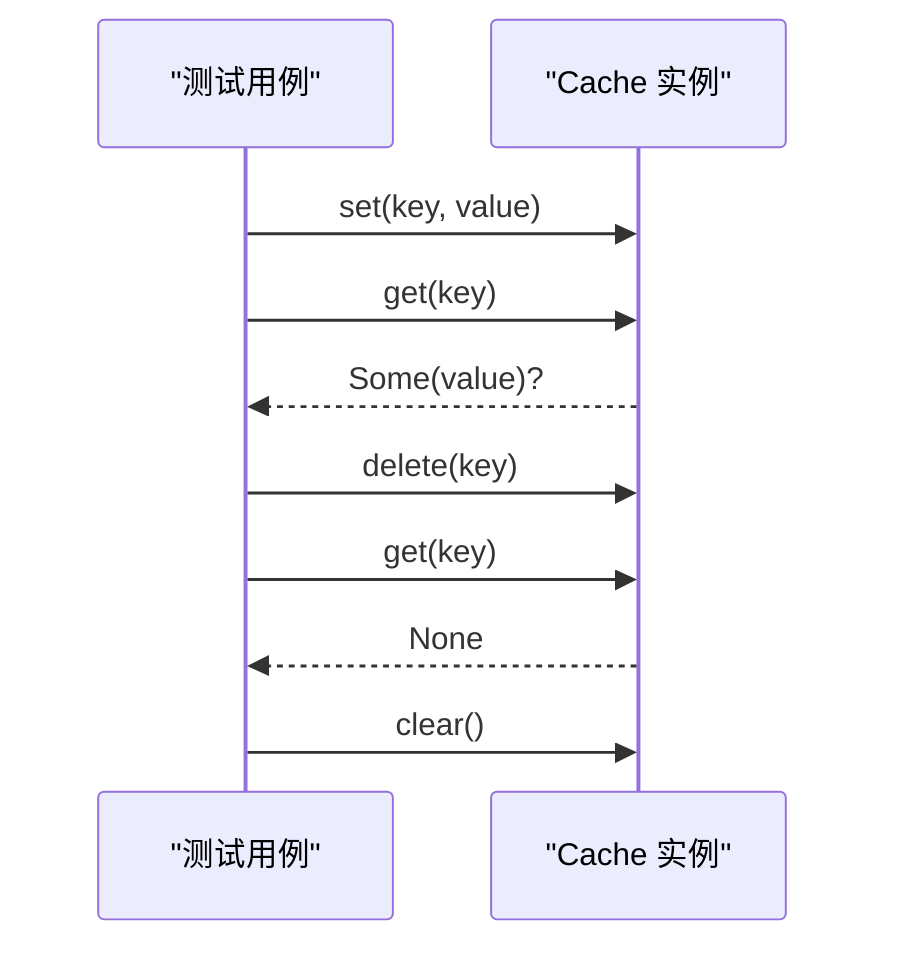
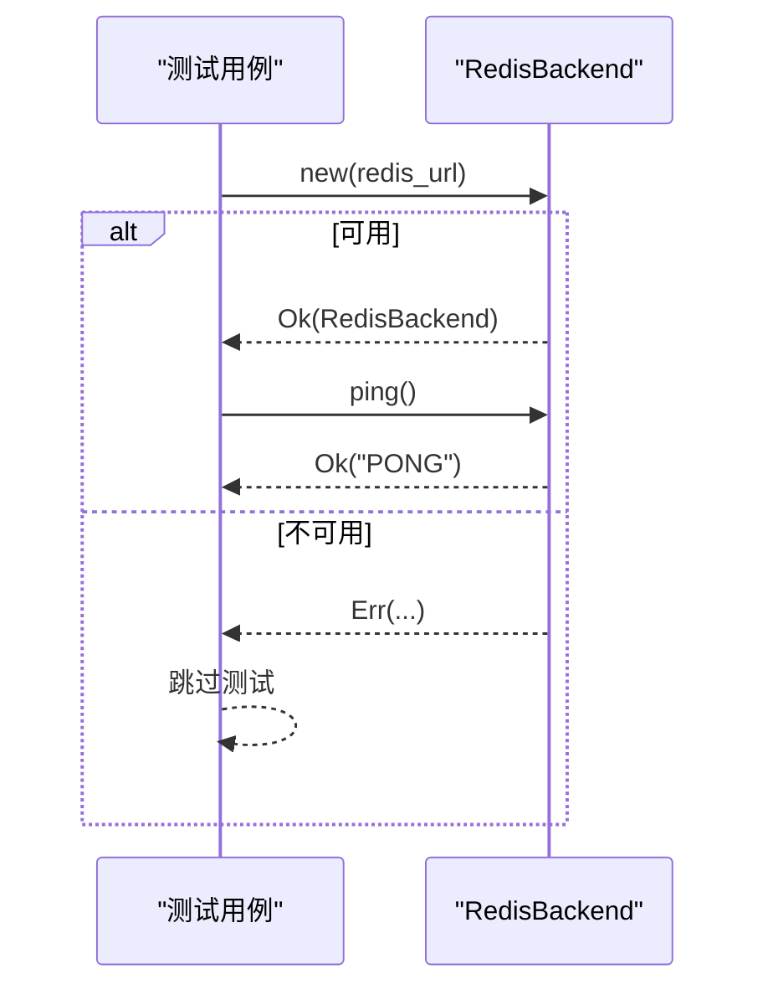
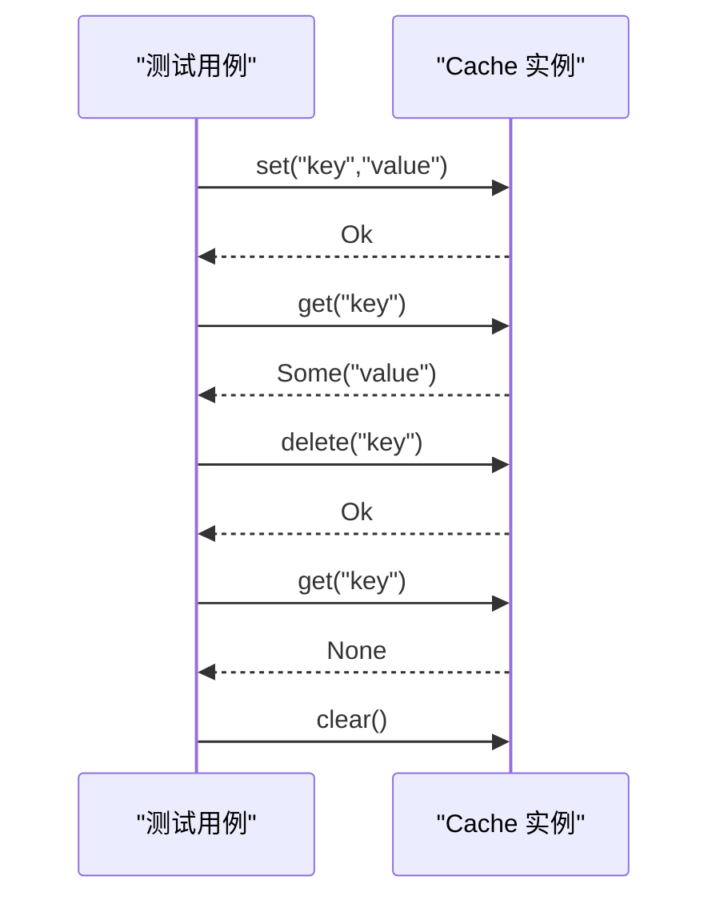
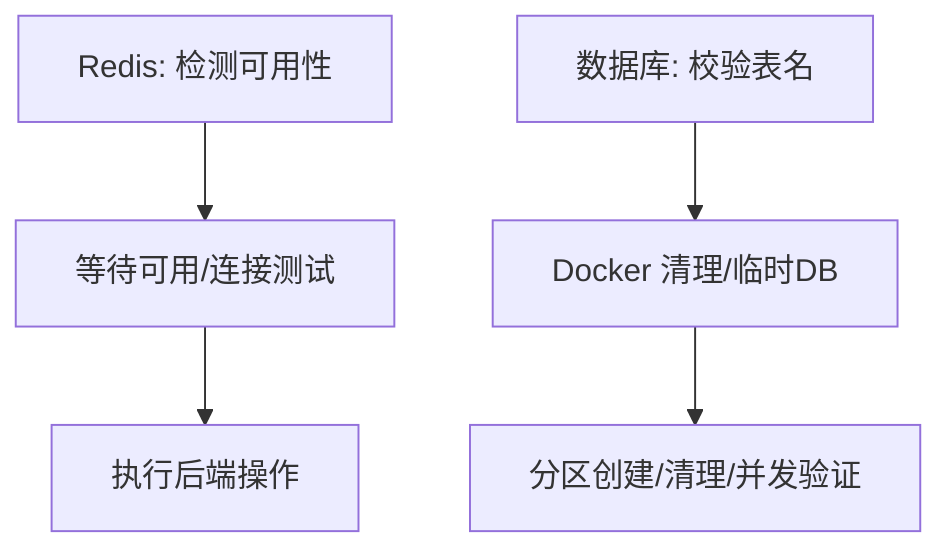
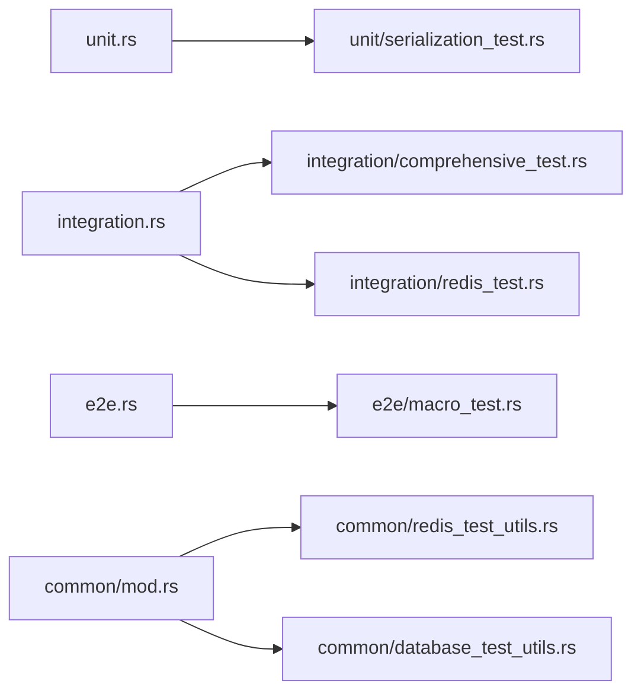

# 测试分类体系

<cite>
**本文引用的文件**
- [tests/TEST_CATEGORIES.md](file://tests/TEST_CATEGORIES.md)
- [tests/unit.rs](file://tests/unit.rs)
- [tests/integration.rs](file://tests/integration.rs)
- [tests/e2e.rs](file://tests/e2e.rs)
- [tests/common/mod.rs](file://tests/common/mod.rs)
- [tests/common/redis_test_utils.rs](file://tests/common/redis_test_utils.rs)
- [tests/common/database_test_utils.rs](file://tests/common/database_test_utils.rs)
- [tests/unit/serialization_test.rs](file://tests/unit/serialization_test.rs)
- [tests/integration/comprehensive_test.rs](file://tests/integration/comprehensive_test.rs)
- [tests/integration/redis_test.rs](file://tests/integration/redis_test.rs)
- [tests/e2e/macro_test.rs](file://tests/e2e/macro_test.rs)
</cite>

## 目录
1. [简介](#简介)
2. [项目结构](#项目结构)
3. [核心组件](#核心组件)
4. [架构总览](#架构总览)
5. [详细组件分析](#详细组件分析)
6. [依赖关系分析](#依赖关系分析)
7. [性能考虑](#性能考虑)
8. [故障排查指南](#故障排查指南)
9. [结论](#结论)
10. [附录](#附录)

## 简介
本文件系统性阐述 Oxcache 项目的测试分类体系与实施方法，覆盖单元测试、集成测试与端到端测试三大层级；解释 tests/ 目录结构的设计理念，包括 common/ 公共测试工具、integration/ 集成测试分类、e2e/ 端到端测试等；明确各类测试的适用场景与重点，如缓存核心功能、配置管理、数据库集成、序列化、同步机制、安全性、故障恢复等，并提供最佳实践与用例设计指南。

## 项目结构
Oxcache 的测试采用“按类型分层 + 按功能细分”的组织方式：
- tests/unit/：单元测试，聚焦独立模块的功能验证（如序列化器）。
- tests/integration/：集成测试，覆盖多组件协作、外部依赖（Redis、数据库）与复杂流程。
- tests/e2e/：端到端测试，模拟真实业务路径，验证完整链路。
- tests/common/：公共测试工具，统一日志、Redis/数据库连接检测、资源清理等。

**图表来源**
- [tests/unit.rs](file://tests/unit.rs#L1-L15)
- [tests/integration.rs](file://tests/integration.rs#L1-L55)
- [tests/e2e.rs](file://tests/e2e.rs#L1-L15)
- [tests/common/mod.rs](file://tests/common/mod.rs#L1-L184)
- [tests/common/redis_test_utils.rs](file://tests/common/redis_test_utils.rs#L1-L77)
- [tests/common/database_test_utils.rs](file://tests/common/database_test_utils.rs#L1-L254)
- [tests/unit/serialization_test.rs](file://tests/unit/serialization_test.rs#L1-L52)
- [tests/integration/comprehensive_test.rs](file://tests/integration/comprehensive_test.rs#L1-L139)
- [tests/integration/redis_test.rs](file://tests/integration/redis_test.rs#L1-L151)
- [tests/e2e/macro_test.rs](file://tests/e2e/macro_test.rs#L1-L104)

**章节来源**
- [tests/TEST_CATEGORIES.md](file://tests/TEST_CATEGORIES.md#L7-L61)
- [tests/unit.rs](file://tests/unit.rs#L1-L15)
- [tests/integration.rs](file://tests/integration.rs#L1-L55)
- [tests/e2e.rs](file://tests/e2e.rs#L1-L15)

## 核心组件
- 单元测试模块入口：tests/unit.rs，当前包含序列化器单元测试。
- 集成测试模块入口：tests/integration.rs，集中声明各子模块，共享 common/ 工具。
- 端到端测试模块入口：tests/e2e.rs，包含宏端到端测试。
- 公共测试工具：tests/common/mod.rs 提供日志初始化、Redis/数据库可用性检测、等待、资源清理等；redis_test_utils.rs/databse_test_utils.rs 提供 Redis/数据库专用工具。

**章节来源**
- [tests/unit.rs](file://tests/unit.rs#L1-L15)
- [tests/integration.rs](file://tests/integration.rs#L1-L55)
- [tests/e2e.rs](file://tests/e2e.rs#L1-L15)
- [tests/common/mod.rs](file://tests/common/mod.rs#L1-L184)
- [tests/common/redis_test_utils.rs](file://tests/common/redis_test_utils.rs#L1-L77)
- [tests/common/database_test_utils.rs](file://tests/common/database_test_utils.rs#L1-L254)

## 架构总览
测试运行通过模块入口文件组织，配合 common/ 工具实现跨测试复用与环境准备。

**图表来源**
- [tests/unit.rs](file://tests/unit.rs#L1-L15)
- [tests/integration.rs](file://tests/integration.rs#L1-L55)
- [tests/e2e.rs](file://tests/e2e.rs#L1-L15)
- [tests/common/mod.rs](file://tests/common/mod.rs#L1-L184)

## 详细组件分析

### 单元测试：序列化功能
- 目标：验证序列化器的往返一致性与压缩能力。
- 关键点：构造结构化数据，序列化后再反序列化，断言相等；验证压缩后的可逆性。
- 适用场景：序列化器内部逻辑、编码/解码正确性、压缩策略有效性。

**图表来源**
- [tests/unit/serialization_test.rs](file://tests/unit/serialization_test.rs#L1-L52)

**章节来源**
- [tests/unit/serialization_test.rs](file://tests/unit/serialization_test.rs#L1-L52)
- [tests/unit.rs](file://tests/unit.rs#L13-L14)

### 集成测试：缓存核心功能
- 目标：验证新 Cache API 的基本生命周期与多类型支持。
- 关键点：SET/GET/DELETE/清空；多类型缓存实例；边界条件（空键/空值/长键）。
- 适用场景：缓存接口稳定性、类型系统兼容性、异常输入处理。

**图表来源**
- [tests/integration/comprehensive_test.rs](file://tests/integration/comprehensive_test.rs#L14-L62)

**章节来源**
- [tests/integration/comprehensive_test.rs](file://tests/integration/comprehensive_test.rs#L1-L139)
- [tests/integration.rs](file://tests/integration.rs#L1-L55)

### 集成测试：Redis 集成
- 目标：验证 RedisBackend 的创建、连接、PING、连接串变体与错误处理。
- 关键点：Redis 可用性检测；多种连接串格式；多次连接；无效连接错误。
- 适用场景：Redis 客户端初始化、网络连通性、错误传播。

**图表来源**
- [tests/integration/redis_test.rs](file://tests/integration/redis_test.rs#L14-L89)
- [tests/common/redis_test_utils.rs](file://tests/common/redis_test_utils.rs#L38-L65)

**章节来源**
- [tests/integration/redis_test.rs](file://tests/integration/redis_test.rs#L1-L151)
- [tests/common/redis_test_utils.rs](file://tests/common/redis_test_utils.rs#L1-L77)

### 端到端测试：基本缓存流程
- 目标：从应用视角验证 SET/GET/DELETE/批量操作的完整链路。
- 关键点：结构化对象缓存；批量写入/读取；最终清理。
- 适用场景：真实业务路径验证、跨模块协作、数据一致性。

**图表来源**
- [tests/e2e/macro_test.rs](file://tests/e2e/macro_test.rs#L21-L48)

**章节来源**
- [tests/e2e/macro_test.rs](file://tests/e2e/macro_test.rs#L1-L104)
- [tests/e2e.rs](file://tests/e2e.rs#L9-L10)

### 公共测试工具：Redis/数据库
- Redis 工具：连接可用性检测、等待、连接测试、键清理占位。
- 数据库工具：分区配置、表名校验、Docker 清理、临时 SQLite、分区创建/清理/并发操作验证。
- 作用：统一环境准备、资源清理、跨测试复用。

**图表来源**
- [tests/common/redis_test_utils.rs](file://tests/common/redis_test_utils.rs#L38-L65)
- [tests/common/database_test_utils.rs](file://tests/common/database_test_utils.rs#L66-L116)
- [tests/common/database_test_utils.rs](file://tests/common/database_test_utils.rs#L118-L205)
- [tests/common/database_test_utils.rs](file://tests/common/database_test_utils.rs#L207-L253)

**章节来源**
- [tests/common/mod.rs](file://tests/common/mod.rs#L18-L184)
- [tests/common/redis_test_utils.rs](file://tests/common/redis_test_utils.rs#L1-L77)
- [tests/common/database_test_utils.rs](file://tests/common/database_test_utils.rs#L1-L254)

## 依赖关系分析
- 模块入口对子模块的依赖：unit.rs/integration.rs/e2e.rs 通过 #[path] 声明子模块，形成清晰的分层依赖。
- 子模块对公共工具的依赖：各测试文件通过 use crate::common::* 或显式导入工具函数，降低重复代码。
- 外部依赖：Redis、数据库容器、Docker 命令等，通过公共工具封装。

**图表来源**
- [tests/unit.rs](file://tests/unit.rs#L1-L15)
- [tests/integration.rs](file://tests/integration.rs#L1-L55)
- [tests/e2e.rs](file://tests/e2e.rs#L1-L15)
- [tests/common/mod.rs](file://tests/common/mod.rs#L1-L184)
- [tests/common/redis_test_utils.rs](file://tests/common/redis_test_utils.rs#L1-L77)
- [tests/common/database_test_utils.rs](file://tests/common/database_test_utils.rs#L1-L254)
- [tests/unit/serialization_test.rs](file://tests/unit/serialization_test.rs#L1-L52)
- [tests/integration/comprehensive_test.rs](file://tests/integration/comprehensive_test.rs#L1-L139)
- [tests/integration/redis_test.rs](file://tests/integration/redis_test.rs#L1-L151)
- [tests/e2e/macro_test.rs](file://tests/e2e/macro_test.rs#L1-L104)

**章节来源**
- [tests/unit.rs](file://tests/unit.rs#L1-L15)
- [tests/integration.rs](file://tests/integration.rs#L1-L55)
- [tests/e2e.rs](file://tests/e2e.rs#L1-L15)

## 性能考虑
- 性能测试：集成测试中的 performance_test.rs 用于评估整体吞吐与延迟。
- 内存测试：memory_tests.rs 与 memory_leak_test.rs 用于检测内存占用与泄漏风险。
- 建议：在 CI 中区分运行时间较长的性能/内存测试，避免阻塞快速反馈。

[本节为通用建议，无需具体文件分析]

## 故障排查指南
- Redis 不可用：通过 common::is_redis_available() 与 wait_for_redis() 检查/等待；必要时设置 OXCACHE_SKIP_REDIS_TESTS 或 OXCACHE_ALLOW_INSECURE_REDIS。
- 数据库清理：使用 database_test_utils.rs 的清理函数与表名校验，避免 SQL 注入风险。
- 资源清理：使用 common::cleanup_service() 清理 WAL 与 SQLite 文件，避免残留影响后续测试。
- 日志：统一通过 setup_logging() 初始化，便于定位问题。

**章节来源**
- [tests/common/mod.rs](file://tests/common/mod.rs#L18-L184)
- [tests/common/redis_test_utils.rs](file://tests/common/redis_test_utils.rs#L44-L81)
- [tests/common/database_test_utils.rs](file://tests/common/database_test_utils.rs#L55-L116)

## 结论
Oxcache 的测试体系以清晰的分层与共享工具为基础，既保证了单元测试的独立性，又通过集成与端到端测试覆盖真实场景。公共工具统一了环境准备与清理，提升了可维护性与可重复性。建议在新增测试时遵循现有分类与命名规范，优先使用 common/ 工具，确保测试质量与效率。

[本节为总结，无需具体文件分析]

## 附录

### 测试分类与适用场景对照
- 缓存核心功能：验证 Cache API 生命周期、多类型支持与边界条件。
- 配置管理：验证配置加载、TOML 解析与 TTL 生效。
- 数据库集成：验证分区策略、跨数据库兼容与连接管理。
- 序列化功能：验证序列化/反序列化一致性与压缩效果。
- 同步机制：验证失效、批量写入、分布式锁与预热。
- 安全性：验证脚本注入防护与扫描类攻击防护。
- 故障恢复：验证 WAL 与恢复流程。
- 性能相关：评估吞吐、延迟与内存占用。

**章节来源**
- [tests/TEST_CATEGORIES.md](file://tests/TEST_CATEGORIES.md#L63-L111)

### 测试运行与新增指引
- 运行所有测试：cargo test
- 运行集成测试：cargo test --test integration
- 运行特定测试：cargo test --test integration -- test_two_level_cache_flow
- 新增集成测试：在 tests/integration/ 下创建文件并在 integration.rs 中添加 #[path] 声明；使用 common 工具与 is_redis_available() 检查依赖。

**章节来源**
- [tests/TEST_CATEGORIES.md](file://tests/TEST_CATEGORIES.md#L112-L177)