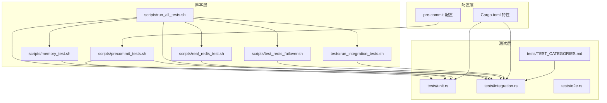
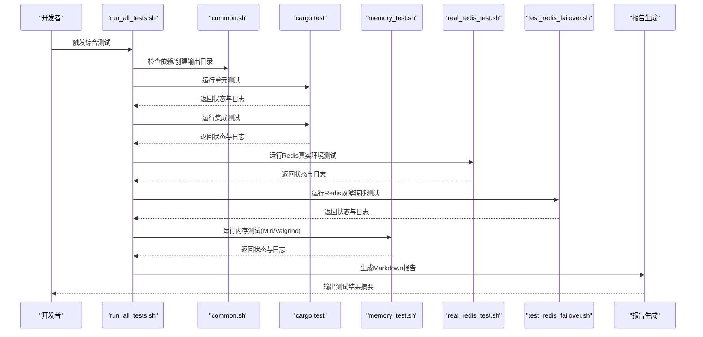
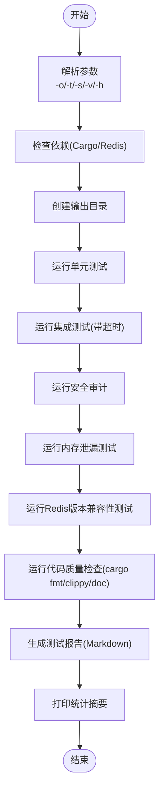
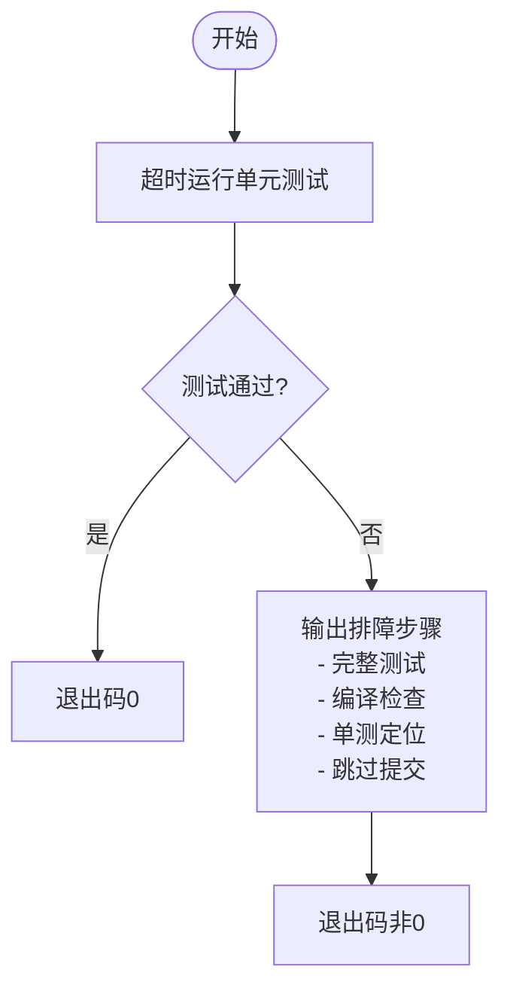
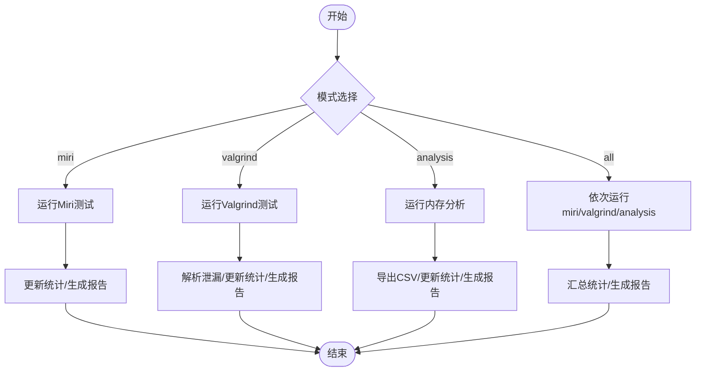
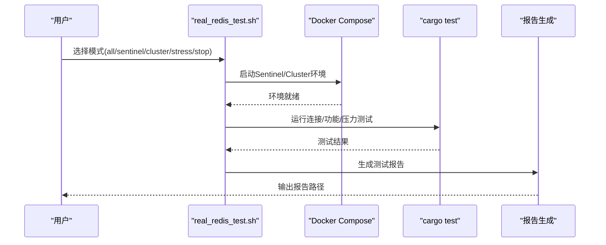
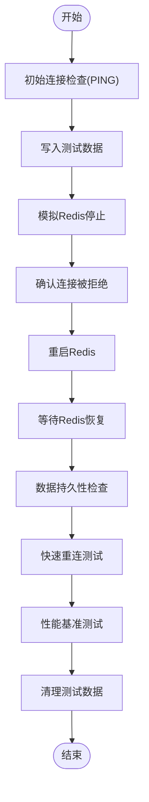
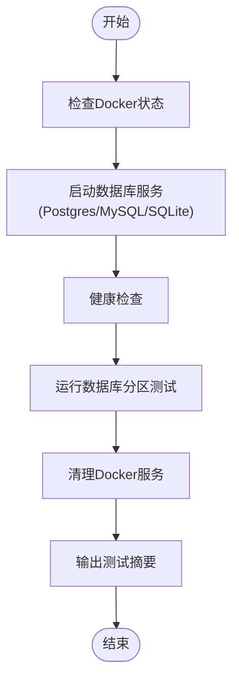
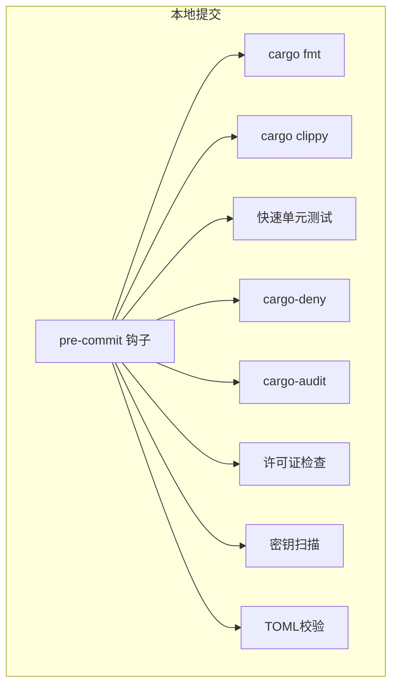
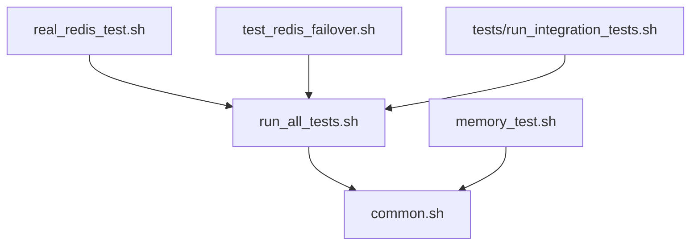

# 测试执行工具

<cite>
**本文引用的文件**
- [scripts/run_all_tests.sh](file://scripts/run_all_tests.sh)
- [scripts/precommit_tests.sh](file://scripts/precommit_tests.sh)
- [scripts/lib/common.sh](file://scripts/lib/common.sh)
- [scripts/memory_test.sh](file://scripts/memory_test.sh)
- [scripts/real_redis_test.sh](file://scripts/real_redis_test.sh)
- [scripts/test_redis_failover.sh](file://scripts/test_redis_failover.sh)
- [tests/run_integration_tests.sh](file://tests/run_integration_tests.sh)
- [.pre-commit-config.yaml](file://.pre-commit-config.yaml)
- [tests/TEST_CATEGORIES.md](file://tests/TEST_CATEGORIES.md)
- [tests/integration.rs](file://tests/integration.rs)
- [tests/unit.rs](file://tests/unit.rs)
- [tests/e2e.rs](file://tests/e2e.rs)
- [Cargo.toml](file://Cargo.toml)
</cite>

## 目录
1. [简介](#简介)
2. [项目结构](#项目结构)
3. [核心组件](#核心组件)
4. [架构概览](#架构概览)
5. [详细组件分析](#详细组件分析)
6. [依赖关系分析](#依赖关系分析)
7. [性能考虑](#性能考虑)
8. [故障排查指南](#故障排查指南)
9. [结论](#结论)
10. [附录](#附录)

## 简介
本文件系统性介绍 Oxcache 项目的测试执行工具与脚本体系，覆盖自动化测试执行、测试覆盖率统计、测试报告生成、并行化与并发控制、结果收集与分析、失败诊断与调试、以及持续集成环境下的测试执行配置。重点解析以下脚本与配置：
- 综合测试运行器：scripts/run_all_tests.sh
- 快速单元测试钩子：scripts/precommit_tests.sh
- 内存测试工具：scripts/memory_test.sh
- Redis 真实环境测试：scripts/real_redis_test.sh
- Redis 故障转移测试：scripts/test_redis_failover.sh
- 集成测试运行脚本：tests/run_integration_tests.sh
- Git 预提交钩子配置：.pre-commit-config.yaml
- 测试分类与组织：tests/TEST_CATEGORIES.md
- 测试模块入口：tests/integration.rs、tests/unit.rs、tests/e2e.rs
- 构建与特性配置：Cargo.toml

## 项目结构
测试相关文件主要分布在 scripts/、tests/ 与根目录配置文件中，采用“脚本驱动 + Rust 测试 + 预提交钩子”的多层测试体系。

图表来源
- [scripts/run_all_tests.sh](file://scripts/run_all_tests.sh#L1-L388)
- [scripts/precommit_tests.sh](file://scripts/precommit_tests.sh#L1-L52)
- [scripts/memory_test.sh](file://scripts/memory_test.sh#L1-L393)
- [scripts/real_redis_test.sh](file://scripts/real_redis_test.sh#L1-L462)
- [scripts/test_redis_failover.sh](file://scripts/test_redis_failover.sh#L1-L150)
- [tests/run_integration_tests.sh](file://tests/run_integration_tests.sh#L1-L103)
- [.pre-commit-config.yaml](file://.pre-commit-config.yaml#L1-L129)
- [tests/TEST_CATEGORIES.md](file://tests/TEST_CATEGORIES.md#L1-L177)
- [tests/integration.rs](file://tests/integration.rs#L1-L62)
- [tests/unit.rs](file://tests/unit.rs#L1-L12)
- [tests/e2e.rs](file://tests/e2e.rs#L1-L16)
- [Cargo.toml](file://Cargo.toml#L1-L377)

章节来源
- [scripts/run_all_tests.sh](file://scripts/run_all_tests.sh#L1-L388)
- [tests/TEST_CATEGORIES.md](file://tests/TEST_CATEGORIES.md#L1-L177)

## 核心组件
- 综合测试运行器：统一调度单元测试、集成测试、安全审计、内存泄漏测试、Redis 兼容性测试与代码质量检查，支持超时控制、输出目录与并行/串行模式切换，并生成 Markdown 报告。
- 快速单元测试钩子：在本地提交前快速运行单元测试，带超时与简要输出，失败时提供排障指引。
- 内存测试工具：支持 Miri 与 Valgrind 两种内存检测方式，可生成内存使用 CSV 与汇总报告。
- Redis 真实环境测试：自动化搭建 Sentinel/Cluster 环境，运行连接、故障转移、压力测试，并生成报告。
- 集成测试运行脚本：基于 Docker 的数据库分区测试，支持健康检查与可选的详细日志。
- 预提交钩子：集中管理格式、静态分析、快速测试、依赖审计、密钥扫描与配置校验。

章节来源
- [scripts/run_all_tests.sh](file://scripts/run_all_tests.sh#L94-L261)
- [scripts/precommit_tests.sh](file://scripts/precommit_tests.sh#L1-L52)
- [scripts/memory_test.sh](file://scripts/memory_test.sh#L79-L264)
- [scripts/real_redis_test.sh](file://scripts/real_redis_test.sh#L52-L313)
- [tests/run_integration_tests.sh](file://tests/run_integration_tests.sh#L1-L103)
- [.pre-commit-config.yaml](file://.pre-commit-config.yaml#L1-L129)

## 架构概览
下图展示测试执行的总体流程与关键交互点：

图表来源
- [scripts/run_all_tests.sh](file://scripts/run_all_tests.sh#L314-L388)
- [scripts/lib/common.sh](file://scripts/lib/common.sh#L45-L121)
- [scripts/memory_test.sh](file://scripts/memory_test.sh#L336-L393)
- [scripts/real_redis_test.sh](file://scripts/real_redis_test.sh#L401-L462)
- [scripts/test_redis_failover.sh](file://scripts/test_redis_failover.sh#L1-L150)

## 详细组件分析

### 综合测试运行器：scripts/run_all_tests.sh
- 功能概述
  - 解析命令行参数：输出目录(-o)、超时时间(-t)、串行模式(-s)、详细输出(-v)、帮助(-h)。
  - 依赖检查：验证 Cargo、Redis 服务器存在性。
  - 测试执行：按顺序运行单元测试、集成测试、安全审计、内存泄漏测试、Redis 版本兼容性测试、代码质量检查。
  - 报告生成：汇总各测试日志，生成 Markdown 报告，包含状态与最后若干行日志。
- 关键流程
  - 依赖检查与输出目录准备。
  - 逐项执行测试，记录状态。
  - 生成报告并打印统计摘要。
- 参数与行为
  - 默认超时 600 秒，输出目录 test-reports，默认并行模式。
  - 集成测试通过超时包装执行，避免长时间阻塞。
  - 代码质量检查包含格式化、Clippy、文档生成。
- 并行化与并发控制
  - 当前实现为串行执行，便于日志聚合与资源控制；如需并行可在循环中引入后台任务与等待队列。
- 报告与结果
  - 每个测试生成独立日志文件，最终汇总至 Markdown 报告，包含状态标记与日志片段。

图表来源
- [scripts/run_all_tests.sh](file://scripts/run_all_tests.sh#L37-L388)

章节来源
- [scripts/run_all_tests.sh](file://scripts/run_all_tests.sh#L1-L388)

### 快速单元测试钩子：scripts/precommit_tests.sh
- 功能概述
  - 在本地提交前快速运行单元测试，跳过慢的集成测试。
  - 限定超时与输出长度，失败时提供排障步骤与建议。
- 关键流程
  - 设置严格退出策略，超时运行 cargo test。
  - 失败时输出详细排查清单，包括完整测试、编译检查、单测定位与跳过提交建议。
- 适用场景
  - 本地开发阶段快速反馈，避免 CI 压力过大。

图表来源
- [scripts/precommit_tests.sh](file://scripts/precommit_tests.sh#L1-L52)

章节来源
- [scripts/precommit_tests.sh](file://scripts/precommit_tests.sh#L1-L52)

### 内存测试工具：scripts/memory_test.sh
- 功能概述
  - 支持四种模式：miri、valgrind、analysis、all。
  - Miri：使用 cargo miri 进行内存安全检查，支持隔离禁用标志。
  - Valgrind：对测试二进制进行内存泄漏检测，解析泄漏统计并判定结果。
  - 内存分析：监控并发场景下的内存使用，导出 CSV。
  - 报告生成：汇总项目信息、测试配置、结果与统计。
- 关键流程
  - 依赖检查：Miri/Valgrind 安装与可用性验证。
  - 选择模式并执行对应测试。
  - 分析输出并更新统计。
  - 生成 Markdown 报告。
- 参数与行为
  - 模式(-m)、超时(-t)、输出目录(-o)、二进制路径(-b)、详细输出(-v)。
  - 默认超时 300 秒，输出目录 memory-test-reports。
- 并行化与并发控制
  - 各模式独立执行，互不影响；并发场景建议在 CI 中分任务并行执行。

图表来源
- [scripts/memory_test.sh](file://scripts/memory_test.sh#L336-L393)

章节来源
- [scripts/memory_test.sh](file://scripts/memory_test.sh#L1-L393)

### Redis 真实环境测试：scripts/real_redis_test.sh
- 功能概述
  - 自动化搭建 Redis Sentinel 与 Cluster 环境，运行连接、故障转移、压力测试，并生成报告。
  - 支持 sentinel、cluster、stress、stop、all 等子命令。
- 关键流程
  - 检查 Docker/Docker Compose 环境。
  - 启动对应环境并等待就绪。
  - 运行连接与功能测试，生成报告。
  - 清理环境并可选停止所有容器。
- 参数与行为
  - 子命令：sentinel、cluster、stress、stop、all。
  - 生成报告文件于 results 目录，包含测试时间、环境、配置、结果与建议。

图表来源
- [scripts/real_redis_test.sh](file://scripts/real_redis_test.sh#L401-L462)

章节来源
- [scripts/real_redis_test.sh](file://scripts/real_redis_test.sh#L1-L462)

### Redis 故障转移测试：scripts/test_redis_failover.sh
- 功能概述
  - 验证 Redis 断开、重启、重连与性能表现，包含数据持久性与吞吐量评估。
- 关键流程
  - 初始连接检查与数据写入。
  - 模拟 Redis 重启，验证连接拒绝与恢复。
  - 数据持久性验证与快速重连测试。
  - 性能基准测试与清理收尾。

图表来源
- [scripts/test_redis_failover.sh](file://scripts/test_redis_failover.sh#L1-L150)

章节来源
- [scripts/test_redis_failover.sh](file://scripts/test_redis_failover.sh#L1-L150)

### 集成测试运行脚本：tests/run_integration_tests.sh
- 功能概述
  - 基于 Docker 的数据库分区测试，启动 PostgreSQL/MySQL/SQLite 服务，运行测试并清理。
- 关键流程
  - 检查 Docker 状态，启动数据库服务并等待健康。
  - 运行数据库分区测试，支持可选详细日志。
  - 清理服务并输出总结。

图表来源
- [tests/run_integration_tests.sh](file://tests/run_integration_tests.sh#L1-L103)

章节来源
- [tests/run_integration_tests.sh](file://tests/run_integration_tests.sh#L1-L103)

### 预提交钩子配置：.pre-commit-config.yaml
- 功能概述
  - 集成 Rust 格式、Clippy、快速测试、依赖审计、许可证检查、密钥扫描与配置校验。
  - 通过 stages: [pre-commit] 在本地提交前触发。
- 关键点
  - Rust 工具链钩子：cargo fmt、cargo clippy、快速测试。
  - 依赖安全：cargo-deny、cargo-audit。
  - 代码质量：detect-secrets、大文件检查。
  - 配置校验：TOML 校验。

图表来源
- [.pre-commit-config.yaml](file://.pre-commit-config.yaml#L1-L129)

章节来源
- [.pre-commit-config.yaml](file://.pre-commit-config.yaml#L1-L129)

### 测试分类与组织：tests/TEST_CATEGORIES.md
- 功能概述
  - 描述测试目录结构与分类标准，指导新增测试与运行方式。
- 关键点
  - 目录结构：common、integration、e2e、chaos 等。
  - 分类：缓存核心、配置管理、数据库集成、序列化、同步机制、安全性、故障恢复、性能相关。
  - 运行方式：cargo test、cargo test --test <name>、指定测试函数。

章节来源
- [tests/TEST_CATEGORIES.md](file://tests/TEST_CATEGORIES.md#L1-L177)

### 测试模块入口：tests/integration.rs、tests/unit.rs、tests/e2e.rs
- 功能概述
  - 通过 #[path = "..."] 属性组织测试模块，tests/integration.rs 统一声明集成测试。
- 关键点
  - tests/integration.rs：声明所有集成测试模块。
  - tests/unit.rs：声明单元测试模块。
  - tests/e2e.rs：声明端到端测试模块。

章节来源
- [tests/integration.rs](file://tests/integration.rs#L1-L62)
- [tests/unit.rs](file://tests/unit.rs#L1-L12)
- [tests/e2e.rs](file://tests/e2e.rs#L1-L16)

### 构建与特性配置：Cargo.toml
- 功能概述
  - 定义特性集（minimal/core/full 等），控制测试与功能开关。
- 关键点
  - 特性：moka、redis、serialization、metrics、database、http-cache 等。
  - profile.test：测试配置优化。
  - benchmarks：基准测试配置。

章节来源
- [Cargo.toml](file://Cargo.toml#L235-L377)

## 依赖关系分析
- 脚本依赖
  - run_all_tests.sh 依赖 common.sh 提供日志、超时、目录与统计工具。
  - memory_test.sh 依赖 common.sh 的超时与统计工具，并调用 cargo miri 与 Valgrind。
  - real_redis_test.sh 依赖 Docker 与 Docker Compose，运行 cargo test。
  - test_redis_failover.sh 依赖 Docker 容器与 redis-cli。
  - run_integration_tests.sh 依赖 Docker 与 cargo test。
- 测试模块依赖
  - tests/integration.rs 统一声明集成测试模块，tests/unit.rs/e2e.rs 同理。
- 预提交钩子依赖
  - .pre-commit-config.yaml 依赖 scripts/* 与 cargo 工具链。

图表来源
- [scripts/lib/common.sh](file://scripts/lib/common.sh#L1-L232)
- [scripts/run_all_tests.sh](file://scripts/run_all_tests.sh#L1-L388)
- [scripts/memory_test.sh](file://scripts/memory_test.sh#L1-L393)
- [scripts/real_redis_test.sh](file://scripts/real_redis_test.sh#L1-L462)
- [scripts/test_redis_failover.sh](file://scripts/test_redis_failover.sh#L1-L150)
- [tests/run_integration_tests.sh](file://tests/run_integration_tests.sh#L1-L103)

章节来源
- [scripts/lib/common.sh](file://scripts/lib/common.sh#L1-L232)
- [scripts/run_all_tests.sh](file://scripts/run_all_tests.sh#L1-L388)
- [scripts/memory_test.sh](file://scripts/memory_test.sh#L1-L393)
- [scripts/real_redis_test.sh](file://scripts/real_redis_test.sh#L1-L462)
- [scripts/test_redis_failover.sh](file://scripts/test_redis_failover.sh#L1-L150)
- [tests/run_integration_tests.sh](file://tests/run_integration_tests.sh#L1-L103)

## 性能考虑
- 超时控制
  - run_all_tests.sh 与 memory_test.sh 均使用 timeout 包裹，防止长时间阻塞。
- 并发与资源
  - run_all_tests.sh 当前为串行执行，便于日志聚合；在 CI 中可拆分为多个任务并行执行以缩短总耗时。
- 内存检测
  - memory_test.sh 支持 Miri 与 Valgrind，建议在 CI 中分别运行以覆盖不同层面的内存问题。
- Docker 环境
  - real_redis_test.sh 与 run_integration_tests.sh 依赖 Docker，建议在 CI 中预热镜像与网络，减少启动开销。

## 故障排查指南
- 快速单元测试失败
  - 使用完整测试命令查看详细输出，定位失败用例。
  - 先执行编译检查，确保无编译错误。
  - 对单个测试用例运行，缩小问题范围。
  - 如仅修改文档/配置，可临时跳过测试提交。
- 综合测试失败
  - 查看 test-reports 下各测试日志，关注最后若干行。
  - 检查 Redis 服务、Docker 环境与超时设置。
  - 分模块运行测试，逐步排除问题。
- 内存泄漏测试失败
  - 检查 Valgrind 输出中的泄漏统计，关注 definitely lost/indirectly lost。
  - 使用 Miri 进行内存安全检查，必要时调整隔离标志。
- Redis 真实环境测试失败
  - 确认 Docker 与 Docker Compose 正常运行。
  - 检查 Sentinel/Cluster 配置与健康状态。
  - 查看生成的测试报告，结合日志定位问题。
- 预提交钩子失败
  - 根据钩子输出修复格式、静态分析问题或依赖漏洞。
  - 使用 detect-secrets 与大文件检查工具修正。

章节来源
- [scripts/precommit_tests.sh](file://scripts/precommit_tests.sh#L24-L51)
- [scripts/run_all_tests.sh](file://scripts/run_all_tests.sh#L263-L312)
- [scripts/memory_test.sh](file://scripts/memory_test.sh#L178-L226)
- [scripts/real_redis_test.sh](file://scripts/real_redis_test.sh#L29-L50)
- [.pre-commit-config.yaml](file://.pre-commit-config.yaml#L1-L129)

## 结论
Oxcache 的测试体系通过脚本层、测试层与配置层协同，实现了从本地快速验证到全面集成测试的多层次保障。综合测试运行器提供统一入口与报告生成，内存测试工具覆盖静态与动态内存检测，Redis 真实环境测试与故障转移测试确保分布式场景稳定性，预提交钩子保证代码质量与安全基线。建议在 CI 中进一步拆分并行任务，提升整体测试效率与反馈速度。

## 附录
- 常用命令参考
  - 运行所有测试：./scripts/run_all_tests.sh
  - 快速单元测试：./scripts/precommit_tests.sh
  - 内存测试：./scripts/memory_test.sh -m all -o reports
  - Redis 真实环境测试：./scripts/real_redis_test.sh all
  - Redis 故障转移测试：./scripts/test_redis_failover.sh
  - 集成测试：./tests/run_integration_tests.sh
  - 预提交钩子：pre-commit run -a
