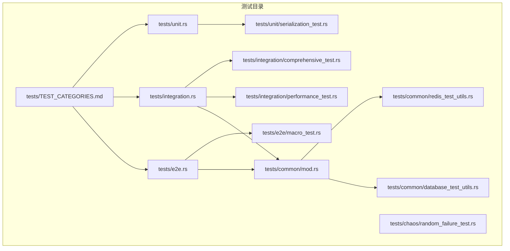
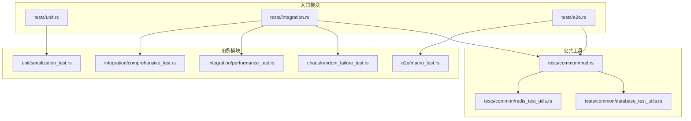
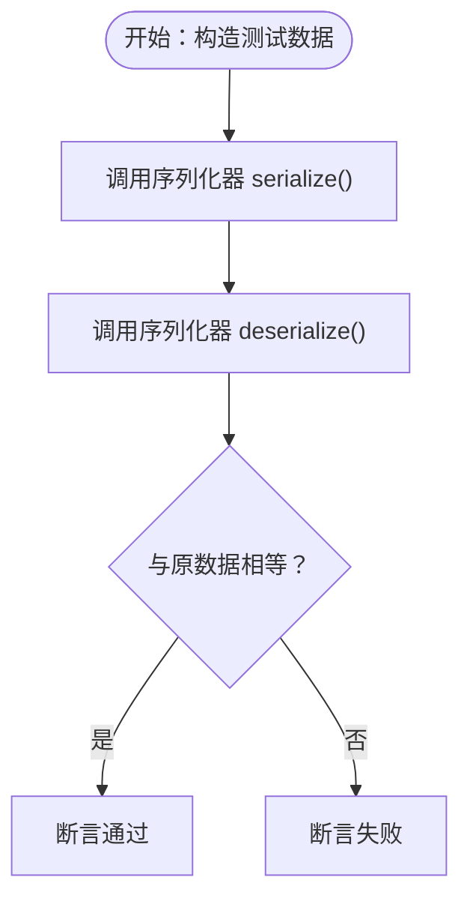
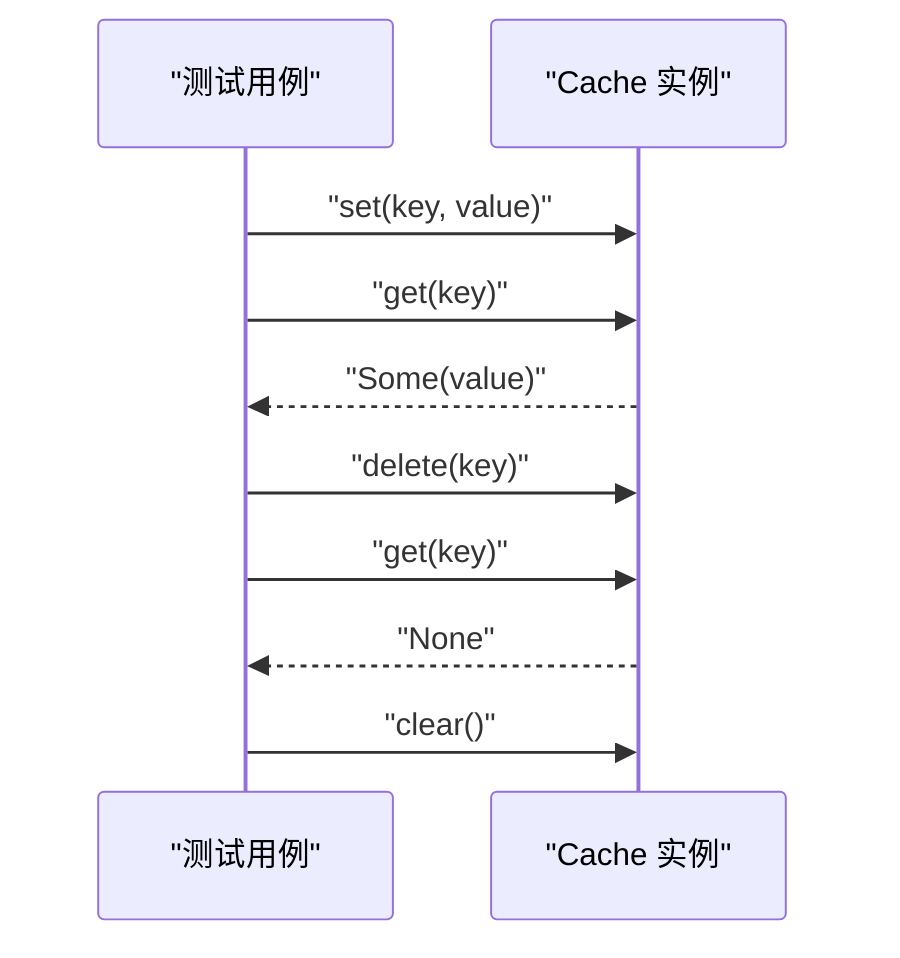
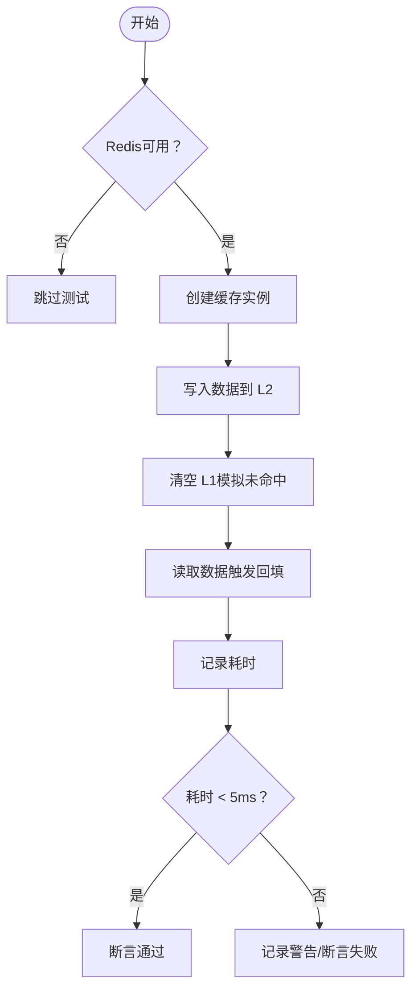
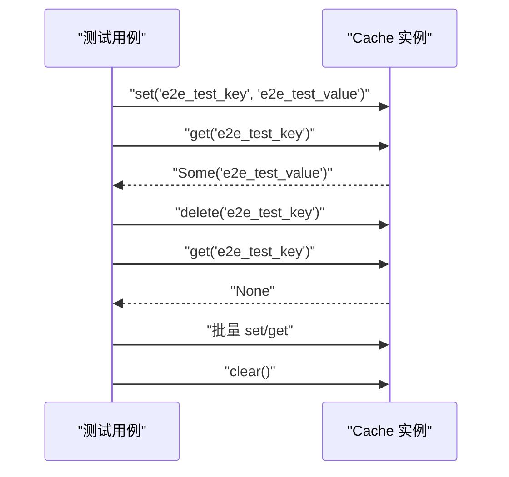
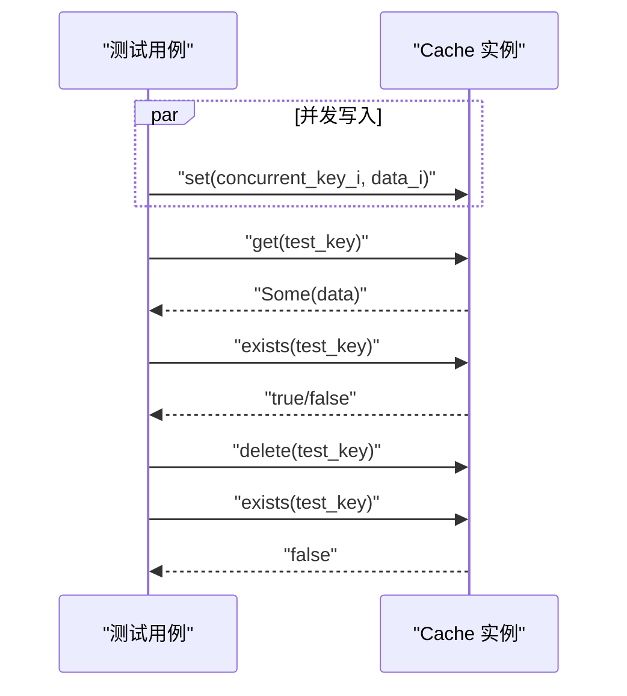
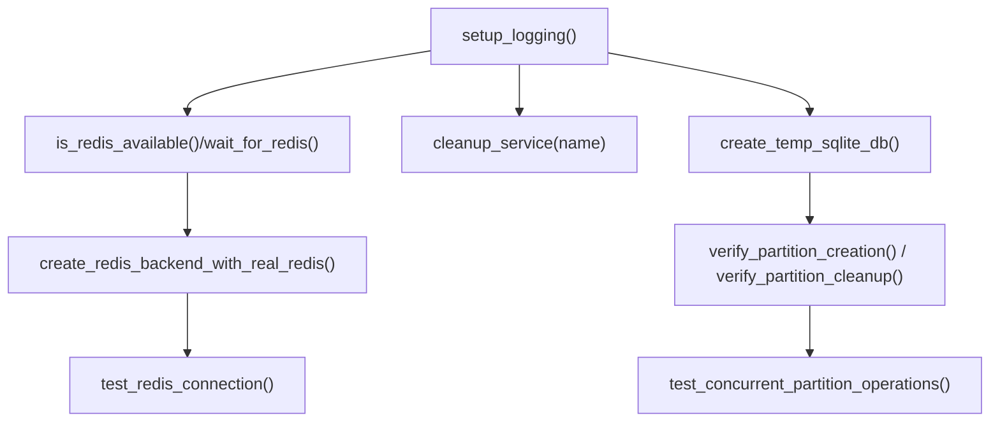
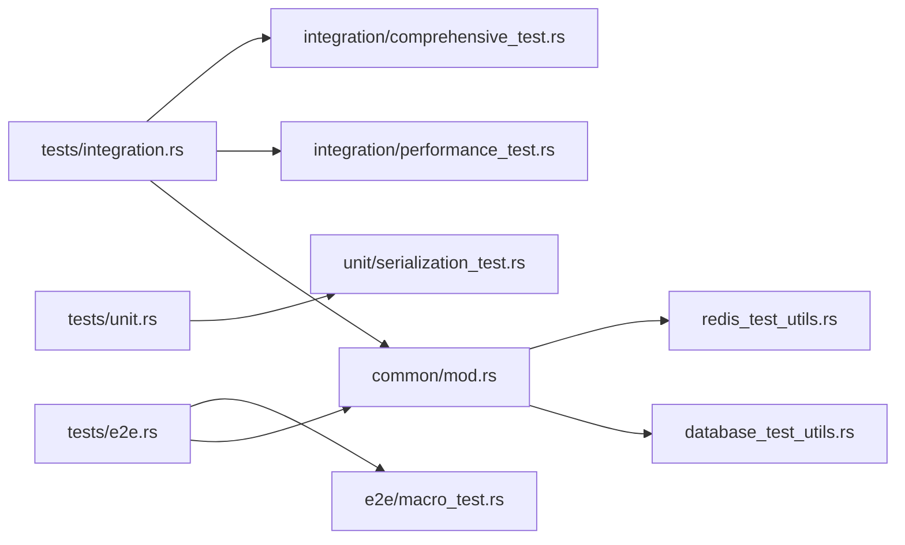
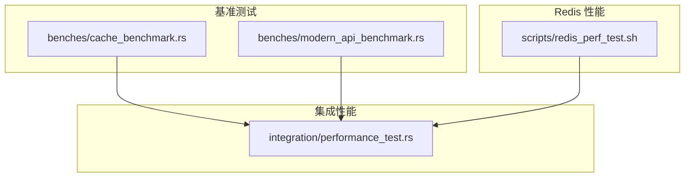

# 测试指南

<cite>
**本文引用的文件**
- [Cargo.toml](file://Cargo.toml)
- [tests/TEST_CATEGORIES.md](file://tests/TEST_CATEGORIES.md)
- [tests/integration.rs](file://tests/integration.rs)
- [tests/unit.rs](file://tests/unit.rs)
- [tests/e2e.rs](file://tests/e2e.rs)
- [tests/common/mod.rs](file://tests/common/mod.rs)
- [tests/common/redis_test_utils.rs](file://tests/common/redis_test_utils.rs)
- [tests/common/database_test_utils.rs](file://tests/common/database_test_utils.rs)
- [tests/integration/comprehensive_test.rs](file://tests/integration/comprehensive_test.rs)
- [tests/integration/performance_test.rs](file://tests/integration/performance_test.rs)
- [tests/unit/serialization_test.rs](file://tests/unit/serialization_test.rs)
- [tests/chaos/random_failure_test.rs](file://tests/chaos/random_failure_test.rs)
- [tests/e2e/macro_test.rs](file://tests/e2e/macro_test.rs)
- [scripts/run_all_tests.sh](file://scripts/run_all_tests.sh)
- [scripts/precommit_tests.sh](file://scripts/precommit_tests.sh)
- [scripts/real_redis_test.sh](file://scripts/real_redis_test.sh)
- [scripts/redis_perf_test.sh](file://scripts/redis_perf_test.sh)
- [benches/cache_benchmark.rs](file://benches/cache_benchmark.rs)
- [benches/modern_api_benchmark.rs](file://benches/modern_api_benchmark.rs)
- [tests/real_env/docker-compose.cluster.yml](file://tests/real_env/docker-compose.cluster.yml)
- [tests/real_env/docker-compose.sentinel.yml](file://tests/real_env/docker-compose.sentinel.yml)
</cite>

## 目录
1. [简介](#简介)
2. [项目结构](#项目结构)
3. [核心组件](#核心组件)
4. [架构总览](#架构总览)
5. [详细组件分析](#详细组件分析)
6. [依赖分析](#依赖分析)
7. [性能考量](#性能考量)
8. [故障排查指南](#故障排查指南)
9. [结论](#结论)
10. [附录](#附录)

## 简介
本指南系统梳理 Oxcache 的测试策略与工具链，覆盖单元测试、集成测试、端到端测试与性能基准测试；明确测试分类体系（功能、性能、安全、兼容性等）；给出测试环境搭建方法（Redis、数据库、测试数据生成）；介绍自动化测试执行与报告生成；提供测试用例编写规范与最佳实践；说明测试数据管理与清理机制；并给出测试失败诊断与调试方法，以及持续集成与自动化测试配置建议。

## 项目结构
测试相关文件组织清晰，采用按“测试类型 + 功能域”分层布局：
- tests/TEST_CATEGORIES.md：测试分类与目录结构说明
- tests/unit.rs、tests/integration.rs、tests/e2e.rs：各类型测试模块入口
- tests/common/：公共测试工具（日志、Redis/数据库工具、资源清理）
- tests/integration/*、tests/chaos/*、tests/e2e/*：具体测试用例
- benches/*：性能基准测试
- scripts/*：测试运行脚本与环境准备脚本

**图表来源**
- [tests/TEST_CATEGORIES.md](file://tests/TEST_CATEGORIES.md#L1-L177)
- [tests/unit.rs](file://tests/unit.rs#L1-L15)
- [tests/integration.rs](file://tests/integration.rs#L1-L55)
- [tests/e2e.rs](file://tests/e2e.rs#L1-L15)
- [tests/common/mod.rs](file://tests/common/mod.rs#L1-L184)
- [tests/common/redis_test_utils.rs](file://tests/common/redis_test_utils.rs#L1-L77)
- [tests/common/database_test_utils.rs](file://tests/common/database_test_utils.rs#L1-L254)

**章节来源**
- [tests/TEST_CATEGORIES.md](file://tests/TEST_CATEGORIES.md#L1-L177)
- [tests/unit.rs](file://tests/unit.rs#L1-L15)
- [tests/integration.rs](file://tests/integration.rs#L1-L55)
- [tests/e2e.rs](file://tests/e2e.rs#L1-L15)

## 核心组件
- 测试分类与入口
  - 单元测试：集中于功能与序列化等纯内存逻辑
  - 集成测试：覆盖缓存核心流程、Redis/数据库集成、性能与安全等
  - 端到端测试：面向用户使用场景的完整流程验证
  - 混沌测试：模拟真实环境故障与并发挑战
- 公共测试工具
  - 日志初始化、Redis可用性检测、Redis连接测试、服务资源清理
  - 数据库分区工具（临时SQLite、分区创建/清理、并发分区操作）

**章节来源**
- [tests/TEST_CATEGORIES.md](file://tests/TEST_CATEGORIES.md#L63-L111)
- [tests/common/mod.rs](file://tests/common/mod.rs#L18-L184)
- [tests/common/redis_test_utils.rs](file://tests/common/redis_test_utils.rs#L1-L77)
- [tests/common/database_test_utils.rs](file://tests/common/database_test_utils.rs#L1-L254)

## 架构总览
测试架构围绕“模块化入口 + 公共工具 + 场景化用例”的三层设计：
- 入口模块：tests/unit.rs、tests/integration.rs、tests/e2e.rs 通过 #[path] 组织具体测试文件
- 公共工具：tests/common 提供日志、Redis/数据库工具与资源清理
- 用例模块：按功能域细分（缓存核心、配置、数据库、序列化、同步、安全、恢复、性能等）

**图表来源**
- [tests/unit.rs](file://tests/unit.rs#L1-L15)
- [tests/integration.rs](file://tests/integration.rs#L1-L55)
- [tests/e2e.rs](file://tests/e2e.rs#L1-L15)
- [tests/common/mod.rs](file://tests/common/mod.rs#L1-L184)
- [tests/common/redis_test_utils.rs](file://tests/common/redis_test_utils.rs#L1-L77)
- [tests/common/database_test_utils.rs](file://tests/common/database_test_utils.rs#L1-L254)
- [tests/integration/comprehensive_test.rs](file://tests/integration/comprehensive_test.rs#L1-L139)
- [tests/integration/performance_test.rs](file://tests/integration/performance_test.rs#L1-L99)
- [tests/e2e/macro_test.rs](file://tests/e2e/macro_test.rs#L1-L104)
- [tests/unit/serialization_test.rs](file://tests/unit/serialization_test.rs#L1-L52)
- [tests/chaos/random_failure_test.rs](file://tests/chaos/random_failure_test.rs#L1-L138)

## 详细组件分析

### 单元测试：序列化功能
- 目标：验证序列化器的往返一致性与压缩功能
- 关键点：使用 Serializer trait 的具体实现（如 JSON），构造结构化数据进行序列化/反序列化断言
- 断言策略：相等性比较、可逆性校验

**图表来源**
- [tests/unit/serialization_test.rs](file://tests/unit/serialization_test.rs#L17-L51)

**章节来源**
- [tests/unit/serialization_test.rs](file://tests/unit/serialization_test.rs#L1-L52)

### 集成测试：综合功能与生命周期
- 目标：验证新 API 的基本 CRUD、类型多样性、边界条件与清理流程
- 关键点：Cache::memory() 或 Cache::builder() 创建实例，批量写入/读取/删除，clear() 清理，断言存在性与空值

**图表来源**
- [tests/integration/comprehensive_test.rs](file://tests/integration/comprehensive_test.rs#L12-L139)

**章节来源**
- [tests/integration/comprehensive_test.rs](file://tests/integration/comprehensive_test.rs#L1-L139)

### 集成测试：性能与回填延迟
- 目标：验证 L1 未命中时从 L2 回填的延迟是否满足 NF2（<5ms）
- 关键点：is_redis_available() 条件执行；clear() 模拟 L1 失效；记录 get() 耗时并断言阈值

**图表来源**
- [tests/integration/performance_test.rs](file://tests/integration/performance_test.rs#L19-L98)

**章节来源**
- [tests/integration/performance_test.rs](file://tests/integration/performance_test.rs#L1-L99)

### 端到端测试：宏端到端
- 目标：覆盖基本 CRUD、结构化数据缓存、批量操作与清理
- 关键点：Cache::new() 创建实例；对结构体 User 进行序列化存储与读取；批量写入/读取断言

**图表来源**
- [tests/e2e/macro_test.rs](file://tests/e2e/macro_test.rs#L20-L103)

**章节来源**
- [tests/e2e/macro_test.rs](file://tests/e2e/macro_test.rs#L1-L104)

### 混沌测试：随机故障与并发
- 目标：验证在真实 Redis 环境下，缓存在随机故障与并发场景下的稳定性与恢复能力
- 关键点：忽略标记用于真实环境；并发写入、存在性检查、删除后验证

**图表来源**
- [tests/chaos/random_failure_test.rs](file://tests/chaos/random_failure_test.rs#L18-L137)

**章节来源**
- [tests/chaos/random_failure_test.rs](file://tests/chaos/random_failure_test.rs#L1-L138)

### 公共测试工具：Redis/数据库与资源清理
- Redis 工具：可用性检测、连接测试、等待可用、URL 生成与清理辅助
- 数据库工具：分区配置、临时 SQLite、分区创建/清理、并发分区操作、SQL 注入防护
- 资源清理：服务名唯一化、WAL/SQLite 文件清理

**图表来源**
- [tests/common/mod.rs](file://tests/common/mod.rs#L18-L184)
- [tests/common/redis_test_utils.rs](file://tests/common/redis_test_utils.rs#L17-L76)
- [tests/common/database_test_utils.rs](file://tests/common/database_test_utils.rs#L42-L253)

**章节来源**
- [tests/common/mod.rs](file://tests/common/mod.rs#L1-L184)
- [tests/common/redis_test_utils.rs](file://tests/common/redis_test_utils.rs#L1-L77)
- [tests/common/database_test_utils.rs](file://tests/common/database_test_utils.rs#L1-L254)

## 依赖分析
- 测试入口与组织
  - tests/unit.rs、tests/integration.rs、tests/e2e.rs 通过 #[path] 声明具体测试文件，形成模块化组织
- 公共依赖
  - tokio::test、crate::common 导入与 is_redis_available() 条件执行
- 开发依赖
  - criterion 用于性能基准测试；tempfile、serial_test、rand、ctor、mockall 用于测试增强

**图表来源**
- [tests/integration.rs](file://tests/integration.rs#L1-L55)
- [tests/e2e.rs](file://tests/e2e.rs#L1-L15)
- [tests/unit.rs](file://tests/unit.rs#L1-L15)
- [tests/common/mod.rs](file://tests/common/mod.rs#L1-L184)
- [tests/common/redis_test_utils.rs](file://tests/common/redis_test_utils.rs#L1-L77)
- [tests/common/database_test_utils.rs](file://tests/common/database_test_utils.rs#L1-L254)

**章节来源**
- [tests/integration.rs](file://tests/integration.rs#L1-L55)
- [tests/e2e.rs](file://tests/e2e.rs#L1-L15)
- [tests/unit.rs](file://tests/unit.rs#L1-L15)
- [Cargo.toml](file://Cargo.toml#L216-L222)

## 性能考量
- 基准测试
  - benches/cache_benchmark.rs：L1 缓存 SET/GET、不同数据大小、批量操作
  - benches/modern_api_benchmark.rs：新 API 的 GET/SET/GET_OR_SET、不同数据大小、顺序与吞吐量
- 性能测试
  - integration/performance_test.rs：回填延迟（NF2）、Redis 故障降级路径验证
- Redis 性能脚本
  - scripts/redis_perf_test.sh：PING/SET/GET/INCR/Pipeline 基准，评估延迟与吞吐

**图表来源**
- [benches/cache_benchmark.rs](file://benches/cache_benchmark.rs#L1-L100)
- [benches/modern_api_benchmark.rs](file://benches/modern_api_benchmark.rs#L1-L158)
- [tests/integration/performance_test.rs](file://tests/integration/performance_test.rs#L1-L99)
- [scripts/redis_perf_test.sh](file://scripts/redis_perf_test.sh#L1-L111)

**章节来源**
- [benches/cache_benchmark.rs](file://benches/cache_benchmark.rs#L1-L100)
- [benches/modern_api_benchmark.rs](file://benches/modern_api_benchmark.rs#L1-L158)
- [tests/integration/performance_test.rs](file://tests/integration/performance_test.rs#L1-L99)
- [scripts/redis_perf_test.sh](file://scripts/redis_perf_test.sh#L1-L111)

## 故障排查指南
- 快速定位
  - precommit_tests.sh：快速单元测试钩子，带排障提示（查看完整输出、编译检查、单测调试、跳过测试）
- 日志与环境
  - common::setup_logging() 初始化日志；is_redis_available()/wait_for_redis() 检查 Redis 可用性
- 常见问题
  - Redis 不可用：检查 REDIS_URL/OXCACHE_ALLOW_INSECURE_REDIS 环境变量；使用 wait_for_redis() 等待
  - 数据库分区：注意表名校验与 Docker 命令执行；使用 verify_partition_creation()/verify_partition_cleanup()
  - 资源清理：cleanup_service() 删除 WAL/SQLite 文件；避免跨测试干扰

**章节来源**
- [scripts/precommit_tests.sh](file://scripts/precommit_tests.sh#L1-L52)
- [tests/common/mod.rs](file://tests/common/mod.rs#L18-L184)
- [tests/common/database_test_utils.rs](file://tests/common/database_test_utils.rs#L55-L205)

## 结论
Oxcache 的测试体系以模块化入口与公共工具为核心，覆盖单元、集成、端到端与性能基准测试，结合混沌测试与真实环境脚本，形成从功能到性能、从单机到分布式、从开发到生产的全链路保障。通过统一的日志与资源管理、条件化的外部依赖检查、完善的报告与排障指引，能够高效支撑高质量交付与持续演进。

## 附录

### 测试分类与实施方法
- 功能测试
  - 单元：序列化、类型与边界条件
  - 集成：缓存核心流程、配置、数据库分区、同步机制
  - 端到端：用户场景的完整流程
- 性能测试
  - 基准：criterion；集成：回填延迟、Redis 压力测试
- 安全测试
  - 安全防护（Lua/SCAN 防护）与安全审计脚本
- 兼容性测试
  - Redis 版本兼容性测试、Sentinel/Cluster 真实环境测试

**章节来源**
- [tests/TEST_CATEGORIES.md](file://tests/TEST_CATEGORIES.md#L63-L111)
- [scripts/real_redis_test.sh](file://scripts/real_redis_test.sh#L1-L462)

### 测试环境搭建
- Redis 实例
  - 本地 Redis：通过 REDIS_URL 或 OXCACHE_ALLOW_INSECURE_REDIS 控制 URL；使用 wait_for_redis() 等待可用
  - Sentinel/Cluster：使用 docker-compose 配置与 real_redis_test.sh 启停环境
- 数据库准备
  - 临时 SQLite：create_temp_sqlite_db()；分区验证：verify_partition_creation()/verify_partition_cleanup()
- 测试数据生成
  - 使用临时文件与随机服务名；并发场景使用 tokio::spawn 并发任务

**章节来源**
- [tests/common/mod.rs](file://tests/common/mod.rs#L45-L184)
- [tests/common/database_test_utils.rs](file://tests/common/database_test_utils.rs#L111-L253)
- [tests/real_env/docker-compose.cluster.yml](file://tests/real_env/docker-compose.cluster.yml)
- [tests/real_env/docker-compose.sentinel.yml](file://tests/real_env/docker-compose.sentinel.yml)

### 测试工具与脚本
- 自动化执行
  - run_all_tests.sh：并行/串行运行单元/集成/安全/内存/兼容性/代码质量检查，生成汇总报告
  - precommit_tests.sh：Git 预提交快速单元测试
  - real_redis_test.sh：Sentinel/Cluster 真实环境测试与压力测试
  - redis_perf_test.sh：Redis 基准性能测试
- 覆盖率统计
  - 仓库未内置覆盖率脚本；可在 CI 中引入 cargo-tarpaulin 或其它覆盖率工具

**章节来源**
- [scripts/run_all_tests.sh](file://scripts/run_all_tests.sh#L1-L388)
- [scripts/precommit_tests.sh](file://scripts/precommit_tests.sh#L1-L52)
- [scripts/real_redis_test.sh](file://scripts/real_redis_test.sh#L1-L462)
- [scripts/redis_perf_test.sh](file://scripts/redis_perf_test.sh#L1-L111)

### 测试用例编写指南与最佳实践
- 组织结构
  - 使用 #[path] 声明测试文件；在对应入口模块注册
  - 公共工具统一导入：use crate::common::{is_redis_available, setup_logging}
- 条件执行
  - 对外部依赖（Redis/数据库）使用 is_redis_available() 判断；必要时使用 #[ignore] 标记
- 断言策略
  - 功能：相等性、存在性、空值；性能：阈值断言；安全：注入防护有效性
- 并发与清理
  - 并发场景使用 tokio::spawn；测试结束清理临时文件与缓存数据

**章节来源**
- [tests/TEST_CATEGORIES.md](file://tests/TEST_CATEGORIES.md#L138-L177)
- [tests/integration/comprehensive_test.rs](file://tests/integration/comprehensive_test.rs#L1-L139)
- [tests/chaos/random_failure_test.rs](file://tests/chaos/random_failure_test.rs#L1-L138)

### 测试数据管理与清理机制
- 服务资源清理：cleanup_service() 删除 WAL/SQLite 文件
- Redis 测试键清理：cleanup_test_keys()（占位实现，便于扩展）
- 数据库清理：verify_partition_cleanup() 与 Docker 命令清理

**章节来源**
- [tests/common/mod.rs](file://tests/common/mod.rs#L168-L183)
- [tests/common/redis_test_utils.rs](file://tests/common/redis_test_utils.rs#L73-L76)
- [tests/common/database_test_utils.rs](file://tests/common/database_test_utils.rs#L147-L205)

### 持续集成与自动化测试配置
- 建议流水线阶段
  - 代码质量：cargo fmt --check、cargo clippy -- -D warnings、cargo doc
  - 单元测试：cargo test --lib
  - 集成测试：cargo test --test '*'（可按需拆分）
  - 性能测试：benches/*（可选）
  - 安全审计：独立脚本或工具
  - 真实环境：real_redis_test.sh（可选）
- 报告与归档
  - run_all_tests.sh 生成 Markdown 报告；CI 可上传 artifacts

**章节来源**
- [scripts/run_all_tests.sh](file://scripts/run_all_tests.sh#L214-L261)
- [Cargo.toml](file://Cargo.toml#L374-L377)
