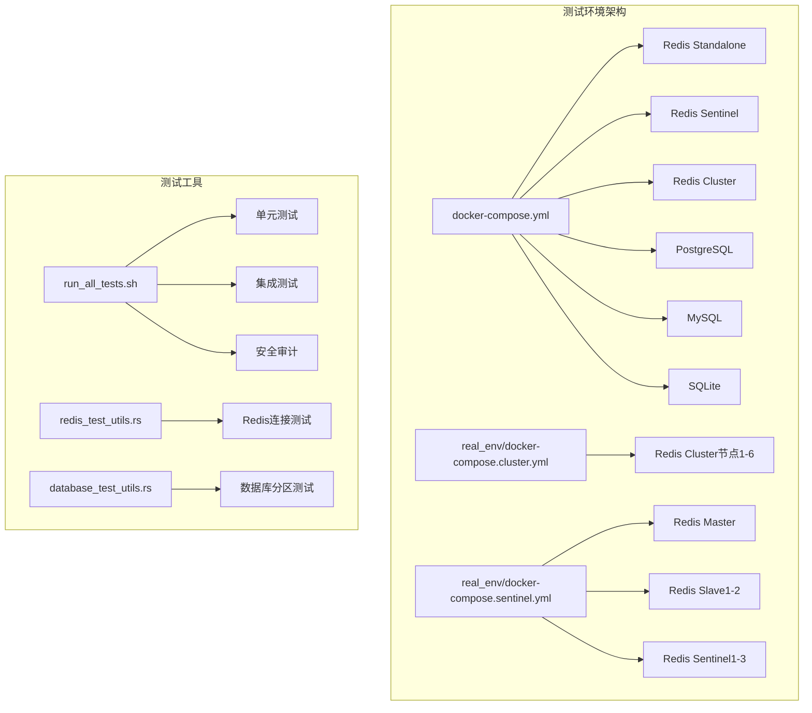
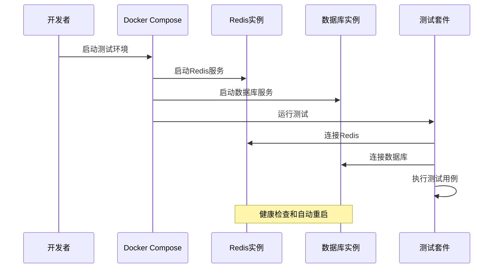
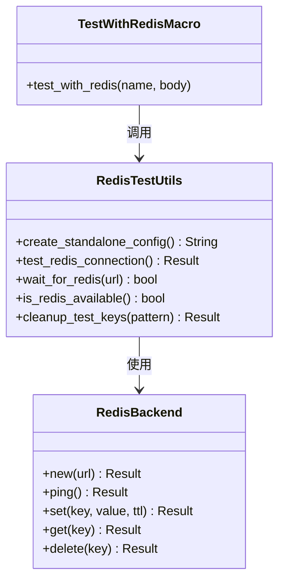
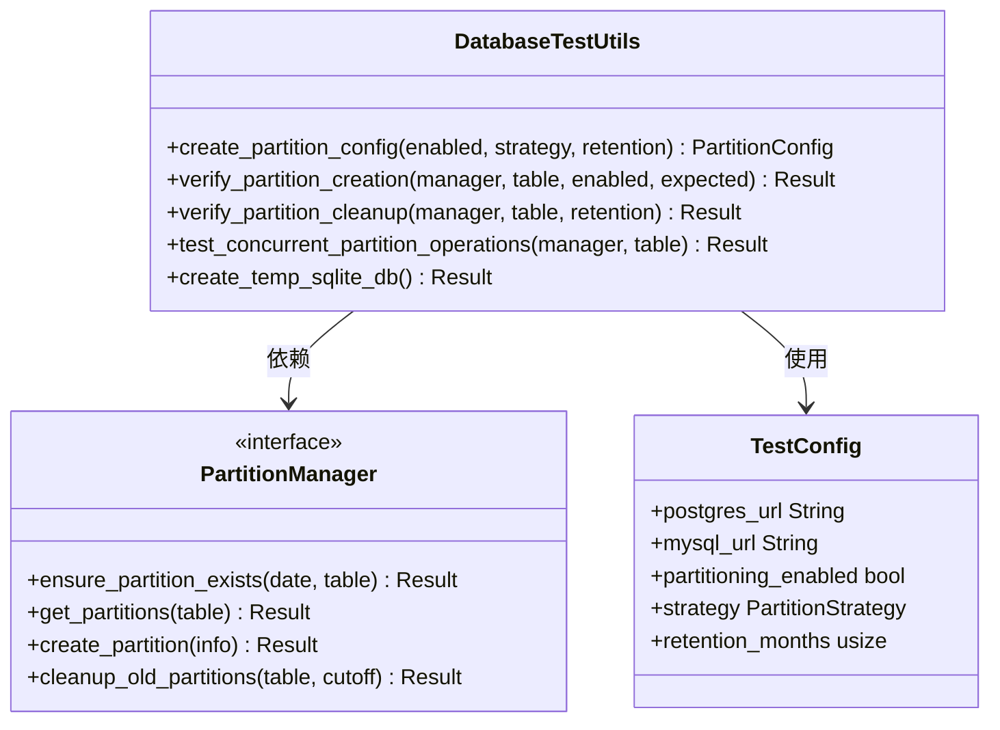
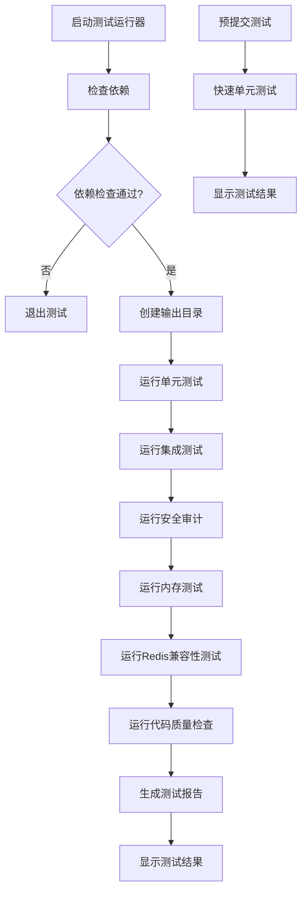
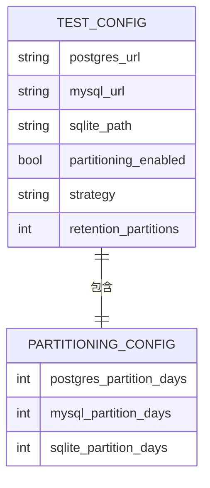
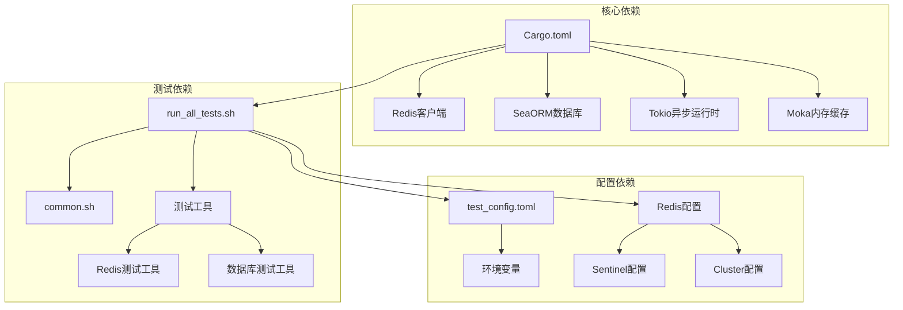

# 测试环境搭建

<cite>
**本文档引用的文件**
- [docker-compose.yml](file://docker-compose.yml)
- [docker-compose.cluster.yml](file://tests/real_env/docker-compose.cluster.yml)
- [docker-compose.sentinel.yml](file://tests/real_env/docker-compose.sentinel.yml)
- [redis-master.conf](file://tests/real_env/configs/redis-master.conf)
- [redis-cluster-node1.conf](file://tests/real_env/configs/redis-cluster-node1.conf)
- [run_all_tests.sh](file://scripts/run_all_tests.sh)
- [precommit_tests.sh](file://scripts/precommit_tests.sh)
- [common.sh](file://scripts/lib/common.sh)
- [redis_test_utils.rs](file://tests/redis_test_utils.rs)
- [redis_test_utils.rs](file://tests/common/redis_test_utils.rs)
- [database_test_utils.rs](file://tests/database_test_utils.rs)
- [database_test_utils.rs](file://tests/common/database_test_utils.rs)
- [test_config.toml](file://tests/test_config.toml)
- [Cargo.toml](file://Cargo.toml)
- [redis_test.rs](file://tests/integration/redis_test.rs)
</cite>

## 目录
1. [简介](#简介)
2. [项目结构](#项目结构)
3. [核心组件](#核心组件)
4. [架构概览](#架构概览)
5. [详细组件分析](#详细组件分析)
6. [依赖关系分析](#依赖关系分析)
7. [性能考虑](#性能考虑)
8. [故障排除指南](#故障排除指南)
9. [结论](#结论)

## 简介

Oxcache 项目的测试环境搭建是一个完整的容器化测试基础设施，支持多种 Redis 部署模式和数据库集成测试。该系统提供了从本地开发到生产级别的全面测试覆盖，包括单机 Redis、Redis Sentinel 高可用集群和 Redis Cluster 分布式集群。

测试环境的核心特点包括：
- 多种 Redis 部署模式支持
- 容器化数据库环境
- 自动化的测试数据管理
- 完整的测试报告生成
- 灵活的配置管理系统

## 项目结构

测试环境主要由以下组件构成：



**图表来源**
- [docker-compose.yml](file://docker-compose.yml#L1-L199)
- [docker-compose.cluster.yml](file://tests/real_env/docker-compose.cluster.yml#L1-L169)
- [docker-compose.sentinel.yml](file://tests/real_env/docker-compose.sentinel.yml#L1-L135)

**章节来源**
- [docker-compose.yml](file://docker-compose.yml#L1-L199)
- [docker-compose.cluster.yml](file://tests/real_env/docker-compose.cluster.yml#L1-L169)
- [docker-compose.sentinel.yml](file://tests/real_env/docker-compose.sentinel.yml#L1-L135)

## 核心组件

### Redis 测试环境

测试环境提供了三种 Redis 部署模式：

#### 单机模式 (Standalone)
- 端口映射：6379:6379
- 健康检查：每5秒ping一次
- 最大重试次数：5次

#### Sentinel 高可用模式
- 主节点：redis-master (端口 16379)
- 从节点：redis-slave-1, redis-slave-2 (端口 16380, 16381)
- 哨兵节点：sentinel-1, sentinel-2, sentinel-3 (端口 26379, 26380, 26381)
- 配置文件：独立的 Redis 和 Sentinel 配置

#### Cluster 分布式模式
- 使用 grokzen/redis-cluster 镜像
- 6个Redis节点 (7000-7005)
- 自动集群创建和配置

**章节来源**
- [docker-compose.yml](file://docker-compose.yml#L7-L134)
- [docker-compose.cluster.yml](file://tests/real_env/docker-compose.cluster.yml#L8-L125)
- [docker-compose.sentinel.yml](file://tests/real_env/docker-compose.sentinel.yml#L8-L120)

### 数据库测试环境

测试环境集成了多种数据库系统：

#### PostgreSQL 配置
- 数据库名称：oxcache_test
- 用户名：postgres
- 密码：postgres
- 端口：5432
- 存储卷：postgres_data

#### MySQL 配置
- 数据库名称：oxcache_test
- 用户名：mysql
- 密码：mysql
- 端口：3306
- 存储卷：mysql_data

#### SQLite 配置
- 文件存储：/data/oxcache_test.db
- 存储卷：sqlite_data
- 自动初始化：VACUUM操作

**章节来源**
- [docker-compose.yml](file://docker-compose.yml#L138-L193)
- [test_config.toml](file://tests/test_config.toml#L1-L32)

## 架构概览

测试环境采用容器化架构，通过 Docker Compose 管理多个服务实例：



**图表来源**
- [docker-compose.yml](file://docker-compose.yml#L12-L174)
- [run_all_tests.sh](file://scripts/run_all_tests.sh#L94-L136)

## 详细组件分析

### 测试工具组件

#### Redis 测试工具

Redis 测试工具提供了完整的连接和验证功能：



**图表来源**
- [redis_test_utils.rs](file://tests/redis_test_utils.rs#L15-L232)
- [redis_test_utils.rs](file://tests/common/redis_test_utils.rs#L17-L77)

#### 数据库测试工具

数据库测试工具提供了分区管理和并发操作测试：



**图表来源**
- [database_test_utils.rs](file://tests/database_test_utils.rs#L42-L239)
- [database_test_utils.rs](file://tests/common/database_test_utils.rs#L42-L254)

**章节来源**
- [redis_test_utils.rs](file://tests/redis_test_utils.rs#L1-L232)
- [database_test_utils.rs](file://tests/database_test_utils.rs#L1-L239)

### 测试运行器

综合测试运行器提供了完整的测试执行流程：



**图表来源**
- [run_all_tests.sh](file://scripts/run_all_tests.sh#L315-L388)
- [precommit_tests.sh](file://scripts/precommit_tests.sh#L1-L52)

**章节来源**
- [run_all_tests.sh](file://scripts/run_all_tests.sh#L1-L388)
- [precommit_tests.sh](file://scripts/precommit_tests.sh#L1-L52)

### 配置管理系统

测试配置采用 TOML 格式，支持环境变量替换：



**图表来源**
- [test_config.toml](file://tests/test_config.toml#L1-L32)

**章节来源**
- [test_config.toml](file://tests/test_config.toml#L1-L32)

## 依赖关系分析

测试环境的依赖关系复杂且层次分明：



**图表来源**
- [Cargo.toml](file://Cargo.toml#L235-L346)
- [run_all_tests.sh](file://scripts/run_all_tests.sh#L74-L86)
- [redis-master.conf](file://tests/real_env/configs/redis-master.conf#L1-L63)

**章节来源**
- [Cargo.toml](file://Cargo.toml#L235-L346)
- [run_all_tests.sh](file://scripts/run_all_tests.sh#L74-L86)

## 性能考虑

测试环境在设计时充分考虑了性能优化：

### Redis 性能配置
- 最大内存限制：256MB
- 内存淘汰策略：allkeys-lru
- AOF持久化：启用
- 网络优化：TCP_NODELAY禁用

### 数据库性能配置
- PostgreSQL：16个数据库实例
- MySQL：8.0版本优化
- SQLite：文件级存储优化

### 测试性能优化
- 并行测试执行
- 超时控制机制
- 内存使用监控
- 资源清理机制

## 故障排除指南

### 常见问题及解决方案

#### Redis连接问题
1. **检查Redis服务状态**
   ```bash
   docker ps | grep redis
   ```

2. **验证端口映射**
   ```bash
   netstat -tulpn | grep 6379
   ```

3. **检查健康检查**
   ```bash
   docker inspect oxcache-redis-standalone | grep Health
   ```

#### 数据库连接问题
1. **PostgreSQL连接**
   ```bash
   psql -h localhost -p 5432 -U postgres -d oxcache_test
   ```

2. **MySQL连接**
   ```bash
   mysql -h localhost -P 3306 -u mysql -p
   ```

3. **SQLite文件权限**
   ```bash
   ls -la /tmp/oxcache_test.db
   ```

#### 测试环境启动问题
1. **Docker服务检查**
   ```bash
   docker-compose --version
   docker info
   ```

2. **端口冲突检查**
   ```bash
   lsof -i :6379
   lsof -i :5432
   lsof -i :3306
   ```

3. **存储空间检查**
   ```bash
   df -h
   docker system df
   ```

### 调试技巧

#### 启用详细日志
```bash
export RUST_LOG=debug
cargo test --lib -- --nocapture
```

#### 快速测试定位
```bash
# 运行特定测试
cargo test test_name

# 查看测试输出
cargo test --lib -- --nocapture | grep -A 10 -B 5 "FAILED"
```

#### 内存泄漏检测
```bash
./scripts/memory_test.sh -m all -o memory_reports
```

**章节来源**
- [precommit_tests.sh](file://scripts/precommit_tests.sh#L24-L48)

## 结论

Oxcache 项目的测试环境搭建展现了现代软件测试基础设施的最佳实践。通过容器化部署、自动化测试工具和完善的配置管理，该系统为开发者提供了强大而灵活的测试能力。

主要优势包括：
- **多模式支持**：单机、Sentinel、Cluster三种Redis部署模式
- **自动化程度高**：Docker Compose自动管理服务生命周期
- **测试覆盖全面**：从单元测试到集成测试的完整流程
- **配置灵活**：支持环境变量和配置文件的组合使用
- **易于维护**：清晰的组件分离和依赖管理

该测试环境不仅满足当前的开发需求，也为未来的功能扩展和技术演进奠定了坚实基础。
