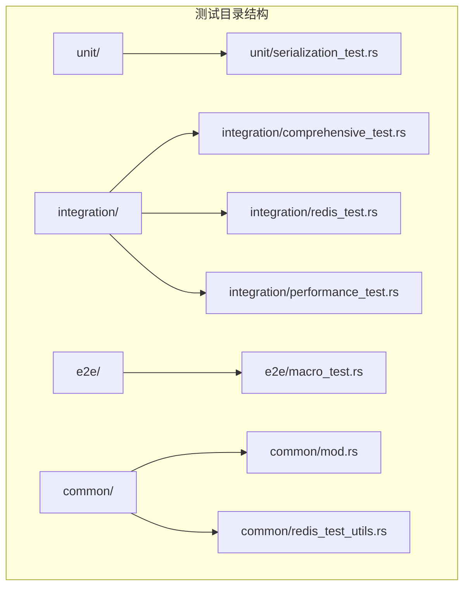
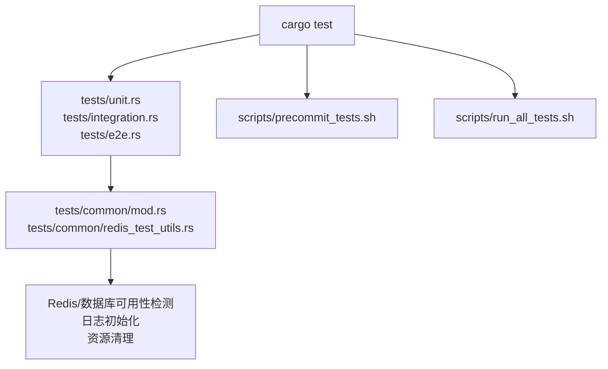
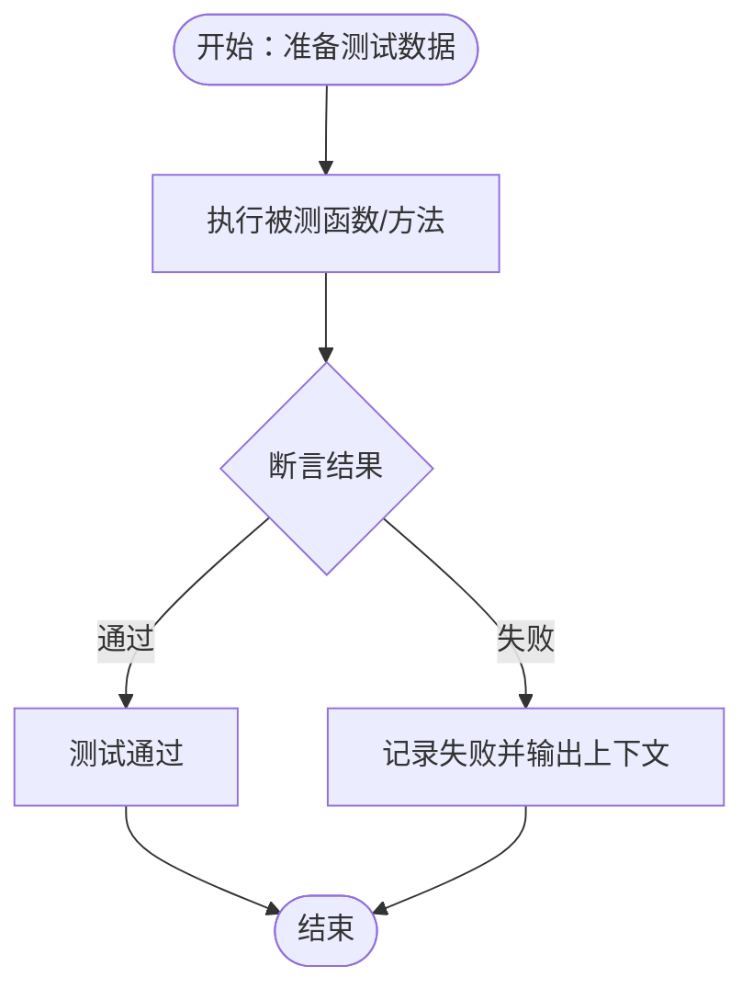
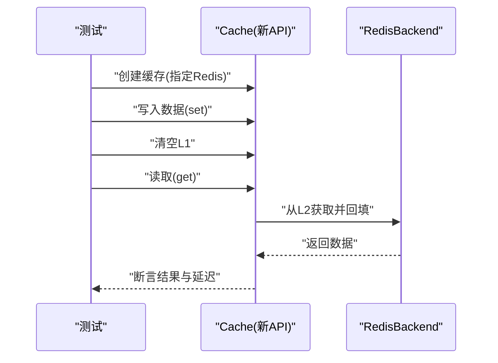
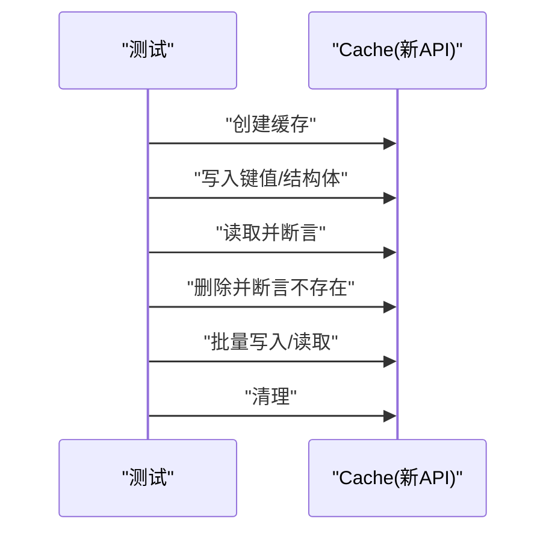
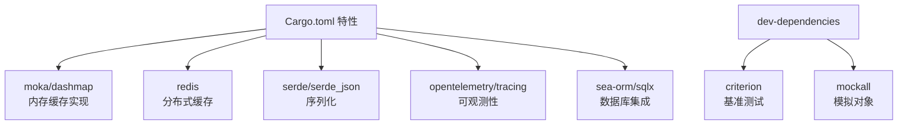

# 测试用例编写指南

<cite>
**本文引用的文件**
- [测试组织指南](file://tests/TEST_CATEGORIES.md)
- [单元测试模块入口](file://tests/unit.rs)
- [集成测试模块入口](file://tests/integration.rs)
- [端到端测试模块入口](file://tests/e2e.rs)
- [Cargo.toml](file://Cargo.toml)
- [测试通用工具模块](file://tests/common/mod.rs)
- [Redis测试工具](file://tests/common/redis_test_utils.rs)
- [单元测试：序列化](file://tests/unit/serialization_test.rs)
- [集成测试：综合功能](file://tests/integration/comprehensive_test.rs)
- [端到端测试：宏测试](file://tests/e2e/macro_test.rs)
- [集成测试：Redis](file://tests/integration/redis_test.rs)
- [集成测试：性能](file://tests/integration/performance_test.rs)
- [预提交测试脚本](file://scripts/precommit_tests.sh)
- [综合测试运行器](file://scripts/run_all_tests.sh)
</cite>

## 目录
1. [引言](#引言)
2. [项目结构](#项目结构)
3. [核心组件](#核心组件)
4. [架构概览](#架构概览)
5. [详细组件分析](#详细组件分析)
6. [依赖分析](#依赖分析)
7. [性能考虑](#性能考虑)
8. [故障排查指南](#故障排查指南)
9. [结论](#结论)
10. [附录](#附录)

## 引言
本指南面向 Oxcache 项目的测试编写与维护，覆盖单元测试、集成测试与端到端测试的编写要点，测试数据准备与管理（含测试夹具与模拟对象）、测试覆盖率统计与要求、测试维护与重构建议，以及测试代码审查与质量保障措施。内容基于仓库内现有测试组织、工具与脚本，结合 Cargo 特性与测试运行方式，形成可操作的最佳实践。

## 项目结构
Oxcache 的测试采用按“测试类别”分层组织的方式，配合模块入口文件集中声明，便于统一运行与维护。

- tests/
  - common/：公共测试工具与夹具（日志、Redis/数据库可用性检测、资源清理等）
  - unit/：单元测试（独立、无外部依赖）
  - integration/：集成测试（跨组件交互、外部服务）
  - e2e/：端到端测试（完整用户工作流）
  - chaos/：混沌工程测试（故障注入）
  - 各类专项测试文件：配置、数据库、安全、性能、内存泄漏、特性组合等

图表来源
- [测试组织指南](file://tests/TEST_CATEGORIES.md#L9-L61)
- [单元测试模块入口](file://tests/unit.rs#L10-L11)
- [集成测试模块入口](file://tests/integration.rs#L10-L57)
- [端到端测试模块入口](file://tests/e2e.rs#L10-L11)

章节来源
- [测试组织指南](file://tests/TEST_CATEGORIES.md#L7-L61)
- [单元测试模块入口](file://tests/unit.rs#L10-L11)
- [集成测试模块入口](file://tests/integration.rs#L10-L57)
- [端到端测试模块入口](file://tests/e2e.rs#L10-L11)

## 核心组件
- 测试组织与入口
  - 单元测试入口：tests/unit.rs
  - 集成测试入口：tests/integration.rs
  - 端到端测试入口：tests/e2e.rs
- 公共测试工具
  - 日志初始化、缓存创建、Redis/数据库可用性检测、等待可用、唯一服务名生成、资源清理等
- 测试运行与脚本
  - 预提交快速测试脚本（限制线程、超时、仅运行快速单元测试）
  - 综合测试运行器（并行/串行、超时、报告生成）

章节来源
- [测试通用工具模块](file://tests/common/mod.rs#L18-L183)
- [预提交测试脚本](file://scripts/precommit_tests.sh#L9-L51)
- [综合测试运行器](file://scripts/run_all_tests.sh#L93-L212)

## 架构概览
测试体系围绕“模块入口 + 类别目录 + 公共工具”的结构展开，测试运行通过 cargo test 与自定义脚本协同完成。外部依赖（如 Redis）通过环境变量与工具函数进行可用性判断与等待，确保测试稳定性与可重复性。

图表来源
- [集成测试模块入口](file://tests/integration.rs#L10-L57)
- [测试通用工具模块](file://tests/common/mod.rs#L18-L183)
- [预提交测试脚本](file://scripts/precommit_tests.sh#L9-L51)
- [综合测试运行器](file://scripts/run_all_tests.sh#L93-L212)

## 详细组件分析

### 单元测试编写要点
- 设计原则
  - 隔离性强：不依赖外部服务，专注单一组件行为
  - 可重复：使用确定性输入与断言，避免随机性
  - 可读性：测试命名清晰表达意图，前置条件明确
- 命名规范
  - 使用 test_xxx 形式，描述具体行为或边界场景
  - 对于复杂场景，拆分为多个小测试，分别覆盖不同分支
- 断言方法
  - 使用标准断言验证返回值、错误类型、数据一致性
  - 对于序列化/反序列化，验证往返一致性
- 示例参考
  - 序列化单元测试：验证 JSON 序列化器的往返与压缩功能

图表来源
- [单元测试：序列化](file://tests/unit/serialization_test.rs#L17-L51)

章节来源
- [单元测试：序列化](file://tests/unit/serialization_test.rs#L10-L51)

### 集成测试编写要点
- 设计原则
  - 覆盖跨组件交互：L1/L2 缓存协作、后端选择、指标与恢复
  - 外部依赖管理：Redis/数据库可用性检测、等待、清理
  - 场景完整性：基本 CRUD、批量操作、错误处理、降级策略
- 命名规范
  - test_category_operation 表达功能域与操作
  - 对性能相关测试，标注性能目标（如延迟阈值）
- 断言方法
  - 对于 Redis/数据库，断言连接、PING、基本读写
  - 对于性能测试，断言延迟、吞吐或资源占用
- 示例参考
  - 综合功能测试：基本 SET/GET/DELETE、批量操作、类型覆盖、边界情况
  - Redis 集成测试：连接创建、PING、连接字符串变体、错误处理
  - 性能测试：回填延迟、Redis 故障降级

图表来源
- [集成测试：综合功能](file://tests/integration/comprehensive_test.rs#L12-L62)
- [集成测试：性能](file://tests/integration/performance_test.rs#L14-L70)

章节来源
- [集成测试：综合功能](file://tests/integration/comprehensive_test.rs#L12-L138)
- [集成测试：Redis](file://tests/integration/redis_test.rs#L16-L152)
- [集成测试：性能](file://tests/integration/performance_test.rs#L14-L98)

### 端到端测试编写要点
- 设计原则
  - 覆盖真实用户工作流：从创建缓存到数据读写再到清理
  - 包含常见数据类型与批量操作，验证整体链路
- 命名规范
  - test_e2e_workflow 描述完整流程
- 断言方法
  - 验证读写一致性、删除后不可见、批量操作正确性
- 示例参考
  - 宏端到端测试：基本缓存、结构体缓存、批量操作

图表来源
- [端到端测试：宏测试](file://tests/e2e/macro_test.rs#L20-L103)

章节来源
- [端到端测试：宏测试](file://tests/e2e/macro_test.rs#L14-L103)

### 测试数据准备与管理
- 测试夹具
  - 日志初始化：统一输出与可观测性
  - 缓存夹具：通过公共工具创建默认内存缓存实例
  - Redis/数据库可用性：通过环境变量与工具函数判断，必要时等待可用
  - 唯一服务名与资源清理：避免并发冲突，测试后清理临时文件
- 模拟对象
  - 对于需要外部依赖的场景，优先使用真实服务（Redis/数据库）并配合可用性检测
  - 若需模拟，可在公共工具中扩展，保持与被测接口一致的抽象

章节来源
- [测试通用工具模块](file://tests/common/mod.rs#L18-L183)
- [Redis测试工具](file://tests/common/redis_test_utils.rs#L17-L76)

### 测试覆盖率统计与要求
- 覆盖率工具
  - 使用 tarpaulin 进行覆盖率统计（支持 XML 输出）
- 覆盖率要求
  - 关键模块与错误路径应达到较高覆盖率
  - 安全相关（Lua 脚本、SCAN 防护、批处理键校验、WAL 键校验）建议 100% 覆盖
- 报告生成
  - 结合综合测试运行器生成汇总报告，包含各单项测试状态与尾部日志

章节来源
- [综合测试运行器](file://scripts/run_all_tests.sh#L264-L312)

### 测试维护与重构指南
- 统一入口与模块声明
  - 新增测试文件后，在对应模块入口（unit.rs、integration.rs、e2e.rs）中添加 #[path = "..."] 声明
- 测试分类与命名
  - 严格遵循测试组织指南中的分类与命名约定，便于检索与 CI 运行
- 依赖与环境
  - 使用公共工具进行外部依赖检测与等待，避免测试因环境不稳定而失败
- 回归与报告
  - 通过综合测试运行器生成报告，定位失败原因并补充缺失场景

章节来源
- [测试组织指南](file://tests/TEST_CATEGORIES.md#L138-L176)
- [单元测试模块入口](file://tests/unit.rs#L10-L11)
- [集成测试模块入口](file://tests/integration.rs#L10-L57)
- [端到端测试模块入口](file://tests/e2e.rs#L10-L11)

### 测试代码审查与质量保证
- 审查清单
  - 是否覆盖关键路径与错误路径
  - 是否使用确定性断言与可读的测试命名
  - 是否正确使用公共工具（日志、可用性检测、清理）
  - 是否避免不必要的外部依赖，或对依赖进行了充分的可用性处理
- 质量保障措施
  - 预提交脚本仅运行快速单元测试，保证提交效率
  - CI 中运行完整测试集与安全审计、内存测试、兼容性测试
  - 代码质量检查（格式化、Clippy、文档生成）

章节来源
- [预提交测试脚本](file://scripts/precommit_tests.sh#L9-L51)
- [综合测试运行器](file://scripts/run_all_tests.sh#L138-L261)

## 依赖分析
测试依赖主要体现在 Cargo 特性与运行配置上，不同特性组合会影响可运行的测试集合与外部依赖。

图表来源
- [Cargo.toml](file://Cargo.toml#L216-L222)
- [Cargo.toml](file://Cargo.toml#L235-L346)

章节来源
- [Cargo.toml](file://Cargo.toml#L216-L377)

## 性能考虑
- 测试并发与超时
  - 预提交脚本限制线程数与超时，确保快速反馈
  - 综合测试运行器支持超时与并行/串行切换
- 性能测试场景
  - 回填延迟测试：验证 L1 未命中时从 L2 加载的延迟
  - 故障降级：验证 Redis 不可用时的行为与错误传播
- 资源管理
  - 使用唯一服务名与清理函数，避免测试间干扰

章节来源
- [预提交测试脚本](file://scripts/precommit_tests.sh#L9-L51)
- [集成测试：性能](file://tests/integration/performance_test.rs#L14-L98)
- [测试通用工具模块](file://tests/common/mod.rs#L164-L183)

## 故障排查指南
- 常见问题
  - Redis 不可用：检查环境变量、是否允许非 TLS 连接、是否跳过了测试
  - 外部依赖未就绪：使用等待函数或在 CI 中预热
  - 超时与失败：查看综合测试运行器生成的详细日志
- 排查步骤
  - 查看完整输出：cargo test --lib -- --nocapture
  - 检查编译：cargo check --all-features
  - 运行单个测试：cargo test --lib test_name -- --nocapture
  - 跳过测试（仅文档/配置修改）：git commit --no-verify

章节来源
- [预提交测试脚本](file://scripts/precommit_tests.sh#L24-L48)
- [综合测试运行器](file://scripts/run_all_tests.sh#L93-L136)

## 结论
通过模块化的测试组织、完善的公共工具与脚本支持，Oxcache 的测试体系能够高效覆盖单元、集成与端到端场景，并在 CI 中进行多维度的质量保障。遵循本文的编写原则、命名规范与维护流程，可显著提升测试的可维护性与可靠性，同时满足覆盖率与质量要求。

## 附录
- 运行测试
  - 运行所有测试：cargo test
  - 运行集成测试：cargo test --test integration
  - 运行特定测试：cargo test --test integration -- test_two_level_cache_flow
- 新增测试
  - 在对应目录新增文件后，在模块入口中添加 #[path = "..."] 声明
  - 使用公共工具与约定命名，确保可维护性

章节来源
- [测试组织指南](file://tests/TEST_CATEGORIES.md#L112-L176)