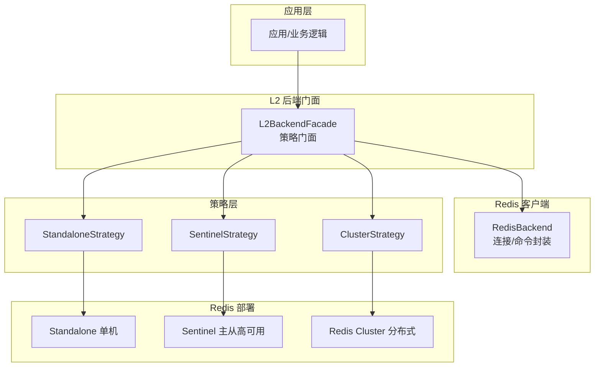
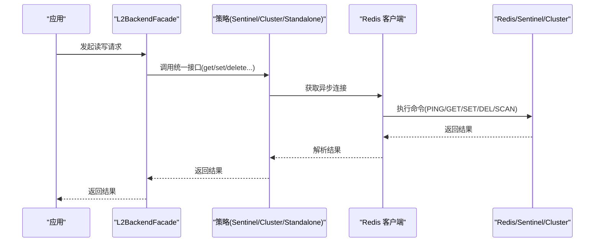
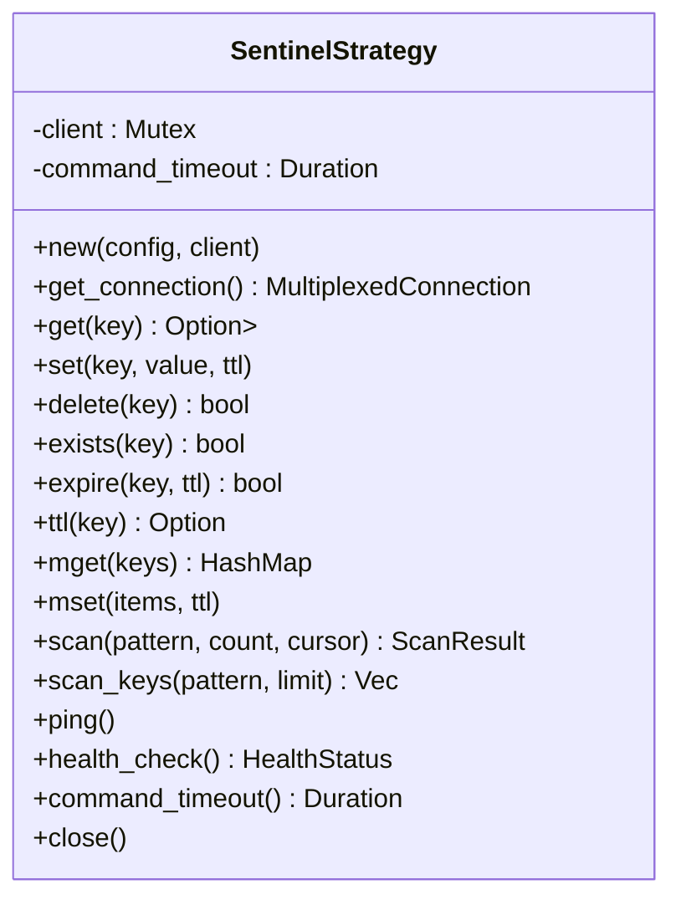
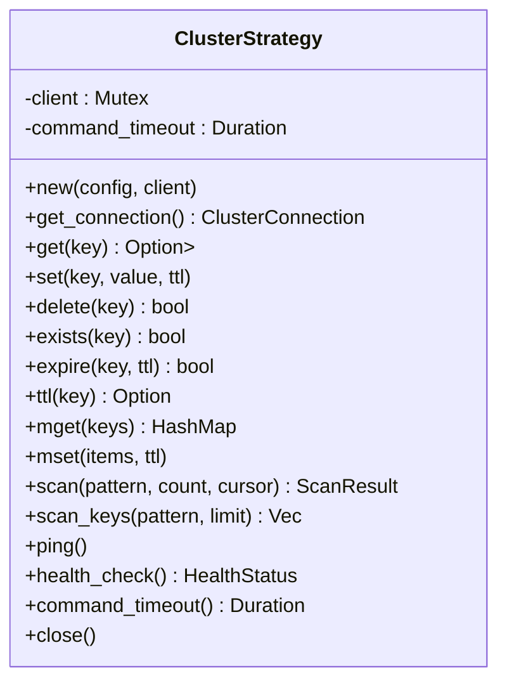
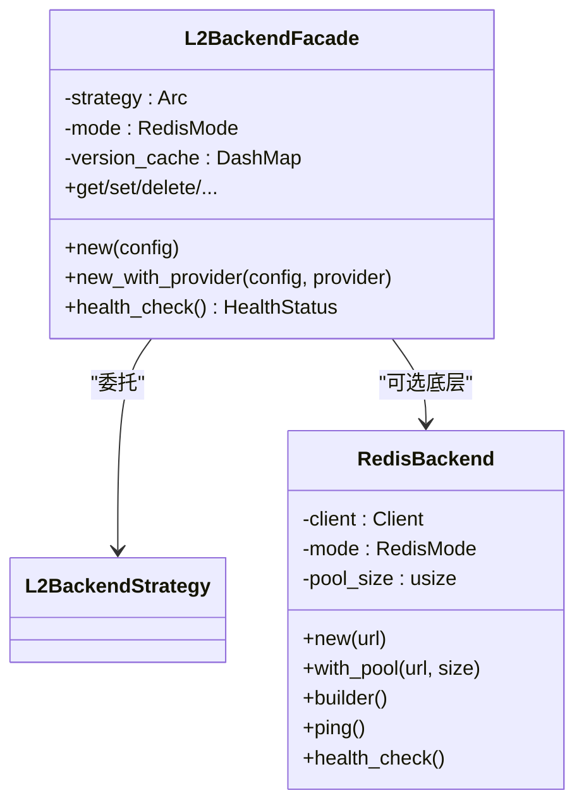
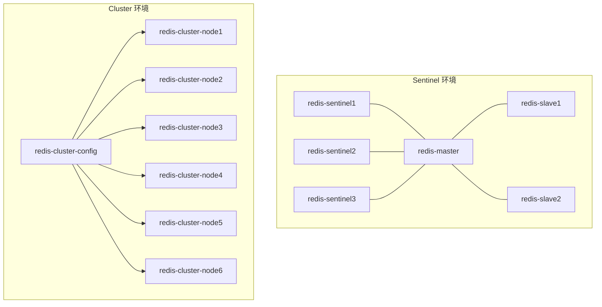
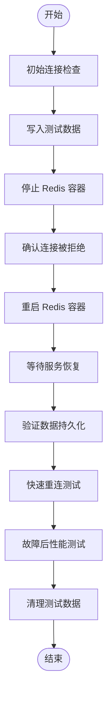
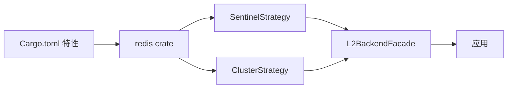
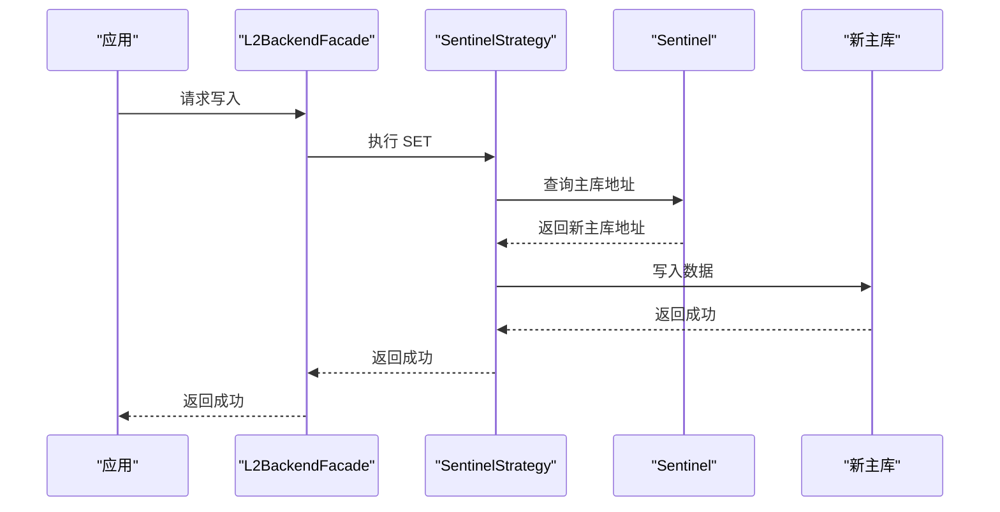

# Redis 故障转移问题

<cite>
**本文引用的文件**
- [scripts/test_redis_failover.sh](file://scripts/test_redis_failover.sh)
- [tests/real_env/docker-compose.sentinel.yml](file://tests/real_env/docker-compose.sentinel.yml)
- [tests/real_env/docker-compose.cluster.yml](file://tests/real_env/docker-compose.cluster.yml)
- [examples/verify_redis.rs](file://examples/verify_redis.rs)
- [src/backend/client/redis/client.rs](file://src/backend/client/redis/client.rs)
- [src/backend/client/redis/mod.rs](file://src/backend/client/redis/mod.rs)
- [src/backend/strategy/sentinel.rs](file://src/backend/strategy/sentinel.rs)
- [src/backend/strategy/cluster.rs](file://src/backend/strategy/cluster.rs)
- [src/backend/strategy/facade.rs](file://src/backend/strategy/facade.rs)
- [tests/integration/redis_test.rs](file://tests/integration/redis_test.rs)
- [Cargo.toml](file://Cargo.toml)
- [tests/real_env/configs/redis-sentinel1.conf](file://tests/real_env/configs/redis-sentinel1.conf)
- [tests/real_env/configs/redis-cluster-node1.conf](file://tests/real_env/configs/redis-cluster-node1.conf)
</cite>

## 目录
1. [简介](#简介)
2. [项目结构](#项目结构)
3. [核心组件](#核心组件)
4. [架构总览](#架构总览)
5. [详细组件分析](#详细组件分析)
6. [依赖关系分析](#依赖关系分析)
7. [性能考量](#性能考量)
8. [故障排查指南](#故障排查指南)
9. [结论](#结论)
10. [附录](#附录)

## 简介
本指南聚焦于 Redis 在不同部署模式下的故障转移问题，结合仓库中的实现与测试脚本，系统阐述 Sentinel 高可用与 Cluster 分布式两种模式的故障检测、自动切换机制与验证方法；同时给出常见故障转移失败的原因、测试执行与结果分析、手动故障转移步骤、恢复后的数据一致性检查，以及针对不同部署模式的策略与配置要点。

## 项目结构
本项目围绕“多级缓存”设计，L2 层采用 Redis 实现，支持 Standalone、Sentinel 与 Cluster 三种模式。关键实现位于 backend 子模块，测试与演示脚本位于 tests 与 scripts 目录，配置文件位于 tests/real_env/configs。

图表来源
- [src/backend/strategy/facade.rs](file://src/backend/strategy/facade.rs#L48-L98)
- [src/backend/client/redis/client.rs](file://src/backend/client/redis/client.rs#L71-L116)
- [src/backend/strategy/sentinel.rs](file://src/backend/strategy/sentinel.rs#L21-L56)
- [src/backend/strategy/cluster.rs](file://src/backend/strategy/cluster.rs#L21-L56)

章节来源
- [src/backend/strategy/facade.rs](file://src/backend/strategy/facade.rs#L48-L98)
- [src/backend/client/redis/client.rs](file://src/backend/client/redis/client.rs#L71-L116)

## 核心组件
- RedisBackend：负责连接建立、基础命令执行与健康检查，支持 Standalone 模式，具备连接池能力接口。
- L2BackendFacade：策略门面，根据配置选择具体策略（Standalone/Sentinel/Cluster），对外提供统一接口。
- SentinelStrategy：基于 redis-rs 的 Sentinel 客户端，封装 GET/SET/DEL/SCAN/PING 等操作。
- ClusterStrategy：基于 redis-rs 的 Cluster 客户端，封装 GET/SET/DEL/SCAN/PING 等操作。
- 测试与脚本：提供真实环境下的 Sentinel/Cluster 配置与一键测试脚本，验证故障转移与重连行为。

章节来源
- [src/backend/client/redis/client.rs](file://src/backend/client/redis/client.rs#L66-L132)
- [src/backend/strategy/facade.rs](file://src/backend/strategy/facade.rs#L18-L38)
- [src/backend/strategy/sentinel.rs](file://src/backend/strategy/sentinel.rs#L21-L56)
- [src/backend/strategy/cluster.rs](file://src/backend/strategy/cluster.rs#L21-L56)

## 架构总览
下图展示应用通过门面访问不同 Redis 策略，策略内部使用对应客户端与 Redis 集群/哨兵交互。

图表来源
- [src/backend/strategy/facade.rs](file://src/backend/strategy/facade.rs#L129-L222)
- [src/backend/strategy/sentinel.rs](file://src/backend/strategy/sentinel.rs#L48-L56)
- [src/backend/strategy/cluster.rs](file://src/backend/strategy/cluster.rs#L48-L56)
- [src/backend/client/redis/client.rs](file://src/backend/client/redis/client.rs#L117-L131)

## 详细组件分析

### 组件 A：Sentinel 策略（高可用）
- 角色与职责：封装 Sentinel 客户端，提供统一的 L2BackendStrategy 接口，支持 GET/SET/DEL/EXISTS/TTL/EXPIRE/MGET/MSET/SCAN/SCAN_KEYS/PING/HEALTH_CHECK 等操作。
- 连接管理：通过 Mutex 包装的 SentinelClient 获取 MultiplexedConnection，命令超时由 L2Config 注入。
- 健康检查：通过 PING 判定健康状态。
- 并发与错误：日志记录与错误映射为 CacheError，便于上层感知。

图表来源
- [src/backend/strategy/sentinel.rs](file://src/backend/strategy/sentinel.rs#L21-L56)

章节来源
- [src/backend/strategy/sentinel.rs](file://src/backend/strategy/sentinel.rs#L58-L432)

### 组件 B：Cluster 策略（分布式）
- 角色与职责：封装 ClusterClient，提供统一接口；对 MGET/MSET/SCAN 等涉及多键或多节点的操作做了简化处理（按策略实现）。
- 连接管理：通过 Mutex 包装的 ClusterClient 获取 ClusterConnection。
- 健康检查：通过 PING 判定健康状态。

图表来源
- [src/backend/strategy/cluster.rs](file://src/backend/strategy/cluster.rs#L21-L56)

章节来源
- [src/backend/strategy/cluster.rs](file://src/backend/strategy/cluster.rs#L58-L436)

### 组件 C：门面与客户端
- L2BackendFacade：根据配置选择策略（Standalone/Sentinel/Cluster），并将版本缓存与策略组合，提供统一接口。
- RedisBackend：负责连接字符串解析、TLS 生产校验、快速连接验证、基础命令执行与健康检查；当前实现以 Standalone 为主，具备连接池接口预留。

图表来源
- [src/backend/strategy/facade.rs](file://src/backend/strategy/facade.rs#L18-L38)
- [src/backend/client/redis/client.rs](file://src/backend/client/redis/client.rs#L66-L132)

章节来源
- [src/backend/strategy/facade.rs](file://src/backend/strategy/facade.rs#L40-L127)
- [src/backend/client/redis/client.rs](file://src/backend/client/redis/client.rs#L79-L213)

### 组件 D：Sentinel/Cluster 真实环境配置与测试
- docker-compose.sentinel.yml：定义主从节点与三个 Sentinel 节点，提供健康检查与网络隔离。
- docker-compose.cluster.yml：定义六个 Redis Cluster 节点与自动创建集群的配置器容器。
- redis-sentinel1.conf：Sentinel 监控参数示例（down-after、parallel-syncs、failover-timeout 等）。
- redis-cluster-node1.conf：Cluster 开关与持久化配置示例（AOF/RDB/cluster-*）。

图表来源
- [tests/real_env/docker-compose.sentinel.yml](file://tests/real_env/docker-compose.sentinel.yml#L6-L121)
- [tests/real_env/docker-compose.cluster.yml](file://tests/real_env/docker-compose.cluster.yml#L6-L151)
- [tests/real_env/configs/redis-sentinel1.conf](file://tests/real_env/configs/redis-sentinel1.conf#L9-L14)
- [tests/real_env/configs/redis-cluster-node1.conf](file://tests/real_env/configs/redis-cluster-node1.conf#L22-L28)

章节来源
- [tests/real_env/docker-compose.sentinel.yml](file://tests/real_env/docker-compose.sentinel.yml#L1-L135)
- [tests/real_env/docker-compose.cluster.yml](file://tests/real_env/docker-compose.cluster.yml#L1-L169)
- [tests/real_env/configs/redis-sentinel1.conf](file://tests/real_env/configs/redis-sentinel1.conf#L1-L15)
- [tests/real_env/configs/redis-cluster-node1.conf](file://tests/real_env/configs/redis-cluster-node1.conf#L1-L63)

### 组件 E：故障转移测试脚本与验证
- scripts/test_redis_failover.sh：模拟 Redis 重启、断连拒绝、数据持久化、快速重连与吞吐测试，输出总结与建议。
- examples/verify_redis.rs：快速验证 RedisBackend 的 PING/SET/GET/DELETE 行为。
- tests/integration/redis_test.rs：验证连接字符串、PING、连接错误处理等。

图表来源
- [scripts/test_redis_failover.sh](file://scripts/test_redis_failover.sh#L15-L127)

章节来源
- [scripts/test_redis_failover.sh](file://scripts/test_redis_failover.sh#L1-L150)
- [examples/verify_redis.rs](file://examples/verify_redis.rs#L1-L79)
- [tests/integration/redis_test.rs](file://tests/integration/redis_test.rs#L16-L152)

## 依赖关系分析
- 依赖 redis crate 并启用 aio、tokio-comp、cluster-async、sentinel、connection-manager、script 等特性，满足异步连接、Sentinel/Cluster 客户端与脚本执行需求。
- L2BackendFacade 在运行时根据配置选择策略，避免上层感知底层差异。
- Sentinel/Cluster 策略均通过各自的客户端获取异步连接并执行命令，统一错误处理与健康检查。

图表来源
- [Cargo.toml](file://Cargo.toml#L85-L88)
- [src/backend/strategy/facade.rs](file://src/backend/strategy/facade.rs#L68-L91)

章节来源
- [Cargo.toml](file://Cargo.toml#L85-L88)
- [src/backend/strategy/facade.rs](file://src/backend/strategy/facade.rs#L68-L91)

## 性能考量
- 连接池：RedisBackend 提供连接池大小字段，当前实现以 multiplexed 连接为主，未来可引入连接池管理器提升并发。
- 命令超时：策略层注入 command_timeout，避免长时间阻塞影响整体性能。
- 健康检查：定期 PING 与健康状态返回，便于快速发现异常并降级或重试。
- 集群扫描：ClusterStrategy 的 SCAN 仅对首个节点执行，复杂场景需扩展为全节点扫描。

章节来源
- [src/backend/client/redis/client.rs](file://src/backend/client/redis/client.rs#L75-L77)
- [src/backend/strategy/sentinel.rs](file://src/backend/strategy/sentinel.rs#L28-L45)
- [src/backend/strategy/cluster.rs](file://src/backend/strategy/cluster.rs#L28-L45)

## 故障排查指南

### 常见故障转移失败原因
- 网络分区
  - Sentinel/Cluster 节点间通信中断导致判定失败或脑裂。
  - 配置项如 down-after、parallel-syncs、failover-timeout 不当，影响决策速度与一致性。
- 主从切换异常
  - 从库延迟过高或不可用，导致切换后数据丢失。
  - Sentinel 未正确更新主库地址或客户端未刷新路由。
- 配置错误
  - 连接字符串不包含 TLS（生产必须 rediss://），或数据库索引/密码错误。
  - 集群节点未正确加入集群或槽位分布不均。

章节来源
- [src/backend/client/redis/client.rs](file://src/backend/client/redis/client.rs#L167-L179)
- [tests/real_env/configs/redis-sentinel1.conf](file://tests/real_env/configs/redis-sentinel1.conf#L9-L14)
- [tests/real_env/configs/redis-cluster-node1.conf](file://tests/real_env/configs/redis-cluster-node1.conf#L22-L28)

### 故障转移过程监控与验证
- 健康检查
  - 使用 PING 或 health_check 判断节点状态。
  - Sentinel/Cluster 策略均提供 ping/health_check。
- 日志与指标
  - 策略层广泛使用 tracing 记录关键操作与错误，便于定位。
- 自动化测试
  - scripts/test_redis_failover.sh：覆盖断连、重启、数据持久化、快速重连与吞吐评估。
  - examples/verify_redis.rs：快速验证 PING/SET/GET/DELETE。
  - tests/integration/redis_test.rs：连接字符串、PING、错误处理验证。

章节来源
- [src/backend/strategy/sentinel.rs](file://src/backend/strategy/sentinel.rs#L402-L422)
- [src/backend/strategy/cluster.rs](file://src/backend/strategy/cluster.rs#L406-L426)
- [scripts/test_redis_failover.sh](file://scripts/test_redis_failover.sh#L15-L127)
- [examples/verify_redis.rs](file://examples/verify_redis.rs#L14-L77)
- [tests/integration/redis_test.rs](file://tests/integration/redis_test.rs#L72-L152)

### 故障转移测试执行与结果分析
- 执行步骤
  - 准备 Sentinel/Cluster 环境（docker-compose）。
  - 运行 scripts/test_redis_failover.sh 或 examples/verify_redis.rs。
  - 查看输出中的 PASS/FAIL 与建议。
- 结果分析
  - 初始连接与 PING 正常：表明基础可达。
  - 连接被拒绝：确认目标容器已停止或端口不可达。
  - 重启后恢复：服务端 PONG 返回即健康。
  - 数据持久化：AOF/RDB 配置生效则重启后数据保留。
  - 快速重连：失败次数越少越稳定。
  - 吞吐：评估故障后性能是否满足预期。

章节来源
- [scripts/test_redis_failover.sh](file://scripts/test_redis_failover.sh#L15-L149)
- [examples/verify_redis.rs](file://examples/verify_redis.rs#L14-L77)

### 手动故障转移操作步骤与注意事项
- Sentinel 手动故障转移
  - 登录 Sentinel 客户端，执行故障转移命令，确认新主库地址。
  - 检查从库重新复制状态与延迟。
  - 注意：确保 parallel-syncs 与 failover-timeout 设置合理，避免过度同步造成抖动。
- Cluster 手动故障转移
  - 使用 redis-cli --cluster fix/--cluster reshard 等命令调整槽位与节点关系。
  - 关注 require-full-coverage 与迁移屏障设置，防止部分不可用。
- 注意事项
  - 生产环境必须使用 TLS（rediss://），测试可临时放宽。
  - 避免在高峰期频繁触发故障转移，降低对业务的影响。
  - 做好备份与回滚预案，确保可快速恢复。

章节来源
- [src/backend/client/redis/client.rs](file://src/backend/client/redis/client.rs#L167-L179)
- [tests/real_env/configs/redis-sentinel1.conf](file://tests/real_env/configs/redis-sentinel1.conf#L9-L14)
- [tests/real_env/configs/redis-cluster-node1.conf](file://tests/real_env/configs/redis-cluster-node1.conf#L22-L28)

### 故障恢复后的数据同步与一致性检查
- 数据同步
  - Sentinel：确认从库复制偏移量追平，延迟指标正常。
  - Cluster：检查节点 slots 分布与迁移进度，必要时执行 reshard。
- 一致性检查
  - 使用 SCAN + 校验关键键值，比对故障前后数据。
  - 通过脚本批量 SET/GET 验证读写一致性。
  - 关注 TTL/EXPIRE 行为，确保过期策略一致。

章节来源
- [src/backend/strategy/cluster.rs](file://src/backend/strategy/cluster.rs#L356-L404)
- [src/backend/strategy/sentinel.rs](file://src/backend/strategy/sentinel.rs#L354-L400)

### 不同部署模式下的故障转移策略与配置要求
- Standalone
  - 无自动故障转移，需外部工具或应用层重试。
  - 配置要求：连接字符串、TLS（生产）、数据库索引。
- Sentinel
  - 自动故障转移：基于多数派投票与配置参数。
  - 配置要求：monitor、auth-pass、down-after、parallel-syncs、failover-timeout、deny-scripts-reconfig。
- Cluster
  - 基于槽位的分布式一致性，支持节点增删与重分片。
  - 配置要求：cluster-enabled、cluster-config-file、cluster-node-timeout、require-full-coverage、AOF/RDB。

章节来源
- [src/backend/client/redis/client.rs](file://src/backend/client/redis/client.rs#L27-L48)
- [tests/real_env/configs/redis-sentinel1.conf](file://tests/real_env/configs/redis-sentinel1.conf#L9-L14)
- [tests/real_env/configs/redis-cluster-node1.conf](file://tests/real_env/configs/redis-cluster-node1.conf#L22-L28)

## 结论
本项目提供了完整的 Redis 多模式接入与测试框架，结合 Sentinel/Cluster 的真实环境配置与自动化测试脚本，能够有效验证故障转移与恢复过程。通过健康检查、日志追踪与统一的策略门面，应用层可稳定地在不同部署模式间切换。建议在生产中严格启用 TLS、合理配置故障转移参数，并持续进行自动化回归测试以保障稳定性。

## 附录

### 关键流程：Sentinel 故障转移序列

图表来源
- [src/backend/strategy/sentinel.rs](file://src/backend/strategy/sentinel.rs#L48-L56)
- [src/backend/strategy/facade.rs](file://src/backend/strategy/facade.rs#L75-L83)
