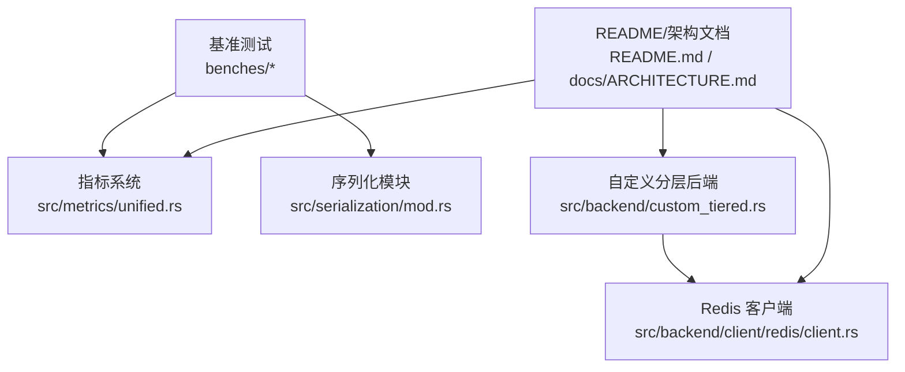
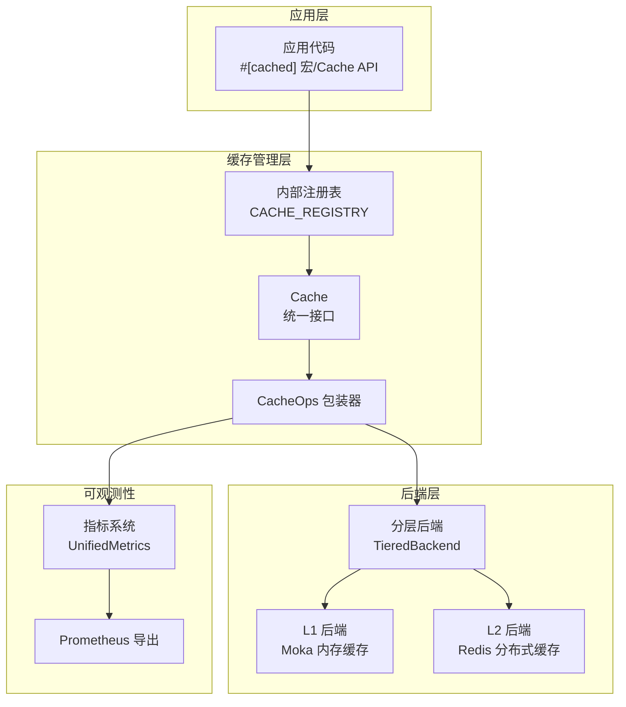
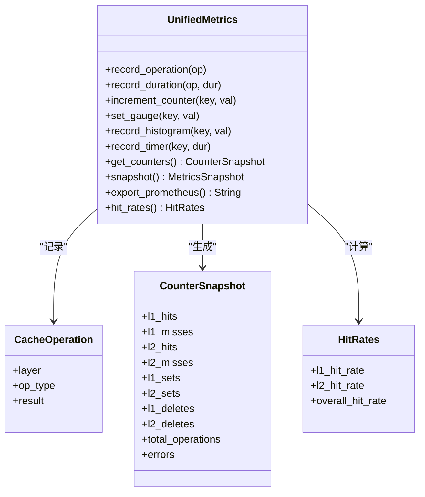
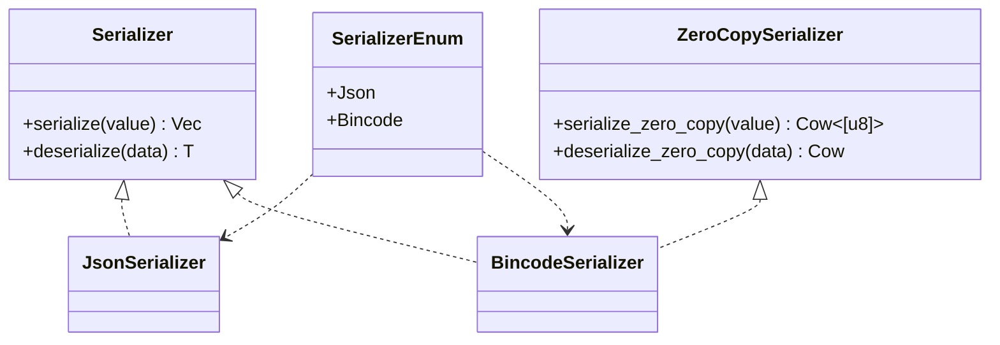
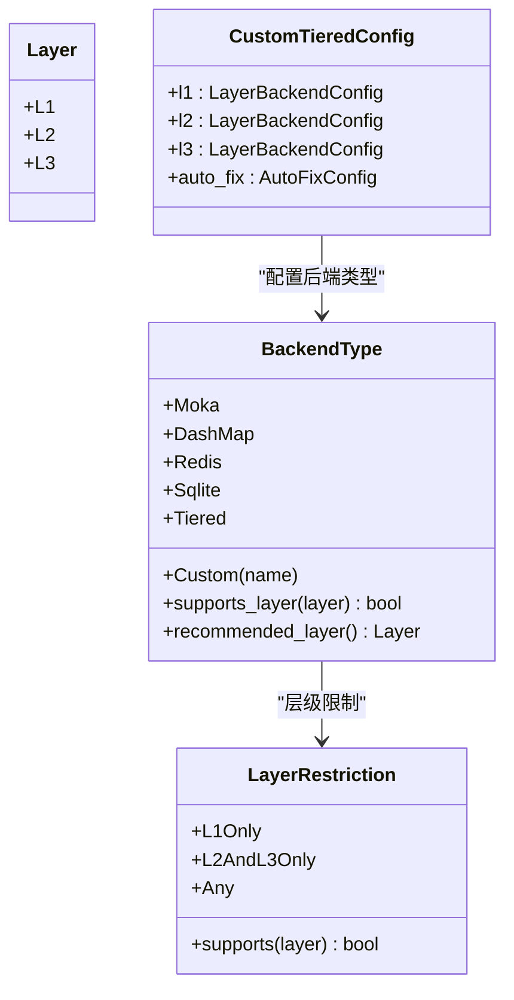
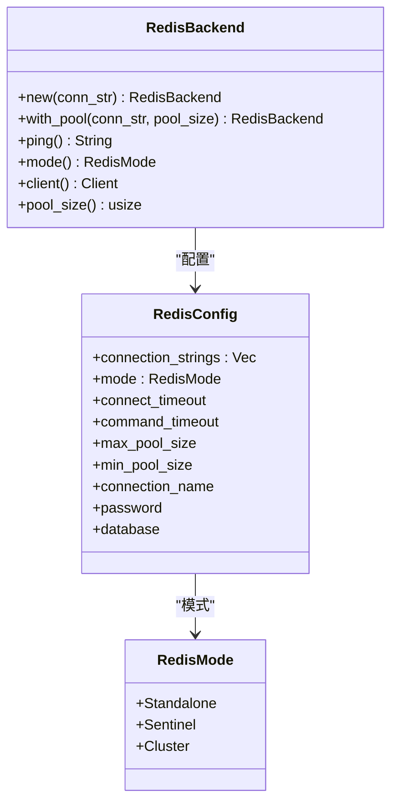
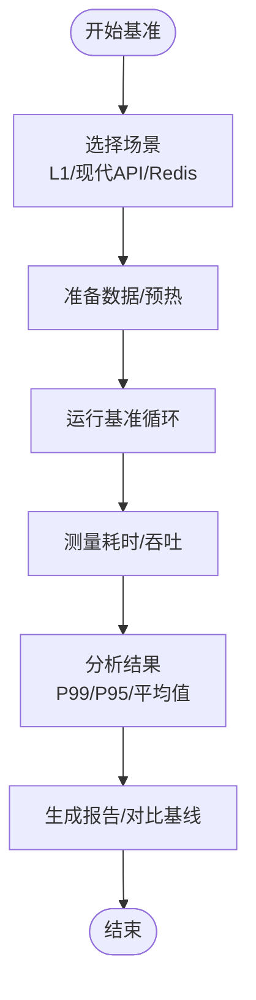
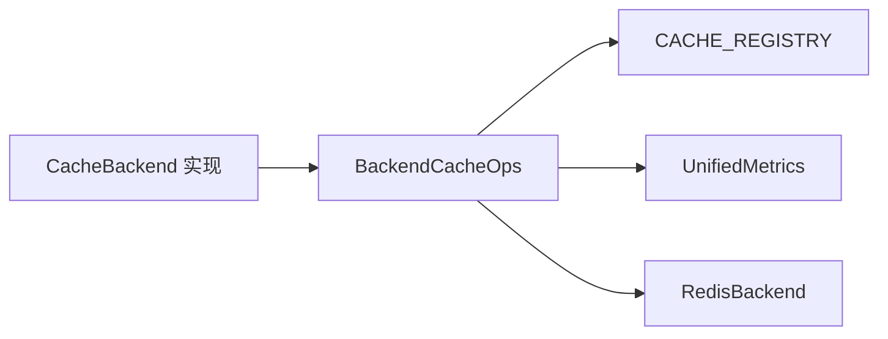

# 性能问题

<cite>
**本文引用的文件**
- [README.md](file://README.md)
- [ARCHITECTURE.md](file://docs/ARCHITECTURE.md)
- [cache_benchmark.rs](file://benches/cache_benchmark.rs)
- [modern_api_benchmark.rs](file://benches/modern_api_benchmark.rs)
- [redis_benchmark.rs](file://benches/redis_benchmark.rs)
- [unified.rs](file://src/metrics/unified.rs)
- [serialization/mod.rs](file://src/serialization/mod.rs)
- [custom_tiered.rs](file://src/backend/custom_tiered.rs)
- [redis_perf_test.sh](file://scripts/redis_perf_test.sh)
- [redis/client.rs](file://src/backend/client/redis/client.rs)
- [cache.rs](file://src/cache.rs)
</cite>

## 目录
1. [简介](#简介)
2. [项目结构](#项目结构)
3. [核心组件](#核心组件)
4. [架构总览](#架构总览)
5. [详细组件分析](#详细组件分析)
6. [依赖关系分析](#依赖关系分析)
7. [性能考量](#性能考量)
8. [故障排查指南](#故障排查指南)
9. [结论](#结论)
10. [附录](#附录)

## 简介
本指南聚焦于缓存系统中的性能问题诊断与优化，围绕命中率低、内存使用过高、Redis 延迟上升、序列化开销过大等典型问题，结合仓库内的基准测试、指标体系、序列化与后端配置能力，给出可操作的监控、定位与优化建议，并提供测试环境搭建与用例设计思路。

## 项目结构
- 基准测试位于 benches/，分别覆盖 L1 内存缓存、现代 API、Redis L2 缓存三类场景。
- 指标系统位于 src/metrics/unified.rs，提供统一的计数器、直方图、定时器与导出能力。
- 序列化模块位于 src/serialization/mod.rs，支持多种格式与零拷贝接口。
- 自定义分层后端位于 src/backend/custom_tiered.rs，提供 L1/L2/L3 后端类型与配置校验、自动修复。
- Redis 客户端位于 src/backend/client/redis/client.rs，提供连接池、模式与健康检查。
- README 与 ARCHITECTURE 文档提供了整体架构、性能目标与优化要点。

**图表来源**
- [README.md](file://README.md#L277-L301)
- [ARCHITECTURE.md](file://docs/ARCHITECTURE.md#L36-L73)

**章节来源**
- [README.md](file://README.md#L277-L301)
- [ARCHITECTURE.md](file://docs/ARCHITECTURE.md#L36-L73)

## 核心组件
- 指标系统：提供 L1/L2 命中/未命中/设置/删除/错误计数、动态指标（计数器/仪表盘/直方图/定时器）、快照与 Prometheus 导出。
- 序列化：统一 Serializer/ZeroCopySerializer 接口，支持 JSON/bincode 等，便于评估序列化开销与选择更高效格式。
- 自定义分层后端：支持 L1/Moka、L2/Redis、L3/Redis 或持久化等组合，内置配置校验与自动修复，便于按场景优化容量与层级。
- Redis 客户端：连接池、模式（单机/哨兵/集群）、健康检查与超时控制，支撑 L2 性能与稳定性。
- 基准测试：覆盖 L1 单测、L1 批量、Redis SET/GET/TTL、现代 API 基本操作等，形成可复现的性能基线。

**章节来源**
- [unified.rs](file://src/metrics/unified.rs#L53-L144)
- [serialization/mod.rs](file://src/serialization/mod.rs#L41-L98)
- [custom_tiered.rs](file://src/backend/custom_tiered.rs#L362-L451)
- [redis/client.rs](file://src/backend/client/redis/client.rs#L15-L64)
- [cache_benchmark.rs](file://benches/cache_benchmark.rs#L14-L100)
- [modern_api_benchmark.rs](file://benches/modern_api_benchmark.rs#L14-L158)
- [redis_benchmark.rs](file://benches/redis_benchmark.rs#L15-L123)

## 架构总览

**图表来源**
- [ARCHITECTURE.md](file://docs/ARCHITECTURE.md#L36-L73)
- [cache.rs](file://src/cache.rs#L29-L85)

**章节来源**
- [ARCHITECTURE.md](file://docs/ARCHITECTURE.md#L36-L73)
- [cache.rs](file://src/cache.rs#L29-L85)

## 详细组件分析

### 指标系统与性能监控
- 关键计数器：L1/L2 命中/未命中/设置/删除/错误；总操作数；预取/压缩统计。
- 动态指标：计数器/仪表盘/直方图/定时器，支持按层/操作类型聚合。
- 快照与导出：支持时间戳、计数器快照与 Prometheus 文本导出，便于集成监控平台。
- 命中率计算：提供 L1/L2/总体命中率，便于快速判断缓存效果。

**图表来源**
- [unified.rs](file://src/metrics/unified.rs#L53-L144)
- [unified.rs](file://src/metrics/unified.rs#L511-L573)
- [unified.rs](file://src/metrics/unified.rs#L575-L611)

**章节来源**
- [unified.rs](file://src/metrics/unified.rs#L159-L509)

### 序列化与序列化开销
- 接口抽象：统一 Serializer/ZeroCopySerializer，支持零拷贝路径，减少中间缓冲与复制。
- 多格式支持：JSON 人类可读、bincode 二进制更小更快；可根据数据规模与网络带宽选择。
- 统一适配：通过统一序列化器与序列化注册表，便于切换与对比。

**图表来源**
- [serialization/mod.rs](file://src/serialization/mod.rs#L41-L98)

**章节来源**
- [serialization/mod.rs](file://src/serialization/mod.rs#L41-L98)

### 自定义分层后端与容量/层级优化
- 后端类型：Moka/DashMap/Redis/Sqlite/Tiered/Custom，支持 L1/L2/L3 层级限制与推荐层级。
- 配置校验：容量、TTL/TTI 上限与名称合法性，防止异常配置导致性能退化。
- 自动修复：在启用时对不合理层级进行修复并可选告警，降低误配置风险。
- Provider 注入：默认提供者根据 options 创建 L1/L2/L3 后端，便于替换与扩展。

**图表来源**
- [custom_tiered.rs](file://src/backend/custom_tiered.rs#L362-L451)
- [custom_tiered.rs](file://src/backend/custom_tiered.rs#L309-L361)
- [custom_tiered.rs](file://src/backend/custom_tiered.rs#L766-L800)

**章节来源**
- [custom_tiered.rs](file://src/backend/custom_tiered.rs#L216-L307)
- [custom_tiered.rs](file://src/backend/custom_tiered.rs#L362-L451)
- [custom_tiered.rs](file://src/backend/custom_tiered.rs#L766-L800)

### Redis 客户端与 L2 性能
- 模式支持：Standalone/Sentinel/Cluster，满足不同高可用与扩展需求。
- 连接与超时：连接/命令超时、最小/最大池大小，保障稳定与吞吐。
- 健康检查：Ping/PONG 快速探测，配合降级策略。
- 基准覆盖：SET/GET/TTL 与不同数据尺寸的基准，便于定位 L2 瓶颈。

**图表来源**
- [redis/client.rs](file://src/backend/client/redis/client.rs#L15-L64)
- [redis/client.rs](file://src/backend/client/redis/client.rs#L79-L132)

**章节来源**
- [redis/client.rs](file://src/backend/client/redis/client.rs#L15-L64)
- [redis/client.rs](file://src/backend/client/redis/client.rs#L79-L132)
- [redis_benchmark.rs](file://benches/redis_benchmark.rs#L15-L123)

### 基准测试与结果分析
- L1 基准：set/get/不同数据尺寸/批量写，覆盖单线程与批量吞吐，便于评估内存缓存性能。
- 现代 API 基准：GET 命中/未命中、SET、GET_OR_SET、不同数据尺寸与顺序操作，评估新 API 的端到端性能。
- Redis 基准：SET/GET/TTL 与不同数据尺寸，以及 TTL 操作，便于评估 L2 性能与延迟。

**图表来源**
- [cache_benchmark.rs](file://benches/cache_benchmark.rs#L14-L100)
- [modern_api_benchmark.rs](file://benches/modern_api_benchmark.rs#L14-L158)
- [redis_benchmark.rs](file://benches/redis_benchmark.rs#L15-L123)

**章节来源**
- [cache_benchmark.rs](file://benches/cache_benchmark.rs#L14-L100)
- [modern_api_benchmark.rs](file://benches/modern_api_benchmark.rs#L14-L158)
- [redis_benchmark.rs](file://benches/redis_benchmark.rs#L15-L123)

## 依赖关系分析
- CacheOps 包装器将具体后端抽象为统一接口，便于注册与 #[cached] 宏使用。
- 指标系统与 CacheOps/后端交互，记录操作与耗时，形成闭环观测。
- 自定义分层后端与 Redis 客户端共同决定 L2 行为，影响整体延迟与吞吐。

**图表来源**
- [cache.rs](file://src/cache.rs#L29-L85)
- [unified.rs](file://src/metrics/unified.rs#L159-L273)
- [redis/client.rs](file://src/backend/client/redis/client.rs#L79-L132)

**章节来源**
- [cache.rs](file://src/cache.rs#L29-L85)
- [unified.rs](file://src/metrics/unified.rs#L159-L273)
- [redis/client.rs](file://src/backend/client/redis/client.rs#L79-L132)

## 性能考量
- 命中率低
  - 检查 L1/L2 命中率与总体命中率，结合业务热点与 TTL 设定评估。
  - 优化键设计与 TTL，避免过短导致频繁回源。
  - 对冷数据使用 L2-only 或降低 L1 容量，释放热数据空间。
- 内存使用过高
  - 通过指标系统观察 L1 错误/删除/设置计数，结合容量配置与淘汰策略评估。
  - 调整 L1 最大容量与 TTL/TTI，必要时启用自动修复与降级。
- Redis 延迟增加
  - 使用 redis-cli 或脚本进行 PING/SET/GET/Pipeline 基准，定位网络/实例瓶颈。
  - 结合 Redis 客户端超时与连接池配置，评估连接与命令超时设置。
- 序列化开销过大
  - 切换至 bincode 以减小负载与提升序列化速度，结合零拷贝接口进一步优化。
  - 对大对象评估压缩策略与序列化格式选择。

**章节来源**
- [unified.rs](file://src/metrics/unified.rs#L481-L509)
- [custom_tiered.rs](file://src/backend/custom_tiered.rs#L216-L307)
- [redis_perf_test.sh](file://scripts/redis_perf_test.sh#L15-L111)
- [redis/client.rs](file://src/backend/client/redis/client.rs#L30-L64)
- [serialization/mod.rs](file://src/serialization/mod.rs#L41-L98)

## 故障排查指南
- 指标采集与导出
  - 使用指标快照与 Prometheus 导出，核对 L1/L2 命中/未命中、错误计数与直方图分布。
  - 通过命中率与错误率变化定位异常时段与问题类型。
- Redis 健康与延迟
  - 使用脚本进行 PING/SET/GET/Pipeline 基准，评估延迟与吞吐。
  - 检查连接超时、命令超时与连接池大小，避免资源争用。
- 配置校验与自动修复
  - 发生配置异常时，查看自动修复日志与告警，确认层级与容量是否被修正。
- 降级与恢复
  - 在 L2 失败时，系统进入 L1-only 模式，应检查 WAL 与重放逻辑，确保数据一致性。

**章节来源**
- [unified.rs](file://src/metrics/unified.rs#L421-L480)
- [redis_perf_test.sh](file://scripts/redis_perf_test.sh#L15-L111)
- [custom_tiered.rs](file://src/backend/custom_tiered.rs#L782-L800)

## 结论
通过统一指标体系、序列化优化、自定义分层后端与 Redis 客户端配置，结合基准测试与脚本化性能验证，可系统性地诊断与优化缓存性能问题。建议优先从命中率与延迟入手，再逐步细化到序列化与后端配置层面，形成持续的性能闭环。

## 附录

### 性能监控工具与关键指标
- 工具
  - Prometheus 导出：统一指标导出，便于集成监控面板。
  - 基准测试：Criterion 基准，覆盖 L1/现代 API/Redis 场景。
  - Redis 基准脚本：PING/SET/GET/Pipeline，评估 L2 延迟与吞吐。
- 关键指标
  - L1/L2 命中率、错误率、总操作数、直方图/定时器分布。
  - Redis PING/SET/GET 平均延迟与吞吐，Pipeline 吞吐。

**章节来源**
- [unified.rs](file://src/metrics/unified.rs#L468-L480)
- [cache_benchmark.rs](file://benches/cache_benchmark.rs#L14-L100)
- [modern_api_benchmark.rs](file://benches/modern_api_benchmark.rs#L14-L158)
- [redis_benchmark.rs](file://benches/redis_benchmark.rs#L15-L123)
- [redis_perf_test.sh](file://scripts/redis_perf_test.sh#L15-L111)

### 基准测试执行与结果分析
- 执行方式
  - L1 基准：benches/cache_benchmark.rs
  - 现代 API 基准：benches/modern_api_benchmark.rs
  - Redis 基准：benches/redis_benchmark.rs
- 结果分析
  - 对比不同数据尺寸与批量大小下的延迟与吞吐，识别瓶颈点（CPU/内存/网络/序列化）。
  - 结合指标系统快照，定位异常时段与错误率变化。

**章节来源**
- [cache_benchmark.rs](file://benches/cache_benchmark.rs#L14-L100)
- [modern_api_benchmark.rs](file://benches/modern_api_benchmark.rs#L14-L158)
- [redis_benchmark.rs](file://benches/redis_benchmark.rs#L15-L123)

### 性能瓶颈识别与定位技术
- 命中率低：通过命中率与计数器对比，结合业务热点与 TTL 设定。
- 内存压力：结合 L1 错误/删除/设置计数与容量配置，评估淘汰策略。
- Redis 延迟：使用脚本与基准测试定位网络/实例瓶颈，检查超时与连接池。
- 序列化开销：切换 bincode 与零拷贝接口，对比序列化/反序列化耗时。

**章节来源**
- [unified.rs](file://src/metrics/unified.rs#L481-L509)
- [redis_perf_test.sh](file://scripts/redis_perf_test.sh#L15-L111)
- [serialization/mod.rs](file://src/serialization/mod.rs#L41-L98)

### 针对不同场景的优化建议
- 调整缓存大小：根据指标与容量校验，合理设置 L1 最大容量与 TTL/TTI。
- 优化序列化策略：优先 bincode，结合零拷贝接口减少中间缓冲。
- 改进批量操作：利用批处理与 Pipeline，提高 L2 写入吞吐。
- 选择合适后端：L1 使用 Moka，L2 使用 Redis，必要时启用自动修复与降级。

**章节来源**
- [custom_tiered.rs](file://src/backend/custom_tiered.rs#L216-L307)
- [serialization/mod.rs](file://src/serialization/mod.rs#L41-L98)
- [redis/client.rs](file://src/backend/client/redis/client.rs#L30-L64)

### 性能测试环境搭建与测试用例设计
- 环境
  - 使用脚本进行 Redis 基准测试，覆盖 PING/SET/GET/Pipeline。
  - 在隔离环境中运行基准测试，避免干扰。
- 用例设计
  - 数据尺寸梯度：100/1000/10000 字节，评估序列化与网络开销。
  - 批量写入：不同批量大小，评估吞吐与延迟权衡。
  - 现代 API：GET 命中/未命中、GET_OR_SET、顺序操作，评估端到端性能。

**章节来源**
- [redis_perf_test.sh](file://scripts/redis_perf_test.sh#L15-L111)
- [cache_benchmark.rs](file://benches/cache_benchmark.rs#L42-L90)
- [modern_api_benchmark.rs](file://benches/modern_api_benchmark.rs#L82-L148)

### 实际调优案例与最佳实践
- 案例：命中率低
  - 现象：L1 命中率下降，错误率上升。
  - 措施：缩短 TTL、优化键设计、提升 L1 容量，启用自动修复。
- 案例：Redis 延迟升高
  - 现象：SET/GET 延迟显著上升。
  - 措施：检查连接池与超时、网络状况，使用脚本进行基准验证。
- 案例：序列化开销大
  - 现象：序列化/反序列化耗时高。
  - 措施：切换 bincode 与零拷贝接口，评估压缩策略。

**章节来源**
- [unified.rs](file://src/metrics/unified.rs#L481-L509)
- [redis_perf_test.sh](file://scripts/redis_perf_test.sh#L15-L111)
- [serialization/mod.rs](file://src/serialization/mod.rs#L41-L98)