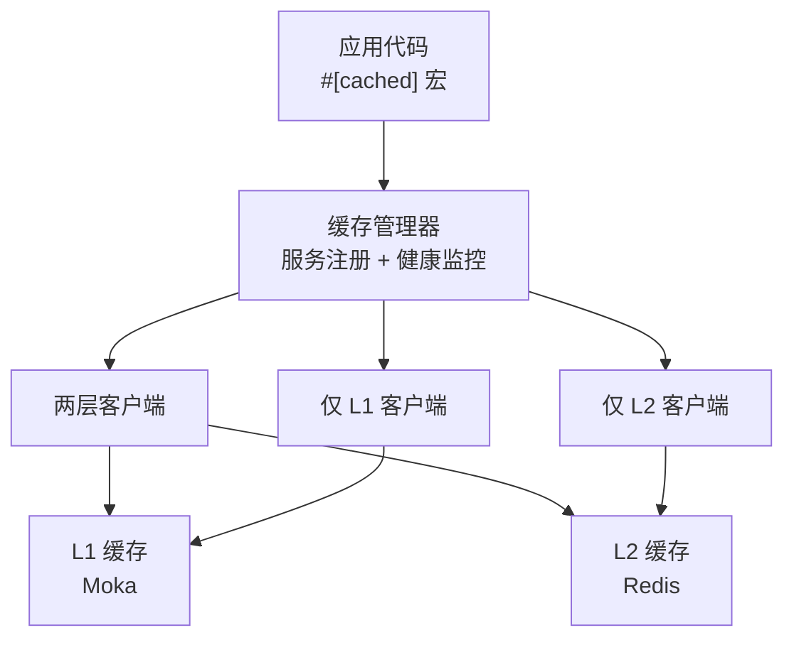
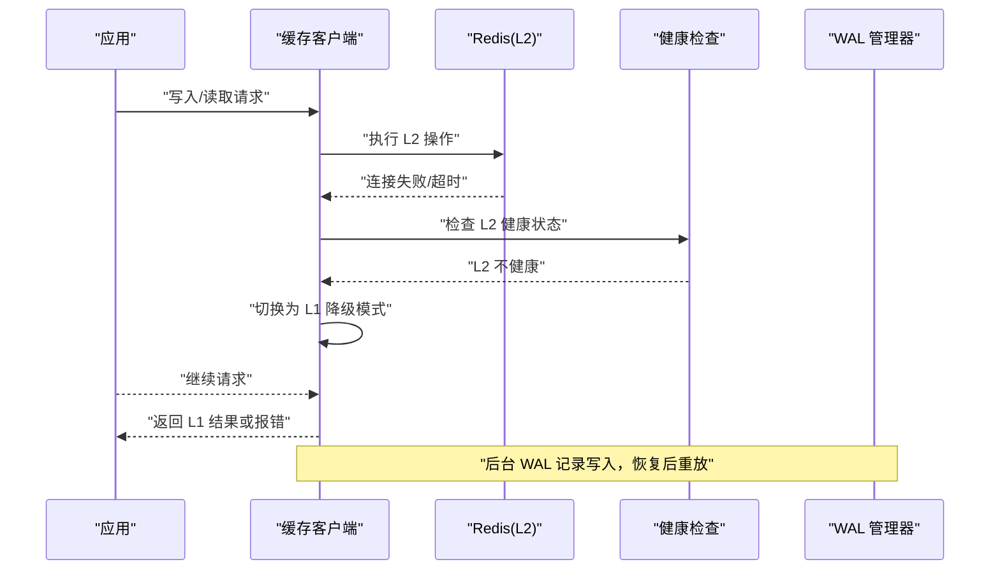
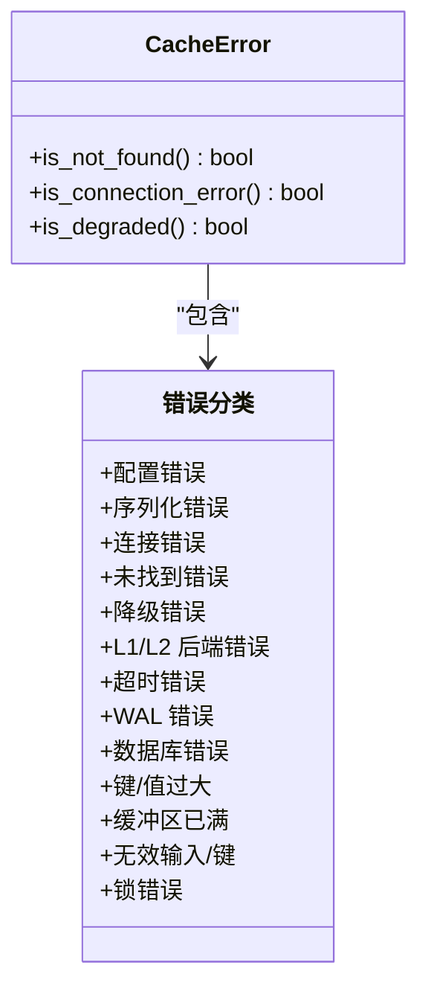
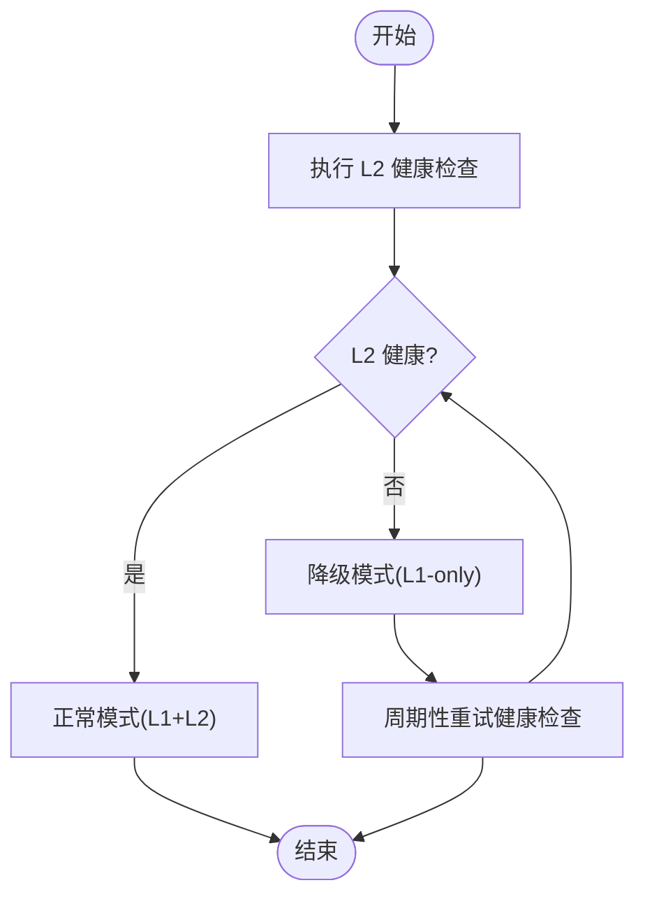
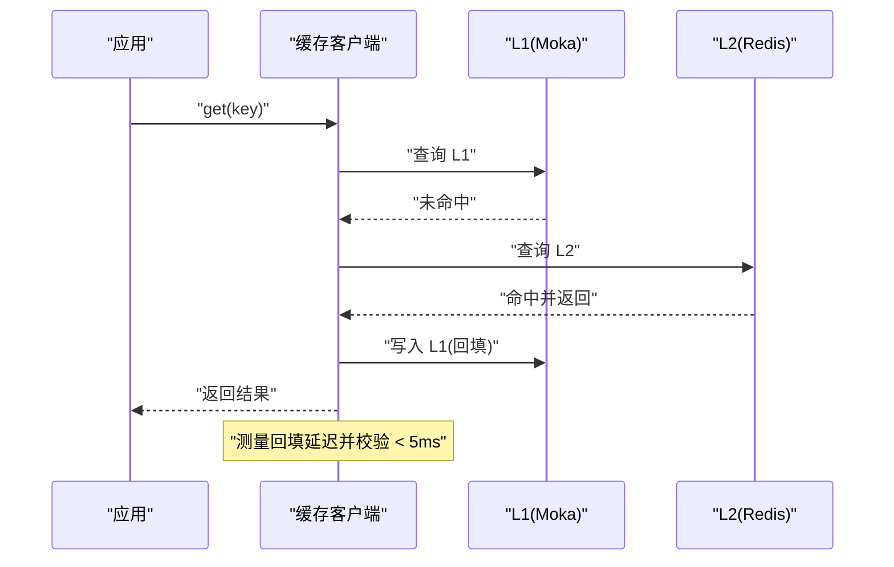
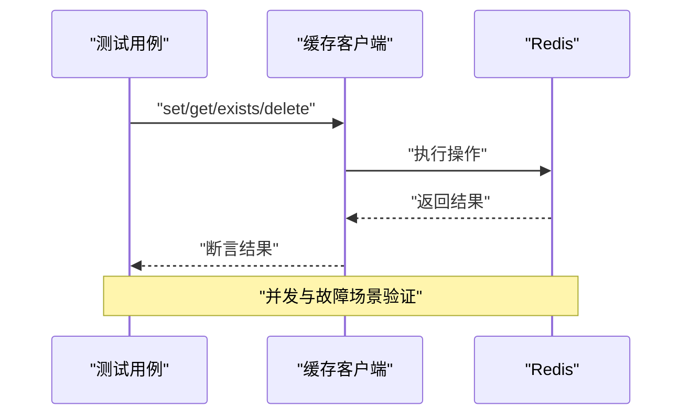
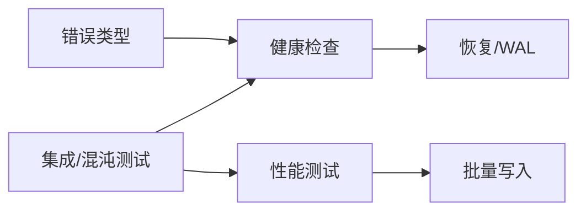

# 故障排除

<cite>
**本文引用的文件**
- [README.md](file://README.md)
- [USER_GUIDE.md](file://docs/USER_GUIDE.md)
- [API_REFERENCE.md](file://docs/API_REFERENCE.md)
- [error.rs](file://src/error.rs)
- [degradation_tests.rs](file://tests/integration/degradation_tests.rs)
- [recovery_test.rs](file://tests/integration/recovery_test.rs)
- [performance_test.rs](file://tests/integration/performance_test.rs)
- [random_failure_test.rs](file://tests/chaos/random_failure_test.rs)
</cite>

## 目录
1. [简介](#简介)
2. [项目结构](#项目结构)
3. [核心组件](#核心组件)
4. [架构总览](#架构总览)
5. [详细组件分析](#详细组件分析)
6. [依赖关系分析](#依赖关系分析)
7. [性能注意事项](#性能注意事项)
8. [故障排除指南](#故障排除指南)
9. [结论](#结论)
10. [附录](#附录)

## 简介
本指南面向使用 Oxcache 的开发者，聚焦于在实际生产环境中可能遇到的各类问题，提供系统化的诊断思路与解决步骤。内容覆盖配置错误、连接失败、性能退化、数据不一致、Redis 集成问题、缓存一致性与降级恢复、性能分析与优化、紧急处置与信息采集等方面。

## 项目结构
- Oxcache 提供 L1（Moka 内存缓存）+ L2（Redis 分布式缓存）的双层架构，支持 Standalone/Sentinel/Cluster 三种 Redis 模式。
- 通过宏与 Builder 模式两种方式初始化与使用缓存，支持健康检查、WAL、批量写入、Promote 等高级特性。
- 测试用例覆盖降级逻辑、恢复能力、性能目标与混沌故障场景，为故障排除提供参考。

**图表来源**
- [README.md](file://README.md#L277-L300)

**章节来源**
- [README.md](file://README.md#L116-L172)

## 核心组件
- 错误体系与诊断：统一的错误类型与辅助判断方法，便于定位“连接失败”“降级模式”“序列化失败”等问题。
- 健康检查与降级：在 L2 不可用时自动降级至 L1 模式，保证系统可用性。
- 恢复与 WAL：通过 WAL 管理器实现持久化与恢复，保障数据可靠性。
- 性能与批量写入：内置批量写入优化与性能测试目标，便于识别性能瓶颈。

**章节来源**
- [API_REFERENCE.md](file://docs/API_REFERENCE.md#L475-L510)
- [error.rs](file://src/error.rs#L45-L208)

## 架构总览
下图展示缓存系统在出现 L2 故障时的降级与恢复路径，以及关键的健康检查与 WAL 回放环节。

**图表来源**
- [API_REFERENCE.md](file://docs/API_REFERENCE.md#L477-L510)
- [recovery_test.rs](file://tests/integration/recovery_test.rs#L11-L77)

**章节来源**
- [API_REFERENCE.md](file://docs/API_REFERENCE.md#L475-L510)
- [recovery_test.rs](file://tests/integration/recovery_test.rs#L11-L77)

## 详细组件分析

### 错误类型与诊断要点
- 连接错误/Redis 错误：用于识别网络、认证、地址错误等。
- 降级错误：指示当前处于 L1 降级模式，需检查 L2 可用性与配置。
- 序列化/反序列化错误：检查数据格式与序列化配置。
- 超时错误：检查网络延迟、Redis 性能与超时阈值。
- 键/值过大：检查键长度与值大小限制。
- 后端错误/IO 错误：检查磁盘空间、权限与后端状态。

**图表来源**
- [error.rs](file://src/error.rs#L75-L208)

**章节来源**
- [error.rs](file://src/error.rs#L45-L208)

### 健康检查与降级流程
- 健康检查：对 L2 进行周期性探测，判定健康状态。
- 降级逻辑：当 L2 不健康时，缓存进入 L1-only 模式，继续提供服务。
- 恢复机制：L2 恢复后，WAL 可重放历史写入，尽量保持数据一致性。

**图表来源**
- [API_REFERENCE.md](file://docs/API_REFERENCE.md#L477-L492)

**章节来源**
- [API_REFERENCE.md](file://docs/API_REFERENCE.md#L475-L510)
- [degradation_tests.rs](file://tests/integration/degradation_tests.rs#L1-L6)

### 性能测试与目标
- 回填延迟（NF2）：在 L1 未命中、L2 命中的情况下，从 L2 加载到 L1 并返回的延迟应小于 5ms。
- 异常场景：Redis 连接失败时，首次操作应报错，体现降级与错误传播。

**图表来源**
- [performance_test.rs](file://tests/integration/performance_test.rs#L14-L70)

**章节来源**
- [performance_test.rs](file://tests/integration/performance_test.rs#L14-L70)

### Redis 集成与混沌测试
- 基本 CRUD：验证 set/get/exists/delete 等操作在 Redis 可用时的正确性。
- 并发与锁：验证并发写入与分布式锁在故障场景下的稳定性。
- 故障恢复：验证在故障后仍能正确执行读写操作。

**图表来源**
- [random_failure_test.rs](file://tests/chaos/random_failure_test.rs#L18-L64)

**章节来源**
- [random_failure_test.rs](file://tests/chaos/random_failure_test.rs#L18-L64)

## 依赖关系分析
- 错误类型与健康检查/恢复模块耦合度低，便于独立扩展与替换。
- 批量写入与性能测试相互印证，有助于定位吞吐瓶颈。
- 测试用例覆盖降级、恢复、混沌与性能目标，形成闭环验证。

**图表来源**
- [API_REFERENCE.md](file://docs/API_REFERENCE.md#L475-L510)
- [performance_test.rs](file://tests/integration/performance_test.rs#L14-L70)
- [random_failure_test.rs](file://tests/chaos/random_failure_test.rs#L18-L64)

**章节来源**
- [API_REFERENCE.md](file://docs/API_REFERENCE.md#L475-L510)
- [performance_test.rs](file://tests/integration/performance_test.rs#L14-L70)
- [random_failure_test.rs](file://tests/chaos/random_failure_test.rs#L18-L64)

## 性能注意事项
- 合理设置 TTL：避免过短导致频繁回填，过长导致数据陈旧。
- 启用批量写入：在高吞吐场景下显著降低 L2 写入开销。
- 监控命中率与延迟：结合指标与日志，持续评估配置合理性。
- 网络与硬件：确保 Redis 与应用在同一局域网或低延迟链路，避免跨地域抖动影响。

[本节为通用指导，无需特定文件引用]

## 故障排除指南

### 一、常见问题与解决方案

- 问题：缓存未命中率高
  - 排查要点：
    - 检查 TTL 是否过短，导致频繁失效。
    - 确认数据更新频率与热点分布。
    - 检查是否启用 promote_on_hit，确保热键向 L1 提升。
    - 调整 L1 容量与淘汰策略。
  - 参考来源
    - [USER_GUIDE.md](file://docs/USER_GUIDE.md#L711-L723)

- 问题：Redis 连接失败
  - 排查要点：
    - 校验连接字符串格式与协议（redis/rediss）。
    - 确认 Redis 服务端口、主机可达性与防火墙策略。
    - 验证认证信息（用户名/密码）与 ACL 权限。
    - 检查 TLS 配置与证书有效性。
  - 参考来源
    - [API_REFERENCE.md](file://docs/API_REFERENCE.md#L387-L423)
    - [README.md](file://README.md#L116-L172)

- 问题：缓存数据不一致
  - 排查要点：
    - 确认 Pub/Sub 失效机制是否正常工作。
    - 检查版本号与失效消息是否正确发布/订阅。
    - 考虑缩短 TTL 或在更新时主动失效。
  - 参考来源
    - [USER_GUIDE.md](file://docs/USER_GUIDE.md#L737-L747)

- 问题：性能下降
  - 排查要点：
    - 检查是否存在内存泄漏或 L1 压力过大。
    - 调整批量写入参数（batch_size、flush interval）。
    - 分析慢查询日志与网络 RTT。
  - 参考来源
    - [USER_GUIDE.md](file://docs/USER_GUIDE.md#L749-L759)

### 二、Redis 集成问题排查步骤

- 连接字符串验证
  - 使用最小可运行示例验证连接字符串，逐步增加复杂度（认证、TLS、Sentinel/Cluster）。
  - 参考来源
    - [API_REFERENCE.md](file://docs/API_REFERENCE.md#L407-L414)

- 认证问题
  - 确认用户名/密码正确，必要时使用环境变量注入。
  - 检查 ACL 权限范围与只读/只写策略。
  - 参考来源
    - [USER_GUIDE.md](file://docs/USER_GUIDE.md#L662-L701)

- 网络连通性
  - 使用 telnet/ping/nc 验证端口连通。
  - 检查 DNS 解析、代理与安全组规则。
  - 参考来源
    - [README.md](file://README.md#L116-L172)

- Sentinel/Cluster 模式
  - Standalone：确认单节点地址与端口。
  - Sentinel：核对主从名称、节点列表与密码。
  - Cluster：核对节点拓扑与槽位映射。
  - 参考来源
    - [USER_GUIDE.md](file://docs/USER_GUIDE.md#L510-L556)

### 三、缓存一致性问题诊断与修复

- 机制确认
  - Pub/Sub 失效：确保发布/订阅通道正常，版本号一致。
  - 主动失效：在写入后主动失效相关键，降低一致性窗口。
- 修复建议
  - 缩短 TTL 或采用更短的失效窗口。
  - 在关键路径上增加主动失效与回源校验。
- 参考来源
  - [USER_GUIDE.md](file://docs/USER_GUIDE.md#L737-L747)

### 四、性能问题分析与优化

- 回填延迟（NF2）
  - 目标：< 5ms；若超过，检查 L2 延迟、网络抖动与批量写入配置。
- 批量写入
  - 启用批量写入并调优 batch_size 与 flush 间隔。
- 指标与日志
  - 结合命中率、延迟直方图与错误计数，定位瓶颈。
- 参考来源
  - [performance_test.rs](file://tests/integration/performance_test.rs#L14-L70)
  - [USER_GUIDE.md](file://docs/USER_GUIDE.md#L557-L567)

### 五、紧急情况处理流程与恢复策略

- 立即行动
  - 降级模式：若 L2 不可用，系统自动降级为 L1-only，继续提供服务。
  - 健康检查：开启周期性健康检查，尽快发现并上报异常。
- 恢复策略
  - WAL 重放：L2 恢复后，WAL 管理器重放未确认写入，尽量补齐数据。
  - 逐步恢复：先恢复只读，再恢复写入，观察延迟与错误率。
- 参考来源
  - [API_REFERENCE.md](file://docs/API_REFERENCE.md#L475-L510)
  - [recovery_test.rs](file://tests/integration/recovery_test.rs#L11-L77)

### 六、诊断方法与工具

- 日志分析
  - 使用 tracing 输出结构化日志，关注连接失败、降级事件与超时记录。
  - 参考来源
    - [API_REFERENCE.md](file://docs/API_REFERENCE.md#L617-L640)

- 性能监控
  - 指标维度：请求总量、命中率、L2 健康状态、批缓冲大小、WAL 条目数。
  - 参考来源
    - [API_REFERENCE.md](file://docs/API_REFERENCE.md#L568-L590)

- 网络诊断
  - 使用 ping/telnet/nc/nmap 检查连通性与端口开放。
  - 参考来源
    - [README.md](file://README.md#L116-L172)

- 错误分类与定位
  - 使用 is_connection_error()/is_degraded() 快速区分错误类型。
  - 参考来源
  - [error.rs](file://src/error.rs#L228-L288)

### 七、收集诊断信息与提交问题报告

- 必备信息
  - Oxcache 版本、特性开关、配置片段（脱敏密码）、日志片段。
  - Redis 版本、部署模式（Standalone/Sentinel/Cluster）、网络拓扑。
  - 性能指标截图（命中率、延迟、错误率）。
- 提交渠道
  - GitHub Issues 或文档中心链接。
- 参考来源
  - [README.md](file://README.md#L387-L386)

## 结论
通过统一的错误类型、健康检查与降级机制、WAL 恢复与性能测试目标，Oxcache 在生产环境中提供了可靠的可观测性与韧性。按照本指南的诊断流程与优化建议，可快速定位并解决配置、连接、性能与一致性问题，保障系统稳定运行。

## 附录

### A. 常用排查清单
- 配置类
  - 连接字符串格式与协议
  - 认证信息与 ACL 权限
  - TTL、批量写入参数、序列化方式
- 运行类
  - L2 健康状态与延迟
  - L1 压力与容量
  - 错误计数与日志级别
- 性能类
  - 回填延迟、吞吐、批缓冲利用率
  - 网络 RTT 与 Redis 响应时间

### B. 相关测试参考
- 降级与恢复：[recovery_test.rs](file://tests/integration/recovery_test.rs#L11-L77)
- 性能目标：[performance_test.rs](file://tests/integration/performance_test.rs#L14-L70)
- 混沌与并发：[random_failure_test.rs](file://tests/chaos/random_failure_test.rs#L18-L64)
