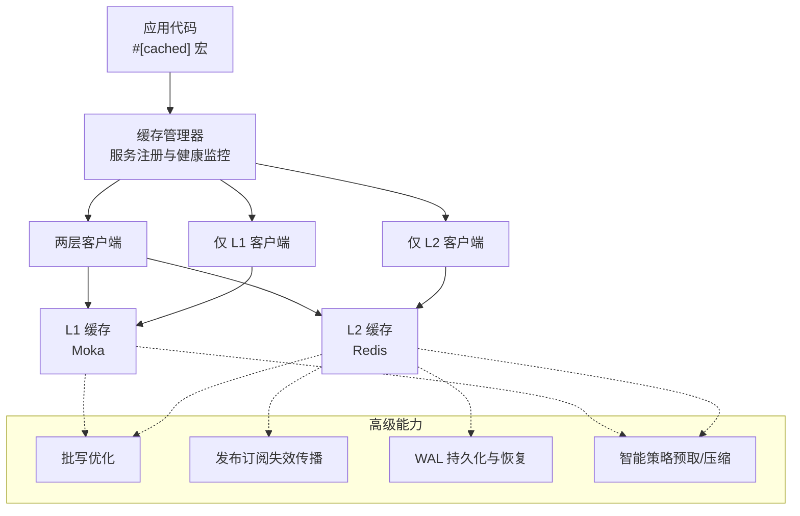
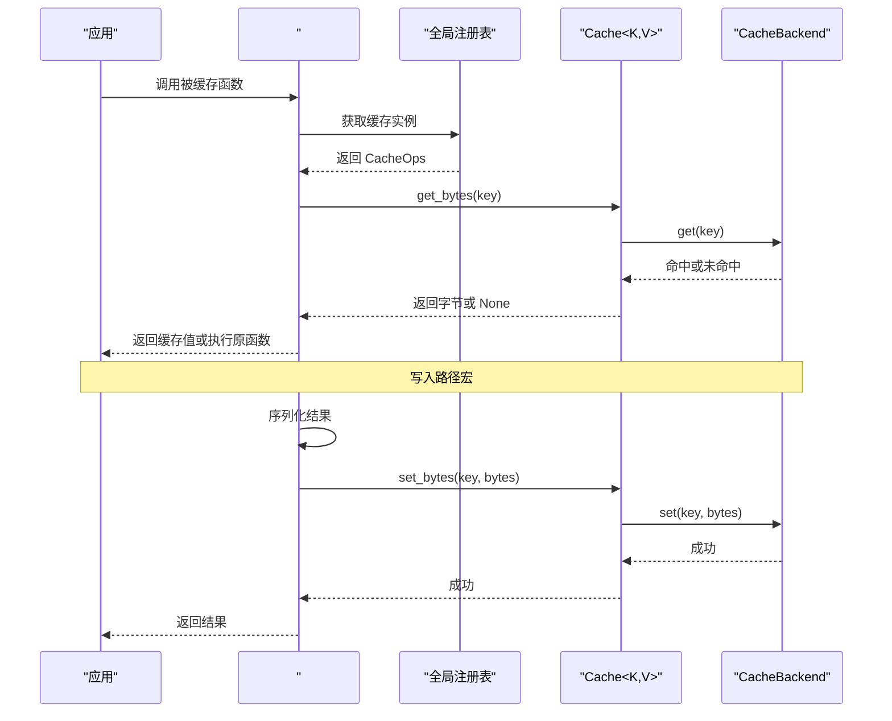
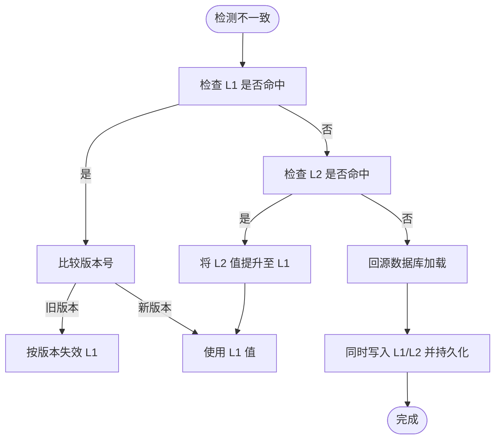
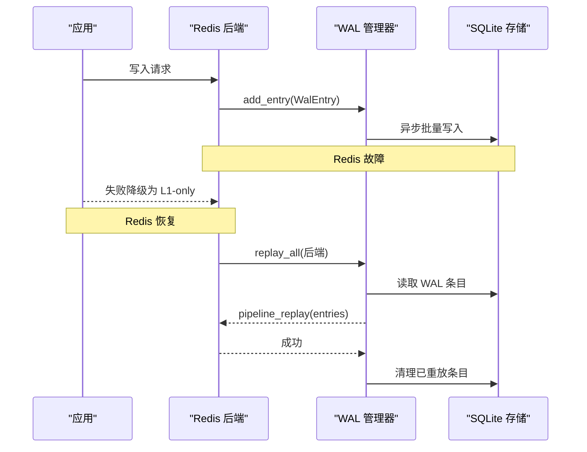
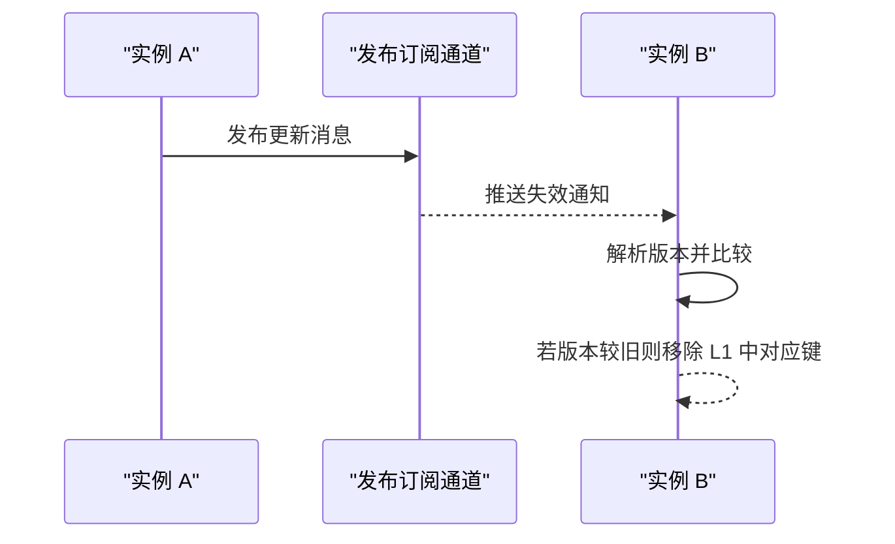
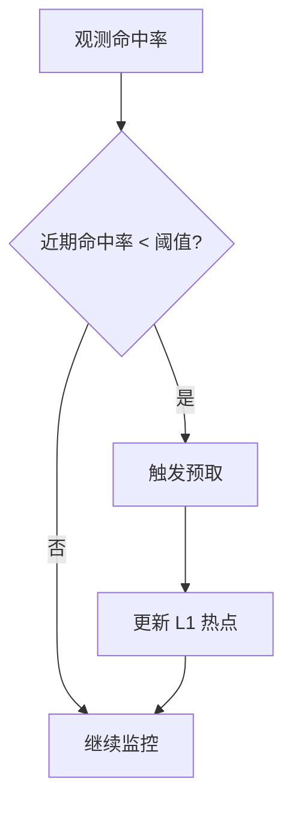
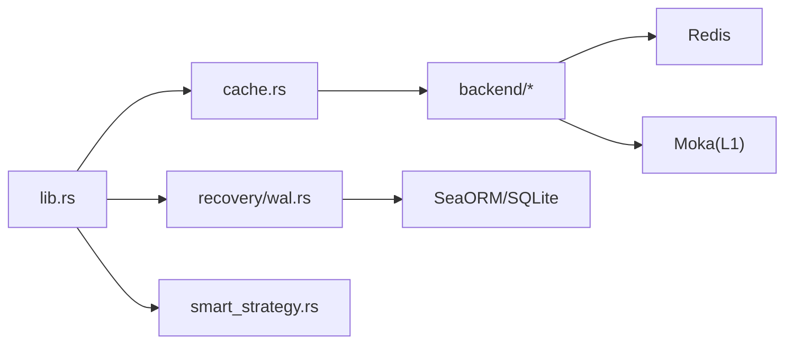

# 数据一致性问题

<cite>
**本文档引用的文件**
- [README.md](file://README.md)
- [ARCHITECTURE.md](file://docs/ARCHITECTURE.md)
- [wal.rs](file://src/recovery/wal.rs)
- [smart_strategy.rs](file://src/smart_strategy.rs)
- [cache.rs](file://src/cache.rs)
- [lib.rs](file://src/lib.rs)
- [unified.rs](file://src/metrics/unified.rs)
</cite>

## 目录
1. [简介](#简介)
2. [项目结构](#项目结构)
3. [核心组件](#核心组件)
4. [架构总览](#架构总览)
5. [详细组件分析](#详细组件分析)
6. [依赖关系分析](#依赖关系分析)
7. [性能考量](#性能考量)
8. [故障排查指南](#故障排查指南)
9. [结论](#结论)
10. [附录](#附录)

## 简介
本指南聚焦于多级缓存系统中的数据一致性问题，涵盖缓存与数据库不一致的常见场景（写入延迟、缓存失效时机不当、并发更新冲突）、WAL（预写日志）机制与故障恢复流程、一致性检查与验证方法、分布式环境下的同步与版本控制、智能策略对一致性的影响力与调优、以及缓存降级模式下的数据一致性保障。文档结合仓库中的架构设计与实现细节，提供可操作的诊断与修复建议。

## 项目结构
Oxcache 是一个两层缓存库（L1 内存 + L2 分布式），支持零代码变更的宏缓存、批处理优化、发布订阅失效传播、WAL 恢复与自动降级等能力。其现代 API 提供类型安全的缓存接口，并通过特征门控模块化启用不同能力（如 WAL、批写、智能策略、数据库集成等）。

**图表来源**
- [ARCHITECTURE.md](file://docs/ARCHITECTURE.md#L36-L73)

**章节来源**
- [README.md](file://README.md#L16-L57)
- [ARCHITECTURE.md](file://docs/ARCHITECTURE.md#L34-L73)

## 核心组件
- 两层缓存（L1 + L2）：L1 使用 Moka（高性能并发缓存），L2 使用 Redis（支持单机/哨兵/集群）。
- 发布订阅失效传播：跨实例保持最终一致性，版本化消息避免竞态与惊群效应。
- WAL（写前日志）：在 Redis 故障期间持久化写操作，恢复后重放到 L2。
- 智能策略：基于命中率的自动预取与启发式可压缩性判断，提升吞吐与存储效率。
- 现代化缓存接口：类型安全、统一的读写与统计接口，支持批处理与健康检查。

**章节来源**
- [ARCHITECTURE.md](file://docs/ARCHITECTURE.md#L17-L33)
- [ARCHITECTURE.md](file://docs/ARCHITECTURE.md#L176-L217)
- [ARCHITECTURE.md](file://docs/ARCHITECTURE.md#L257-L275)
- [ARCHITECTURE.md](file://docs/ARCHITECTURE.md#L276-L301)
- [smart_strategy.rs](file://src/smart_strategy.rs#L1-L556)

## 架构总览
下图展示从应用到缓存层、再到 L1/L2 的数据流，以及一致性与恢复路径的关键节点。

**图表来源**
- [ARCHITECTURE.md](file://docs/ARCHITECTURE.md#L381-L407)
- [cache.rs](file://src/cache.rs#L241-L325)

**章节来源**
- [ARCHITECTURE.md](file://docs/ARCHITECTURE.md#L375-L407)
- [cache.rs](file://src/cache.rs#L87-L120)

## 详细组件分析

### 1) 缓存与数据库不一致的常见场景与对策
- 写入延迟
  - 场景：L1 写入立即返回，L2 写入异步批处理，网络抖动导致短暂不一致。
  - 对策：合理设置批写阈值与超时；在强一致需求场景优先使用 L1-only 或禁用批写；通过发布订阅加速失效传播。
- 缓存失效时机不当
  - 场景：先删 L2 再删 L1，或反向顺序不一致；版本化失效未生效。
  - 对策：统一通过发布订阅失效协议，按版本比较决定本地淘汰；确保删除顺序与协议一致。
- 并发更新冲突
  - 场景：多实例同时写同一键，导致部分实例读到过期值。
  - 对策：使用版本化消息与原子失效；在热点键上采用单飞（single-flight）或分布式锁（库内提供安全锁值生成）。

**图表来源**
- [ARCHITECTURE.md](file://docs/ARCHITECTURE.md#L542-L574)

**章节来源**
- [ARCHITECTURE.md](file://docs/ARCHITECTURE.md#L542-L574)

### 2) WAL（写前日志）机制与故障恢复
- 目标：在 Redis 故障期间不丢失写操作，恢复后重放到 L2。
- 结构：WAL 条目包含时间戳、操作类型（SET/DELETE）、键、值与 TTL。
- 流程：写入时追加 WAL；Redis 恢复后读取 WAL 条目，逐条重放到后端；全部成功后再清理 WAL。
- 特性：批量事务写入、定期刷新、失败回滚并保留待重试。

**图表来源**
- [wal.rs](file://src/recovery/wal.rs#L58-L66)
- [wal.rs](file://src/recovery/wal.rs#L174-L191)
- [wal.rs](file://src/recovery/wal.rs#L392-L429)

**章节来源**
- [wal.rs](file://src/recovery/wal.rs#L1-L512)

### 3) 分布式环境下的数据同步与版本控制
- 同步方式：基于发布订阅的失效传播，消息包含键、版本与时间戳。
- 版本规则：版本字符串按字典序比较，时间戳与实例 ID 组合，较新版本覆盖旧版本。
- 效果：跨实例最终一致，避免竞态与惊群。

**图表来源**
- [ARCHITECTURE.md](file://docs/ARCHITECTURE.md#L553-L562)
- [ARCHITECTURE.md](file://docs/ARCHITECTURE.md#L564-L574)

**章节来源**
- [ARCHITECTURE.md](file://docs/ARCHITECTURE.md#L551-L574)

### 4) 智能策略对数据一致性的影响与调优
- 自动预取：当近期命中率低于阈值时触发，提前拉取可能的热键，降低回源压力与不一致窗口。
- 压缩策略：对大对象进行可压缩性检查，减少 L2 存储占用，间接提升命中稳定性。
- 调优要点：根据业务波动调整预取阈值与窗口大小；对高价值键开启压缩；观察命中率统计动态调整。

**图表来源**
- [smart_strategy.rs](file://src/smart_strategy.rs#L109-L112)
- [smart_strategy.rs](file://src/smart_strategy.rs#L270-L290)

**章节来源**
- [smart_strategy.rs](file://src/smart_strategy.rs#L1-L556)

### 5) 数据一致性检查与验证方法
- 命中率与操作统计：通过统一指标导出与增强统计，识别异常波动与不一致趋势。
- 一致性验证：对比 L1/L2/DB 的同键值，或在测试环境构造并发写入场景，验证版本失效与重放行为。
- 健康检查：定期执行 L1/L2 健康检查，发现潜在故障与降级。

**章节来源**
- [unified.rs](file://src/metrics/unified.rs#L185-L210)
- [cache.rs](file://src/cache.rs#L547-L556)

### 6) 缓存降级模式下的数据一致性保障
- 触发条件：Redis 连接超时、Ping 失败、连接被远端关闭。
- 行为：切换为 L1-only 模式，继续服务；后台重连；恢复后重放 WAL。
- 保障：L1 内部强一致；对外表现为最终一致，延迟由版本化失效与 WAL 重放控制。

**章节来源**
- [ARCHITECTURE.md](file://docs/ARCHITECTURE.md#L575-L592)
- [wal.rs](file://src/recovery/wal.rs#L392-L429)

### 7) 实际案例分析与解决方案
- 案例 1：写入延迟导致的“幽灵读”
  - 现象：L1 已更新，L2 未落盘，其他实例读到旧值。
  - 原因：批写缓冲未及时刷新或网络抖动。
  - 解决：缩短批写间隔、增大批写阈值；必要时禁用批写；加强发布订阅失效。
- 案例 2：并发更新引发的“脏读”
  - 现象：多实例同时写同一键，出现部分实例读到过期值。
  - 原因：失效传播顺序或版本比较逻辑异常。
  - 解决：统一使用版本化失效；校验版本字符串比较逻辑；增加单飞或分布式锁。
- 案例 3：Redis 故障后的数据丢失
  - 现象：重启后部分写入缺失。
  - 原因：未启用 WAL 或 WAL 写入失败。
  - 解决：启用 wal-recovery 特性；检查 WAL 文件权限与磁盘空间；恢复后执行 replay_all 并核对条目数。

**章节来源**
- [wal.rs](file://src/recovery/wal.rs#L392-L429)
- [ARCHITECTURE.md](file://docs/ARCHITECTURE.md#L575-L592)

## 依赖关系分析
- 特性门控：通过特征开关启用/禁用 WAL、批写、智能策略、数据库集成等模块。
- 模块耦合：缓存接口统一抽象，后端可插拔；发布订阅与 WAL 作为横切关注点注入到 L2 后端。
- 外部依赖：Redis（连接池、发布订阅）、SQLite（WAL 存储）、Moka（L1 并发缓存）。

**图表来源**
- [lib.rs](file://src/lib.rs#L435-L489)
- [cache.rs](file://src/cache.rs#L7-L18)
- [wal.rs](file://src/recovery/wal.rs#L8-L26)

**章节来源**
- [lib.rs](file://src/lib.rs#L435-L489)
- [cache.rs](file://src/cache.rs#L7-L18)

## 性能考量
- L1：纳秒级读写（P99），适合热数据与高频访问。
- L2：毫秒级读写（本地 Redis），批写可显著提升吞吐。
- 智能策略：预取与压缩在提升命中率与节省带宽的同时，需平衡 CPU 开销。
- 指标监控：通过统一指标导出与增强统计，持续观测命中率、延迟与错误率。

**章节来源**
- [ARCHITECTURE.md](file://docs/ARCHITECTURE.md#L608-L646)
- [unified.rs](file://src/metrics/unified.rs#L185-L210)

## 故障排查指南
- 快速定位
  - 查看 L1/L2 健康状态与 WAL 大小。
  - 检查发布订阅通道是否正常接收/发送失效消息。
  - 核对批写缓冲是否频繁触发或积压。
- 常见问题
  - 不一致：检查版本化失效与时间戳排序。
  - 丢数据：确认 WAL 是否启用、存储是否可写、重放是否成功。
  - 高延迟：评估批写阈值与超时、L1 命中率、序列化开销。
- 操作步骤
  - 启用 wal-recovery 特性并初始化 WAL 管理器。
  - 在 Redis 恢复后调用 replay_all 并核对返回条目数。
  - 通过 Cache::health_check 与 stats 接口确认后端状态。
  - 使用 get_or 模式进行缓存-旁路加载，验证一致性。

**章节来源**
- [wal.rs](file://src/recovery/wal.rs#L68-L172)
- [cache.rs](file://src/cache.rs#L547-L556)
- [cache.rs](file://src/cache.rs#L530-L532)

## 结论
Oxcache 通过 L1/L2 两级缓存、发布订阅失效、WAL 持久化与智能策略，在性能与一致性之间取得平衡。针对数据不一致问题，应从写入路径、失效传播、版本控制、降级恢复与策略调优等维度系统排查，并结合指标与测试验证修复效果。在分布式环境下，版本化消息与 WAL 重放是保障最终一致性的关键手段。

## 附录
- 关键特性与启用方式参考：README 中的功能特性与启用示例。
- 架构与一致性模型参考：ARCHITECTURE 文档中的架构图与一致性说明。

**章节来源**
- [README.md](file://README.md#L106-L115)
- [ARCHITECTURE.md](file://docs/ARCHITECTURE.md#L542-L574)