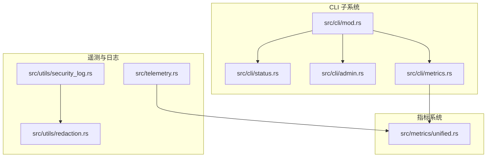
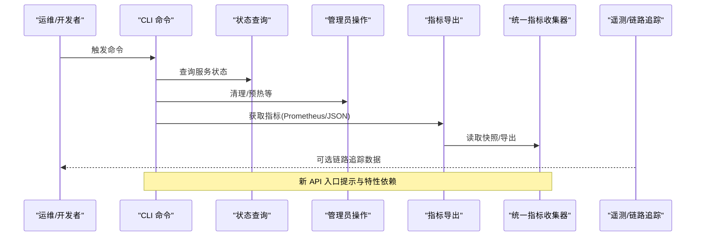
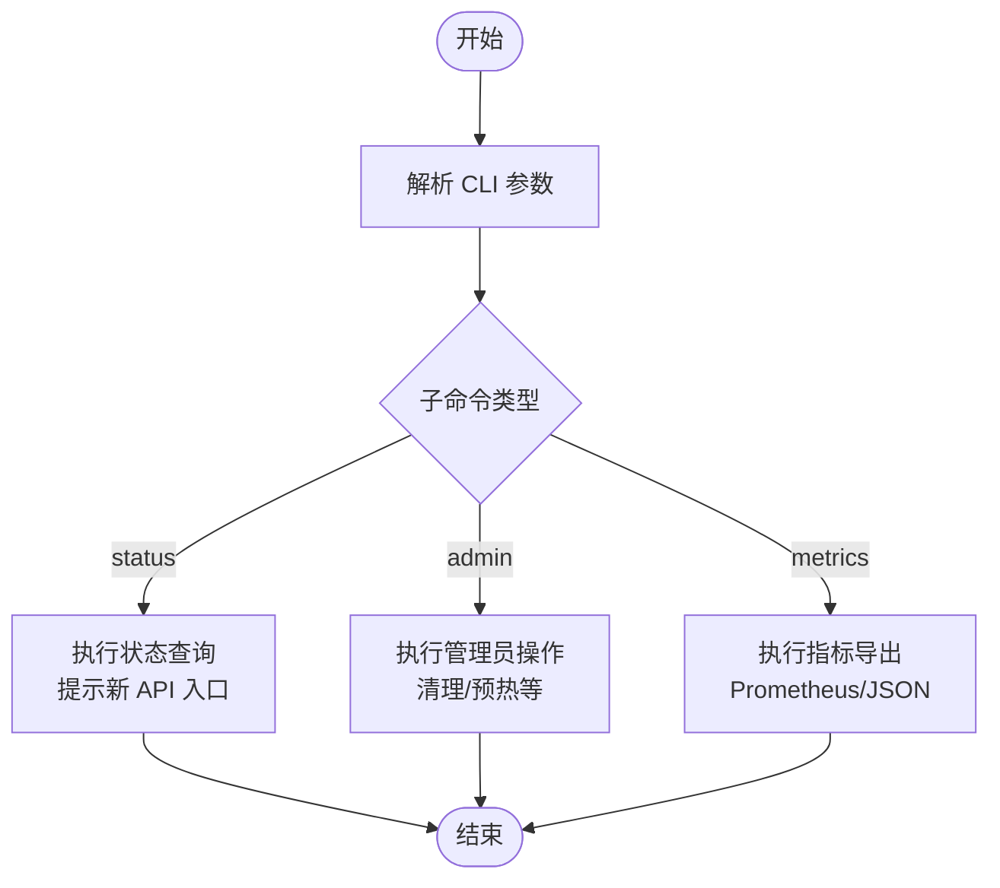
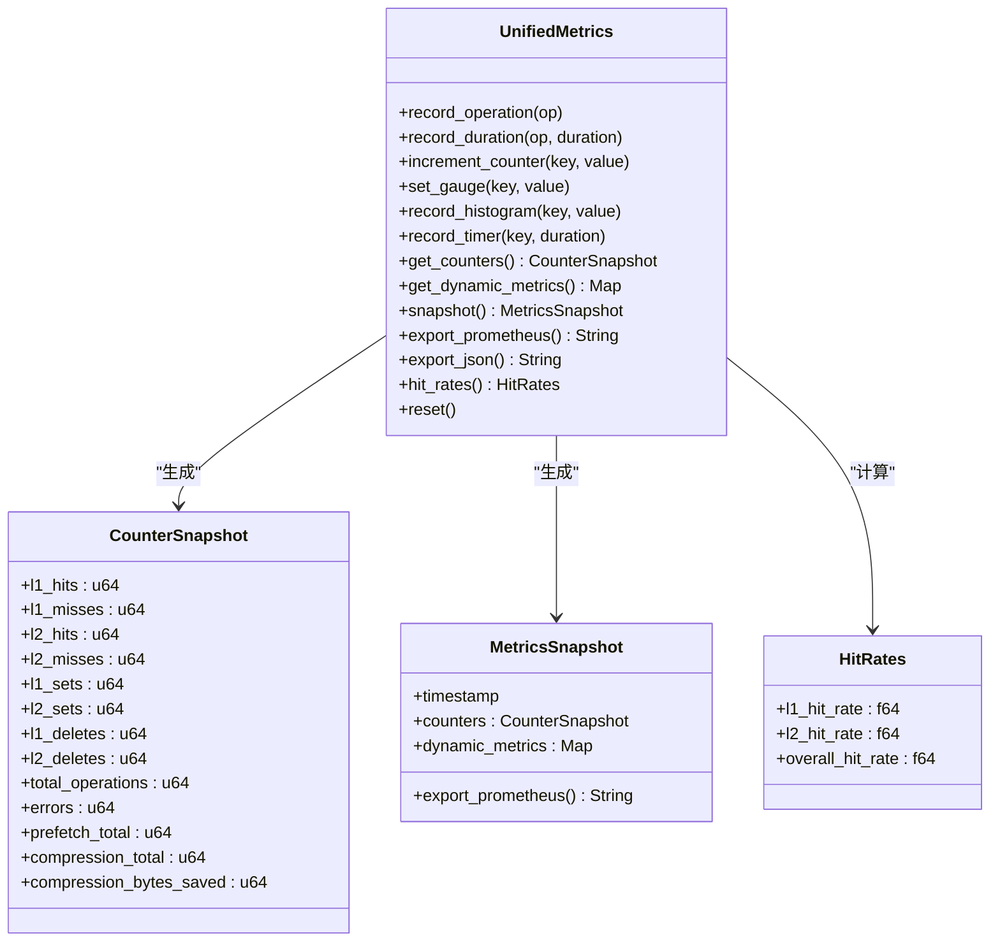
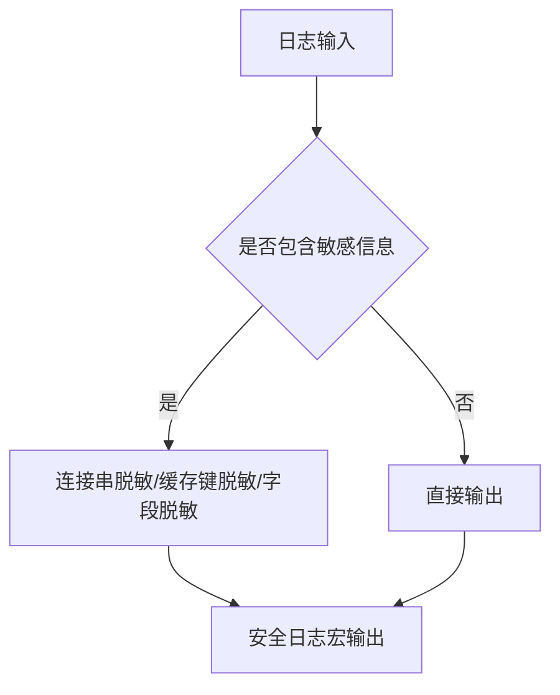

# 调试工具和诊断方法

<cite>
**本文引用的文件**
- [README.md](file://README.md)
- [src/lib.rs](file://src/lib.rs)
- [src/cli/mod.rs](file://src/cli/mod.rs)
- [src/cli/status.rs](file://src/cli/status.rs)
- [src/cli/admin.rs](file://src/cli/admin.rs)
- [src/cli/metrics.rs](file://src/cli/metrics.rs)
- [src/metrics/unified.rs](file://src/metrics/unified.rs)
- [src/telemetry.rs](file://src/telemetry.rs)
- [src/utils/security_log.rs](file://src/utils/security_log.rs)
- [src/utils/redaction.rs](file://src/utils/redaction.rs)
</cite>

## 目录
1. [简介](#简介)
2. [项目结构](#项目结构)
3. [核心组件](#核心组件)
4. [架构总览](#架构总览)
5. [详细组件分析](#详细组件分析)
6. [依赖分析](#依赖分析)
7. [性能考量](#性能考量)
8. [故障排查指南](#故障排查指南)
9. [结论](#结论)
10. [附录](#附录)

## 简介
本指南聚焦 Oxcache 的调试与诊断能力，覆盖 CLI 工具、指标监控、日志脱敏与分析、第三方集成建议、自动化诊断脚本思路以及性能剖析与内存分析方法。文档基于仓库现有实现进行说明，并提供可操作的实践步骤与可视化图示，帮助开发者快速定位问题并优化系统表现。

## 项目结构
Oxcache 将调试与诊断能力分布在以下模块：
- CLI 子系统：提供状态查询、管理操作与指标导出入口
- 指标系统：统一计数器、动态指标、直方图与定时器，支持 Prometheus/JSON 导出
- 遥测与链路追踪：OpenTelemetry 集成入口（可选）
- 安全日志与脱敏：连接串、缓存键、敏感字段自动脱敏



图表来源
- [src/cli/mod.rs](file://src/cli/mod.rs#L10-L66)
- [src/cli/status.rs](file://src/cli/status.rs#L10-L26)
- [src/cli/admin.rs](file://src/cli/admin.rs#L11-L68)
- [src/cli/metrics.rs](file://src/cli/metrics.rs#L10-L25)
- [src/metrics/unified.rs](file://src/metrics/unified.rs#L15-L125)
- [src/telemetry.rs](file://src/telemetry.rs#L26-L56)
- [src/utils/security_log.rs](file://src/utils/security_log.rs#L25-L95)
- [src/utils/redaction.rs](file://src/utils/redaction.rs#L45-L115)

章节来源
- [src/cli/mod.rs](file://src/cli/mod.rs#L10-L66)
- [src/metrics/unified.rs](file://src/metrics/unified.rs#L15-L125)

## 核心组件
- CLI 命令
  - status：查询缓存服务状态（新 API 入口提示）
  - admin：管理员操作（清理、预热等，新 API 入口提示）
  - metrics：获取缓存指标（OpenTelemetry/指标特性要求）
- 指标收集与导出
  - 统一指标收集器：原子计数器、动态指标（计数器/量表/直方图/定时器）、快照与导出
  - 全局实例与便捷函数：便于在业务代码中记录与导出
- 遥测与链路追踪
  - OpenTelemetry Tracing 初始化入口（可选特性）
- 安全日志与脱敏
  - 连接串脱敏、缓存键脱敏、敏感字段脱敏、安全日志宏

章节来源
- [src/cli/mod.rs](file://src/cli/mod.rs#L18-L66)
- [src/cli/status.rs](file://src/cli/status.rs#L10-L26)
- [src/cli/admin.rs](file://src/cli/admin.rs#L11-L68)
- [src/cli/metrics.rs](file://src/cli/metrics.rs#L10-L25)
- [src/metrics/unified.rs](file://src/metrics/unified.rs#L159-L509)
- [src/telemetry.rs](file://src/telemetry.rs#L26-L56)
- [src/utils/security_log.rs](file://src/utils/security_log.rs#L25-L95)
- [src/utils/redaction.rs](file://src/utils/redaction.rs#L45-L115)

## 架构总览
下图展示 CLI、指标系统与遥测之间的交互关系，以及日志脱敏在请求路径中的位置。



图表来源
- [src/cli/mod.rs](file://src/cli/mod.rs#L57-L66)
- [src/cli/status.rs](file://src/cli/status.rs#L17-L25)
- [src/cli/admin.rs](file://src/cli/admin.rs#L11-L19)
- [src/cli/metrics.rs](file://src/cli/metrics.rs#L10-L24)
- [src/metrics/unified.rs](file://src/metrics/unified.rs#L421-L480)
- [src/telemetry.rs](file://src/telemetry.rs#L26-L56)

## 详细组件分析

### CLI 工具使用指南
- 命令入口与子命令
  - status：查询缓存服务状态（当前提示需使用新 API 的构造方式）
  - admin：管理员操作（清理 L1/L2/WAL、缓存预热控制）
  - metrics：获取指标（Prometheus/JSON 输出；需启用指标特性）
- 使用建议
  - 在 CI/CD 中通过 metrics 子命令定期抓取指标，结合外部监控系统
  - 使用 status/admin 作为运维巡检的快捷入口，配合新 API 的健康检查



图表来源
- [src/cli/mod.rs](file://src/cli/mod.rs#L57-L66)
- [src/cli/status.rs](file://src/cli/status.rs#L17-L25)
- [src/cli/admin.rs](file://src/cli/admin.rs#L11-L19)
- [src/cli/metrics.rs](file://src/cli/metrics.rs#L10-L24)

章节来源
- [src/cli/mod.rs](file://src/cli/mod.rs#L18-L66)
- [src/cli/status.rs](file://src/cli/status.rs#L10-L26)
- [src/cli/admin.rs](file://src/cli/admin.rs#L21-L68)
- [src/cli/metrics.rs](file://src/cli/metrics.rs#L10-L25)

### 指标收集与分析方法
- 指标类型
  - 原子计数器：L1/L2 命中/未命中、设置/删除、总操作数、错误数、预取/压缩统计
  - 动态指标：计数器/量表/直方图/定时器，支持自定义键值
  - 快照与导出：Prometheus 文本格式与 JSON（可选序列化特性）
- 关键指标
  - 缓存命中率：L1 命中率、L2 命中率、整体命中率
  - 延迟分布：按操作类型分组的定时器统计
  - 错误统计：错误总数与时序趋势
- 分析建议
  - 结合 P95/P99 延迟与命中率变化定位热点与异常
  - 对比 L1/L2 命中率评估分层策略有效性
  - 利用直方图桶观察尾延迟分布



图表来源
- [src/metrics/unified.rs](file://src/metrics/unified.rs#L159-L509)

章节来源
- [src/metrics/unified.rs](file://src/metrics/unified.rs#L53-L125)
- [src/metrics/unified.rs](file://src/metrics/unified.rs#L159-L509)
- [src/metrics/unified.rs](file://src/metrics/unified.rs#L612-L681)

### 日志级别与日志内容解读
- 日志级别
  - 使用 tracing 子系统，默认控制台订阅器（可扩展为 OTLP）
- 安全日志
  - secure_info/secure_debug：自动脱敏连接串与敏感字段
  - log_cache_key：对缓存键进行脱敏输出
  - sanitize_message：通用消息脱敏
- 脱敏规则
  - 连接串：移除密码部分，保留协议与主机信息
  - 缓存键：匹配敏感模式后进行脱敏
  - 敏感字段：根据字段名识别并脱敏



图表来源
- [src/utils/security_log.rs](file://src/utils/security_log.rs#L25-L95)
- [src/utils/redaction.rs](file://src/utils/redaction.rs#L45-L115)

章节来源
- [src/telemetry.rs](file://src/telemetry.rs#L26-L56)
- [src/utils/security_log.rs](file://src/utils/security_log.rs#L25-L95)
- [src/utils/redaction.rs](file://src/utils/redaction.rs#L45-L115)

### 第三方调试工具集成与使用建议
- OpenTelemetry
  - 通过遥测初始化函数配置 TracerProvider 与 tracing subscriber
  - 生产环境建议接入 OTLP exporter，统一汇聚链路数据
- 监控系统
  - Prometheus：使用 metrics 子命令导出 Prometheus 文本格式
  - Grafana：基于导出指标构建仪表盘（命中率、延迟、错误数）
- 日志平台
  - 结合安全日志宏，避免敏感信息泄露
  - 使用脱敏后的连接串与缓存键进行检索与告警

章节来源
- [src/telemetry.rs](file://src/telemetry.rs#L26-L56)
- [src/cli/metrics.rs](file://src/cli/metrics.rs#L10-L24)
- [src/metrics/unified.rs](file://src/metrics/unified.rs#L469-L480)

### 诊断信息收集与分析流程
- 快速诊断
  - 使用 metrics 子命令导出当前快照，检查命中率与错误数
  - 使用 status/admin 子命令确认服务状态与缓存预热进度
- 深入分析
  - 结合 tracing 输出与链路追踪，定位慢操作与异常节点
  - 使用直方图与定时器统计观察延迟分布
- 自动化脚本建议
  - 定时执行 metrics 导出，写入时序数据库或对象存储
  - 将安全日志宏封装为统一日志工具，规范输出格式

章节来源
- [src/cli/mod.rs](file://src/cli/mod.rs#L57-L66)
- [src/cli/metrics.rs](file://src/cli/metrics.rs#L10-L24)
- [src/metrics/unified.rs](file://src/metrics/unified.rs#L421-L480)

### 性能剖析与内存分析
- 性能剖析
  - 使用指标系统记录关键路径耗时（定时器/直方图）
  - 结合链路追踪定位热点与瓶颈
- 内存分析
  - 建议结合系统工具（如 perf、Valgrind、Massif）与 Rust 内存分析工具（如 cargo-bisect-rustc、cargo-valgrind）
  - 关注 L1/L2 后端的内存占用与 GC 行为（如 Moka）

章节来源
- [src/metrics/unified.rs](file://src/metrics/unified.rs#L275-L382)
- [src/telemetry.rs](file://src/telemetry.rs#L26-L56)

## 依赖分析
- 特性依赖
  - metrics：启用指标特性以使用统一指标收集器与导出
  - opentelemetry：启用遥测特性以使用 OpenTelemetry 集成
  - cli：启用 CLI 特性以使用命令行工具
  - confers：CLI 子命令依赖配置加载能力
- 模块耦合
  - CLI 依赖指标系统进行数据导出
  - 遥测模块与指标系统解耦，可独立启用
  - 安全日志模块依赖脱敏工具，提供统一的安全日志接口

```mermaid
graph LR
Metrics["指标系统"] <- --> CLI["CLI 子系统"]
Telemetry["遥测"] -.-> Metrics
SecurityLog["安全日志"] --> Redaction["脱敏工具"]
CLI --> Confers["配置加载(可选)"]
```

图表来源
- [src/lib.rs](file://src/lib.rs#L449-L460)
- [src/lib.rs](file://src/lib.rs#L483-L485)
- [src/lib.rs](file://src/lib.rs#L670-L680)
- [src/cli/mod.rs](file://src/cli/mod.rs#L57-L66)
- [src/utils/security_log.rs](file://src/utils/security_log.rs#L25-L95)
- [src/utils/redaction.rs](file://src/utils/redaction.rs#L45-L115)

章节来源
- [src/lib.rs](file://src/lib.rs#L449-L460)
- [src/lib.rs](file://src/lib.rs#L483-L485)
- [src/lib.rs](file://src/lib.rs#L670-L680)

## 性能考量
- 指标开销
  - 原子计数器与动态指标采用并发容器，尽量减少锁竞争
  - 直方图与定时器在详细模式下增加内存与 CPU 开销，建议按需开启
- 导出成本
  - Prometheus/JSON 导出为一次性快照，建议在低频周期内执行
- 日志与脱敏
  - 脱敏处理带来少量 CPU 成本，但显著降低安全风险

## 故障排查指南
- CLI 不可用或提示“新 API”
  - 确认已使用新 API 的构造方式（如 Cache::memory()/Cache::redis()）
  - 检查特性启用情况（metrics/opentelemetry/cli/confers）
- 指标为空或未更新
  - 确认已启用指标特性并正确记录操作
  - 检查是否在业务路径中调用记录函数
- 日志泄露风险
  - 使用安全日志宏输出连接串与缓存键
  - 避免直接打印原始连接串与敏感字段

章节来源
- [src/cli/status.rs](file://src/cli/status.rs#L17-L25)
- [src/cli/admin.rs](file://src/cli/admin.rs#L11-L19)
- [src/cli/metrics.rs](file://src/cli/metrics.rs#L10-L24)
- [src/utils/security_log.rs](file://src/utils/security_log.rs#L25-L95)
- [src/utils/redaction.rs](file://src/utils/redaction.rs#L45-L115)

## 结论
Oxcache 提供了从 CLI、指标、遥测到安全日志的完整调试与诊断能力。通过合理启用特性、使用统一指标收集器与安全日志宏、结合第三方监控与链路追踪，能够高效定位问题并持续优化缓存性能。建议在生产环境中开启指标与遥测，并建立自动化导出与告警机制。

## 附录
- 常用命令
  - 查询状态：oxcache status [-s SERVICE] [--verbose]
  - 管理操作：oxcache admin clean|warmup ...
  - 指标导出：oxcache metrics [-s SERVICE] [--prometheus|--json]
- 关键特性开关
  - 指标：metrics
  - 遥测：opentelemetry
  - CLI：cli
  - 配置：confers

章节来源
- [src/cli/mod.rs](file://src/cli/mod.rs#L18-L66)
- [src/lib.rs](file://src/lib.rs#L670-L680)
- [README.md](file://README.md#L113-L115)