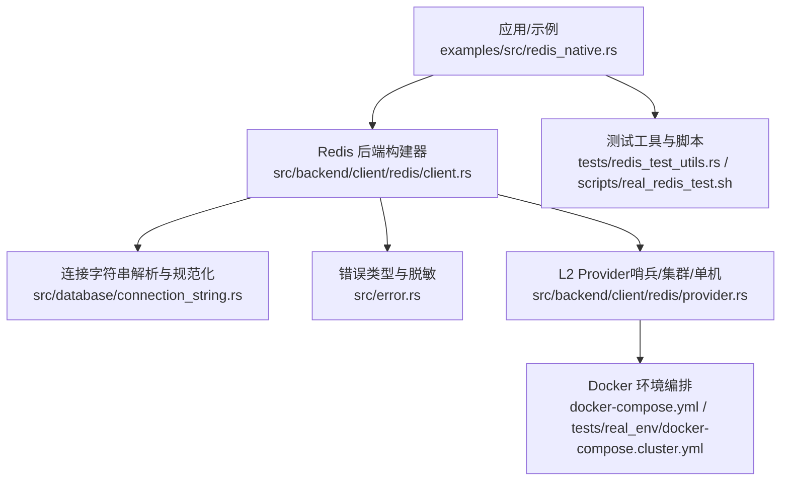
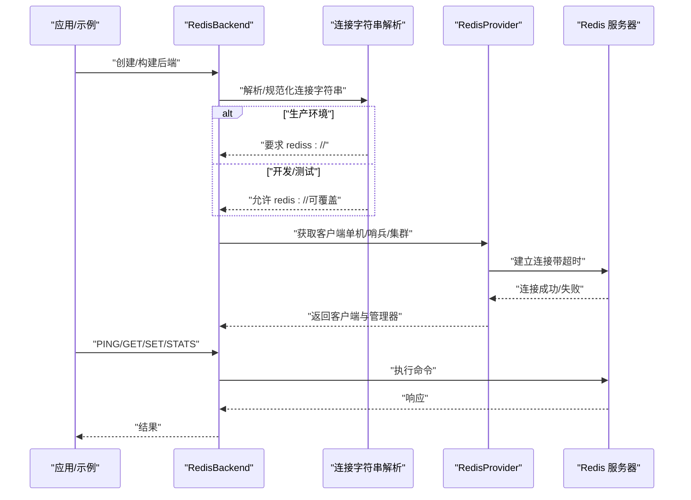
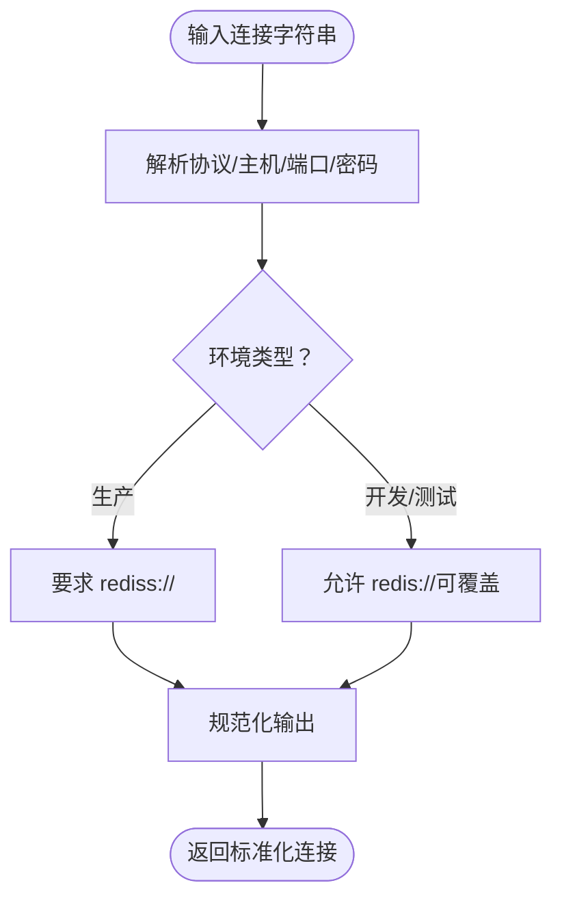
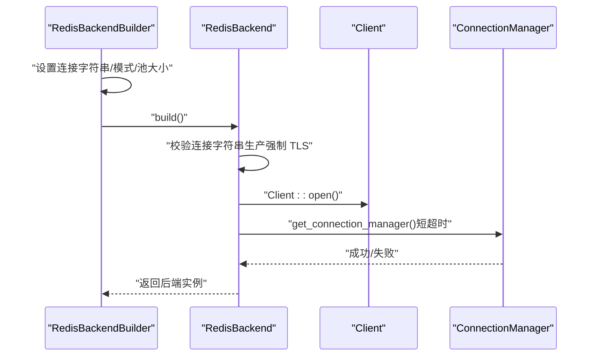
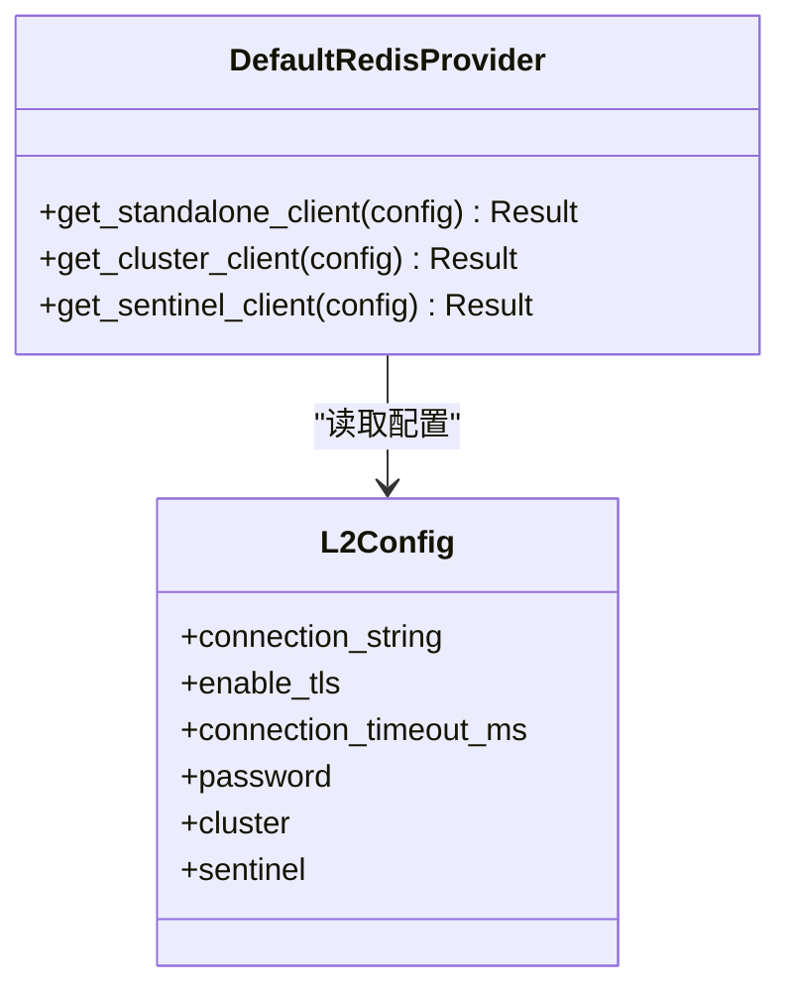
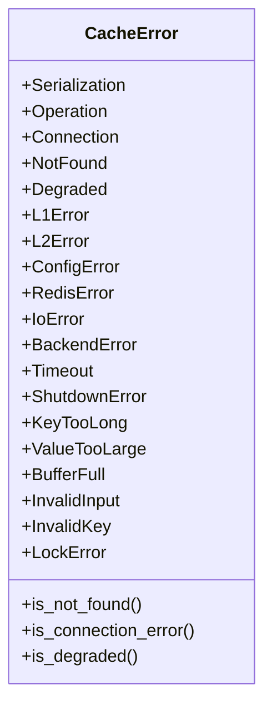
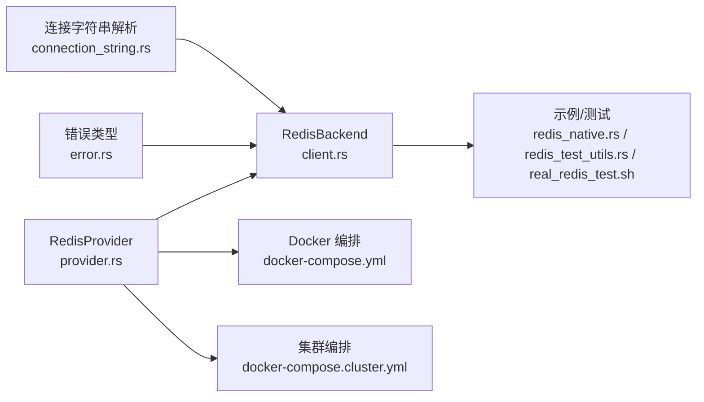

# 连接问题

<cite>
**本文引用的文件**  
- [src/database/connection_string.rs](file://src/database/connection_string.rs)
- [src/backend/client/redis/client.rs](file://src/backend/client/redis/client.rs)
- [src/backend/client/redis/provider.rs](file://src/backend/client/redis/provider.rs)
- [src/error.rs](file://src/error.rs)
- [examples/src/redis_native.rs](file://examples/src/redis_native.rs)
- [docker-compose.yml](file://docker-compose.yml)
- [scripts/real_redis_test.sh](file://scripts/real_redis_test.sh)
- [tests/real_env/docker-compose.cluster.yml](file://tests/real_env/docker-compose.cluster.yml)
- [tests/redis_test_utils.rs](file://tests/redis_test_utils.rs)
- [tests/security/security_tests.rs](file://tests/security/security_tests.rs)
</cite>

## 目录
1. [简介](#简介)
2. [项目结构](#项目结构)
3. [核心组件](#核心组件)
4. [架构总览](#架构总览)
5. [详细组件分析](#详细组件分析)
6. [依赖关系分析](#依赖关系分析)
7. [性能考量](#性能考量)
8. [故障排查指南](#故障排查指南)
9. [结论](#结论)
10. [附录](#附录)

## 简介
本章节面向在使用 Oxcache 的 Redis 缓存时遇到连接问题的用户与运维人员，提供系统化的诊断思路与解决方案。内容涵盖：
- 常见连接失败原因：网络连通性、认证失败、超时设置不当、连接池耗尽、SSL/TLS 配置错误等
- 连接状态检查与诊断工具使用方法
- 连接字符串的正确格式与参数配置
- Docker 环境下的连接问题排查步骤
- 连接重试与退避策略的配置与调优建议
- SSL/TLS 连接的配置与故障排除方法
- 实际连接测试命令与验证步骤

## 项目结构
围绕 Redis 连接问题，本仓库的关键实现与测试分布在如下位置：
- 连接字符串解析与规范化：src/database/connection_string.rs
- Redis 客户端与连接校验：src/backend/client/redis/client.rs
- L2 层 Redis Provider（哨兵/集群/单机）：src/backend/client/redis/provider.rs
- 错误类型与脱敏：src/error.rs
- 示例与测试：examples/src/redis_native.rs、tests/redis_test_utils.rs、scripts/real_redis_test.sh、docker-compose.yml、tests/real_env/docker-compose.cluster.yml
- 安全与超时测试：tests/security/security_tests.rs

**图表来源**
- [examples/src/redis_native.rs](file://examples/src/redis_native.rs#L1-L115)
- [src/backend/client/redis/client.rs](file://src/backend/client/redis/client.rs#L1-L522)
- [src/database/connection_string.rs](file://src/database/connection_string.rs#L1-L1150)
- [src/backend/client/redis/provider.rs](file://src/backend/client/redis/provider.rs#L1-L195)
- [src/error.rs](file://src/error.rs#L1-L289)
- [docker-compose.yml](file://docker-compose.yml#L1-L199)
- [tests/real_env/docker-compose.cluster.yml](file://tests/real_env/docker-compose.cluster.yml#L1-L169)
- [tests/redis_test_utils.rs](file://tests/redis_test_utils.rs#L1-L232)
- [scripts/real_redis_test.sh](file://scripts/real_redis_test.sh#L1-L462)

**章节来源**
- [src/database/connection_string.rs](file://src/database/connection_string.rs#L1-L1150)
- [src/backend/client/redis/client.rs](file://src/backend/client/redis/client.rs#L1-L522)
- [src/backend/client/redis/provider.rs](file://src/backend/client/redis/provider.rs#L1-L195)
- [src/error.rs](file://src/error.rs#L1-L289)
- [examples/src/redis_native.rs](file://examples/src/redis_native.rs#L1-L115)
- [docker-compose.yml](file://docker-compose.yml#L1-L199)
- [tests/real_env/docker-compose.cluster.yml](file://tests/real_env/docker-compose.cluster.yml#L1-L169)
- [tests/redis_test_utils.rs](file://tests/redis_test_utils.rs#L1-L232)
- [scripts/real_redis_test.sh](file://scripts/real_redis_test.sh#L1-L462)

## 核心组件
- 连接字符串解析与规范化：支持 SQLite、MySQL、PostgreSQL、Redis 四类数据库，提供解析、验证、规范化与推荐格式生成能力；Redis 格式为 redis://host:port 或 rediss://host:port（生产强制 TLS）
- Redis 后端与连接校验：在构建阶段快速验证连接可用性（短超时），并提供 PING/HEALTH/CLEAR 等健康检查与统计接口
- L2 Provider：统一管理单机、哨兵、集群三种模式的连接与认证流程，内置超时控制与错误处理
- 错误类型与脱敏：集中定义 CacheError，区分连接、超时、L2/L1 等错误类别，并对连接字符串中的敏感信息进行脱敏输出
- Docker 编排与测试：提供 Redis Standalone/Sentinel/Cluster 的一键编排与真实环境测试脚本

**章节来源**
- [src/database/connection_string.rs](file://src/database/connection_string.rs#L235-L290)
- [src/backend/client/redis/client.rs](file://src/backend/client/redis/client.rs#L79-L213)
- [src/backend/client/redis/provider.rs](file://src/backend/client/redis/provider.rs#L38-L193)
- [src/error.rs](file://src/error.rs#L75-L208)

## 架构总览
下图展示从应用到 Redis 的典型连接路径，以及在不同模式下的差异：

**图表来源**
- [src/backend/client/redis/client.rs](file://src/backend/client/redis/client.rs#L162-L213)
- [src/backend/client/redis/provider.rs](file://src/backend/client/redis/provider.rs#L38-L193)
- [src/database/connection_string.rs](file://src/database/connection_string.rs#L667-L685)

## 详细组件分析

### 组件一：连接字符串解析与规范化（Redis）
- 支持格式：redis://host:port、redis://:password@host:port、rediss://host:port（生产）
- 解析要点：识别密码段、提取主机与端口、校验必填项
- 规范化与推荐：提供标准化输出与按环境生成推荐连接串（开发/测试/生产）
- 安全建议：生产环境强制 rediss://，开发/测试可通过环境变量临时放宽

**图表来源**
- [src/database/connection_string.rs](file://src/database/connection_string.rs#L235-L273)
- [src/database/connection_string.rs](file://src/database/connection_string.rs#L667-L685)

**章节来源**
- [src/database/connection_string.rs](file://src/database/connection_string.rs#L235-L273)
- [src/database/connection_string.rs](file://src/database/connection_string.rs#L667-L685)

### 组件二：RedisBackend 构建与连接校验
- 构建流程：校验连接字符串（生产强制 TLS）、打开 Client、快速获取 ConnectionManager（短超时）
- 健康检查：提供 PING/HEALTH/CLEAR/STATS 等常用接口
- 错误分类：区分连接错误与操作错误，便于上层处理

**图表来源**
- [src/backend/client/redis/client.rs](file://src/backend/client/redis/client.rs#L162-L213)

**章节来源**
- [src/backend/client/redis/client.rs](file://src/backend/client/redis/client.rs#L162-L213)

### 组件三：L2 Provider（单机/哨兵/集群）
- 单机：根据 enable_tls 自动将 redis:// 替换为 rediss://，否则保持原样；超时控制与认证分离
- 哨兵：解析多个哨兵节点，记录主名与节点数，使用 ConnectionManager 自动处理故障转移；单独 AUTH 避免密码泄露
- 集群：构建 ClusterClient，开启从节点读取以提升扩展性，连接超时保护

**图表来源**
- [src/backend/client/redis/provider.rs](file://src/backend/client/redis/provider.rs#L22-L31)
- [src/backend/client/redis/provider.rs](file://src/backend/client/redis/provider.rs#L38-L193)

**章节来源**
- [src/backend/client/redis/provider.rs](file://src/backend/client/redis/provider.rs#L38-L193)

### 组件四：错误类型与脱敏
- 错误分类：Connection、L2Error、RedisError、Timeout 等，便于区分网络、后端、超时等问题
- 脱敏策略：对连接字符串中的密码进行掩码输出，避免日志泄露

**图表来源**
- [src/error.rs](file://src/error.rs#L75-L208)

**章节来源**
- [src/error.rs](file://src/error.rs#L75-L208)

## 依赖关系分析
- RedisBackend 依赖连接字符串解析模块以确保格式正确
- L2 Provider 依赖 redis-rs 的 Client/ConnectionManager/ClusterClient，负责不同模式的连接与认证
- 错误模块统一对外暴露错误类型，便于上层进行差异化处理
- Docker 编排与测试脚本为真实环境下的连接验证提供支撑

**图表来源**
- [src/database/connection_string.rs](file://src/database/connection_string.rs#L1-L1150)
- [src/backend/client/redis/client.rs](file://src/backend/client/redis/client.rs#L1-L522)
- [src/backend/client/redis/provider.rs](file://src/backend/client/redis/provider.rs#L1-L195)
- [src/error.rs](file://src/error.rs#L1-L289)
- [docker-compose.yml](file://docker-compose.yml#L1-L199)
- [tests/real_env/docker-compose.cluster.yml](file://tests/real_env/docker-compose.cluster.yml#L1-L169)
- [examples/src/redis_native.rs](file://examples/src/redis_native.rs#L1-L115)
- [tests/redis_test_utils.rs](file://tests/redis_test_utils.rs#L1-L232)
- [scripts/real_redis_test.sh](file://scripts/real_redis_test.sh#L1-L462)

**章节来源**
- [src/database/connection_string.rs](file://src/database/connection_string.rs#L1-L1150)
- [src/backend/client/redis/client.rs](file://src/backend/client/redis/client.rs#L1-L522)
- [src/backend/client/redis/provider.rs](file://src/backend/client/redis/provider.rs#L1-L195)
- [src/error.rs](file://src/error.rs#L1-L289)
- [docker-compose.yml](file://docker-compose.yml#L1-L199)
- [tests/real_env/docker-compose.cluster.yml](file://tests/real_env/docker-compose.cluster.yml#L1-L169)
- [examples/src/redis_native.rs](file://examples/src/redis_native.rs#L1-L115)
- [tests/redis_test_utils.rs](file://tests/redis_test_utils.rs#L1-L232)
- [scripts/real_redis_test.sh](file://scripts/real_redis_test.sh#L1-L462)

## 性能考量
- 连接池：当前 RedisBackend 字段中包含 pool_size，但注释提示未来结合 r2d2/mobc 使用；建议在高并发场景下评估连接池大小与复用策略
- 超时设置：构建阶段使用短超时快速失败，避免阻塞启动；L2 Provider 对连接与命令分别设置超时，需结合业务场景调优
- 只读扩展：集群模式启用从节点读取以提升读扩展性
- 健康检查：提供 PING/HEALTH/STATS 接口，便于监控与自愈

[本节为通用指导，无需具体文件分析]

## 故障排查指南

### 一、常见连接失败原因与定位
- 网络连通性
  - 使用测试工具检测目标 URL 是否可达，支持单机、集群、哨兵模式等待与探测
  - Docker 环境下确认容器网络与端口映射
- 认证失败
  - 检查连接字符串中密码格式与位置；哨兵模式下单独 AUTH 避免密码泄露
  - 生产环境必须使用 rediss://，开发/测试可通过环境变量放宽
- 超时设置不当
  - 构建阶段短超时用于快速失败；L2 Provider 的连接/命令超时需结合网络状况与负载调整
- 连接池耗尽
  - 评估并发与池大小；关注连接复用与释放
- SSL/TLS 配置错误
  - 生产必须使用 rediss://；证书/主机名校验失败会导致连接失败

**章节来源**
- [tests/redis_test_utils.rs](file://tests/redis_test_utils.rs#L78-L158)
- [src/backend/client/redis/provider.rs](file://src/backend/client/redis/provider.rs#L44-L54)
- [src/backend/client/redis/client.rs](file://src/backend/client/redis/client.rs#L167-L205)
- [src/database/connection_string.rs](file://src/database/connection_string.rs#L667-L685)

### 二、连接状态检查与诊断工具
- 健康检查接口
  - PING：快速判断服务器可用性
  - HEALTH：返回布尔值表示健康状态
  - STATS：返回内存等关键指标
- 连接字符串脱敏输出
  - 对日志中的连接字符串进行密码掩码，避免泄露
- 超时测试
  - 单元测试中对 PING 设置超时，验证超时行为

**章节来源**
- [src/backend/client/redis/client.rs](file://src/backend/client/redis/client.rs#L117-L131)
- [src/backend/client/redis/client.rs](file://src/backend/client/redis/client.rs#L455-L498)
- [src/error.rs](file://src/error.rs#L12-L43)
- [tests/security/security_tests.rs](file://tests/security/security_tests.rs#L113-L127)

### 三、连接字符串的正确格式与参数配置
- Redis 格式
  - 单机：redis://host:port 或 redis://:password@host:port
  - 生产：rediss://host:port（强制 TLS）
- 环境推荐
  - 开发/测试：redis://host:port
  - 生产：rediss://host:port（可选密码）
- 参数建议
  - 建议显式设置连接/命令超时，避免默认值导致的不稳定

**章节来源**
- [src/database/connection_string.rs](file://src/database/connection_string.rs#L235-L273)
- [src/database/connection_string.rs](file://src/database/connection_string.rs#L667-L685)

### 四、Docker 环境下的连接问题排查步骤
- 启动服务
  - 使用 docker-compose 启动 Redis Standalone/Sentinel/Cluster
  - 等待健康检查通过
- 验证连通性
  - 使用 redis-cli 或内部脚本进行 PING/SCAN/CLUSTER INFO 等验证
- 故障转移与压力测试
  - 通过真实环境测试脚本模拟故障与恢复，观察重连与性能表现

**章节来源**
- [docker-compose.yml](file://docker-compose.yml#L1-L199)
- [tests/real_env/docker-compose.cluster.yml](file://tests/real_env/docker-compose.cluster.yml#L1-L169)
- [scripts/real_redis_test.sh](file://scripts/real_redis_test.sh#L52-L121)
- [scripts/real_redis_test.sh](file://scripts/real_redis_test.sh#L129-L149)

### 五、连接重试机制的配置与调优建议
- 构建阶段短超时用于快速失败，避免阻塞启动
- L2 Provider 对连接/命令分别设置超时，建议结合业务场景调优
- 建议在应用层引入指数退避重试策略，避免雪崩效应
- 健康检查与熔断配合，降低对下游的压力

**章节来源**
- [src/backend/client/redis/client.rs](file://src/backend/client/redis/client.rs#L185-L205)
- [src/backend/client/redis/provider.rs](file://src/backend/client/redis/provider.rs#L57-L78)
- [scripts/real_redis_test.sh](file://scripts/real_redis_test.sh#L144-L147)

### 六、SSL/TLS 连接的配置与故障排除
- 生产环境强制使用 rediss://
- 如需在开发/测试放宽，可通过环境变量覆盖（仅限开发/测试）
- 若出现 TLS 握手失败，检查证书链、主机名与防火墙策略

**章节来源**
- [src/backend/client/redis/client.rs](file://src/backend/client/redis/client.rs#L167-L179)
- [src/database/connection_string.rs](file://src/database/connection_string.rs#L667-L685)

### 七、实际连接测试命令与验证步骤
- 示例程序
  - 使用示例创建 Redis 缓存，执行 SET/GET/DELETE/CLEAR/STATS
- 基础命令
  - PING：确认服务器可达
  - GET/SET：验证读写
  - CLUSTER INFO（集群）：确认集群状态
  - SENTINEL masters（哨兵）：确认主节点列表
- 等待与探测
  - 等待 Redis/哨兵/集群就绪后再执行测试

**章节来源**
- [examples/src/redis_native.rs](file://examples/src/redis_native.rs#L20-L115)
- [tests/redis_test_utils.rs](file://tests/redis_test_utils.rs#L24-L51)
- [tests/redis_test_utils.rs](file://tests/redis_test_utils.rs#L96-L158)

## 结论
- Redis 连接问题多源于格式错误、认证失败、超时不当与 TLS 配置不当
- 通过连接字符串规范化、快速连接校验、健康检查与脱敏日志，可显著提升诊断效率
- Docker 编排与真实环境测试脚本提供了可复现的验证路径
- 建议在生产环境强制 TLS，在应用层实施合理的重试与退避策略，并结合健康检查与熔断机制保障稳定性

[本节为总结，无需具体文件分析]

## 附录

### A. 连接字符串格式对照表
- 单机（开发/测试）：redis://host:port
- 单机（生产）：rediss://host:port
- 带密码：redis://:password@host:port
- 哨兵：sentinel://host:port[,host2:port2]*master
- 集群：redis://host:port[,host2:port2]*（多节点）

**章节来源**
- [src/database/connection_string.rs](file://src/database/connection_string.rs#L235-L273)
- [src/database/connection_string.rs](file://src/database/connection_string.rs#L667-L685)

### B. 常用命令与验证清单
- PING：确认连通性
- GET/SET：验证读写
- CLUSTER INFO：集群状态
- SENTINEL masters：哨兵主节点
- 等待就绪：轮询直到可用

**章节来源**
- [tests/redis_test_utils.rs](file://tests/redis_test_utils.rs#L78-L158)
- [scripts/real_redis_test.sh](file://scripts/real_redis_test.sh#L129-L149)
