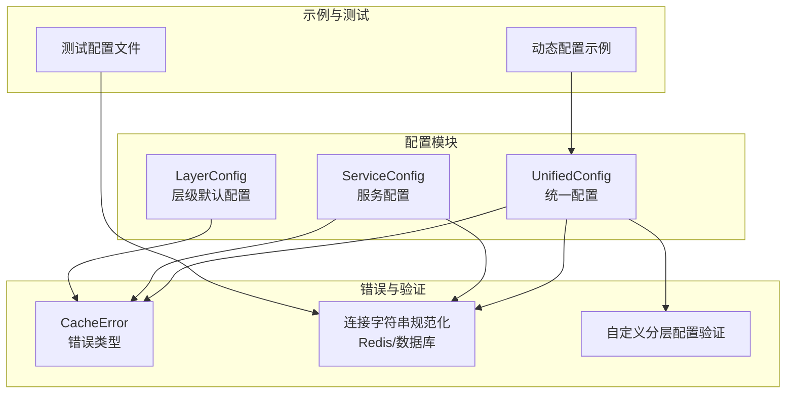
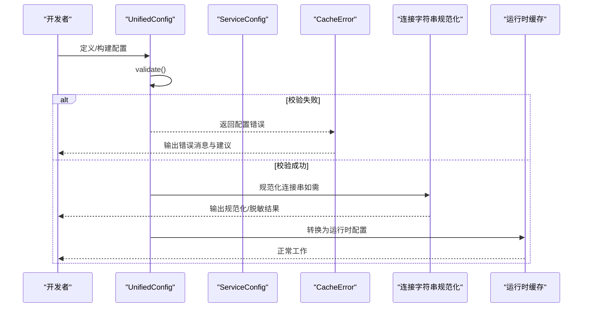
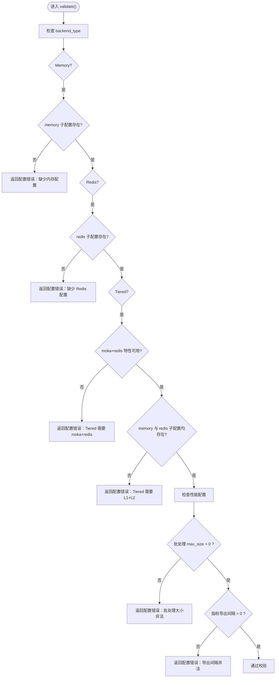
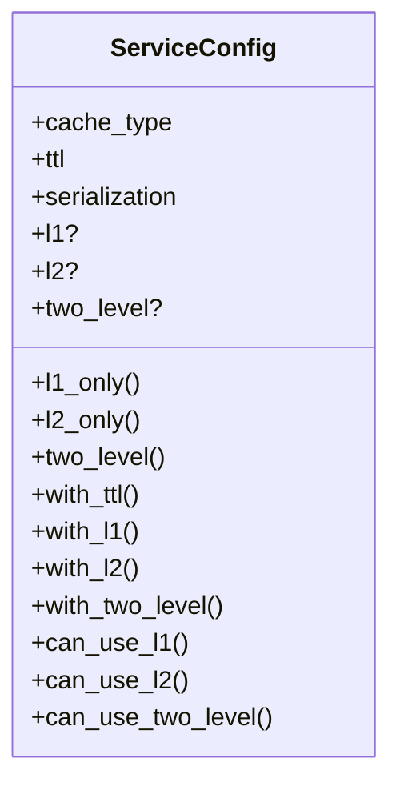
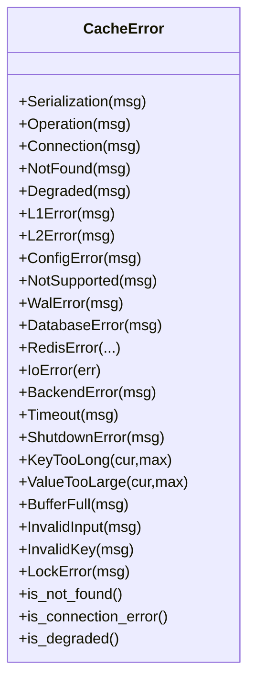
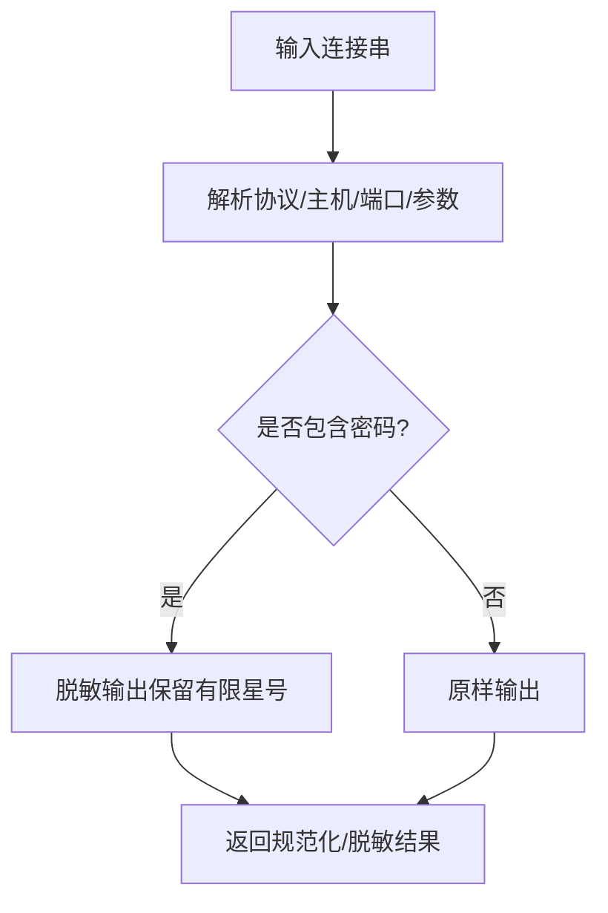
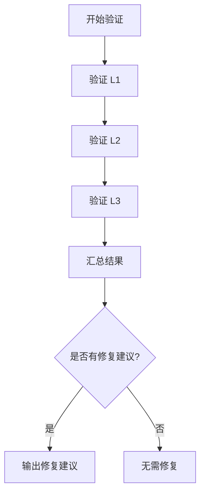
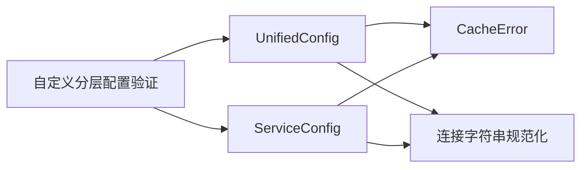

# 配置问题

<cite>
**本文引用的文件**
- [src/config/mod.rs](file://src/config/mod.rs)
- [src/config/unified.rs](file://src/config/unified.rs)
- [src/config/service.rs](file://src/config/service.rs)
- [src/config/layer.rs](file://src/config/layer.rs)
- [src/error.rs](file://src/error.rs)
- [src/database/connection_string.rs](file://src/database/connection_string.rs)
- [src/backend/custom_tiered.rs](file://src/backend/custom_tiered.rs)
- [examples/src/dynamic_config.rs](file://examples/src/dynamic_config.rs)
- [tests/test_config.toml](file://tests/test_config.toml)
- [src/lib.rs](file://src/lib.rs)
</cite>

## 目录
1. [简介](#简介)
2. [项目结构](#项目结构)
3. [核心组件](#核心组件)
4. [架构总览](#架构总览)
5. [详细组件分析](#详细组件分析)
6. [依赖关系分析](#依赖关系分析)
7. [性能考量](#性能考量)
8. [故障排查指南](#故障排查指南)
9. [结论](#结论)
10. [附录](#附录)

## 简介
本指南聚焦于 oxcache 的配置问题诊断与解决，覆盖常见配置错误类型（连接字符串格式、Redis URL 配置、序列化器配置、后端配置冲突等），并结合仓库中的统一配置模型、错误类型与验证逻辑，给出可操作的错误消息解读、修复步骤、最佳实践与动态配置更新的排障方法。同时提供配置模板与示例路径，帮助快速定位与修正配置问题。

## 项目结构
配置相关能力主要由统一配置模块与服务配置模块构成，并通过错误类型与连接字符串规范化工具提供验证与诊断能力；动态配置示例展示了运行时配置管理思路。

**图表来源**
- [src/config/unified.rs](file://src/config/unified.rs#L1-L987)
- [src/config/service.rs](file://src/config/service.rs#L1-L682)
- [src/config/layer.rs](file://src/config/layer.rs#L1-L298)
- [src/error.rs](file://src/error.rs#L1-L289)
- [src/database/connection_string.rs](file://src/database/connection_string.rs#L491-L1149)
- [src/backend/custom_tiered.rs](file://src/backend/custom_tiered.rs#L1038-L1240)
- [examples/src/dynamic_config.rs](file://examples/src/dynamic_config.rs#L1-L133)
- [tests/test_config.toml](file://tests/test_config.toml#L1-L32)

**章节来源**
- [src/config/mod.rs](file://src/config/mod.rs#L1-L32)
- [src/config/unified.rs](file://src/config/unified.rs#L1-L987)
- [src/config/service.rs](file://src/config/service.rs#L1-L682)
- [src/config/layer.rs](file://src/config/layer.rs#L1-L298)
- [src/error.rs](file://src/error.rs#L1-L289)
- [src/database/connection_string.rs](file://src/database/connection_string.rs#L491-L1149)
- [src/backend/custom_tiered.rs](file://src/backend/custom_tiered.rs#L1038-L1240)
- [examples/src/dynamic_config.rs](file://examples/src/dynamic_config.rs#L1-L133)
- [tests/test_config.toml](file://tests/test_config.toml#L1-L32)

## 核心组件
- 统一配置（UnifiedConfig）：集中管理后端类型、性能、监控、安全等配置，并内置基础校验。
- 服务配置（ServiceConfig）：面向单服务的缓存配置，按特性开关暴露 L1/L2/双层配置。
- 层级默认配置（LayerConfig）：提供 L1/L2/双层的默认配置模板，便于继承与复用。
- 错误类型（CacheError）：统一的错误语义，包含配置错误、连接错误、序列化错误等，便于诊断。
- 连接字符串规范化（connection_string.rs）：对 Redis/数据库连接串进行标准化与脱敏输出，辅助定位 URL 问题。
- 自定义分层配置验证（custom_tiered.rs）：提供分层配置的验证与修复建议，输出可读性报告。

**章节来源**
- [src/config/unified.rs](file://src/config/unified.rs#L17-L33)
- [src/config/service.rs](file://src/config/service.rs#L105-L128)
- [src/config/layer.rs](file://src/config/layer.rs#L14-L47)
- [src/error.rs](file://src/error.rs#L75-L208)
- [src/database/connection_string.rs](file://src/database/connection_string.rs#L518-L538)
- [src/backend/custom_tiered.rs](file://src/backend/custom_tiered.rs#L1038-L1240)

## 架构总览
统一配置模块贯穿“配置定义—构建—校验—转换—运行时使用”的闭环，配合错误类型与连接字符串规范化，形成可诊断、可修复的配置体系。

**图表来源**
- [src/config/unified.rs](file://src/config/unified.rs#L548-L608)
- [src/error.rs](file://src/error.rs#L127-L130)
- [src/database/connection_string.rs](file://src/database/connection_string.rs#L518-L538)

## 详细组件分析

### 统一配置（UnifiedConfig）与校验
- 后端类型与必填项校验：Memory/Redis/Tiered/Custom 各自要求的子配置必须提供，否则抛出配置错误。
- 性能配置校验：批处理最大尺寸必须大于 0；指标导出间隔必须大于 0。
- 转换为 Redis 配置：将统一配置映射为 Redis 客户端配置，便于下游使用。

**图表来源**
- [src/config/unified.rs](file://src/config/unified.rs#L548-L608)

**章节来源**
- [src/config/unified.rs](file://src/config/unified.rs#L548-L662)

### 服务配置（ServiceConfig）与特性开关
- 按特性暴露 L1/L2/双层配置：moka 特性开启时提供 L1；redis 特性开启时提供 L2 与 TwoLevel。
- 提供便捷构造函数与链式设置方法，便于组合不同缓存类型。
- 无法使用某层时会降级为可用部分，避免编译期报错。

**图表来源**
- [src/config/service.rs](file://src/config/service.rs#L105-L297)

**章节来源**
- [src/config/service.rs](file://src/config/service.rs#L105-L297)

### 层级默认配置（LayerConfig）
- 提供 L1/L2/双层的默认容量、TTL、超时、淘汰策略等模板，便于快速搭建。
- 可通过 with_* 方法定制，降低重复配置成本。

**章节来源**
- [src/config/layer.rs](file://src/config/layer.rs#L14-L206)

### 错误类型（CacheError）与错误消息解读
- 配置错误（ConfigError）：配置不完整或不合法时触发，提示检查配置文件与必填项。
- 连接错误（Connection/RedisError/L2Error）：网络连通性或服务器状态异常，建议检查地址、端口、认证与可达性。
- 序列化错误（Serialization）：数据格式与序列化器不匹配，建议核对序列化格式与阈值。
- 其他错误：键过长、值过大、缓冲区满、锁错误等，分别对应不同限制与并发场景。

**图表来源**
- [src/error.rs](file://src/error.rs#L75-L208)

**章节来源**
- [src/error.rs](file://src/error.rs#L75-L208)

### 连接字符串规范化与诊断
- 对 Redis/数据库连接串进行规范化与脱敏输出，便于在日志中安全展示。
- 支持屏蔽密码等敏感信息，避免泄露。

**图表来源**
- [src/database/connection_string.rs](file://src/database/connection_string.rs#L518-L538)
- [src/error.rs](file://src/error.rs#L12-L43)

**章节来源**
- [src/database/connection_string.rs](file://src/database/connection_string.rs#L491-L1149)
- [src/error.rs](file://src/error.rs#L12-L43)

### 自定义分层配置验证与修复建议
- 对 L1/L2/L3 各层进行独立验证，记录无效层与修复建议。
- 若启用自动修复，可生成从当前后端类型到推荐类型的修复建议，输出可读性报告。

**图表来源**
- [src/backend/custom_tiered.rs](file://src/backend/custom_tiered.rs#L1038-L1240)

**章节来源**
- [src/backend/custom_tiered.rs](file://src/backend/custom_tiered.rs#L1038-L1240)

### 动态配置更新排障
- 示例展示了以缓存存储配置键值的方式，支持初始化、查询、更新、导出与分组统计。
- 排障要点：确认缓存可用、键空间命名规范、序列化格式一致、TTL 合理设置、并发访问控制。

**章节来源**
- [examples/src/dynamic_config.rs](file://examples/src/dynamic_config.rs#L1-L133)

## 依赖关系分析
- 统一配置依赖错误类型与连接字符串规范化，用于校验与诊断。
- 服务配置按特性开关决定可用的子配置，避免在不满足条件下编译失败。
- 自定义分层配置验证依赖后端类型与推荐策略，输出修复建议。

**图表来源**
- [src/config/unified.rs](file://src/config/unified.rs#L1-L987)
- [src/config/service.rs](file://src/config/service.rs#L1-L682)
- [src/error.rs](file://src/error.rs#L1-L289)
- [src/database/connection_string.rs](file://src/database/connection_string.rs#L491-L1149)
- [src/backend/custom_tiered.rs](file://src/backend/custom_tiered.rs#L1038-L1240)

**章节来源**
- [src/config/unified.rs](file://src/config/unified.rs#L1-L987)
- [src/config/service.rs](file://src/config/service.rs#L1-L682)
- [src/error.rs](file://src/error.rs#L1-L289)
- [src/database/connection_string.rs](file://src/database/connection_string.rs#L491-L1149)
- [src/backend/custom_tiered.rs](file://src/backend/custom_tiered.rs#L1038-L1240)

## 性能考量
- 批处理与并发：合理设置批大小、批超时与并发队列，避免阻塞与资源耗尽。
- 序列化与压缩：根据数据体量选择合适格式与阈值，平衡 CPU 与带宽。
- 指标导出：设置合理的导出间隔与保留周期，避免频繁 I/O 与存储压力。

[本节为通用指导，无需列出具体文件来源]

## 故障排查指南

### 常见配置错误类型与修复步骤
- 连接字符串格式错误
  - 现象：连接失败、认证失败、URL 解析异常。
  - 诊断：使用连接字符串规范化工具输出规范化/脱敏结果，确认协议、主机、端口、密码、数据库等字段。
  - 修复：确保使用标准 Redis URL 格式，必要时通过环境变量注入密码，避免明文硬编码。
  - 参考：连接字符串规范化与脱敏逻辑。

- Redis URL 配置问题
  - 现象：认证失败、超时、网络不可达。
  - 诊断：检查连接模式（standalone/sentinel/cluster）、连接串、密码、数据库编号、连接名。
  - 修复：根据部署模式调整连接串与认证参数；为生产环境设置更长的超时与合适的池大小。
  - 参考：统一配置中的 Redis 连接与池配置。

- 序列化器配置错误
  - 现象：序列化/反序列化失败、数据损坏、格式不兼容。
  - 诊断：核对序列化格式、零拷贝开关、压缩阈值；确认数据类型与序列化器兼容。
  - 修复：在支持的特性下启用相应序列化器，调整阈值与开关。
  - 参考：统一配置中的序列化配置。

- 后端配置冲突
  - 现象：Tiered 配置缺失 L1/L2、特性不满足、后端类型不支持。
  - 诊断：检查 backend_type 与子配置是否齐全；确认 moka/redis 特性是否启用。
  - 修复：补齐 L1/L2 配置；启用所需特性；或降级为 Memory/Redis 单层配置。
  - 参考：统一配置校验逻辑。

- 指标导出与批处理配置
  - 现象：指标导出间隔为 0、批处理大小为 0、队列溢出。
  - 诊断：检查导出间隔与批处理参数；观察队列长度与并发。
  - 修复：设置大于 0 的导出间隔与批大小；调整并发与队列上限。
  - 参考：统一配置校验逻辑。

- 动态配置更新故障
  - 现象：配置未生效、键冲突、序列化不一致。
  - 诊断：确认缓存可用、键命名规范、序列化格式一致、TTL 设置合理。
  - 修复：使用示例中的键空间与序列化方式；在更新后重新查询验证。
  - 参考：动态配置示例。

**章节来源**
- [src/database/connection_string.rs](file://src/database/connection_string.rs#L518-L538)
- [src/config/unified.rs](file://src/config/unified.rs#L548-L608)
- [src/config/unified.rs](file://src/config/unified.rs#L134-L145)
- [examples/src/dynamic_config.rs](file://examples/src/dynamic_config.rs#L1-L133)

### 配置验证机制与错误检测方法
- 统一配置 validate：集中校验后端类型、批处理、指标导出等关键参数。
- 自定义分层验证：对 L1/L2/L3 各层独立验证，输出无效层与修复建议。
- 连接字符串规范化：标准化与脱敏输出，辅助定位 URL 问题。
- 错误类型语义化：通过 CacheError 的细分类型快速定位问题类别。

**章节来源**
- [src/config/unified.rs](file://src/config/unified.rs#L548-L608)
- [src/backend/custom_tiered.rs](file://src/backend/custom_tiered.rs#L1038-L1240)
- [src/error.rs](file://src/error.rs#L75-L208)

### 错误消息解读与修复步骤
- 配置错误：检查必填子配置与特性开关，补齐缺失项。
- 连接错误：核对地址、端口、认证、超时与网络连通性。
- 序列化错误：确认序列化格式与阈值，确保数据类型兼容。
- 其他限制类错误：键过长、值过大、缓冲区满等，调整参数或优化数据结构。

**章节来源**
- [src/error.rs](file://src/error.rs#L127-L208)

### 配置文件最佳实践与常见陷阱
- 最佳实践
  - 使用环境变量注入敏感信息（如数据库/Redis 密码），避免硬编码。
  - 为生产环境设置合理的超时、池大小与 TTL。
  - 启用指标导出与健康检查，定期评估性能。
  - 使用层级默认配置作为起点，按需微调。
- 常见陷阱
  - 忘记启用 moka/redis 特性导致 Tiered 或 L1/L2 不可用。
  - 批处理大小或导出间隔设为 0。
  - Redis URL 缺少密码或格式不正确。
  - 序列化格式与数据类型不匹配。

**章节来源**
- [tests/test_config.toml](file://tests/test_config.toml#L1-L32)
- [src/config/layer.rs](file://src/config/layer.rs#L85-L206)
- [src/config/unified.rs](file://src/config/unified.rs#L548-L608)

### 动态配置更新的故障排除方法
- 使用缓存存储配置键值，支持初始化、查询、更新、导出与分组统计。
- 排障重点：缓存可用性、键空间命名、序列化一致性、TTL 合理设置、并发访问控制。
- 参考示例路径：examples/src/dynamic_config.rs

**章节来源**
- [examples/src/dynamic_config.rs](file://examples/src/dynamic_config.rs#L1-L133)

### 配置模板与示例
- 统一配置模板
  - 内存-only：参考统一配置的 memory_only 构建器。
  - Redis-only：参考统一配置的 redis_only 构建器。
  - Tiered：在具备 moka 与 redis 特性时使用 tiered 构建器。
  - 生产级 Redis：参考统一配置的生产级示例。
- 服务配置模板
  - L1/L2/TwoLevel 的便捷构造函数与链式设置方法。
- 动态配置示例
  - 使用缓存存储配置键值，演示初始化、查询、更新、导出与分组统计。

**章节来源**
- [src/config/unified.rs](file://src/config/unified.rs#L610-L800)
- [src/config/service.rs](file://src/config/service.rs#L140-L297)
- [examples/src/dynamic_config.rs](file://examples/src/dynamic_config.rs#L1-L133)

## 结论
通过统一配置模型、特性开关、错误类型与连接字符串规范化，oxcache 提供了完善的配置诊断与修复能力。遵循本文提供的排障流程与最佳实践，可显著降低配置错误带来的风险与维护成本。对于动态配置，建议采用示例中的键值缓存方案，并结合统一配置的校验与转换能力，实现稳定可靠的运行时配置管理。

[本节为总结性内容，无需列出具体文件来源]

## 附录
- 特性开关与功能对照
  - moka：启用 L1 内存缓存（Moka）。
  - redis：启用 L2 分布式缓存（Redis）。
  - serialization：启用 JSON/Bincode 序列化。
  - metrics：启用指标导出。
  - wal-recovery：启用预写日志恢复。
  - batch-write：启用优化的批量写入。
  - full：启用全部特性。

**章节来源**
- [src/lib.rs](file://src/lib.rs#L147-L156)
