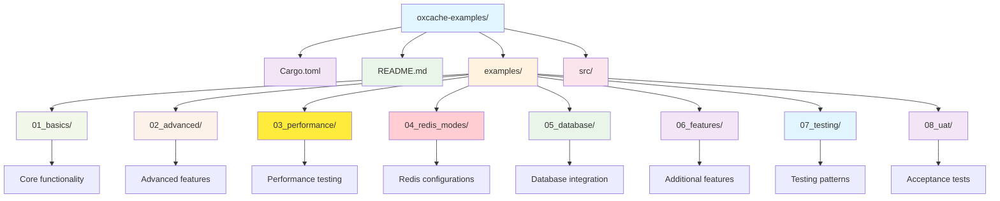

# Oxcache Examples

A comprehensive collection of examples demonstrating how to use [Oxcache](https://github.com/kirky-x/oxcache), a high-performance two-level caching library for Rust.

## What is Oxcache?

Oxcache provides a seamless L1 (Moka in-memory cache) + L2 (Redis distributed cache) architecture:
- **Extreme Performance**: L1 nanosecond response, L2 millisecond response
- **Zero-Code Changes**: Enable caching with a single `#[cached]` macro
- **Automatic Failover**: Graceful degradation on Redis failure
- **Multi-Instance Consistency**: Pub/Sub + version-based invalidation sync

## Quick Start

```bash
# Run a specific example
cargo run --example example_basic_operations

# List all available examples
cargo run --example --list

# Run all examples
cargo test --examples
```

## Learning Path

Follow these modules to learn Oxcache from basics to advanced usage:

### Beginner (Start Here)

| Module | Description | Examples |
|--------|-------------|----------|
| [01_basics](./examples/01_basics/) | Core functionality | macro usage, manual cache, serialization, CRUD |
| [02_advanced](./examples/02_advanced/) | Advanced features | batch write, cache promotion, invalidation, warmup |

### Intermediate

| Module | Description | Examples |
|--------|-------------|----------|
| [03_performance](./examples/03_performance/) | Performance testing | benchmarks, stress tests |
| [04_redis_modes](./examples/04_redis_modes/) | Redis configurations | standalone, sentinel, cluster, TLS |

### Advanced

| Module | Description | Examples |
|--------|-------------|----------|
| [05_database](./examples/05_database/) | Database integration | SQLite, PostgreSQL, MySQL, partitioning |
| [06_features](./examples/06_features/) | Additional features | bloom filter, rate limiting, metrics |

### Expert

| Module | Description | Examples |
|--------|-------------|----------|
| [07_testing](./examples/07_testing/) | Testing patterns | unit tests, integration tests, mock tests |
| [08_uat](./examples/08_uat/) | Acceptance tests | functional, performance, security UAT |

## Prerequisites

- Rust 1.75+
- Redis 6.0+ (for L2 cache examples)
- Docker (optional, for database examples)

## Project Structure



## Examples by Category

### 01_basics - Core Functionality

- `example_basic_operations` - Basic CRUD operations (Get, Set, Delete)
- `example_comprehensive_usage` - Comprehensive demo of macros, manual control, and serialization
- `example_cached_macro` - #[cached] macro usage demonstration
- `example_serialization` - JSON vs Bincode serialization comparison

### 02_advanced - Advanced Features

- `example_batch_write` - Batch write optimization for improved throughput
- `example_cache_promotion` - Automatic L2 → L1 cache promotion on hits
- `example_invalidation` - Active cache invalidation mechanisms
- `example_warmup` - Cache warmup strategies for fast startup

### 03_performance - Performance Testing

- `example_latency_benchmark` - Latency benchmarks for cache operations
- `example_throughput_benchmark` - Throughput benchmarks
- `example_stress_test` - Stress testing under high load

### 04_redis_modes - Redis Configurations

- `example_standalone` - Basic Redis standalone mode
- `example_sentinel` - Redis Sentinel for high availability
- `example_cluster` - Redis Cluster for horizontal scaling
- `example_tls` - TLS encrypted Redis connections

### 05_database - Database Integration

- `example_database_integration` - Database integration with cache-aside pattern
- `example_sqlite_cache` - SQLite with caching integration
- `example_postgresql_cache` - PostgreSQL with caching integration
- `example_mysql_cache` - MySQL with caching integration
- `example_database_partitioning` - Database partitioning strategies

### 06_features - Additional Features

- `example_bloom_filter` - Bloom filter for cache optimization and penetration protection
- `example_rate_limiting` - Rate limiting with token bucket algorithm
- `example_metrics` - OpenTelemetry metrics collection
- `example_health_check` - Health check and monitoring

### 07_testing - Testing Patterns

- `example_unit_tests` - Unit testing patterns for cache code
- `example_integration_tests` - Integration testing with real Redis
- `example_mock_tests` - Mock-based testing without external services

### 08_uat - Acceptance Tests

- `example_functional_uat` - Functional user acceptance tests
- `example_performance_uat` - Performance acceptance criteria
- `example_security_uat` - Security acceptance testing
- `example_uat_stress_test` - Stress testing for UAT

## Common Utilities

The `src/` module provides shared utilities for examples:

- `src/config.rs` - Configuration builders and helpers
- `src/metrics.rs` - Performance metrics collectors
- `src/redis.rs` - Redis connection utilities

## Dependencies

This project uses:
- [Oxcache](https://crates.io/crates/oxcache) - The caching library
- [Tokio](https://crates.io/crates/tokio) - Async runtime
- [Serde](https://crates.io/crates/serde) - Serialization

## Contributing

1. Fork the repository
2. Create your feature branch (`git checkout -b feature/amazing-feature`)
3. Run `cargo fmt` and `cargo clippy`
4. Submit a pull request

## License

MIT License - see [LICENSE](../LICENSE) for details.

---

<div align="center">

**If this project helps you learn Oxcache, please give a ⭐ Star!**

</div>
